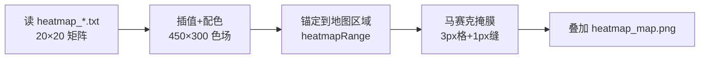
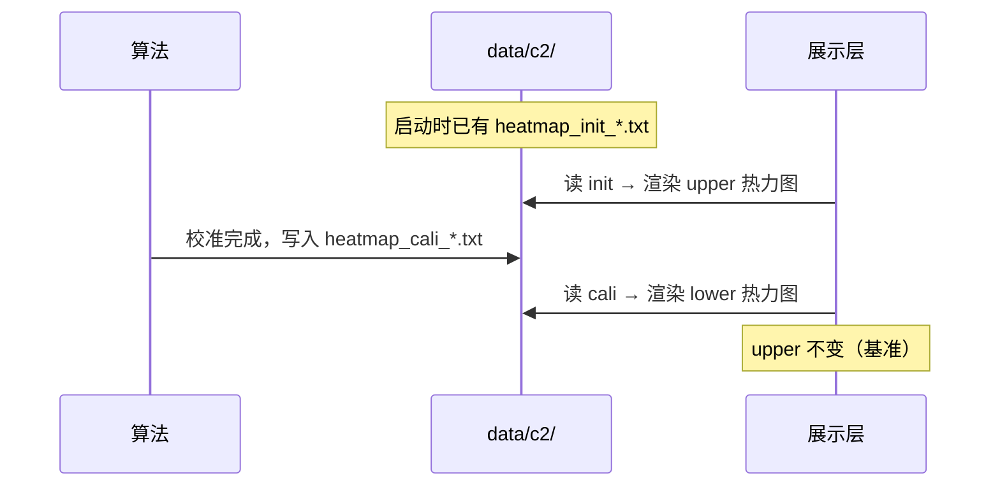

# Case2 热力图叠加 — 数据读取与叠加原理（AI 精简版）

> Case2 / DT Calibration  
> 一句话：**20×20 误差矩阵 → 双线性插值为 450×300 色场 → 锚定到地图 (750,400)-(1200,700) → 3×3 马赛克半透明叠加**

---

## 1. 总流程



```
算法输出                中间产物                    最终语义
─────────              ──────────                  ──────────
heatmap_init_rss.txt → HeatmapField[450×300] → 贴到地图矩形区 → 与底图合成
     20×20                  RGB 连续场              (750,400)-(1200,700)
```

---

## 2. 数据读取

### 2.1 文件清单

```
data/c2/
├── heatmap_map.png                    # 底图 1974×1100（不参与矩阵解析）
├── heatmap_init_rss.txt               # Initial  20×20
├── heatmap_cali_rss.txt               # Calibrated 20×20
├── heatmap_init_effective_path_num.txt
├── heatmap_cali_effective_path_num.txt
├── heatmap_init_first_path_delay.txt
├── heatmap_cali_first_path_delay.txt
├── heatmap_init_first_path_aoa.txt    # 可选
├── heatmap_cali_first_path_aoa.txt
├── heatmap_init_first_path_zoa.txt
└── heatmap_cali_first_path_zoa.txt
```

命名：`heatmap_{init|cali}_{指标}.txt`

### 2.2 矩阵文件格式

- 纯文本，`\n` 分行
- 行内：逗号或空白分隔浮点数
- 典型：**20 行 × 20 列**，值域约 0–100

```
83,57,87,54,13,90,83,77,11,89,...
86,98,60,29,90,18,10,10,58,79,...
...（共 20 行）
```

### 2.3 解析伪代码

```
function loadHeatmapFile(path) -> Matrix[R][C]:
    lines = trim(readFile(path)).split("\n")
    matrix = []
    for line in lines:
        row = trim(line).split(/[\s,]+/).map(parseFloat)
        matrix.append(row)
    return matrix
    // 例：R=C=20, matrix[r][c] = 误差值
```

### 2.4 与 KPI 文件区分

| 文件 | 形状 | 用途 |
|------|------|------|
| `heatmap_init_rss.txt` | 20×20 | **热力图**空间分布 |
| `heatmap_init_kpi_rss.txt` | 4×5 | **CDF** 统计（见另一文档） |

---

## 3. 配置常量（算法必需）

```
MAP_W, MAP_H     = 1974, 1100          # heatmap_map.png 尺寸

HEATMAP_X0, Y0   = 750, 400            # 锚定区左上角（地图像素坐标）
HEATMAP_X1, Y1   = 1200, 700           # 锚定区右下角
RANGE_W          = X1 - X0 = 450       # 热力区宽度
RANGE_H          = Y1 - Y0 = 300       # 热力区高度

CELL_SIZE        = 3                   # 马赛克单格边长（px）
GAP_SIZE         = 1                   # 格间距（px）
PERIOD           = CELL_SIZE + GAP_SIZE = 4
ALPHA            = 0.38                # 热力层透明度
```

**坐标参考系**：`(750,400)`、`(1200,700)` 相对 **`heatmap_map.png` 左上角**，非浏览器窗口。

```
heatmap_map.png (1974 × 1100)
(0,0)──────────────────────────── (1974,0)
  │      (750,400)┌── 450 ──┐      │
  │               │  300   │      │  ← 热力锚定区
  │               └────────(1200,700)
(0,1100)──────────────────────(1974,1100)
```

---

## 4. 阶段 A：矩阵 → 连续色场（450×300）

### 4.1 采样点布局

矩阵 \(E \in \mathbb{R}^{R \times C}\)（通常 \(R=C=20\)）的格点 \((i,j)\) 映射到色场坐标：

\[
x_j = j \cdot \Delta x, \quad y_i = i \cdot \Delta y
\]

\[
\Delta x = \frac{W_{range}}{C-1}, \quad \Delta y = \frac{H_{range}}{R-1}
= \frac{450}{19} \approx 23.68,\ \frac{300}{19} \approx 15.79
\]

```
色场坐标 (450×300)          矩阵索引 (20×20)
(0,0)●───●───●─── ... ───●     E[0][0] ... E[0][19]
     │   │   │           │     E[1][0] ... 
     ●───●───●─── ... ───●     ...
     ...                       E[19][0] ... E[19][19]
(450,300)
```

### 4.2 双线性插值

对色场中任意像素 \((x, y)\)，先归一化到格点索引：

\[
g_x = \frac{x}{\Delta x}, \quad g_y = \frac{y}{\Delta y}
\]

\[
x_0 = \lfloor g_x \rfloor,\ y_0 = \lfloor g_y \rfloor,\ f_x = g_x - x_0,\ f_y = g_y - y_0
\]

四角取样 \(e_{00}=E[y_0][x_0],\ e_{01}=E[y_0][x_1],\ e_{10}=E[y_1][x_0],\ e_{11}=E[y_1][x_1]\)：

\[
\boxed{
\hat{e}(x,y) = e_{00}(1-f_x)(1-f_y) + e_{01} f_x(1-f_y) + e_{10}(1-f_x)f_y + e_{11} f_x f_y
}
\]

### 4.3 伪彩色映射

\[
t = \mathrm{clamp}\left(\frac{\hat{e} - e_{\min}}{e_{\max} - e_{\min}},\ 0,\ 1\right)
\]

分段线性插值色标（蓝→青→黄→红）：

| t 区间 | 颜色 |
|--------|------|
| [0.00, 0.33] | 蓝 → 青 |
| [0.33, 0.66] | 青 → 黄 |
| [0.66, 1.00] | 黄 → 红 |

\[
\mathrm{RGB}(x,y) = \mathrm{Colormap}(t)
\]

### 4.4 伪代码

```
function buildHeatmapField(matrix[R][C]) -> Image[RANGE_W][RANGE_H]:
    eMin = min(flatten(matrix))
    eMax = max(flatten(matrix))
    dx = RANGE_W / (C - 1)
    dy = RANGE_H / (R - 1)
    field = new Image[RANGE_W][RANGE_H]

    for y in 0 .. RANGE_H-1:
        for x in 0 .. RANGE_W-1:
            e = bilinearInterp(matrix, x, y, dx, dy)
            t = clamp((e - eMin) / (eMax - eMin), 0, 1)
            field[x][y] = colormap(t)    // RGB
    return field
```

```
function bilinearInterp(E, x, y, dx, dy):
    gx = x / dx;  gy = y / dy
    x0 = floor(gx);  y0 = floor(gy)
    x1 = min(x0+1, cols(E)-1);  y1 = min(y0+1, rows(E)-1)
    fx = gx - x0;  fy = gy - y0
    e00 = E[y0][x0];  e01 = E[y0][x1]
    e10 = E[y1][x0];  e11 = E[y1][x1]
    return e00*(1-fx)*(1-fy) + e01*fx*(1-fy) + e10*(1-fx)*fy + e11*fx*fy
```

---

## 5. 阶段 B：色场锚定到地图

色场与地图锚定区 **1:1 像素对应**：

\[
\text{MapPixel}(x_m, y_m) = \text{Field}(x_m - X_0,\ y_m - Y_0)
\]

其中 \(X_0 \le x_m < X_1,\ Y_0 \le y_m < Y_1\)。

```
地图 (1974×1100)                    色场 (450×300)
┌────────────────────┐             ┌──────────┐
│    ┌──────────┐    │  1:1 贴图  │ Field    │
│    │ 锚定矩形 │ ←──│──────────→│ RGB      │
│    └──────────┘    │             └──────────┘
└────────────────────┘
     (750,400)
```

### 5.1 显示缩放（若需适配任意视口）

视口显示时地图等比 fit，缩放因子：

\[
s_x = \frac{D_w}{MAP_W},\quad s_y = \frac{D_h}{MAP_H}
\]

热力区在视口中的位置：

\[
O_x = D_x + X_0 \cdot s_x,\quad O_y = D_y + Y_0 \cdot s_y
\]

\[
W' = RANGE_W \cdot s_x,\quad H' = RANGE_H \cdot s_y
\]

（\(D_w, D_h, D_x, D_y\) 为 fit 后地图在视口中的宽高与偏移；算法写文件时可忽略，仅 UI 缩放需要。）

---

## 6. 阶段 C：马赛克掩膜叠加

### 6.1 原理

在锚定区 \([X_0, X_1) \times [Y_0, Y_1)\) 内，按周期 \(P = CELL\_SIZE + GAP\_SIZE = 4\) 划分：

- 每个周期前 3px：显示热力色（透明度 \(\alpha\)）
- 最后 1px：**不绘制**（露出底图）

\[
\text{MosaicVisible}(x_{local}, y_{local}) =
\begin{cases}
\text{true}  & \text{if } (x_{local} \bmod P) < CELL\_SIZE \text{ and } (y_{local} \bmod P) < CELL\_SIZE \\
\text{false} & \text{otherwise（缝隙）}
\end{cases}
\]

其中 \(x_{local} = x_m - X_0,\ y_{local} = y_m - Y_0\)。

### 6.2 示意图

```
连续色场 (450×300)                 马赛克后（俯视图）
┌─────────────────┐               ┌─┐ ┌─┐ ┌─┐
│▓▓▒▒░░▒▒▓▓██▓▓▒▒│   掩膜采样    │▓│ │▒│ │░│  3px 色块
│▒▒░░▒▒▓▓██▓▓▒▒░░│  ─────────→  └─┘ └─┘ └─┘
│░░▒▒▓▓██▓▓▒▒░░▒▒│                ↑1px↑    缝隙→底图
└─────────────────┘               ┌─┐ ┌─┐
  每像素有颜色                     │▒│ │░│ ...
                                   └─┘ └─┘

格数：cols = floor(450/4) = 112,  rows = floor(300/4) = 75
```

### 6.3 合成伪代码

```
function composite(map, field, X0, Y0, RANGE_W, RANGE_H):
    output = copy(map)
    for yLocal in 0 .. RANGE_H-1:
        for xLocal in 0 .. RANGE_W-1:
            if not mosaicVisible(xLocal, yLocal):
                continue    // 缝隙：保留底图
            xm = X0 + xLocal
            ym = Y0 + yLocal
            rgb = field[xLocal][yLocal]
            output[xm][ym] = blend(map[xm][ym], rgb, ALPHA)

function mosaicVisible(x, y):
    return (x mod PERIOD < CELL_SIZE) and (y mod PERIOD < CELL_SIZE)

function blend(bg, fg, alpha):
    return (1-alpha)*bg + alpha*fg    // 逐通道
```

---

## 7. 完整端到端伪代码

```
// ── 输入 ──
matrix = loadHeatmapFile("data/c2/heatmap_init_rss.txt")   // 20×20
map    = loadImage("data/c2/heatmap_map.png")              // 1974×1100

// ── 阶段 A：连续色场 ──
field = buildHeatmapField(matrix)                          // 450×300 RGB

// ── 阶段 B+C：锚定 + 马赛克叠加 ──
result = composite(map, field, X0=750, Y0=400, RANGE_W=450, RANGE_H=300)

// ── 输出 ──
// result：带半透明马赛克热力图的地图
// Initial 用 heatmap_init_*.txt，Calibrated 用 heatmap_cali_*.txt
```

---

## 8. 数据更新时机



---

## 9. 五指标同一流程

| 指标 | init 文件 | cali 文件 |
|------|-----------|-----------|
| RSS | `heatmap_init_rss.txt` | `heatmap_cali_rss.txt` |
| Effective Path Num | `heatmap_init_effective_path_num.txt` | `heatmap_cali_effective_path_num.txt` |
| First Path Delay | `heatmap_init_first_path_delay.txt` | `heatmap_cali_first_path_delay.txt` |
| First Path AOA | `heatmap_init_first_path_aoa.txt` | `heatmap_cali_first_path_aoa.txt` |
| First Path ZOA | `heatmap_init_first_path_zoa.txt` | `heatmap_cali_first_path_zoa.txt` |

---

## 10. 两层「网格」对照

| 层级 | 尺寸 | 来源 | 作用 |
|------|------|------|------|
| **数据网格** | 20×20 | 算法矩阵 | 插值控制点 |
| **马赛克网格** | 3×3 px 块，112×75 格 | 显示掩膜 | 视觉网格感 |

二者独立：20×20 先插值成 450×300 连续场，再按 3+1 周期做马赛克采样。

---

## 11. 速查

| 问题 | 答案 |
|------|------|
| 矩阵格式？ | 20×20 文本，`loadHeatmapFile` 解析 |
| 锚定坐标相对谁？ | `heatmap_map.png` 左上角，(750,400)-(1200,700) |
| 色场尺寸？ | 450×300，与锚定区等宽等高 |
| 插值方法？ | 双线性 |
| 马赛克？ | 3px 显示 + 1px 透明缝，α=0.38 叠加 |
| 算法要写什么？ | `heatmap_{init\|cali}_*.txt`（20×20）即可 |

---

## 12. 一句话

> **读 20×20 矩阵 → 双线性插值到 450×300 并配色 → 贴到地图 (750,400)-(1200,700) → 按 3+1 周期做马赛克半透明合成。**
