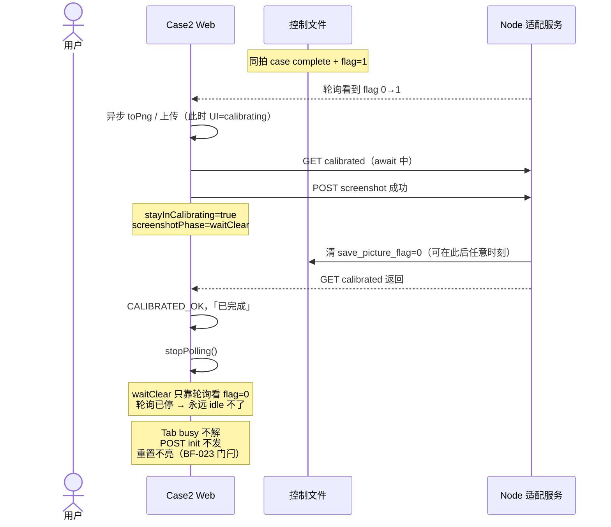
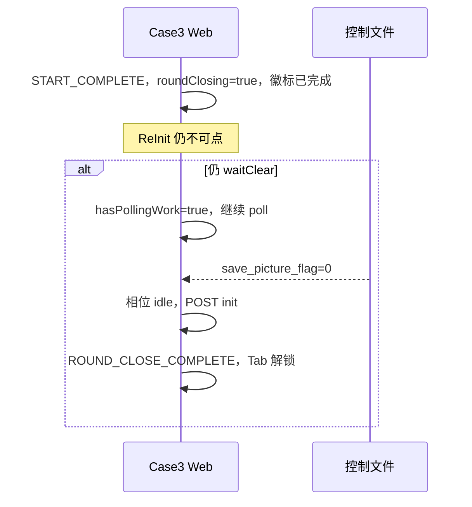
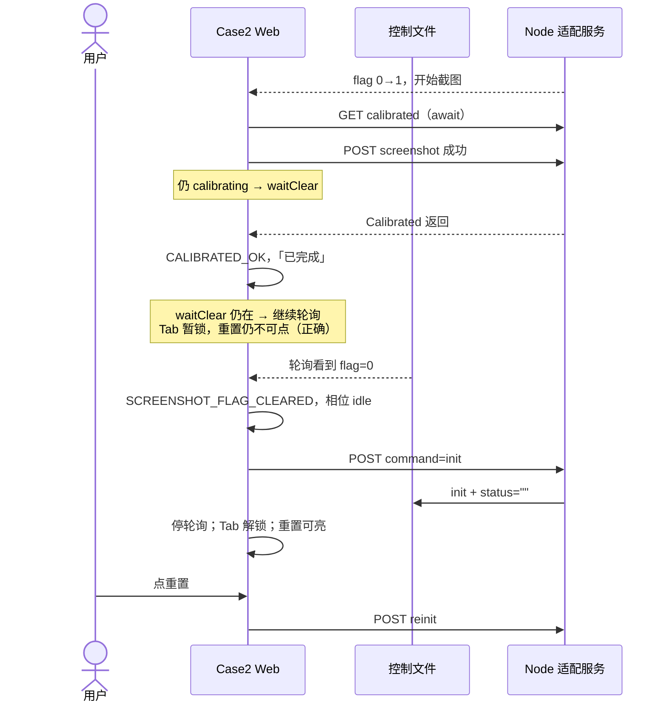

# BF-001 Case2：截图 waitClear + 停轮询 → Tab 永久锁

- Status: done
- Severity: P0
- Area: `code/web` Case2
- 一次只修这一条
- 完成：2026-08-12，completed + waitClear 继续轮询至 flag 清零后再 POST init

## 相关工单

- **BF-023**（已修）：完成瞬间重置可点 → 409 卡死。本单**不改** `canReset`。
- **BF-012**：轮询不校验控制文件归属（误读别人的 complete/flag）。
- **BF-013**：Case3 轮询失败只打日志、用户无感知。
- 本单只修：`waitClear` 时轮询被停掉，flag 清零再也看不见。

## 当前问题（BF-023 之后）

截图相位 `waitClear` 的含义是：PNG 已上传成功，Web 还要靠**后续控制轮询**看到 `save_picture_flag` 从 1 变 0，才能把相位收成 `idle`。

Case2 在 `CALIBRATED_OK`（以及 `schedulePollLoop` 发现 UI 已不是 calibrating/resetting）时会 **立刻 `stopPolling()`**。若此时相位已经是 `waitClear`，清零观察口被关掉。

BF-023 之后后果更重：`canReset` 还要求 `screenshotPhase==="idle"` 且 `POST init` 已写回。`waitClear` 不解 → init 不发 → 重置也永远不亮。Tab 因 `busy` 含 `waitClear` 一直灰。只能刷新。

这和你们刚验过的成功路径**不是同一条时序**：

| 时序 | 截图相对拉六文件 | 上传完成时 UI | 相位 | 结果 |
| --- | --- | --- | --- | --- |
| 已验收（BF-023） | **慢**（`toPng` ~2s） | 已是 `completed` | 直接 `idle`，不进 `waitClear` | Tab 能解，随后 `POST init`，重置可亮 |
| **本单 BF-001** | **快 / 交叉**：上传落在 `GET calibrated` 的 await 里 | 仍是 `calibrating` | `stayInCalibrating=true` → **`waitClear`** | 随后 `CALIBRATED_OK` 停轮询，卡死 |

旧验收里写「截图慢于六文件读取」是把**非缺陷路径**写成了本单条件，下面已改正。

## 什么场景触发

同时满足：

1. 本轮有截图请求（stub 默认 `requestPicture=true`，同拍 `case complete + save_picture_flag=1` 即可）。
2. `poll` 先 `flag 0→1` 异步开 `toPng`/上传，再 `GET calibrated`（await）。
3. **上传成功时 `case2UiState` 仍是 `calibrating`**（六文件读取尚未 `CALIBRATED_OK`）。常见窗口：共享目录 GET 变慢、六文件尚未就绪需重试、或截图异常快（测试里已有 base64 / 舞台很小）。
4. `SCREENSHOT_UPLOAD_OK` 带 `stayInCalibrating: true` → `screenshotPhase=waitClear`。
5. 紧接着 `CALIBRATED_OK` → `stopPolling()`；`schedulePollLoop` 见 UI=`completed` 也不再排下一轮。

本地演示里 `toPng` 常约 2s、GET 常是毫秒，所以这条比 BF-023 **少见**；共享盘/慢读取时会变成必现。不是网络抖动。

不触发（对照）：上传完成时已经 `completed` → 相位直接 `idle`（你们 8-12 人工 log 就是这条）。

## 触发以后的结果

1. 界面可以「已完成」并画出 Calibrated。
2. `screenshotPhase` 停在 `waitClear`；Node 随后把 flag 清 0，Web **看不见**（没有 `poll.flag_cleared`）。
3. `shouldResetCommandAfterCommandCompletion` 为 false → **没有** `completion.init_reset_begin`。
4. Shell Tab 锁不解（`Case2Page.busy` 含 `waitClear`），切不了 Case3。
5. BF-023 后门闩：重置保持 disabled。没有 409，也不是「连接异常」——是收尾永远走不完。
6. 刷新才能恢复。

诊断上应看到：`screenshot.ok` 带 `stayInCalibrating: true`，随后 `calibrated.ok`，**没有** `poll.flag_cleared` / `completion.init_reset_begin`。

## 与 BF-012、BF-013 不是同一问题

三条都碰「轮询」，但坏的环节不同。不要当成 duplicate。

| | BF-001（本单） | BF-012 | BF-013 |
| --- | --- | --- | --- |
| Case | Case2 | Case2 | Case3 |
| 坏在哪 | 轮询**停太早**，`waitClear` 看不到 flag 0 | 轮询**仍在跑**，但不认 `case/command/dt_type`，可能误读别人的 complete/截图 | 轮询 GET **失败**只 `console.warn`，徽标仍「测试中」 |
| 触发 | 截图上传完成时还是 calibrating，随后 completed 停表 | 共享文件被 Case3（或其它元组）写入，Case2 还在 calibrating/resetting | Case3 动作中适配服务中断 |
| 用户看到 | 已完成 + Tab 锁死 + 重置不亮 | 可能误完成、误截图 | 一直测试中，不知已断连 |
| 本单是否改 | 只改「completed 后若仍 waitClear 则继续轮询」 | 不改归属校验 | 不改 Case3 |

README 表序号 12/13 是 BF-011 / BF-012。BF-011 是忙态徽标被连接异常盖住，也不是本单。

## 问题路径时序

Case3 对照（本单要对齐的行为）：结果入画后若仍 `waitClear`，`schedulePollLoop.hasPollingWork` 为 true，继续 GET，直到 flag=0 再 `maybeFinishAfterScreenshot` → `POST init`。Case3 还把真正 toPng 放在结果渲染之后，较少在「拉最终结果的 await 里」就进 waitClear；但 **waitClear 期间不停轮询** 才是本单要抄的点。

## 期望修法（请审核；通过后再改代码）

**对齐 Case3：业务已是 `completed` 时，若截图相位仍是 `waitClear`，不要停轮询。** 只观察到 `flag===0`（或截图 3 次放弃进 `idle`）之后再停表、再走现有完成态 `POST init`。

具体（最小改动，仍只动 Case2）：

1. `pollOnce` 在 `CALIBRATED_OK` 之后：若 `screenshotPhase==="waitClear"`，**不** `stopPolling()`；否则与现在一样停。
2. `schedulePollLoop` 下一轮条件：除 `calibrating` / `resetting` 外，允许 `completed && screenshotPhase==="waitClear"` 继续 tick。
3. `pollOnce` 末尾「`ui==="completed"` 就停」同样让出 `waitClear`。
4. `waitClear` 分支保持现有：看到 `save_picture_flag===0` → `SCREENSHOT_FLAG_CLEARED` → `idle`。之后现有 completion init effect（BF-023）会自己 `POST init`。
5. 补一条 log，例如 `poll.keep_for_waitClear`，避免再把「停表」理解成收尾完成。

不采用「一进 completed 就强行把 waitClear 改 idle」：Node 可能还没清 flag，会漏观察、也可能和截图所有权打架。

明确不改：

- `canReset` / BF-023 门闩
- 取消测试、命令队列、业务命令自动重试
- BF-012 归属校验、BF-013 Case3 失败可见
- 截图清 flag 不得改 `status`（服务端 BF-002）

## 设计时序（修后）

截图慢于六文件（已验收路径）行为不变：上传时已是 completed → 直接 idle → 不依赖本单继续轮询。

## 验收

- [x] 单测：`completed + waitClear` 不得停轮询；flag 0 后相位 idle 并允许 completion init。
- [x] 不改 `canReset`：waitClear 期间重置仍不可点；idle + init 写回后才可点。
- [x] Case3 行为不改。
- [x] 截图慢于六文件（不进 `waitClear`）：现有 controller 主路径单测仍通过。
- [x] 截图失败 3 次放弃（`SCREENSHOT_DROPPED` → idle）：reducer 仍回 idle。
- [ ] 人工：同拍且上传完成时仍是 calibrating（进 `waitClear`）：完成后 Tab 能解锁，且会 `POST init`。默认快速 GET + 慢 toPng 打不进；需放慢 data-files 或看单测 log。

## 测试入口

`code/web/test/case2Reducer.test.ts`、`code/web/test/useCase2Controller.entry.test.ts`（`completed + waitClear 继续轮询`）。人工默认路径通常不进 waitClear。

## 完成说明（2026-08-12）

- `shouldKeepPollingForWaitClear`：`completed && waitClear`。
- `pollOnce` 在 `CALIBRATED_OK` 后若仍 waitClear 则 `poll.keep_for_waitClear` 不停表；`schedulePollLoop` 同样续跑。
- `flag===0` → `SCREENSHOT_FLAG_CLEARED` → idle → 现有 completion `POST init`（BF-023 门闩不变）。
- 单测全绿。controller 回归 log：`screenshot.ok stayInCalibrating:true` → `poll.keep_for_waitClear` → `poll.flag_cleared` → `completion.init_reset_ok`。
