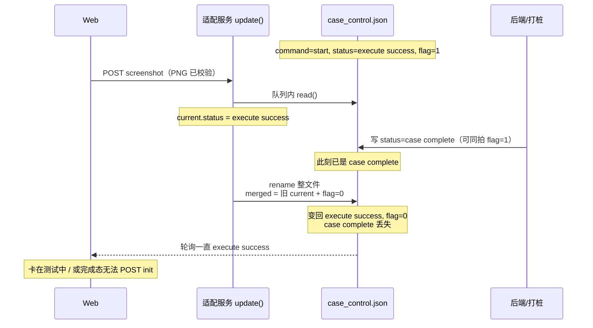
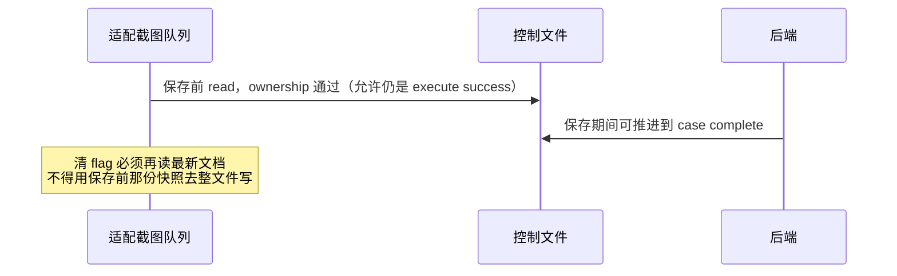
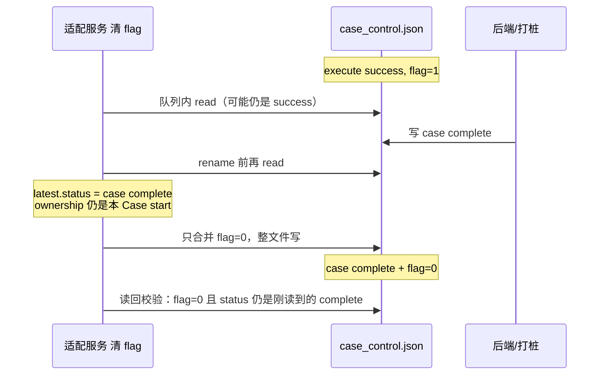

# BF-002 适配服务：清 flag 整文件写可能盖掉 case complete

- Status: done
- Severity: P0
- Area: `code/server` 共享控制文件（Case2 / Case3 共用）
- 一次只修这一条
- 完成：2026-08-12，清 flag 写前再读最新控制、只合并 `save_picture_flag=0`；写后业务元组冲突最多再试 3 次（I/O 冲突，不是业务命令重试）

## 相关工单

- **BF-001 / BF-023**（已修）：Web 侧收尾门闩与 waitClear 续轮询。本单不改 Web。
- **BF-021**：PNG 已落盘但清 flag 失败的孤儿日志。本单修的是清 flag **写成功却把 status 写坏**，不是清失败。
- 对照：`doc/case2/SERVER-SPEC.md` §4.2 / §6.2.7：截图清零不得改 `status`，必须在共享队列内重读最新控制并复验 ownership，不能用保存前旧快照。

## 当前问题

适配服务清 `save_picture_flag` 走 `store.update()`：在进程内串行队列里 **读整份 JSON → `{ ...current, ...patch }` → 整文件原子写**。`patch` 只有 `{ save_picture_flag: 0 }`，合并后会把读到的整份 `status` 一并写回。

真实后端 **不进** 这条队列，直接改共享文件。因此：

- 队列只挡住「浏览器侧」并发 POST；
- 读与 `rename` 之间，后端仍可写入 `status=case complete`；
- 适配层随后用**读到的旧快照**整文件替换，把 `case complete` 盖回 `execute success`（flag 变成 0）。

`png-screenshot.mjs` 保存前会先 `read()` 做 ownership，但清 flag 时 `clearPictureFlag()` 会再进 `update()` 读一次，所以 **PNG 落盘耗时本身不是脏快照来源**。脏的是 `update()` 内部「这一次 read」到「这一次 write」的缝。

`beforeWrite` 只给 start/reinit 清 Calibrated 文件用；清 flag **没有**写前再读、也没有 status 冲突重试。

## 什么场景触发

同时满足：

1. 本轮有截图：`save_picture_flag=1` 出现在 **`status` 仍是 `execute success`** 时（规格明确允许保存期间从 success 推进到 complete）。
2. Web 已把 PNG 传到适配服务，Node 开始 `clearPictureFlag` / Web 放弃路径 `POST {save_picture_flag:0}`。
3. `update()` 已 `read()` 到 `execute success + flag=1`，**尚未** `rename` 写回。
4. 同一窗口后端（或打桩）写入 `status=case complete`（可同拍 flag=1）。
5. 适配层用步骤 3 的旧对象写回：`execute success + flag=0`。

**默认本地 stub 通常打不中：** `realback_no.md` 固定同拍 `case complete + flag=1`，打桩收工后才轮到 Web 截图。清 flag 时文件里往往已经是 complete，合并会保留 complete。和 BF-001 一样：默认演示少见，真后端若「success 就置 flag、稍后才写 complete」会变成可复现。

Case3 更接近这条：flag 可在测试中途拉高，截图落盘与后续 `case complete` 更容易重叠。

不触发（对照）：清 flag 读到的已经是 `case complete`（你们 Case2 默认 stub 人工路径）。

## 触发以后的结果

取决于 Web 当时有没有已经看到 `case complete`：

| Web 进度 | 磁盘被盖成 | 用户看到 |
| --- | --- | --- |
| 还在等完成门沿 | `start` + `execute success` + `flag=0` | 一直「测试中」；Calibrated / Case3 终态读不到；截图可能已经落盘 |
| 已经 `CALIBRATED_OK` / 侧栏已完成 | 同上，轮询下次变成 success | 画面可已完成，但 `lastControl` 不再是 `case complete`，完成态 `POST init` 不发，重置不亮（BF-023 门闩） |

都不是「连接异常」。适配日志里会出现截图成功后的 `control file updated`，`status` 仍是 `execute success`。刷新也救不回已经被盖掉的 complete，除非后端再写一次终态（规格不要求）。

## 问题路径时序

规格允许的重叠（不是 bug 本身，是窗口存在的原因）：

## 期望修法（已于 2026-08-12 批准并落地）

只动清 flag 路径（`clearPictureFlag` 与 HTTP `{save_picture_flag:0}`），Case2 / Case3 共用 `store.update`。

在共享队列内：

1. **写前再读**最新 JSON（不能用截图保存开始时的快照；`update()` 开头那一次 read 之后、`rename` 之前还要再读一次，尽量贴着写）。
2. **只改** `save_picture_flag=0`，合并到**刚读到的**文档上：保留当时的 `status`、`command`、`case`、`dt_type` 及未知字段。
3. 再读后若 ownership 已变（不是本 Case 的 `start` 截图）→ `409 SCREENSHOT_NOT_REQUESTED`，**不要**把旧快照写回去。flag 已是 0 则仍幂等成功。
4. **短次数重试**（建议最多 3 次）：若 read 时的 `(case, command, dt_type, status)` 与 rename 后读回的不一致，说明窗口里又被后端写过，丢弃本轮写结果、再读再合并 flag，避免用过期 status 盖终态。这是 I/O 冲突重试，不是业务命令自动重试。
5. 不要加 version / manifest / 要求真实后端配合新字段。

不改：Web `canReset`、waitClear 轮询、start/reinit 清 Calibrated 的 `beforeWrite`、BF-021（清失败留 PNG）。

`SERVER-SPEC` §4.3 写过「双端同时整文件写，最后写者覆盖是无版本号 JSON 的固有限制」。本单只把 **截图清零** 收成「以写前最新文档为底、只动 flag」，这是 §6.2.7 已要求、当前没做到的部分；不声称解决所有双端覆盖。

## 设计时序（修后）

若再读时 ownership 已不是本 Case start：不写，409，磁盘保持后端刚写的内容。

## 验收

- [x] 单测：第一次 read 为 `execute success + flag=1`，写前文件已变成 `case complete + flag=1`，清 flag 后磁盘仍是 `case complete` 且 `flag=0`。
- [x] 清 flag 不改未知字段，不改 `command` / `case` / `dt_type`。
- [x] 再读后 ownership 不匹配：409，不写脏文件。
- [x] flag 已是 0：幂等 200，不改 status。
- [x] Case2 / Case3 截图成功清零与 Web 放弃清零都走同一套逻辑。
- [x] 默认 stub 同拍路径行为与现在成功演示一致（本来就不该被盖掉）。
- [x] 写后 `(case,command,dt_type,status)` 被后端改掉：最多 3 次再读再合并 flag；耗尽则 `500 CONTROL_WRITE_FAILED`。

## 已实现

- `store.update({ rereadBeforeWrite, tupleConflictRetries })`：清 flag 路径写前再读、flag 已 0 则跳过写；rename 后元组不一致则 warn 并重试。
- Case2 / Case3 `clearPictureFlag`（截图成功与 HTTP `{save_picture_flag:0}` 放弃）均传入 `rereadBeforeWrite: true`、`tupleConflictRetries: 3`。
- 不改 Web `canReset`、waitClear、start/reinit `beforeWrite`、BF-021。
- `code/server npm test`：61/61。人工默认 stub 只验不回归。

## 测试入口

`code/server` 控制文件 store / Case2·Case3 screenshot 单测。对照 `doc/case2/SERVER-SPEC.md` § 截图清零。人工默认 stub 验的是「不回归」；要打中本单需在单测里模拟「read 与 write 之间后端改 status」。

## 关键代码

- `code/server/src/shared/control-file-store.mjs`：`update()` 读-改-写；`assertScreenshotOwnership`
- `code/server/src/cases/case2/control-file.mjs` / `case3/control-file.mjs`：`clearPictureFlag`
- `code/server/src/shared/png-screenshot.mjs`：落盘后 `clearPictureFlag()`
