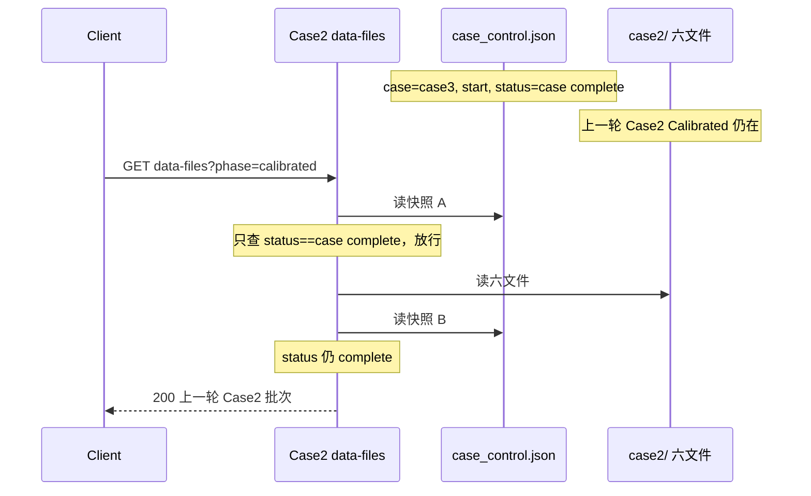
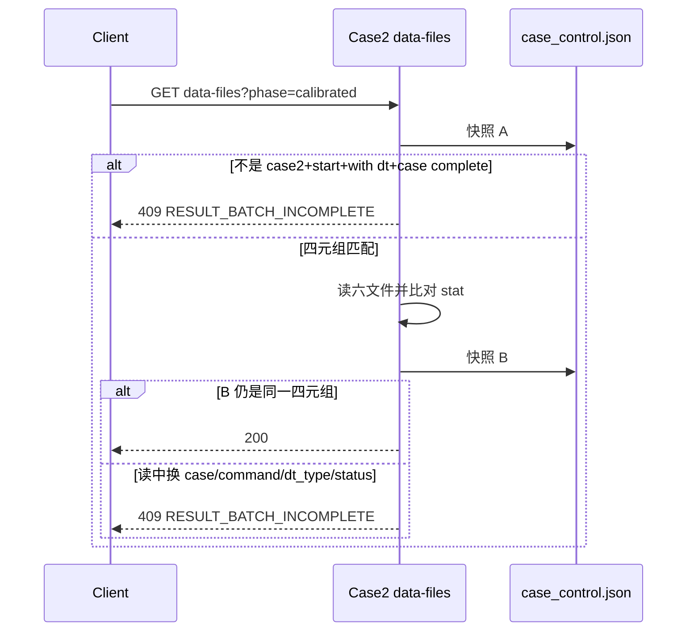

# BF-003 Case2：Calibrated 读取只认 status、不认 case 归属

- Status: fixed-local
- Severity: P2（联调防御）；默认单 Tab 正常 UI 闭环不阻塞
- Area: `code/server` Case2 data-files
- 一次只修这一条（只改 Node Calibrated 两次控制快照；不改 Web、不改 Initial、不改 Case3、不改截图 ownership）
- 排查：2026-08-13，修复前 API 层缺口存在，且已用临时 Node 脚本复现。但正常 Web UI 闭环会在完成收尾后 `POST init` 清控制文件，默认单 Tab 演示基本触发不了。
- 落地：2026-08-13，已按本文最小方案收紧 Node Calibrated 首尾控制快照门禁，并同步 `SERVER-SPEC` / `README` / server 单测；`code/server npm test` 65/65。

## 0. 本次复核结论

**修复前 API 层问题存在；正常 UI 闭环场景基本不存在。** 这不是默认单窗口演示问题。只有当控制文件异常残留、外部脚本/第二客户端直调，或完成后的 `POST init` 因异常未执行/失败时，才会暴露 Server API 层的数据归属门禁缺口：一旦 Case2 上一轮 Calibrated 六文件仍在磁盘，控制文件又处于 Case3 的 `case complete`，修复前 `GET /api/case2/data-files?phase=calibrated` 会返回 200；当前 Node 已返回 `409 RESULT_BATCH_INCOMPLETE`。

临时复现结果：

```json
{"status":"BUG_REPRODUCED","phase":"calibrated","metricKeys":["rss","effective_path_num","first_path_delay"],"rssRows":2}
```

修改必要性判断：

| 维度 | 结论 |
| --- | --- |
| 默认单 Tab 演示 | 不阻塞；Tab 忙锁、完成后 `POST init`、切回握手和 Web 轮询条件基本封住该路径 |
| 正常用户 UI 路径 | 基本不存在；Case2/Case3 完成态被 Web 消费后都会写回 `init` |
| 联调 / 第二客户端 / 脚本直调 | 存在防御价值；API 会把非本 Case 的 complete 当作 Case2 Calibrated ready |
| 异常路径 | 存在风险；例如浏览器崩溃、网络中断、`POST init` 失败、真实后端/外部工具直接改控制文件 |
| 数据完整性 | 若触发会较隐蔽；错误响应是 200 + metrics，日志也会显示正常批次读取 |
| 修复代价 | 很低；只改 Case2 data-files 的两次控制快照判断和 server 单测 |

更优方案：**不作为当前演示阻断项，不扩成 Web + Node 双线修复。** 本次只补 Node API 门禁，因为它是所有调用方的底线；Web 的 `shouldFetchCalibrated` 四元组收紧属于 BF-012，可单独处理。Node 修完后，即使 Web 在极端旧轮询里误拉，也会拿到 409 并继续等待/回退，不会把旧批次画成完成态。

## 1. 修复前问题是否存在

**修复前存在，当前已按本文方案修复。** 原 `code/server/src/cases/case2/data-files.mjs` 首尾两次控制快照只判断 `status === "case complete"`，不看 `case` / `command` / `dt_type`。当前实现已新增 `isCase2CalibratedControl`，首快照和尾快照都要求 `case=case2, command=start, dt_type=with dt, status=case complete`。

对照：

| 路径 | 现在怎么认「这是我的完成批次」 |
| --- | --- |
| Case2 截图保存 / 清 flag | 四元组：`case2 + start + with dt`（另加 flag=1） |
| Case3 终态 side | 四元组：`case3 + start + 本侧 dt_type + case complete` 才 `isFinalRead` |
| **Case2 Calibrated GET** | **修复前只认 `status=case complete`；当前 Node 已收紧为 `case2 + start + with dt + case complete`** |

修复前 `doc/case2/SERVER-SPEC.md` §5.3 只写了 status 门槛，和旧实现一致；这是契约缺口，不是「代码漏实现已冻结规格」。当前 `SERVER-SPEC` 与 `code/server/README.md` 均已同步为四元组。

默认单 Tab 演示**基本触发不了**：Web 只在 `calibrating && seenExecuteSuccess && status=case complete` 才 GET；Tab 忙锁 + `CONTROL_BUSY` 会挡住「Case2 启动轮未消费完时再开 Case3」；Case2/Case3 完成后都会在收尾里 `POST init`；切回 Case2 也会先 handshake `POST init`。这说明它不是 UI 正常路径问题，但不代表 Node API 门禁已经正确。

## 2. 什么场景出现，时序怎样

共享同一份 `case_control.json`。Case2 Calibrated 六文件在磁盘上**一直留到下一次 Case2 start/reinit 才写空**；Case3 start **不会**清 Case2 文件。因此修复前只要控制文件里 `status` 碰巧是 `case complete`，不论是谁的 complete，Node 都可以把**上一轮 Case2 的六文件**当成本轮批次 200 回去。

### 场景 A（最干净，修复前 API 层必现）

控制文件异常残留在 Case3 终态，磁盘上还有上一轮 Case2 Calibrated。修复前任意客户端 `GET /api/case2/data-files?phase=calibrated` → **会 200**。正常 UI 完成收尾会把这个终态写回 `init`，所以该场景主要来自异常残留、调试脚本或外部直写，不是普通用户点击链路。

```text
T0  Case2 某轮已完成，六文件在磁盘上（POST init 后文件不清）
T1  Case3 Start → complete：case=case3, command=start, dt_type=without|with dt, status=case complete
T2  GET /api/case2/data-files?phase=calibrated
    首快照：只看 status=complete → 放行
    读六文件：上一轮 Case2 结果仍在
    尾快照：status 仍是 complete → 200
```



### 场景 B（读窗口内归属被换掉，status 仍是 complete）

本轮确实是 Case2 `start + with dt + case complete`，GET 已经开始。读六文件期间控制文件变成 Case3 的 `case complete`（或 `command`/`dt_type` 变了但 status 没变）。尾快照仍然放行。

```text
T0  快照 A：case2 + start + with dt + case complete → 放行
T1  读/解析六文件（相对慢）
T2  控制文件被写成 case3 + start + … + case complete
T3  快照 B：只看 status 仍 complete → 200
```

单进程 `CONTROL_BUSY` 拦的是**另一条 HTTP 命令写**；不拦真实后端直接改共享文件，也不拦「status 字面值没变、只换了 case」。

### 场景 C（叠 BF-012，单页误展示）

BF-012：Case2 `pollOnce` / `shouldFetchCalibrated` 也不认四元组。若 Case2 仍停在 `calibrating`（第二窗口、轮询没停干净），轮询读到 Case3 的 `case complete` 就会去拉 Calibrated。Node 本单若 409，Web 只会继续等/走结果不完整回退，**不会把别人的 complete 画成对比页**。本单不修 Web。

默认单窗口：Case2 测试中会锁 Tab，Case3 开不了轮；切走会停 Case2 轮询。C 不是默认人工路径。

不触发（对照）：

- `GET phase=initial`：本来就没有 complete 门禁，本单不要套四元组。
- Case2 本轮 `start + with dt + case complete` 且六文件合法：应继续 200。
- 控制已是 `execute success` / `""` / `execute fail`：现有 status 门槛已经 409。

## 3. 出现后的问题是什么，有用例覆盖吗

若异常触发：

- Node 把**非本轮、非本 Case** 的 Calibrated 当合法批次。
- 若 Web 跟着画（场景 C）：Case2 对比页展示陈旧/错属批次，随后可能 `POST init` 结束「这一轮」。
- 若只是 API 被打到（场景 A）：Web 不一定画，但联调/第二客户端/脚本会拿到错批次。
- 响应仍是 200 + 完整 `metrics`，日志是 `case2 data batch read`，**看不出归属错误**。

修复前单测**没有**覆盖本缺陷，成功路径甚至把缺口写成了绿灯：

| 测试 | 修复前断言 | 和本单的关系 |
| --- | --- | --- |
| `data-files.test.mjs`「六文件稳定且 status complete 时整批成功」 | `createSharedDir({ status: "case complete" })` → 200 | fixture 默认 `command=init, dt_type=""`。修四元组后这条应变 409，或改成合法 `start + with dt` |
| 同文件：缺失/非法/读中文件变化 / 非 complete | 409 | 只覆盖 status 与文件，**没有** Case3 complete、错 `command`、错 `dt_type`、读中换 case |
| `api.test.mjs`「Calibrated 非法时 HTTP 整批拒绝」 | 同样只叠 `status: case complete` | 非法内容仍 422；不测归属 |
| Web `shouldFetchCalibrated` | 只看 `calibrating + seenSuccess + status` | BF-012 范围，本单不改 |

当前已补充「Case3 `case complete` 时 Case2 calibrated GET 不得 200」、`init + case complete` 不得 200、读中控制归属变化仍 409，以及 HTTP 层归属拒绝用例。

## 4. 修改推荐方案（不要冗余），时序

只加一条 `data-files.mjs` 本地谓词，与截图/Case3 终态同构。复用现有 `409 RESULT_BATCH_INCOMPLETE`，不要新 error code、不要改 Web、不要改 Initial，也不要把它抽到 shared。当前只有 Case2 Calibrated 读取需要这个 exact 门槛，抽共享会把 case-local 语义扩散。

```text
function isCase2CalibratedControl(control) {
  return (
    control.case === "case2" &&
    control.command === "start" &&
    control.dt_type === "with dt" &&
    control.status === "case complete"
  );
}
```

首快照、尾快照都用它替换现在的 `status !== "case complete"`。不匹配文案可写成归属/命令元组不匹配或读中变化，code 仍是 `RESULT_BATCH_INCOMPLETE`。尾快照不需要引入批次 ID 或未知字段比较；本项目当前没有 batch_id，强行发明会扩大前后端/真实后端契约。文件 stat A/B 已负责发现读中改写，控制四元组负责发现读中换归属。

修后时序：

```text
GET calibrated
  读控制 A
  A 不是 case2+start+with dt+case complete → 409（含 Case3 complete、init+complete、错 dt_type）
  文件快照 A → 读六文件 → 文件快照 B（变化仍 409，现有）
  读控制 B
  B 不是同一四元组 → 409
  200
```



不采用：新 `OWNERSHIP_*` 409（调用方已按 `RESULT_BATCH_INCOMPLETE` 重试/回退）；把四元组检查放到 Web（BF-012，挡不住直接 GET）；Initial 套同一门槛。

## 关键代码

- `code/server/src/cases/case2/data-files.mjs`：当前 `isCase2CalibratedControl` 和两次控制快照检查
- 对照：`code/server/src/shared/control-file-store.mjs` `assertScreenshotOwnership`；`code/server/src/cases/case3/side-files.mjs` `isFinalRead`

## 验收

- [x] 控制文件是 Case3 `case complete` 时，Case2 calibrated GET 不得 200。
- [x] Case2 本轮 `start` + `with dt` + `case complete` 且六文件合法时仍 200。
- [x] 读期间 status **或** `case`/`command`/`dt_type` 变化仍 409。
- [x] `command=init` 仅叠 `status=case complete` 不得再当成功路径。
- [x] Initial 读取行为不变。
- [x] 单测覆盖上述条。不改 Web（BF-012）、不改 Case3、不改截图路由。

## 测试入口

`code/server`：`test/case2/data-files.test.mjs`（主）；必要时改 `api.test.mjs` 里只叠 status 的 calibrated fixture。

已落地：`code/server npm test` 65/65；`SERVER-SPEC` §5.3 / `code/server/README.md` 已把「只认 status」改成四元组（与观察步骤对齐）。
