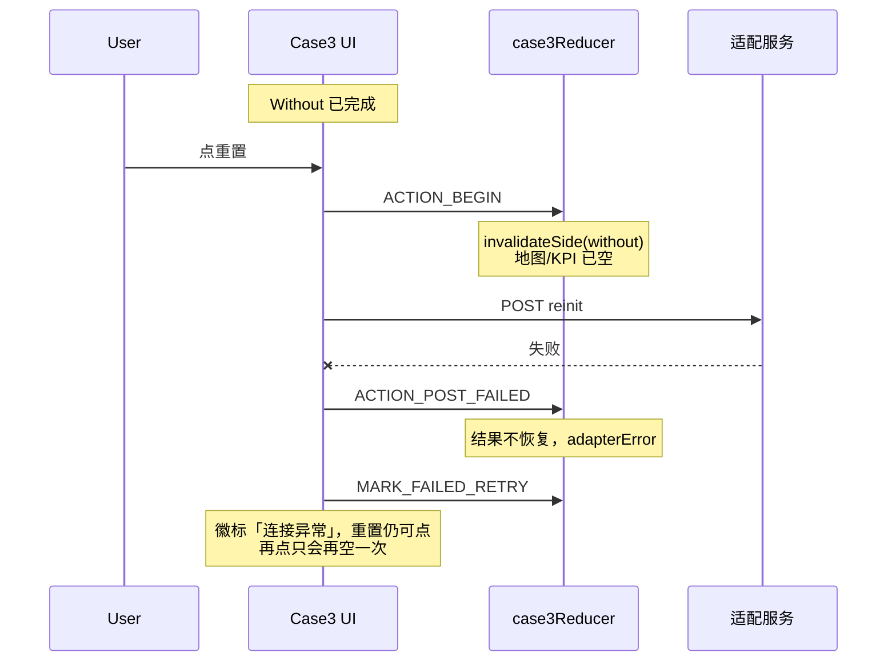
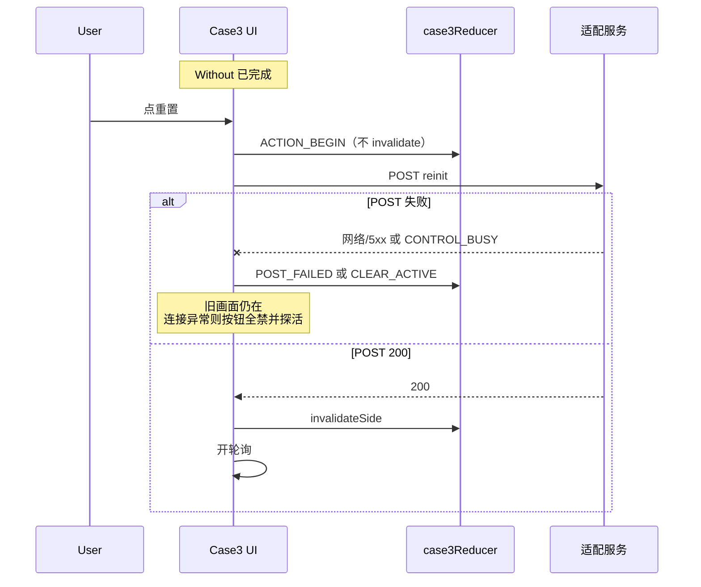

# BF-004 Case3：POST 失败前已清空本侧结果；连接异常仍可点按钮

- Status: deferred（先不处理）
- Severity: P2（原 P0，2026-08-13 用户降级）
- Area: `code/web` Case3
- 一次只修这一条（按钮禁用 + 失败回滚是同一缺陷的两面）
- 排查：2026-08-13，代码缺口仍在。用户判定：Web 与 Node **同机**（Chrome → `127.0.0.1:3102`），传输层断连 / POST 失败**极低**；降级、先不处理。不改代码。

## 1. 这个问题还存在么

**存在，两面都在。**

| 面 | 现状 |
| --- | --- |
| 连接异常仍可点 | `canStartWithout` / `canStartWith` / `canReinit` **不看** `adapterError`。徽标已是「case3文件服务器连接异常」时，只要 `initStatus==="ready"` 且没有 `activeAction`，按钮仍可点。 |
| POST 未成功先丢画面 | `ACTION_BEGIN` 立刻 `invalidateSide`（本侧 `results`/`live` 置空，`pairValid=false`）。`ACTION_POST_FAILED` 注释写明「不得恢复」。`CONTROL_BUSY` 的 start 只 `CLEAR_ACTIVE`，被清掉的结果也不回来。 |

Case2 对照：`canStart`/`canReset` 见 `adapterError` 即 false；`START_CLICK`/`RESET_CLICK` 记下 `phaseBeforeCommand`，`START_POST_FAIL`/`RESET_POST_FAIL` 把 UI 相滚回去。

进页握手失败看起来像「已经禁了 Start」，其实是 `initStatus!=="ready"`，不是 `adapterError` 门闩。握手成功之后的 POST 失败 / 完成态 `POST init` 失败，徽标会换、按钮仍按结果矩阵计算。

## 2. 什么场景出现，时序怎样

代码路径：点启动/重置 → **先** `invalidateSide` 清本侧 UI → 再 POST。POST 失败则 UI 不恢复。

**同机前提下，传输失败极低。** Web 和 Node 适配都在前端 PC，浏览器只打本机 `127.0.0.1:3102`，不存在分机断网。Without 已经跑完说明刚才一整轮 GET/POST 都通；再点重置时 loopback 突然失败，只剩「这几秒里 Node 进程被杀掉 / 端口没了」这类操作事故，不是常规演示抖动。

因此「画面先空、磁盘没清」在同机部署上**几乎不会被点到**。逻辑上成立，不能当 P0 现场必现。

若 POST 根本没到 Node：侧文件确实还在，但 Web 进页/失败都不会把侧结果再读回 UI，所以即使得逞，伤的也是内存里那张完成图，不是共享目录被写坏。

### 场景 A：已有 Without 完成画面，点 ReInit，POST 失败（代码路径，同机极少）

要 Node 在点击当时已经不在了（进程退出），不是 Chrome↔Node 网络闪断。

```text
T0  Without 已完成，地图/KPI 在
T1  点重置 → ACTION_BEGIN → 本侧 results/live 立刻空，画面先没
T2  POST /api/case3/control-file 失败（网络/5xx）
T3  ACTION_POST_FAILED：adapterError=true，activeAction=null，结果不恢复
T4  MARK_FAILED_RETRY：同侧 ReInit 仍可点
T5  磁盘上 Case3 侧文件可能根本没被清（POST 没写成功）
```



### 场景 B：徽标已是连接异常，仍可点启动/重置

`initStatus==="ready"` 且 `adapterError===true`，例如：

- 场景 A 之后；
- 本轮已 `START_COMPLETE`/`REINIT_COMPLETE`，收尾 `POST init` 失败（结果还在，只亮异常徽标）。

`can*` 不看 `adapterError` → Start/ReInit 仍 enabled。再点走场景 A，把还在的画面清掉。

进页 Node 未启动：`initStatus` 仍是 `loading`，Start 会禁用。那不是本面；本面是 **ready 之后**。

### 场景 C：`CONTROL_BUSY`（不是断连，同机仍可能）

这和 Chrome↔Node 断开无关：POST 到了，Node 回 409（控制文件被另一命令占着，例如 Case2 轮次未 `init`、双页）。实现仍是先清 UI 再 POST，所以同机也会丢画面。概率取决于有没有「占着控制文件还去点 Case3」，不是网抖。

Start：`ACTION_BEGIN` 先清目标侧。Without 已完成再点 Start With，会清 With（对侧 Without 保留）。POST 失败后 With 不回来。

`CONTROL_BUSY`（控制文件被另一命令占着）：

```text
ACTION_BEGIN 已清目标侧
→ CLEAR_ACTIVE
→ start 不置 adapterError、不 MARK_FAILED_RETRY
→ 画面没了，徽标也不提示连接异常
```

ReInit 的 `CONTROL_BUSY` 会再 `MARK_FAILED_RETRY`，按钮可点，结果同样不恢复。

`WEB-SPEC` §6.1 写「收到 CONTROL_BUSY 时保持当前态」——实现没有保持，只清了 `activeAction`。

不触发（对照）：POST 200 后再 `execute fail` / 结果不完整回退。那是命令已经写出去，本侧本就该清。本单只管 **POST 没成功**。

## 3. 出现后的问题是什么，有用例覆盖吗

若真走到 POST 失败：UI 空了且不会从磁盘补回，只能重跑该侧。同机下这条**极少发生**，不能当成演示主风险。

仍值得单独看的是 `CONTROL_BUSY`：不是断连，POST 成功返回 409，但 UI 已经空了。

`ACTION_BEGIN` 只清 **目标侧**，对侧已完成结果会留着。验收里「Start POST 失败不把对侧清掉」当前碰巧成立；缺的是 **目标侧** 在 POST 失败时也不该丢。

现有单测**没有**覆盖本缺陷：

| 测试 | 实际测到的 | 没测到的 |
| --- | --- | --- |
| `case3Reducer.test.ts`「adapterError 时徽标…」 | `INIT_LOADING` + `ADAPTER_ERROR` 后 `canStartWithout===false` | 假绿灯：当时 `initStatus!=="ready"`。`ready` + `adapterError` 时 `canStartWithout` 仍是 true |
| 同文件 ACTION_BEGIN / ReInit | 成功路径下 begin 即清目标侧 | 没有 `ACTION_POST_FAILED` 后结果仍在 |
| `useCase3Controller.entry.test.ts` | 进页握手失败 → `adapterError` 且 `initStatus=loading` | 不测 ready 后命令 POST 失败 |
| lifecycle | 主路径 start/reinit/截图 | 无 POST reject、无 `CONTROL_BUSY` 点击 |

没有「ReInit POST 失败 Without 还在」「adapterError 且 ready 时按钮 disabled」的用例。

## 4. 修改推荐方案（不要冗余），时序

不要引入 `phaseBeforeCommand` 快照拷贝。Case3 的可见运行态已经由 `activeAction` 派生；**POST 成功前不要 `invalidateSide`**，失败时自然还有旧 `results`。

三处，不再加第四条机制：

1. **三个 `can*`**：`adapterError === true` 一律 false（与 Case2 对齐）。
2. **推迟清空**：`ACTION_BEGIN` 只挂 `activeAction` / 清 failure / `adapterError=false`。`POST` 200 之后再 `invalidateSide`（可新增 `ACTION_POST_OK`，或 begin 里成功分支再 dispatch 一次清空）。然后才 `schedulePollLoop`。
3. **失败只收尾、不补清**：
   - 网络/5xx → 现有 `ACTION_POST_FAILED`（`activeAction=null`、`adapterError=true`）；删掉「不得恢复」。不要 `MARK_FAILED_RETRY`（结果还在，`canReinit` 自己会亮；有 `adapterError` 时第 1 条会按住）。
   - `CONTROL_BUSY` → 只 `CLEAR_ACTIVE`（结果还在，也不冒充连接异常）。start/reinit 同一套，不要 start 静默、reinit 进 failed-reinit。

POST 失败后把进页那套 5s `scheduleProbe` 再挂上（`beginAction` 现在会 `stopProbe` 且失败不重挂）。只探活、清 `adapterError`；探活成功不要 `MOUNT_RESET`，以免把刚保住的结果清掉。不另做命令队列或业务命令自动重试。

`EXECUTE_FAIL` / 结果不完整 / `REINIT_COMPLETE` 仍清本侧——那是 POST 已经成功之后。

修后时序（ReInit POST 失败）：

```text
点重置
  ACTION_BEGIN（activeAction=reinit，results 仍在 → 按钮因 busy 禁用，地图仍显示旧结果）
  POST reinit
    失败 → ACTION_POST_FAILED + 挂探活
           results 仍在，adapterError → can* 全 false
    CONTROL_BUSY → CLEAR_ACTIVE
           results 仍在，无 adapterError → ReInit 仍可点（数据还在）
    200 → invalidateSide（此时才空本侧）→ 轮询
```



不采用：失败后再深拷贝回滚（begin 时没丢就不必）；新失败相；改 Node 清文件顺序（BF-015）；顺手改 Case2。

## 关键代码

- `code/web/src/cases/case3/state/case3Reducer.ts`：`canStartWithout` / `canStartWith` / `canReinit`；`ACTION_BEGIN` 里的 `invalidateSide`；`ACTION_POST_FAILED`
- `code/web/src/cases/case3/hooks/useCase3Controller.ts`：`beginAction` 先 begin 再 POST；`CONTROL_BUSY` 分支；失败后不重挂 probe
- 对照：`code/web/src/cases/case2/state/case2Reducer.ts` `canStart`/`canReset`/`START_POST_FAIL`

## 验收

- [ ] `initStatus==="ready"` 且 `adapterError` 时，双侧 Start / ReInit 均 disabled。
- [ ] 已有 Without 结果时，ReInit POST 失败（网络），Without 地图/KPI 仍在。
- [ ] Start With POST 失败：Without 仍在，**本侧 With 也仍在**。
- [ ] `CONTROL_BUSY`：目标侧结果仍在；start 不得静默丢画面。
- [ ] POST 200 之后才清空目标侧并开轮询；`execute fail` 仍只清本侧。
- [ ] reducer / controller 单测覆盖上述条。不改 Node，不改 Case2。

## 测试入口

`code/web/test/case3/case3Reducer.test.ts`（`ready+adapterError` 的 `can*`；begin 不清空、POST_FAILED 不丢结果）；`useCase3Controller.lifecycle.test.ts`（ReInit/Start POST reject、`CONTROL_BUSY`）。

落地且用户接受后，再改 `doc/case3/WEB-SPEC.md` §6.1 / §6.4（POST 失败改为恢复/保持当前结果；`CONTROL_BUSY` 真正「保持当前态」）。未批准前不改 `doc/`。
