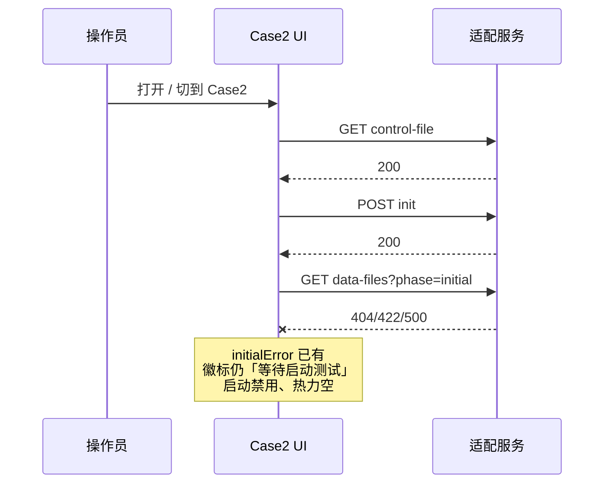
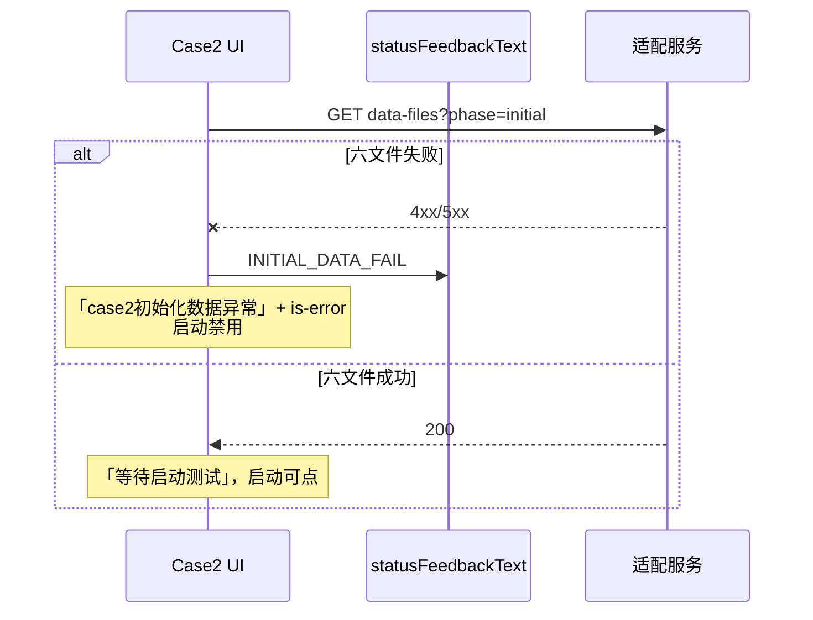

# BF-005 Case2：Initial 加载失败无界面说明

- Status: done
- Severity: P1
- Area: `code/web` Case2
- 一次只修这一条（只补可见徽标，不新开 phase、不改探活范围）
- 完成：2026-08-13，Initial 六文件失败徽标「case2初始化数据异常」+ is-error；不探活。`code/web npm test` 104/104。

## 现象

进页后热力空槽、启动按钮灰色，徽标仍是「等待启动测试」。操作员不知道是 Initial 六文件读失败。

## 1. 这个问题还存在么

**存在。** 进页 `GET data-files?phase=initial` 失败会 `INITIAL_DATA_FAIL`，`canStart` 因没有 `initialData` 为 false。但：

- `statusFeedbackText` 在 `case2UiState==="initial"` 且无 `adapterError` 时固定「等待启动测试」，**不看** `initialError`
- `Case2Page` 的 `is-error` 只认 `adapterError` 或 `failed-*`，不认 `initialError`
- `.initial-error` 类在 CSS 里，页面没渲染

对照：control / `POST init` 失败会亮「case2文件服务器连接异常」；Case3 初始化文件失败会亮「case3初始化数据异常」。

## 2. 什么场景出现，时序怎样

发生在进页握手**已经走完控制文件**、只卡在 Initial 六文件。适配是通的，所以**不会**走连接异常徽标，也**不会**开 5s 探活（探活条件是 `adapterError && initial`）。

典型触发（联调比演示主路径更常见）：

- `DT_SHARED_DIR` 指错，或 `case2/` 下缺 `heatmap_init_*` / `heatmap_init_kpi_*`
- 文件在但非法（非矩形、越界、非 UTF-8）→ Node `422 DATA_FILE_INVALID` / `404 DATA_FILE_MISSING`
- 共享盘刚挂上、六文件还没拷全

```text
T0  GET control-file 200
T1  POST {command:init} 200（adapterError 仍 false）
T2  GET data-files?phase=initial 失败
T3  INITIAL_DATA_FAIL：initialData=null，initialError=报文
T4  相仍是 initial；启动灰；徽标「等待启动测试」；热力 empty
```



不触发（对照）：

- Node 根本连不上：T0/T1 失败 → `adapterError`，「连接异常」。那是另一条。
- Initial 六文件合法：`INITIAL_DATA_OK`，徽标「等待启动测试」且启动可点。这是正常进页。
- 启动之后 Calibrated 失败：保持测试中或「结果不完整已自动回退」。不是本单。

文件补齐后：**页面不会自动再拉** Initial。要刷新，或切走再切回 Case2，重新走握手。本单不把探活扩到「仅 initialError」。

**探活补拉修不了本单这种失败。** 5s 探活只在 `adapterError`（Node 连不上）时跑。POST init 已成功、只是六文件缺/格式坏时，`adapterError` 为 false，探活根本不会启动。就算以后探活顺带 GET 了 Initial，文件没改之前还是 422/404。探活救的是「适配器死了又活了」，不是「文件写错了」。

## 3. 出现后的问题是什么，影响客户什么

内部演示 / 联调操作员（不是真实后端算法）：

- 看起来像「还在等你点启动」，实际点不了。
- 热力空槽没有「失败」样式，容易当成加载中、缩放问题或 Gate 1 资源没出。
- 会去查后端打桩、控制文件 `status`、甚至重启 Node；真正原因是 Initial 文件，日志里才有 `entry.initial_fail`。
- 和「连接异常」分不清：适配是好的，再重启 Node 也没用。

不阻塞已跑起来的校准轮（进页时就失败了，还没 Start）。不丢 Calibrated、不锁 Tab。伤的是**进页诊断**：第一次打开 Case2 就会停住，且说明是错的。

### 出现后用户怎么做

1. 看徽标是不是「case2初始化数据异常」（修完本单之后）。
2. 去共享目录改 Initial 六文件（补齐、改格式、核对 `DT_SHARED_DIR`），或看 Node 日志 `entry.initial_fail`。
3. **刷新页面，或切走 Case2 再切回来**，让进页握手再 GET 一次 Initial。
4. 成功后徽标回到「等待启动测试」，启动可点。

不要重启打桩/后端指望它自己好；控制文件已经 init 成功了。不要等探活。

现有单测：`statusFeedbackText` 覆盖了连接异常 / 执行失败 / 结果不完整，**没有** `INITIAL_DATA_FAIL` → 文案应是初始化异常。controller 进页失败用例走的是 control 失败，不是 Initial 文件失败。

## 4. 修改推荐方案（不要冗余），时序

状态机已经对了，只补选择器和徽标 class。不要新 phase、不要在热力区再抄一份长错误、不要改握手顺序。

1. `statusFeedbackText`：`adapterError` 仍最优先；否则若 `initialError` → **「case2初始化数据异常」**（对齐 Case3「case3初始化数据异常」）。不要写成「执行命令失败」。
2. `Case2Page`：`is-error` 在 `adapterError || initialError || failed-*` 时加上。

`WEB-SPEC` §5.1.3 已是这个语义，代码落地即可，不必先改 `doc/`。

```text
进页 GET initial
  成功 → 现有 INITIAL_DATA_OK，徽标「等待启动测试」，启动可点
  失败 → INITIAL_DATA_FAIL
        徽标「case2初始化数据异常」+ is-error
        启动仍不可点（现有 canStart）
        用户改文件后刷新/切 Tab，再走一遍进页 GET
```



不采用：独立 error phase；把 `initialError` 原文铺到图上；仅为 Initial 失败开探活（文件不会因为 GET control 而出现）。

## 关键代码

- `code/web/src/cases/case2/state/case2Reducer.ts`：`statusFeedbackText`；`INITIAL_DATA_FAIL` 已写 `initialError`
- `code/web/src/cases/case2/Case2Page.tsx`：`is-error` 条件
- 对照：Case3 `CASE3_INIT_DATA_ERROR_BADGE`

## 验收

- [x] Initial GET 失败：徽标「case2初始化数据异常」+ `is-error`，启动不可点。
- [x] 不得显示「执行命令失败」或「case2文件服务器连接异常」。
- [x] 本单不新增探活；仅 `initialError` 时不得误开 adapter 探活。
- [x] `statusFeedbackText` 单测覆盖 `initialError` 与 `adapterError` 优先级。

## 测试入口

`code/web/test/case2Reducer.test.ts`；`useCase2Controller.entry.test.ts`（`getDataFiles("initial")` reject：徽标正确、`adapterError` 仍 false、握手后不再多打 control）。

## 已实现

- `statusFeedbackText`：`adapterError` 仍最优先；否则 `initialError` → `CASE2_INIT_DATA_ERROR_BADGE`。
- `Case2Page`：`initialError` 时徽标 `is-error`。
- 未改探活、未新开 phase、未改 `WEB-SPEC`（§5.1.3 已是该语义）。
