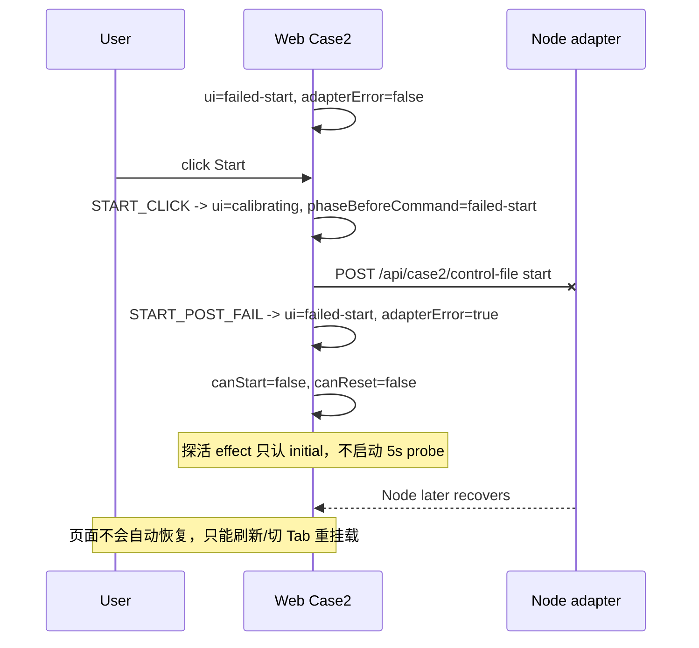
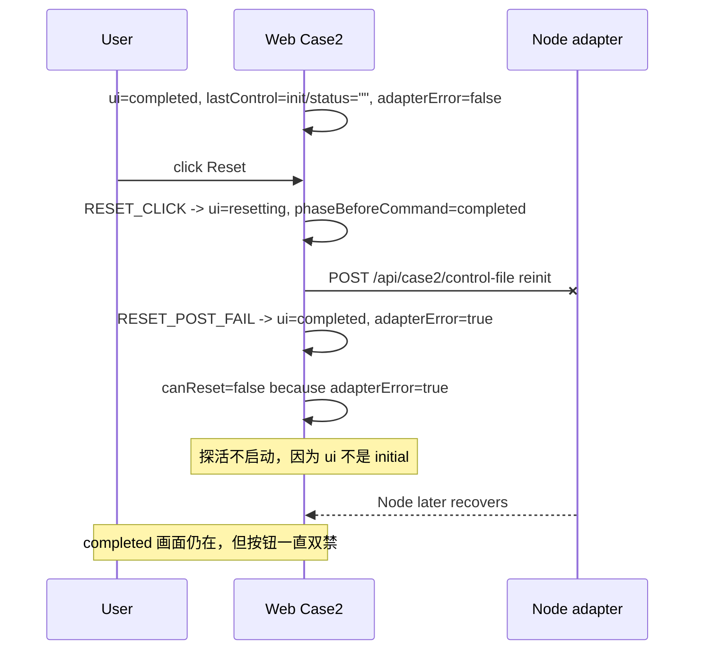
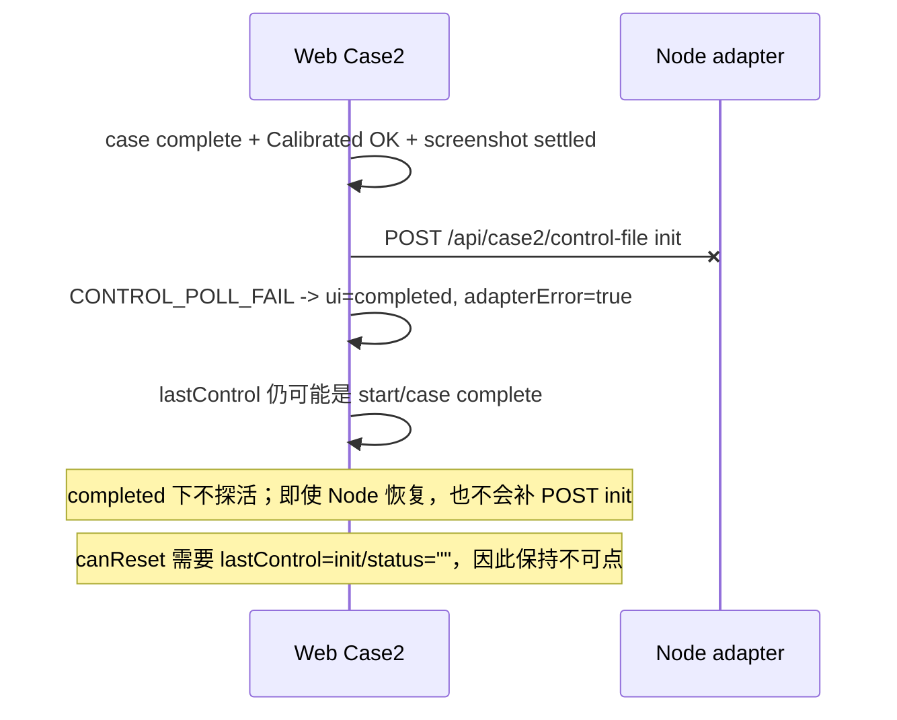

# BF-006 Case2：连接探活只覆盖 initial，非 initial 空闲相会锁死按钮

- Status: deferred-watch（暂不改代码）
- Severity: P3（共主机人工演示可接受人工恢复）；若要求无人值守长时间演示或真实挂载长时间联调，可升 P2
- Area: `code/web` Case2
- Updated: 2026-08-18
- 一次只修这一条

## 结论

问题仍存在，但原始关联路径已经缩小：

1. **仍存在**：`failed-start` / `completed` / `failed-reinit` 上发生真实连接失败后，`adapterError=true` 会双禁按钮，但 5s adapter probe 不会启动，只能刷新、切 Tab 重挂载，或重启 Web 状态。
2. **已被其他修复削弱**：`CONTROL_BUSY` 不再进入 `adapterError`，而是走 `COMMAND_CONTROL_BUSY` 回滚点击前相；`completed` 后 Reset 也已要求 `lastControl.command==="init"` 且 `status===""`，减少了“完成瞬间点重置”的触发概率。
3. **当前规格仍写着旧限制**：`WEB-SPEC` 明确探活仅覆盖 `adapterError=true && initial`；代码也按这个实现。

证据：

- `code/web/src/cases/case2/hooks/useCase2Controller.ts`：
  - `runAdapterRecoveryProbe` 在入口处要求 `snap.case2UiState === "initial"`。
  - `scheduleAdapterProbeLoop` 的循环继续条件也要求 `case2UiState === "initial"`。
  - effect 只在 `state.adapterError && state.case2UiState === "initial"` 时启动探活。
- `code/web/src/cases/case2/state/case2Reducer.ts`：
  - `canStart` / `canReset` 只要 `adapterError` 为 true 就返回 false。
  - `START_POST_FAIL` / `RESET_POST_FAIL` 回退点击前相，并置 `adapterError=true`。
  - `DIAGNOSTIC_CONTROL_OK` 只清 `adapterError` 和更新 `lastControl`，不改变 `case2UiState`，因此可以用于非 initial 空闲相恢复。

## 当前问题时序

### A. `failed-start` 重试启动时 Node 断开



### B. `completed` 上 Reset POST 真实连接失败



### C. `completed` 收尾 POST init 失败



## 共主机演示场景下是否值得修

我的判断：**当前不值得单独改代码，先作为可接受的人工恢复/观察项。**

原因：

1. Web 和 Node 共主机时，真实网络链路短；正常演示里，适配服务在非 initial 空闲相刚好断开、随后又恢复的概率偏低。
2. 原先较容易误触发的 `CONTROL_BUSY` 路径已经被 BF-009 削弱：它不再进入 `adapterError`，只回滚点击前相。
3. 不修不会造成数据错误或协议错写，主要代价是恢复体验差：Node 恢复后页面不会自己清掉连接异常。
4. 人工恢复路径明确：刷新页面或切 Tab 重挂载；代价是可能丢掉当前 React 内存中的完成态/失败态上下文。

在你的“Web + Node 同一台 PC”的内部演示里，若当天流程固定、Node 由脚本稳定启动，**短期不改代码**。若要给别人操作、长时间放置、现场可能重启 Node 或切换共享目录，再升级处理。

## 后续可选修改方案

### 方案 A：扩展现有探活到所有空闲可操作相（后续升级时推荐）

把探活条件从：

```ts
adapterError && case2UiState === "initial"
```

扩展为：

```ts
adapterError &&
case2UiState in ["initial", "failed-start", "completed", "failed-reinit"]
```

探活流程继续复用当前逻辑：`GET control-file -> POST init -> DIAGNOSTIC_CONTROL_OK`。仅在 `initialData` 缺失时补拉 Initial；不要因为探活成功把 `completed` / `failed-*` 改回 `initial`。

推荐理由：

- 能同时修 `failed-start`、`failed-reinit`、`completed Reset POST 失败` 和 `completed 收尾 POST init 失败`。
- `DIAGNOSTIC_CONTROL_OK` 当前不清 `calibratedData`、不改 UI 相，适合保留完成态画面。
- `POST init` 在这些状态下是空闲/收尾握手，不是业务命令重试；对 `completed` 尤其必要，因为 `canReset` 要求 `lastControl=init/status=""`。
- 改动最小，测试也明确。

风险与约束：

- 只能覆盖空闲相；`calibrating` / `resetting` 中的 poll 失败不在本单处理，不能借机做业务超时或自动失败。
- `CONTROL_BUSY` 仍必须保持 BF-009 语义：只回滚，不置 `adapterError`，不启动 probe。

建议测试：

- `failed-start + adapterError`：5s probe 后清 error，Start 恢复可点。
- `failed-reinit + adapterError`：5s probe 后清 error，Reset 恢复可点。
- `completed + adapterError + lastControl=init/status=""`：probe 后 Calibrated 仍显示，Reset 恢复可点。
- `completed + adapterError + lastControl=start/case complete`：probe 成功后补 `POST init`，Reset 恢复可点。
- `CONTROL_BUSY` 分支仍不触发 `adapterError` / probe。

### 方案 B：非 initial 空闲相只做 GET 探活，不 POST init

探活成功后新增类似 `ADAPTER_RECOVERED` 的 reducer action，只清 `adapterError`，不写控制文件。

优点：副作用最小，不会写 `init` 撤权。

缺点：修不全。`completed` 收尾 `POST init` 已失败时，单纯 GET 只能清连接异常，`lastControl` 仍不是 `init/status=""`，`canReset` 仍可能不可点。最后还得再加条件化 POST init，复杂度接近方案 A。

### 方案 C：不改代码，只写操作规程

遇到连接异常后刷新页面或切 Tab 重挂载。

优点：零代码风险。

缺点：现场体验差；刷新会丢掉当前 React 内存中的完成态/失败态上下文；操作者必须知道绕路。这个方案只适合非常短期、单人可控演示。

## 推荐

推荐 **方案 C：当前暂不改代码，只写操作规程并观察**。

理由：

- 当前触发条件窄，且共主机人工演示有明确绕路。
- 这不是数据正确性问题，也不是真实后端协议问题。
- 贸然改探活覆盖范围会带来测试面：`completed` 保留 Calibrated、`failed-*` 按钮恢复、`CONTROL_BUSY` 仍不得触发探活，都需要补验证。
- 等出现真实现场复现、无人值守需求或长时间真实挂载联调，再按方案 A 修，性价比更高。

当前操作规程：

1. 出现「case2文件服务器连接异常」且按钮全灰时，先确认 Node adapter 是否恢复。
2. Node 恢复后刷新页面，或切离再切回 `DT Calibration`。
3. 重新进入后按现有进页流程 `GET control-file -> POST init -> GET Initial` 恢复到 Initial。

升级条件：

- 现场或长时间联调复现 1 次以上。
- 演示交给非开发人员独立操作。
- 需要无人值守、轮播或长时间放置。
- 真实挂载联调阶段出现 adapter 重启、共享目录切换、端口占用等恢复场景。
