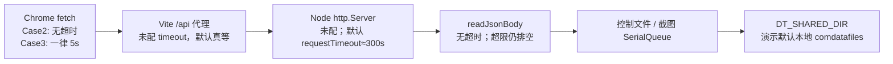
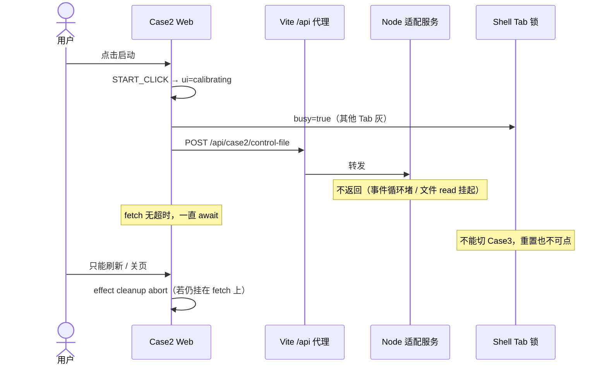
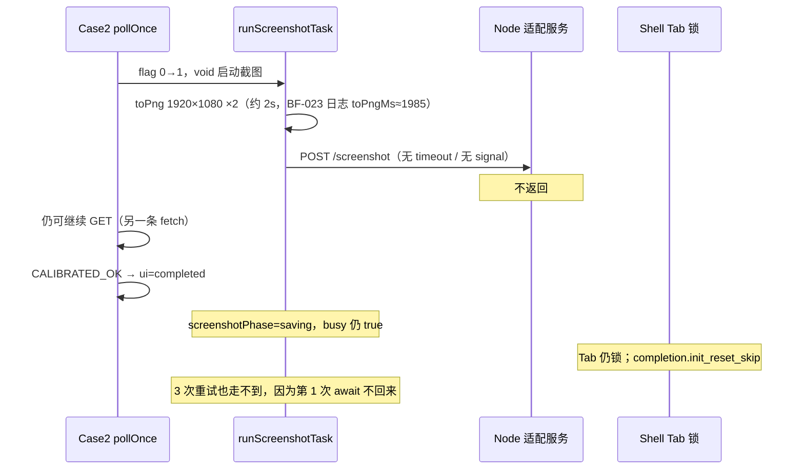
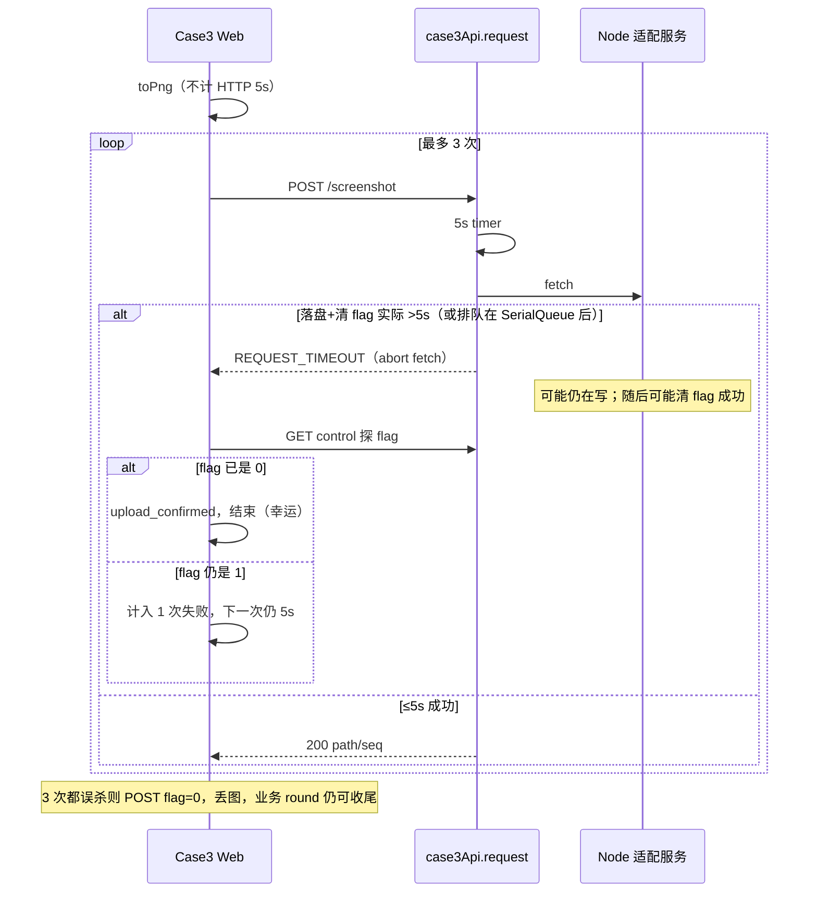

# BF-008 HTTP 超时：Case2 没有；Case3 截图共用 5s

- Status: done
- Severity: P1
- Area: `code/web` Case2 API + Case3 API
- 一次只修这一条
- 复核：2026-08-17（对照当时 Web/Node 代码）
- 落地：2026-08-17，用户确认方案 C
- 结论：缺陷当时仍在；已按分层超时修复。不抽公共 helper，不降截图像素比。

## 2026-08-17 三个问题的结论

1. **问题仍存在。** Case2 `request()` 仍无超时；Case3 所有路径（含 `POST /screenshot`）仍共用 `DEFAULT_REQUEST_TIMEOUT_MS = 5000`。Chrome fetch、Vite `/api` 代理、Node `http.createServer` 都没有更短的客户端超时；Node 20 未配置时 `requestTimeout` 默认约 300s。Case2 挂起时 Tab 只能刷新逃生；Case3 截图超过 5s 会变成 `REQUEST_TIMEOUT` 并吃掉 3 次配额。
2. **共主机演示值得改，但是小改。** 健康路径上本机 loopback + 本地 `comdatafiles` 通常很快，Case2 永久挂起概率低；Case3 3840×2160 PNG 的 JSON 上传+落盘+清 flag **有可能顶到 5s**。不改的代价见下表。不要把本单扩成改像素比（BF-UI）或 Node 排空（BF-017）。
3. **推荐方案 C：按路径分层超时**（Case2 补超时；Case3 截图单独加长）。复制 Case3 已有的 AbortController + `timedOut` 与调用方 abort 分流即可。不抽公共 helper，不改业务重试语义。

## 落地（方案 C，2026-08-17）

用户确认采用 C。未采用「统一 10s」。

| 路径 | 超时 | 常量 |
| --- | --- | --- |
| Case2 控制 GET/POST、data-files | 8s | `CASE2_REQUEST_TIMEOUT_MS` |
| Case3 控制 GET/POST、init-data、side | 5s | `CASE3_REQUEST_TIMEOUT_MS` |
| 两边 `POST /screenshot` | 20s | `CASE2_SCREENSHOT_TIMEOUT_MS` / `CASE3_SCREENSHOT_TIMEOUT_MS` |

行为：

- 超时：中止 fetch，抛 `REQUEST_TIMEOUT`（`httpStatus` 0）。Case2 不是 `AbortError`，`pollOnce` / 命令 POST 走现有 `CONTROL_POLL_FAIL` / `START_POST_FAIL` / `RESET_POST_FAIL`；Case3 截图把 `REQUEST_TIMEOUT` 当失败计入 3 次配额。
- 调用方 abort：保持 `AbortError`，不当成 timeout。
- 不改像素比、不改 Node/Vite 超时、不因 HTTP 超时自动结束业务轮次。

改动文件：

- `code/web/src/cases/case2/api/case2Api.ts`
- `code/web/src/cases/case3/api/case3Api.ts`
- `code/web/test/case2Api.test.ts`
- `code/web/test/case3/case3Api.test.ts`

---

## 1. 问题是否还在（代码证据）

| 断言 | 2026-08-17 代码 | 仍成立？ |
| --- | --- | --- |
| Case2 fetch 无超时 | `code/web/src/cases/case2/api/case2Api.ts` `request()` 只把 `init.signal` 传给 fetch，无 `AbortController` / `setTimeout` | 修复前是；现已有 8s/20s |
| Case2 截图也不受 poll abort 约束 | `useCase2Controller.ts` `api.postScreenshot(base64)` **不传 signal** | 仍不传 caller signal；截图自身 20s 超时可中止 fetch |
| Case3 一律 5s | `case3Api.ts`：`CASE3_REQUEST_TIMEOUT_MS = 5000`，`postScreenshot` 走 `CASE3_SCREENSHOT_TIMEOUT_MS = 20000` | 控制/数据仍 5s；截图 20s |
| Case3 超时可与调用方 abort 区分 | `timedOut` 优先抛 `REQUEST_TIMEOUT`；调用方先 abort 则保持 `AbortError` | 是；Case2 现同样分流 |
| 截图像素 2× | Case2 `pixelRatio: 2`；Case3 `CASE3_SCREENSHOT_PIXEL_RATIO = 2`；QA 证据里本机 PNG 为 3840×2160 | 是（本单不改） |
| 本单验收单测 | Case2 永不 resolve → `REQUEST_TIMEOUT`；Case3 GET 5s / screenshot 20s；调用方 abort ≠ timeout | 已做 |

未修时不是 duplicate。修复后本单关闭。

相邻但不在本单：

- **BF-017**：Node `readJsonBody` 超 20MiB 仍排空到 EOF，服务端无 request timeout。本单只改浏览器侧。
- **BF-013**：Case3 轮询失败只 `console.warn`。本单超时后控制 GET 仍走这条静默路径。
- **BF-001**：`waitClear` 停轮询导致 Tab 锁。本单是 **fetch 永不返回**，锁的机制不同。
- **BF-UI**：降 `pixelRatio` 是可选视觉/体积优化，禁止为本单超时去改。

### 请求链（为何共主机也会挂 / 误杀）

共主机只保证 Web 与 Node 同机、loopback 延迟低。**不保证** Node 事件循环永不堵、控制文件锁永不排队、3840×2160 PNG 的 JSON 体解析+`fsync`+清 flag 一定 <5s。

---

## 2. 仍存在时的时序

### 2.1 Case2：控制 GET / 命令 POST 挂起 → Tab 锁，只能刷新

`START_CLICK` 会立刻把 UI 打成 `calibrating`。`Case2Page.busy` 在 `calibrating|resetting|pending|saving|waitClear` 为 true，Shell 锁其他 Tab。`pollOnce` 是 `await getControl()` 串行循环：这一发不返回，下一发不排。规格不做业务命令自动超时，因此 **HTTP 层没有上限 = 这一轮永远是「测试中」**。

适配进程崩溃通常是 `ECONNREFUSED`，fetch 会很快失败并走 `START_POST_FAIL` / `CONTROL_POLL_FAIL`。真正危险的是 **连接已建立、响应永不来**：Node 断点、事件循环堵死、共享目录 read 挂起、Vite 代理对卡住的 3102 真等。此时 Chrome 不会自己断；要等到 Node 默认 ~300s `requestTimeout`，或用户刷新。

轮询挂起同构：启动 POST 已成功、`schedulePollLoop` 里 `await pollOnce()` → `getControl` 永不返回 → 后续 1000ms 轮询不再排。`CONTROL_POLL_FAIL` **不会发生**。即便以后加了超时并 `CONTROL_POLL_FAIL`，也只把 `adapterError=true`，**ui 仍是 calibrating，Tab 仍锁**（规格：不因单次传输失败自动结束本轮）。超时的价值是：轮询循环能继续转、徽标能亮连接异常，而不是整条 await 冻死。

命令 POST 挂起更狠：`START_POST_FAIL` 根本进不去，回不到 `phaseBeforeCommand`。

### 2.2 Case2：截图 POST 挂起 → completed 后仍锁 Tab

截图任务与轮询并发（`void runScreenshotTask()`）。`postScreenshot` 无超时且无 signal。相位停在 `saving` 时 `busy` 仍为 true；`screenshotBusyRef` 挡住完成态 `POST init`。

### 2.3 Case3：截图共用 5s → 误超时吃掉 3 次配额

`toPng` **不计**进这 5s。计时只包 `POST /screenshot`（上传 JSON + Node 校验/排队/写盘/`fsync`/清 flag + 响应）。超时抛的是 `Case3ApiError REQUEST_TIMEOUT`，`isAbortError` 为 false，于是当失败重试。调用方 abort（切 Tab、execute fail）仍是 `AbortError`，截图循环会直接 return，这条是对的。

误杀时的次生：第一次 POST 已被 abort，Node 若仍在 `queue.run` 写盘，第二次 POST 会排在同一截图队列后面，更容易再超 5s。最坏是三次都超时 → 丢图；若第一次其实已经写成，可能留下 PNG 且 Web 以为失败后又去清 flag（规格已允许极端窗口丢/重图）。

Case3 控制 GET 的 5s **合理**：500ms 串行轮询不该无限等。超时后当前只 `poll.fail` 日志，busy 不解（BF-013）。

---

## 3. 共主机演示：值不值得改，不改的代价

场景口径：Chrome + Vite + Node 适配同机，`127.0.0.1:3102`，共享根默认本地 `code/comdatafiles`，打桩后端。不是真实挂载、不是分机。

| 故障 | 共主机健康路径概率 | 不改时用户可见 | 演示杀伤 |
| --- | --- | --- | --- |
| Case2 命令 POST / 控制 GET 永不返回 | **低**（Node 卡死、调试断点、目录 hang；进程直接挂掉反而会秒失败） | 一点启动就「测试中」+ **Tab 锁死**，重置不可点，只能刷新 | 高（现场像死机） |
| Case2 截图 POST 永不返回 | **低** | 图已出来仍锁 Tab，完不成 `POST init` | 高 |
| Case3 截图 POST 实际 >5s | **中低**。本机数 MB JSON 通常 <5s；3840×2160 + 双地图 canvas PNG 偏大、控制/截图队列卡住、磁盘 `fsync` 时可能顶到 | 控制台 `REQUEST_TIMEOUT` ×3，**丢本张截图**；round 往往仍能结束，Tab 最终会解 | 中（丢 PNG，多卡约 15s+） |
| Case3 控制 GET 5s | 已有保护，保持 | 单次慢 GET 最多卡 5s 再打下一轮；失败无界面（BF-013） | 低 |

**判断：值得改，但只做分层超时，工作量小。**

理由：

- 共主机 **消除不了**「已建立连接却不回」；只是让 RTT 变短。Case2 无超时 = 这一类故障没有演示逃生，只能刷新。
- Case3 5s 是 **健康路径也可能踩到的假失败**，和「Node 已死」不是同一类。假失败会浪费本就只有 3 次的截图配额。
- 改动面只在两个 `*Api.ts` + 单测；不碰 reducer 业务语义，不碰像素比。
- 不改可以演示，前提是接受：刷新是 Case2 挂起的唯一出口；Case3 偶发丢图算可接受。这是产品取舍，不是「代码已经安全」。

不在本单把「Tab 因 calibrating 一直锁」改成超时后自动 `failed-start`。那是业务命令超时，P0-2 明确不做。

---

## 4. 若修改：方案与推荐

| 方案 | 做什么 | 优点 | 缺点 | 演示共主机 |
| --- | --- | --- | --- | --- |
| A. wontfix | 文档留下残余风险 | 零改动 | Case2 挂起只能刷新；Case3 假超时仍在 | 仅当明确接受丢图/刷新 |
| B. 只加长 Case3 截图超时 | `postScreenshot` 用 20s，其余仍 5s | 最小 diff；对准更可能的健康路径 | Case2 挂起原样 | 半套 |
| **C. 分层超时（推荐）** | Case2 补与 Case3 相同的 timeout/abort 分流；控制/数据 8s；**两边 screenshot 20s**；其它 Case3 仍 5s | 对准本单两条现象；单测好写；不发明业务重试 | 比 B 多改 Case2 API | **推荐** |
| D. 抽公共 `requestWithTimeout` | 两 Case 共用 helper | 长期少分叉 | 超出「一次一条」；易误伤 keepalive/init | 不推荐本单 |
| E. 顺手改 Node/Vite 超时或降 pixelRatio | 服务端 `request.destroy`、代理 timeout、1× 截图 | 纵深，但不是本单根因层 | 混入 BF-017 / BF-UI | 禁止本单做 |

**推荐 C，why：**

1. Case3 已经实现了正确的「超时 ≠ 调用方 abort」。Case2 缺的就是这 30 行，不需要新抽象。
2. 控制/数据短超时（8s）让挂起的 poll/命令 POST 能进入 **已有** `CONTROL_POLL_FAIL` / `START_POST_FAIL` / `RESET_POST_FAIL`。命令 POST 失败会退回 `phaseBeforeCommand` 并解 Tab；轮询失败不解 Tab（符合「不自动结束本轮」），但循环能继续、连接异常能亮。
3. 截图单独 20s：覆盖 3840×2160 JSON 上传+落盘+清 flag，避免 3×5s 误杀；仍远小于 Node 默认 300s。生成 `toPng` 仍不计入 HTTP 超时（生成失败走现有 3 次重试）。
4. 不把超时当成业务重试；截图仍最多 3 次；清 flag 失败仍按现有路径。
5. 超时码：Case3 保持 `REQUEST_TIMEOUT`。Case2 建议同样抛带 `code: "REQUEST_TIMEOUT"` 的 `Case2ApiError`（httpStatus 0），controller 不必特判，走现有 fail；单测断言 code 即可。

数值建议（可在实现时微调，不要再拆单）：

| 路径 | 超时 |
| --- | --- |
| Case2/Case3 控制 GET/POST、Case2 data-files、Case3 init-data/side | 8s（Case3 若想少动，控制/side **可继续 5s**） |
| `POST /screenshot`（两 Case） | 20s |
| 调用方 `AbortSignal`（切 Tab、卸载、execute fail） | 立即 abort，**不得**标成 `REQUEST_TIMEOUT` |

实现要点（方案 C，仍未写代码）：

- Case2 `request()` 抄 Case3：内部 AbortController、caller abort 置位、timeout abort、`finally` clearTimeout。
- `postScreenshot(path, init, mapOk, timeoutMs)` 或 `request(..., { timeoutMs })`；默认短、截图长。
- Case2 截图补上 `signal` 不是本单必做（超时在 request 内部已能 abort fetch）；不要借这个去降像素比。
- 不要改 Vite proxy timeout、不要改 Node `server.requestTimeout`（BF-017）。
- 不要因超时去 `stopPolling` 后当本轮失败。

---

## 原工单（检视当时，仍然准确）

### 现象

1. Case2 `fetch` 无超时。适配服务或 Vite 代理挂起时，`pollOnce` 一直等，Tab 锁不解。
2. Case3 所有请求默认 5s，含 `POST /screenshot`。舞台 1920×1080 且 `pixelRatio: 2`（3840×2160 PNG），上传+落盘容易 `REQUEST_TIMEOUT`，吃掉 3 次截图配额。

### 关键代码

- `code/web/src/cases/case2/api/case2Api.ts`：`request()` 无 timeout
- `code/web/src/cases/case3/api/case3Api.ts`：`DEFAULT_REQUEST_TIMEOUT_MS = 5000`
- 截图像素：Case2 `useCase2Controller.ts` `pixelRatio: 2`；Case3 `CASE3_SCREENSHOT_PIXEL_RATIO = 2`

### 建议修法

- Case2：control / data 请求加超时（建议 5–8s），超时走现有 `CONTROL_POLL_FAIL` / 命令 POST fail，不要自己发明业务重试。
- Case3：screenshot POST 单独更长超时（建议 15–30s）；其它 GET/控制写可保持 5s。
- 超时错误码要能和 abort 区分（Case3 已有 `REQUEST_TIMEOUT`）。

不要为了超时去降低截图像素比（那是 BF-UI 的可选优化）。

### 验收

- [x] Case2 单测：假 fetch 永不 resolve，超时后抛 `REQUEST_TIMEOUT`（非 `AbortError`，controller 现有 catch 会当成 poll fail）。
- [x] Case3 单测：普通 GET 仍 5s；screenshot 超时阈值 20s。
- [x] 调用方 abort 仍表现为 abort，不当成 timeout。
