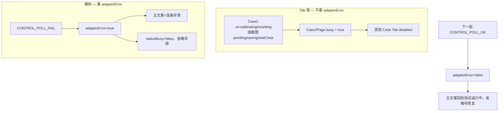
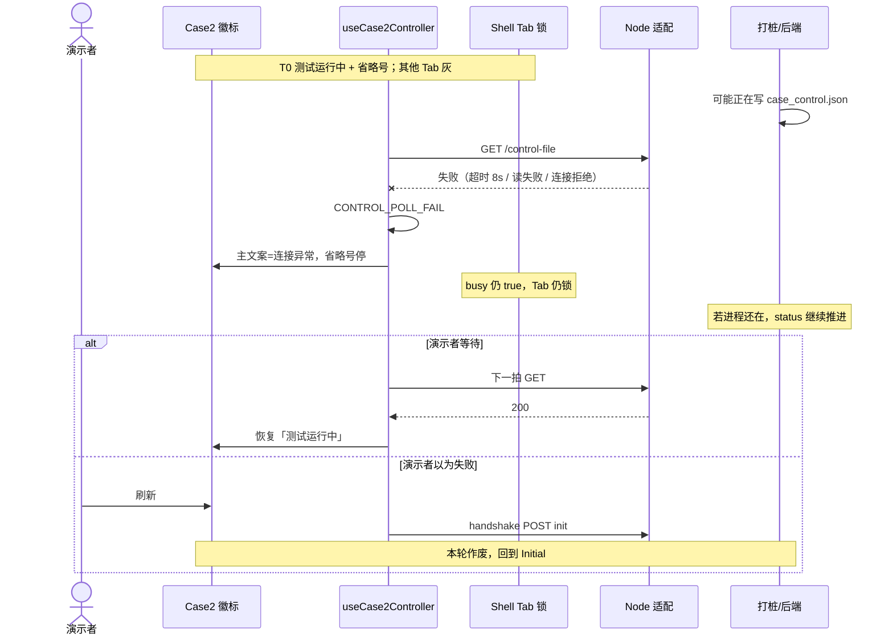
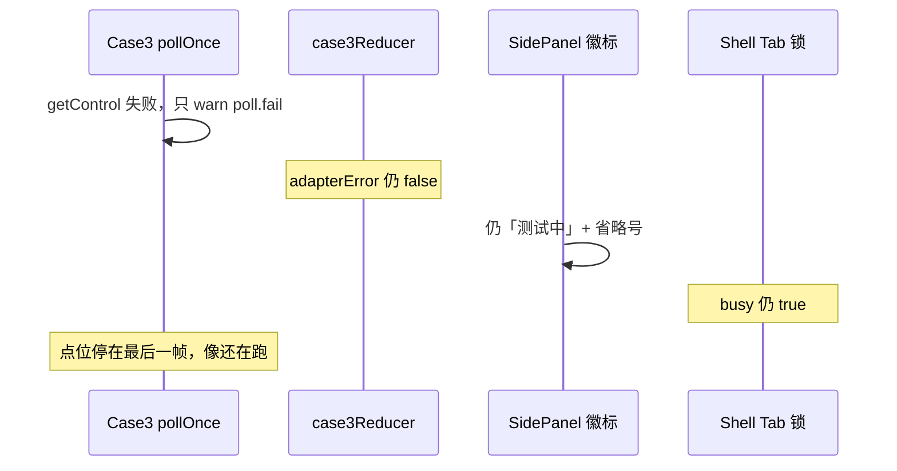

# BF-011 忙态中连接失败盖住「测试中」

- Status: done
- Severity: P1
- Area: `code/web` Case2 + Case3
- 一次只修这一条（两边徽标选择器一起改，保持文案一致）
- 复核：2026-08-18（对照当时 Web 代码；BF-008 分层超时已落地）
- 落地：2026-08-18，用户确认方案 D（与 BF-013 一起）
- 配对工单：[BF-013](BF-013-case3-poll-fail-visible.md)
- 结论：缺陷当时仍在；已按方案 D 改忙态徽标。不解 Tab、不撤权。

## 落地（方案 D-011，2026-08-18）

忙态主文案不再被「连接异常」盖掉；省略号保持；连续 3 次 poll 失败才亮次要「重试中」。空闲态仍显示连接异常。

| 项 | 行为 |
| --- | --- |
| Case2 `calibrating`/`resetting` | 主文案「测试运行中」/「重置中」+ 省略号；`pollFailStreak>=3` 时旁注「重试中」 |
| Case2 `completed` 截图收尾 | 主文案保持「已完成」，不换成连接异常 |
| Case2 空闲 `adapterError` | 仍「case2文件服务器连接异常」，按钮禁用 |
| Case3 `activeAction`/`roundClosing` | `sideStatusBadge` 走业务文案；`sideStatusBadgeIsError` 为 false；跑着的那侧可亮「重试中」 |
| Tab 锁 | 仍只看 busy 相，不因 poll 失败解开 |

改动文件：

- `code/web/src/cases/case2/state/case2Reducer.ts`
- `code/web/src/cases/case2/Case2Page.tsx`、`case2.css`
- `code/web/src/cases/case2/hooks/useCase2Controller.ts`
- `code/web/src/cases/case3/state/case3Reducer.ts`
- `code/web/src/cases/case3/components/SidePanel.tsx`、`case3.css`、`Case3Page.tsx`
- `code/web/test/case2Reducer.test.ts`、`test/case3/case3Reducer.test.ts`

Case3 轮询何时置 `adapterError` 见 BF-013。

---

## 2026-08-18 三个问题的结论

1. **时序**：忙态 Tab 锁着、业务轮询还在转；**只有主文案/省略号被 `adapterError` 换掉**。Case2 是「一次 GET 失败立刻长得像已经失败」；Case3 现在甚至走不到这条（poll 失败不置 `adapterError`，见 BF-013）。两边语义是反的。
2. **共主机（Web+Node 同机）值得改徽标，不是因为 loopback 会抖。** Chrome↔Node 断连仍极低（同 BF-004）。要改的是 **展示过敏**：单次 `CONTROL_READ_FAILED` / `REQUEST_TIMEOUT`(8s) 也会把「测试运行中」换成「连接异常」。不改能演示，代价是演示者容易刷新，本轮作废。
3. **推荐 D**：忙态保留「测试运行中/测试中/重置中」+ 省略号；连接问题降为次要「重试中」；连续 3 次失败才亮次要文案。不解 Tab、不撤权、不 `POST init`。Case3 的 `adapterError` 派发留给 BF-013，且必须在本单之后。

---

## 1. 问题是否还在（代码证据）

| 断言 | 2026-08-18 代码 | 仍成立？ |
| --- | --- | --- |
| Case2 一次 poll 失败就 `adapterError` | `useCase2Controller.ts` `pollOnce` catch → `CONTROL_POLL_FAIL` | 是 |
| Case2 徽标 `adapterError` 优先于忙态文案 | `statusFeedbackText`：先返回「case2文件服务器连接异常」 | 是 |
| Case2 省略号因 `adapterError` 停掉 | `Case2Page.tsx` `statusBusy = !adapterError && (calibrating\|resetting)` | 是 |
| Case2 Tab 仍锁 | `busy` **不看** `adapterError`，仍为 calibrating/resetting/截图相 | 是 |
| 下一拍成功会自己恢复 | `reduceControlPoll` / `CONTROL_POLL_OK` 置 `adapterError: false` | 是 |
| Case3 徽标同样 adapter 优先 | `sideStatusBadge` 先返回 `CASE3_ADAPTER_ERROR_BADGE`；`isBusyBadge` 只认「测试中/重置中」 | 选择器是；**忙态 poll 当前几乎走不到**（见下） |
| Case3 忙态 poll 失败置 `adapterError` | `pollOnce` 外层 catch 只 `case3Warn("poll.fail")`；`side.live_fail` 同样只 warn | **否**，这是 BF-013 |

未修，不是 duplicate。BF-008 已给 Case2 控制 GET 8s 超时：以前「永不返回」现在会变成 `REQUEST_TIMEOUT` → 本单的 `CONTROL_POLL_FAIL`。也就是说 **BF-008 让本单更容易在共主机上被看见**（慢 GET 不再冻死，而是闪成连接异常）。

相邻但不在本单：

- **BF-013**：Case3 要把 poll 失败变成可见的 `adapterError`。若先做 013 不做本单，Case3 会复制 Case2 现在的「看起来已失败」。
- **BF-006**：`adapterError` 留在 `completed`/`failed-start` 时探活不跑。本单不修探活。
- **BF-004**：空闲态连接异常仍可点 Case3 按钮。本单只谈 **忙态徽标**。
- **BF-018**：Node 读控制文件不对 `EBUSY` 重试。那是减少抖的服务端手段，不替代本单展示策略。
- **P0-2**：不做取消、不做业务命令自动超时。忙态 poll 失败 **不得** 改成 `failed-start` 或解 Tab。

---

## 2. 问题时序图

数据关系（忙态锁与徽标是两条线）：



### 2.1 Case2：单次 control GET 失败（本单主路径）

触发可以是：Node 进程没了（`ECONNREFUSED`）、控制文件 JSON 三次重试仍坏（`CONTROL_READ_FAILED`）、BF-008 之后 GET 超过 8s（`REQUEST_TIMEOUT`）。**不需要分机断网。**

```text
T0  用户已点启动，ui=calibrating，徽标「测试运行中」+ 省略号，Tab 锁
T1  pollOnce GET /api/case2/control-file 失败
T2  CONTROL_POLL_FAIL → adapterError=true
T3  徽标换成「case2文件服务器连接异常」+ is-error；省略号停
T4  schedulePollLoop 仍在，1000ms 后再 GET；Tab 仍锁；后端/打桩可能仍在写 status
T5a 下一拍成功 → adapterError 清除，看起来「自己好了」
T5b 演示者在 T3 刷新 → 进页 POST init，本轮作废（规格：刷新回 Initial）
```



`waitClear`（ui 已是 `completed`）时同样：poll 失败会把「已完成」盖成「连接异常」，截图收尾期间 Tab 仍锁。

### 2.2 Case3：选择器已写好，忙态 poll 目前进不去

若 `adapterError===true` 且 `activeAction` 还在：

- `sideStatusBadge` → 「case3文件服务器连接异常」
- `sideStatusBadgeIsError` → true → 红样式
- `SidePanel` `isBusyBadge` 不再是「测试中」→ 省略号停
- `setBusy(true)` 不因 poll 失败而清 → Tab 仍锁

当前 `poll.fail` / `side.live_fail` **不 dispatch `ADAPTER_ERROR`**，所以演示里 Case3 是 2.3 而不是 2.2。BF-013 一旦按「第一次失败就置位」落地，Case3 会立刻变成 2.2。



### 2.3 不是本单的时序（避免和 BF-004 / 命令 POST 搞混）

- 启动 **POST** 失败：Case2 走 `START_POST_FAIL`，**退回点击前相** 并解 busy。那是命令没写出去，不是忙态 poll。
- 进页 Node 没起：`initial` + `adapterError`，探活覆盖（BF-006 只说失败态缺口）。本单不管空闲态。

---

## 3. 共主机演示：值不值得改，不改的代价

场景口径：Chrome + Vite + Node 适配同机，`127.0.0.1:3102`，共享根默认本地 `code/comdatafiles`，打桩原子 rename 写控制文件。不是真实挂载、不是分机。

和 BF-004 的差别：**BF-004 的根因是 loopback POST 失败（极低）→ 先不改。本单的根因是徽标选择器，即使传输几乎永不失败，一次读超时/读失败也会换主文案。**

| 故障 | 共主机健康路径概率 | 不改时用户可见 | 演示杀伤 |
| --- | --- | --- | --- |
| 单次控制 GET 失败后下一拍成功 | **低～中低**。本地原子 rename 很少撕 JSON；8s 超时、杀 Node、调试断点、BF-018 的 `EBUSY` 仍可能 | 约 1s（或最多 8s 超时）内徽标变红「连接异常」、省略号停，然后可能自己变回来 | **中**：不刷新则无数据损失；一刷新本轮没了 |
| Node 在校准中被杀掉 | **低**（操作事故，但演示现场会有人重启 3102） | Case2：持续「连接异常」+ Tab 锁，**这其实该提示**；只是文案像业务失败 | 中：锁着但至少有红字 |
| Case3 校准中 Node 挂了 | 同左 | **本单不改也无变化**（仍「测试中」），见 BF-013 | 见 BF-013 |
| 演示者把红字当「执行失败」 | 取决于临场 | 刷新 / 乱点 | **高**（人为中断正在跑的打桩） |

**判断：值得改，只改忙态徽标与省略号条件，工作量小。**

理由：

- 共主机 **消除不了**「单次 GET 非 200」。BF-008 之后失败会更快变成可见状态，而不是永远 await。
- 不改 **不丢业务数据、不解错 Tab、不写坏控制文件**。伤的是观感和「刷新」这个合法逃生口被误用。
- 不改可以演示，前提是：演示者看见「连接异常」时 **先等下一拍、看控制台 `[case2] poll.fail`，不要刷新**。这是产品取舍，不是「代码已经安全」。
- 比 BF-004 更值得做：004 要动清空时序；本单是选择器 + 一行 `statusBusy` 条件。

不在本单把忙态失败升级成 `failed-start`。那是业务命令超时，P0-2 禁止。

---

## 4. 若修改：方案与推荐

| 方案 | 做什么 | 优点 | 缺点 | 演示共主机 |
| --- | --- | --- | --- | --- |
| A. 两单 wontfix | 文档留下残余风险 | 零改动；对齐 BF-004「同机少改」 | Case2 仍会闪红；Case3 真断了仍无界面 | 仅当明确接受「别刷新」纪律 |
| B. 只改本单徽标 | 忙态主文案保持测试中；`statusBusy`/`isBusyBadge` 不因 `adapterError` 为 false；次要「重试中」或 `title` | Case2 当场不再像失败；diff 小 | Case3 仍静默（BF-013） | 共主机最小有价值集 |
| C. 只做 BF-013 | Case3 第一次 poll 失败就 `ADAPTER_ERROR` | Case3 不再假跑 | **Busy 主文案被盖掉**，Case3 变成今天的 Case2 | **禁止单独做** |
| **D. 011 徽标 + 013 连续 3 次（推荐）** | 本单改选择器；BF-013 再给 Case3 连续失败置位；成功一次清 streak | 过敏/过钝一起收口；单次抖不亮红 | 两次提交（遵守一次一条） | **推荐** |
| E. 忙态失败就 `failed-start` / 解 Tab | 当业务超时 | 演示者能点按钮 | 违反 P0-2；打桩可能仍在跑 | 禁止 |
| F. 主文案仍换连接异常，只加 `title` | 几乎不改视觉 | diff 最小 | 省略号仍停、红样式仍在，刷新冲动还在 | 不够 |

**推荐 D，本单先做 D 里属于 011 的那一半。why：**

1. 根因是 **文案优先级**，不是「有没有 `adapterError`」。忙态下 `adapterError` 表示传输在重试，不是 `execute fail`。
2. Case2 单独做 B/D-011 就够挡住「闪红→刷新」。连续 3 次只是避免「重试中」也闪一下，建议本单一并做（`pollFailStreak` 放 controller ref 即可，不必进 reducer）。
3. Case3 必须先有本单选择器，BF-013 才能把失败变成「测试中 + 重试中」而不是「连接异常」。
4. 不解锁、不撤权、不 invent 业务重试：poll 循环本来就在转。
5. 空闲态（`initial` / Case3 `initStatus!==ready`）仍用「连接异常」并禁用按钮，本单不放宽。

本单落地范围（方案 D-011，已写代码）：

- `statusFeedbackText`：`calibrating`/`resetting` 时返回「测试运行中」/「重置中」，不要被 `adapterError` 换掉。
- `Case2Page` `statusBusy`：忙态相下即使 `adapterError` 也保持省略号。
- Case3 `sideStatusBadge` / `isBusyBadge`：`activeAction` 时同样不让 adapter 文案替换「测试中/重置中」。
- 次要提示：主文案旁加「重试中」或 `title`（长文案不要撑破 32px 徽标；完整句放 `title`）。
- Case2 连续 3 次 `CONTROL_POLL_FAIL` 才把次要「重试中」亮起来；一次成功清零。（若想最小 diff，可本单先每次失败都亮「重试中」，3 次过滤放到 BF-013 对称做。更推荐本单就做 3 次，避免 Case2 仍闪副文案。）
- 单测：reducer/页面选择器；不要改 Node，不要改 BF-013 的 poll catch。
- 不改 `doc/`。

Case3 `ADAPTER_ERROR` 的 dispatch、live `getSide` 失败计数 → **BF-013**。

---

## 原工单（检视当时，仍然准确）

### 现象

测试/重置进行中若单次 control GET 失败：

- Case2：`adapterError` 优先，徽标变成「case2文件服务器连接异常」；`statusBusy` 因 `adapterError` 为 false，省略号停掉。轮询其实还在，Tab 仍锁。
- Case3：`sideStatusBadge` 同样 adapter 文案优先，busy 省略号因 badge 不再是「测试中」而停。

演示看起来像已经失败，其实后端可能仍在跑。

### 关键代码

- `code/web/src/cases/case2/state/case2Reducer.ts`：`statusFeedbackText`
- `code/web/src/cases/case2/Case2Page.tsx`：`statusBusy`
- `code/web/src/cases/case3/state/case3Reducer.ts`：`sideStatusBadge` / `sideStatusBadgeIsError`
- `code/web/src/cases/case3/components/SidePanel.tsx`：`isBusyBadge`

### 建议修法

忙态（calibrating/resetting/activeAction）时保留「测试中/重置中」+ busy 样式；连接问题用次要文案或 title（例如「连接重试中」），不要拆掉 `is-busy`。恢复后去掉次要文案。

不要在忙态因一次 poll 失败就解 Tab 锁或自动撤权。

### 验收

- [x] calibrating 期间 poll 失败：仍显示测试中/省略号，Tab 仍锁。
- [x] poll 恢复：adapterError 清除，文案恢复正常忙态或完成态。
- [x] idle 下的连接失败仍显示连接异常并禁用按钮（Case2 已有；Case3 见 BF-004）。
