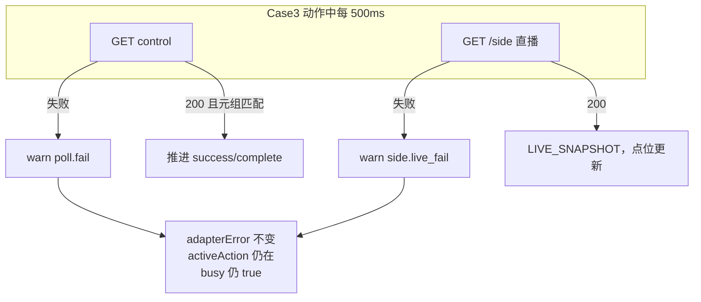
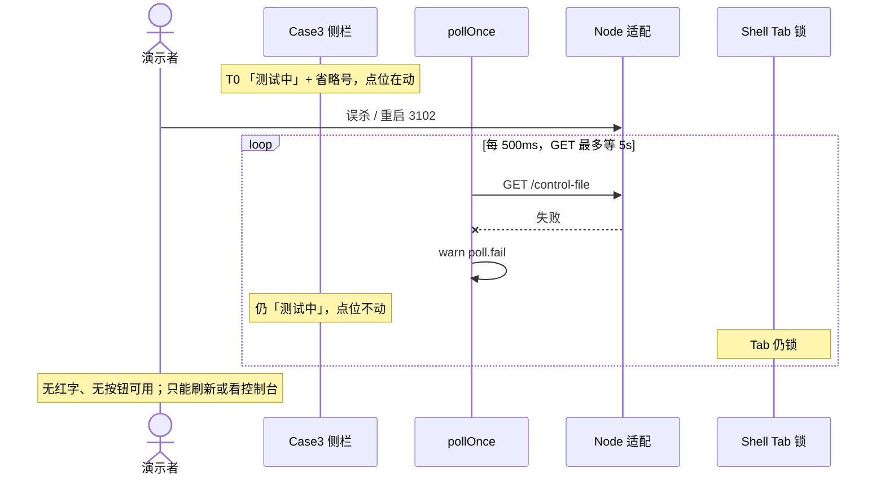
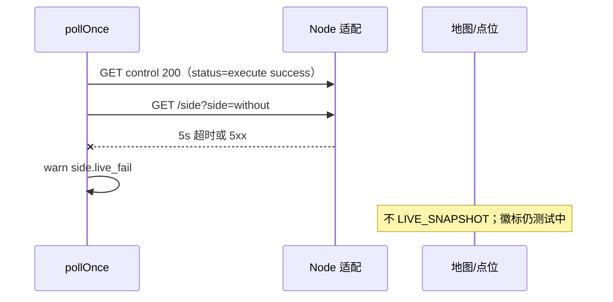
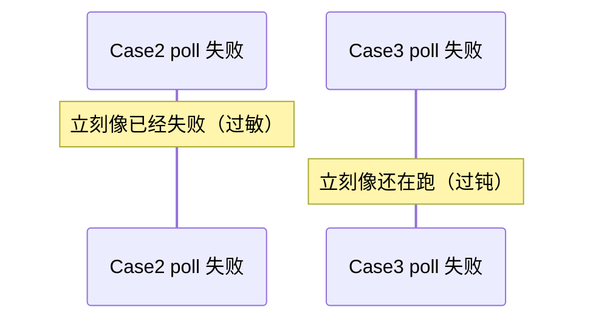

# BF-013 Case3：轮询失败只打日志、用户无感知

- Status: done
- Severity: P1
- Area: `code/web` Case3
- 一次只修这一条
- 复核：2026-08-18（对照当时 Web 代码；BF-008 分层超时已落地）
- 落地：2026-08-18，用户确认方案 D（BF-011 之后）
- 前置：[BF-011](BF-011-busy-adapter-error-badge.md)
- 结论：缺陷当时仍在；已按方案 D 连续 3 次失败才置 `adapterError`。不解 busy、不撤权。

## 落地（方案 D-013，2026-08-18）

动作中 `poll.fail` 与 `side.live_fail` 共用 `pollFailStreakRef`。连续 3 次才 `ADAPTER_ERROR true`；control 可读且本拍未计 fail 则清零并 `false`。最终门槛 `noteFinalNotReady` 不计入 streak。

| 项 | 行为 |
| --- | --- |
| 单次 GET 失败 | 只 warn，`adapterError` 仍 false |
| 连续 3 次 | `adapterError=true`，徽标仍「测试中」+「重试中」（BF-011） |
| 随后一拍成功 | streak=0，`adapterError=false`，动作继续 |
| `RESULT_NOT_READY` / 10 次回退 | 不变 |

改动文件：

- `code/web/src/cases/case3/hooks/useCase3Controller.ts`
- `code/web/src/cases/case3/state/case3Reducer.ts`（`CASE3_POLL_FAIL_RETRY_THRESHOLD`）
- `code/web/test/case3/useCase3Controller.lifecycle.test.ts`

---

## 2026-08-18 三个问题的结论

1. **时序**：Case3 动作中 `pollOnce` 外层 catch 与 `side.live_fail` **只 `console.warn`**，不 `ADAPTER_ERROR`、不解 `busy`、不撤权。点位停在最后一帧，徽标继续「测试中」，Tab 锁死。和 Case2「一次失败就换连接异常」正好相反。
2. **共主机值得改，优先级低于 BF-011。** Chrome↔Node 闪断仍极低。要防的是 **演示中途把 Node 杀掉 / GET 连续 5s 超时** 时，Case3 一轮 31 点要跑几十秒，界面完全不报。不改能演示，代价是只能看控制台或干等到刷新。
3. **推荐 D，且禁止先于 BF-011。** 先做本单、不做 011，会把 Case3 变成今天的 Case2：忙态主文案变「连接异常」，省略号停，演示者更想刷新。

---

## 1. 问题是否还在（代码证据）

| 断言 | 2026-08-18 代码 | 仍成立？ |
| --- | --- | --- |
| 控制 GET 失败只打日志 | `useCase3Controller.ts` `pollOnce` catch：`case3Warn("poll.fail")`，无 dispatch | 是 |
| live `getSide` 失败同样静默 | 内层 catch `case3Warn("side.live_fail")`，不冒泡到外层 | 是 |
| 忙态 Tab 仍锁 | 失败路径不 `setBusy(false)` | 是 |
| 单次失败不撤权 | 不 `POST init`、不 `EXECUTE_FAIL` | 是（这点是对的，应保留） |
| reducer 已有 `ADAPTER_ERROR` | 有；进页握手失败、命令 POST 失败、收尾 `POST init` 失败会用 | 是，**就是 poll 不用** |
| 徽标 adapter 优先 | `sideStatusBadge` 见 BF-011 | 是；所以本单若直接置位会盖住「测试中」 |

原工单写「idle/动作中」。**纠正：Case3 空闲不跑业务 poll**（只有 handshake / 5s probe）。本单范围是 **`activeAction` 或截图 `waitClear` 期间的 poll/live GET**。idle 连接失败已由握手 `adapterError` 覆盖。

`case complete` 之后的最终 `getSide` 失败走 `noteFinalNotReady`（最多 10 次 → 结果不完整回退），**不是**本单的静默路径。不要把最终门槛超时算进本单的 3 次 streak（最终门槛是另一条退出语义）。

相邻：

- **BF-011**：忙态文案。本单依赖它。
- **BF-008**：控制/side GET 仍 5s；超时现在会进 `poll.fail` / `side.live_fail`，仍无界面。
- **BF-004**：idle 且 `ready` 时按钮不看 `adapterError`。本单不改 `can*`。
- **P0-2**：连续失败也不得自动结束业务轮次。

---

## 2. 问题时序图



### 2.1 动作中控制 GET 一直失败（Node 挂了 / 连续超时）

Case3 一轮比 Case2 长（默认 31 点、500ms 轮询）。共主机上最现实的触发是：**测到一半有人重启适配进程**。

```text
T0  Without 测试中，点位在增加，徽标「测试中」，Tab 锁
T1  Node 退出，或 GET 连续 REQUEST_TIMEOUT(5s)
T2  每拍只 warn poll.fail；点位冻结在 T0 最后一帧
T3  徽标仍「测试中」+ 省略号；演示者以为还在扫点
T4  不会自动 failed-start，也不会解 Tab
T5  只能刷新（回 Initial）或把 Node 拉起来等下一拍 GET 成功（点位从文件继续）
```



### 2.2 仅 live `getSide` 失败（control 仍 200）

控制文件可读、侧文件慢/校验失败时：外层 catch 进不去，只有 `side.live_fail`。界面同样「测试中」，点位不涨。最终 complete 门槛是另一条路径。



### 2.3 对照：同一时刻的 Case2

Case2 一次失败就会 `CONTROL_POLL_FAIL` → 主文案「连接异常」（BF-011）。所以 **TOP2 不是两个独立偶发，是同一轮询失败在两边展示反了。**



---

## 3. 共主机演示：值不值得改，不改的代价

场景口径同 BF-011 / BF-004：Web+Node 同机 loopback，本地 `comdatafiles`，打桩。

| 故障 | 共主机健康路径概率 | 不改时用户可见 | 演示杀伤 |
| --- | --- | --- | --- |
| 单次 GET 失败、下一拍成功 | **低**（原子写 + 本机盘） | 完全无感知，点位下一拍继续 | **无**（静默在这里反而是对的） |
| Node 在 Without/With 跑到一半被杀 | **低**，但 Case3 窗口是几十秒不是 5s | 点位冻住、仍「测试中」、Tab 锁、控制台 `poll.fail` | **中高**：投影上看着像卡死；没有红字提示去看终端 |
| 连续 `REQUEST_TIMEOUT`（5s） | **低**；BF-008 后单次慢 GET 最多卡 5s | 每拍卡住最多 5s，界面仍测试中 | 中：进度变「一顿一顿」且无说明 |
| 演示者刷新 | 取决于是否意识到卡死 | handshake `POST init`，打桩应停旧轮 | 本轮作废 |

**判断：值得改，但不要为了共主机「网络闪断」去改（那几乎不发生）。要改的是「长动作 + 静默失败」的可观测性。**

不改可以演示，前提是：

- 适配进程演示期间不准重启；
- 卡住时先看 Chrome 控制台 `[case3] poll.fail` / `side.live_fail`，再决定刷新。

这和 BF-004 一样是纪律，不是代码保证。差别是：004 的 POST 失败会空掉画面（更吓人、但同机极难点到）；本单失败 **画面还在动过的最后一帧上装成还在测**，更像死机。

**不要本单单独改、011 还 open。** 否则共主机杀伤会从「像卡死」变成「像失败」，刷新冲动更大。

---

## 4. 若修改：方案与推荐

| 方案 | 做什么 | 优点 | 缺点 | 演示共主机 |
| --- | --- | --- | --- | --- |
| A. wontfix | 纪律：别杀 Node、看控制台 | 零改动 | 长动作真断了只能干等 | 可接受但 Case3 演示窗口长 |
| B. 第一次失败就 `ADAPTER_ERROR` | 一行 dispatch | 立刻可见 | 未做 011 时主文案变连接异常；做了 011 也会让「重试中」对单次抖过敏 | 不推荐 |
| C. 只 warn 升级为页面 toast | 新 UI 通道 | 显眼 | 超出现有徽标体系；忙态会更吵 | 不推荐 |
| **D. 连续 3 次失败才置位（推荐）** | control 外层 fail 与 live `getSide` fail 共用 streak；成功一次清零；**不**把最终门槛 `noteFinalNotReady` 算进来 | 与 BF-011 的「重试中」对齐；单次抖无界面 | 依赖 011 的选择器；3×5s 超时≈15s 才亮（可接受：真超时本来就慢） | **推荐** |
| E. 连续失败就 `setBusy(false)` / `EXECUTE_FAIL` | 能点按钮 | 演示能自救 | 违反 P0-2；打桩可能仍在跑 | 禁止 |

**推荐 D，why：**

1. 本单职责是 **把失败变成 `adapterError`**，不是改业务相。徽标长什么样交给已落地的 BF-011。
2. 连续 3 次：过滤共主机单次读失败（那种失败静默反而是对的）；Node 真死了，连接拒绝会很快连打 3 次（不必等满 5s×3）。
3. live `getSide` 必须计入 streak，否则「control 好、side 一直 5s 超时」仍然假跑。
4. 最终 `getSide` 的 `RESULT_NOT_READY` / 10 次回退保持现状，不要和 streak 混成一种失败。
5. 成功一拍（control 200 且 live GET 成功，或本拍按规定不拉 side）就把 `adapterError` 清掉，动作继续。
6. 动作中不必重挂 idle probe；轮询自己就是探活。失败不要 `MOUNT_RESET`。

落地范围（方案 D，已写代码；**011 先落地**）：

- `useCase3Controller.ts`：`pollFailStreakRef`；`poll.fail` 与 `side.live_fail` +1；`>=3` 则 `dispatch({ type: "ADAPTER_ERROR", value: true })`；对应成功路径置 0 并 `value: false`（已是 true 才 dispatch，避免无意义 rerender）。
- 不 `setBusy(false)`，不 `POST init`，不 `MARK_FAILED_RETRY`。
- 单测：lifecycle 里连续 3 次 getControl reject → `adapterError===true` 且 `activeAction` 仍在；随后一次 200 → `false`；1 次失败不置位。
- 不改 Node、不改 Case2 poll（Case2 的 3 次过滤若 BF-011 已做则不要重复）。

验收仍以下面原清单为准，加上「单次失败不置位」。

---

## 原工单（检视当时，除 idle 表述外仍然准确）

### 现象

Case2 poll 失败会 `CONTROL_POLL_FAIL` → `adapterError`。Case3 轮询失败大约只 `console.warn`，徽标仍是「测试中」，用户不知道适配服务已断。若一直失败，可能直到超时门槛才动。

与 BF-011 的关系：本工单负责 **动作中把失败变成可见的 adapterError**；BF-011 负责 **忙态时不要用连接文案盖掉测试中**。若两条都做，先约定：忙态设 `adapterError` 但徽标仍显示测试中 + 次要「重试中」。

### 关键代码

- `code/web/src/cases/case3/hooks/useCase3Controller.ts`：poll 循环的 catch（`poll.fail` / `side.live_fail`）
- `code/web/src/cases/case3/state/case3Reducer.ts`：`ADAPTER_ERROR`

### 建议修法

连续 N 次（建议 3 次）control/side GET 失败后 `dispatch({ type: "ADAPTER_ERROR", value: true })`。成功一次清掉。不要因单次失败就 `setBusy(false)` 或 POST init。

可复用 Case3 已有 adapter probe（若仅 idle 有探活，动作中靠轮询恢复即可）。

### 验收

- [x] 动作中连续失败：`adapterError` 为 true（徽标策略交给 BF-011）。
- [x] 随后一次成功：`adapterError` 为 false，动作继续。
- [x] 单次失败不撤权、不解 busy。
