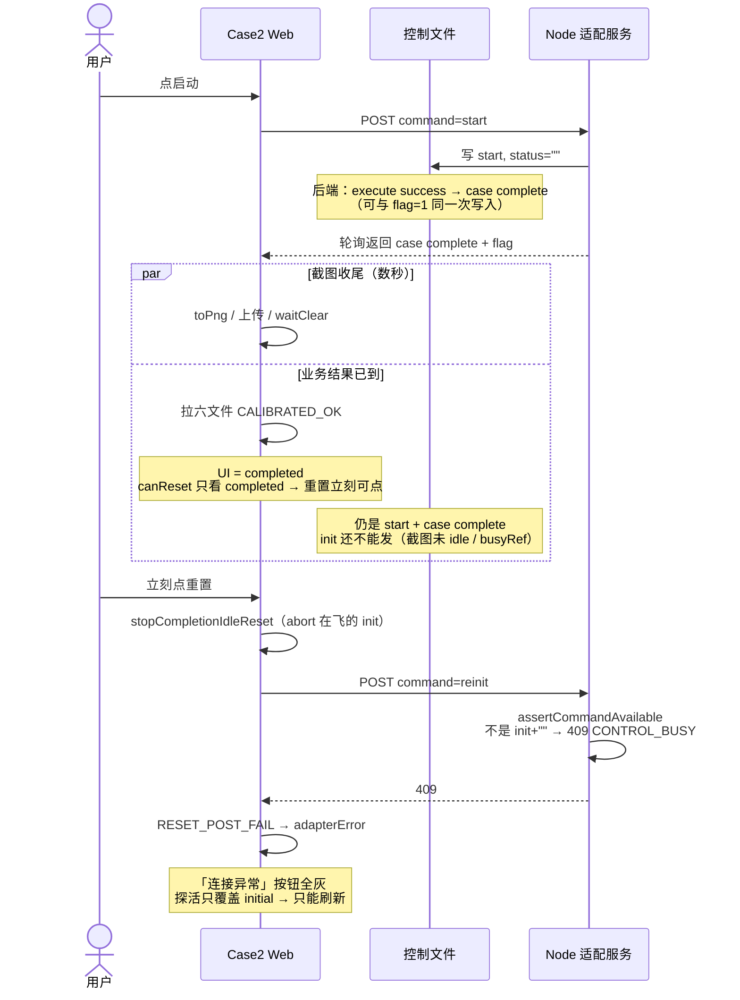
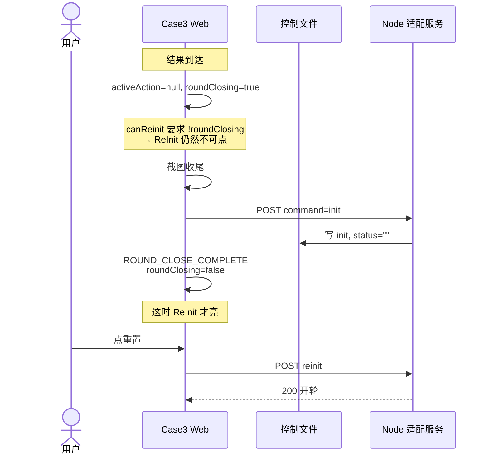
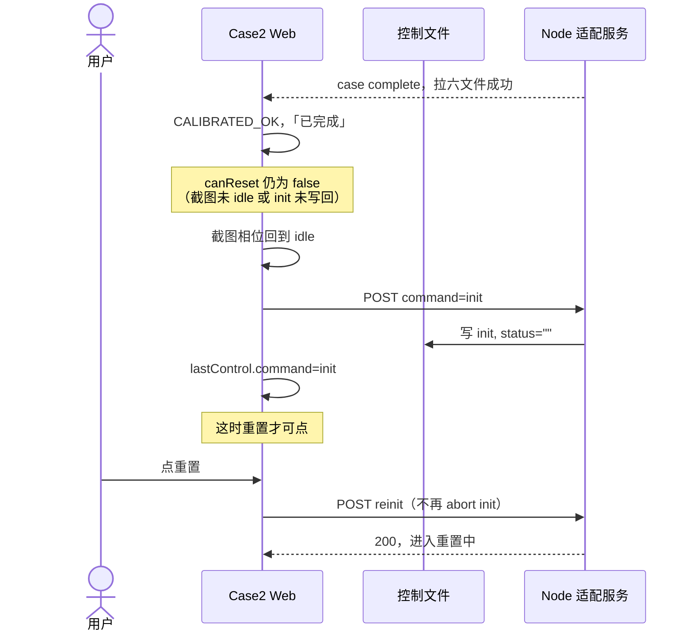

# BF-023 Case2：完成瞬间重置可点，立即点击后报连接异常并卡死

- Status: done
- Severity: P0
- Area: `code/web` Case2（对照 Case3 收尾门闩）
- 一次只修这一条
- 用户 2026-08-12 现场复现，检视初稿未单列
- 完成：2026-08-12，重置门闩对齐完成态 `POST init`；诊断 log 已补

## 现象（用户原话对应）

1. 进入 Case2 → 点启动。
2. 界面已经出现「已完成」、**重置按钮可点**，但截图还没做完（`toPng`/上传/`waitClear`/`POST init` 仍在进行）。
3. **立刻点重置** → 徽标变成「case2文件服务器连接异常」，按钮全灰，其它 Tab 也可能锁住。只能刷新恢复。
4. 同样流程，等 Case 结束后 **再等 5～10 秒** 再点重置 → 正常。
5. Case3 同样「启动结束后重置刚可点就立刻点」→ **没有此问题**。

## 结论：缺陷存在，且是独立用户路径

不是偶发网络问题。默认打桩 `requestPicture=true` 时**必然出现**（见下方现场 log）：六文件已发布后同拍 `case complete + flag=1`，Web 先 `CALIBRATED_OK` 放开重置，`toPng` 仍在飞。Case2 把「业务结果已到」和「控制文件已空闲、截图已收尾」当成了同一时刻；Case3 没有。

## 问题时序




## 现场证据（2026-08-12，默认 stub）

打桩：`outcome=success`、`requestPicture=true`、`stepMs=5000`。顺序固定为：accepted start → `execute success` → 发布六文件 → **一次** `status=case complete` 且 `save_picture_flag=1` → stub `start operation completed`。此后打桩不再动控制文件，文件一直停在 `start + case complete`，直到 Web 自己 `POST init`。

Web 控制台同一轮（用户在「已完成」后立刻点重置）：

```
command.start_click
command.start_ok
poll.start
poll.status_edge          ← execute success
poll.flag_rise            ← flag 0→1，与 complete 同拍
screenshot.triggered      ← toPng 异步开始，未等结束
poll.status_edge          ← case complete
calibrated.fetch_begin
calibrated.ok             ← UI completed，重置立刻可点
command.reset_click       ← 无 payload：看不出 ui / screenshotPhase / lastControl
POST /api/case2/control-file  409
reset POST failed … owns case_control.json
command.reset_fail        ← 只有 reason 字符串，无 code / httpStatus
screenshot.ok             ← 发生在 409 之后：截图当时还没完
```

**没有** `completion.init_reset_begin`：`screenshotBusyRef` 为 true 时完成态 init 根本不发。所以 409 打在未消费的 `start + case complete` 上，不是网络抖动。

为何「必然」而不是竞态偶发：打桩先写完六文件再同拍 complete+flag；`GET calibrated` 是本地读已落地文件，毫秒级；`toPng(1920×1080, pixelRatio=2)` 是秒级。徽标一亮就点重置，一定落在截图窗口内。

### Web log 过弱（修本条时一并补）

只看 `[case2]` 事件名，无法回答「点重置时文件/截图/按钮门闩是什么」。对照 Case3：`command.reinit_click` 带 generation/kind/side；`CONTROL_BUSY` 有专用 `command.control_busy`（code + endpoint），不当成连接异常。

当前缺口：


| 事件                    | 现在记了什么       | 本条诊断需要但没有                                                                                            |
| --------------------- | ------------ | ---------------------------------------------------------------------------------------------------- |
| `command.reset_click` | 无 payload    | `ui`、`screenshotPhase`、`screenshotBusy`、`lastControl.{command,status,flag}`、`canReset`、是否已 POST init |
| `command.reset_fail`  | `reason` 字符串 | `code`（`CONTROL_BUSY`）、`httpStatus`（409）、endpoint、当时 `lastControl`                                   |
| `calibrated.ok`       | 矩阵尺寸         | `screenshotPhase`、`screenshotBusy`、`lastControl`、此时 `canReset`                                       |
| （缺失）                  | —            | 完成态 init 因截图 busy **被跳过**（本轮完全没有 `completion.init_reset_begin`，但 log 不解释为什么）                         |
| `screenshot.ok`       | attempt / 耗时 | 当时 `ui`（本轮已是 completed，甚至已 reset_fail）                                                               |


`Case2ApiError` 已有 `code` / `httpStatus`，`onReset` catch 只 `String(err)`，结构化字段被丢掉。浏览器红条 409 是 fetch 层的，业务 log 没有把它标成 `CONTROL_BUSY`。

## 机制


### Case2 过早放开重置

`canReset` 只看 `case2UiState === "completed"`（或 `failed-reinit`），**不看** `screenshotPhase`，也**不看** 完成态 `POST init` 是否已经写回。

```91:95:code/web/src/cases/case2/state/case2Reducer.ts
export function canReset(state: Case2State): boolean {
  if (state.adapterError) return false;
  const s = state.case2UiState;
  return s === "completed" || s === "failed-reinit";
}
```

`CALIBRATED_OK` 一到就是 `completed`，重置立刻可点。此时控制文件往往仍是：

`case=case2, command=start, status=case complete`（截图可能还在、`init` 还不能发）

完成态写回 init 的条件更严，必须截图相位已经 `idle`：

```417:423:code/web/src/cases/case2/state/case2Reducer.ts
  const startComplete =
    state.case2UiState === "completed" &&
    ...
    state.screenshotPhase === "idle";
```

hook 里还有 `screenshotBusyRef.current` 为 true 时根本不发 init。

用户立刻点重置：

1. `onReset` 会 `stopCompletionIdleReset()`（若 init 刚发出去，直接 abort）。
2. `POST {command:"reinit"}`。
3. 适配服务 `assertCommandAvailable`：只有干净 `init+status=""` 或同动作 `execute fail` 才允许开轮。未消费的 `start + case complete` → **409 CONTROL_BUSY**。
4. Case2 把任意 POST 失败当成 `RESET_POST_FAIL` → `adapterError=true`，文案「case2文件服务器连接异常」。
5. 探活只覆盖 `initial`（见 BF-006），卡在 `completed + adapterError`：**按钮全死，只能刷新**。
6. 若截图仍停在 `waitClear`（BF-001），Tab 锁也不解。

等 5～10 秒：`toPng`(2× 全舞台) + 上传 + 清 flag + `POST init` 通常已经做完，控制文件空闲，reinit 才能 200。

### Case3 为什么没事

`canReinit` 要求 `!activeAction && !roundClosing`。`roundClosing` 直到 `maybeFinishAfterScreenshot` 里 **截图收尾并且** `POST init` **完成** 之后才清掉（`ROUND_CLOSE_COMPLETE`）。所以重置按钮亮起时，控制文件已经是空闲 `init`。Case3 对 `CONTROL_BUSY` 也有专用分支，不会当成连接异常死锁。




## 与已有工单的关系（不要当成 duplicate）


| 工单     | 覆盖了什么                          | 没覆盖什么            |
| ------ | ------------------------------ | ---------------- |
| BF-001 | `waitClear` 停轮询 → Tab 锁        | 不解释「重置可点 + 立即点击」 |
| BF-006 | `adapterError` 后探活只管 `initial` | 不阻止过早点重置         |
| BF-009 | `CONTROL_BUSY` 文案被当成连接异常       | 不阻止按钮在收尾前可点      |


本工单是 **用户可复现主路径**。优先修「重置在收尾完成前不可点 / 点击须等 init」，BF-001/006/009 仍要单独修（其它入口还会踩）。

## 关键代码

- `code/web/src/cases/case2/state/case2Reducer.ts`：`canReset`、`shouldResetCommandAfterCommandCompletion`、`RESET_CLICK` / `RESET_POST_FAIL`
- `code/web/src/cases/case2/hooks/useCase2Controller.ts`：完成态 init effect（约 609–658）、`onReset`（约 688–709）
- `code/web/src/cases/case2/Case2Page.tsx`：`resetEnabled={canReset(state)}`（busy 只锁 Tab，**不锁重置按钮**）
- `code/server/src/shared/control-file-store.mjs`：`assertCommandAvailable`
- 对照：`code/web/src/cases/case3/state/case3Reducer.ts` `canReinit` + `roundClosing`；`maybeFinishAfterScreenshot`


## 建议修法（对齐 Case3，最小改动）

1. **主修复：** `canReset` 在启动完成路径上还要满足：截图相位 `idle`、且完成态 `POST init` 已成功（例如 `lastControl.command === "init"`，或单独 `roundClosing`/`initSettled` 标志）。重置按钮在收尾期间保持 disabled。
2. `onReset` 不要在 init 还在飞时 abort 再抢发 reinit；应等收尾结束或直接因为按钮 disabled 点不到。
3. 不要为实现本条去加「取消测试」或自动重试 reinit。
4. **同条补诊断 log（不另开工单）：** `reset_click` / `calibrated.ok` / `reset_fail` 带上门闩与控制快照；init 因截图 busy 跳过要显式打一条；`Case2ApiError.code` + `httpStatus` 写入 `reset_fail`，不要只 stringify。目的：下次只看控制台就能对上「重置打在 start+complete 上」，不必再靠 stub 日志和网络红条拼图。

BF-009 仍建议修（其它 CONTROL_BUSY 入口），但本条即使 409 处理对了，过早可点的重置也是错的。




## 验收

- [x] 单测：`completed + screenshotPhase!==idle` 时 `canReset===false`；`completed + init 已写回` 时 `canReset===true`；立即 reinit 不会在 `start+case complete` 上发出去。
- [x] Case3 行为不改（本条只动 Case2）。
- [x] 人工：启动 → 已完成刚出现、截图仍在进行：重置 **不可点**。
- [x] 人工：截图结束且 `POST init` 成功后：重置可点，立即点击能进入重置中并完成，不出现连接异常。
- [x] 人工：等重置按钮亮起再点（旧「再等 5～10 秒」）：行为与成功路径一致。
- [ ] 人工：无截图本轮（flag 从未置 1）：完成后仍能在 init 写回后重置。（本轮 stub `requestPicture=true`，未跑）

## 测试入口

`code/web/test/case2Reducer.test.ts`、`code/web/test/useCase2Controller.entry.test.ts`。人工：启动后结果一出就连点重置（应点不了）；等重置按钮亮起再点（应成功）。控制台应能看到 `calibrated.ok` 带 `canReset:false`，收尾后 `completion.init_reset_ok`，再 `command.reset_click` 带 `lastCommand:"init"`。

## 完成说明（2026-08-12）

- `canReset`：启动完成路径须 `screenshotPhase==="idle"` 且 `lastControl.command==="init"` 且 `status===""`。`failed-reinit` 仍可点。
- `onReset`：门闩未过则 `command.reset_click_ignored` 并直接返回，不再 abort 在飞的完成态 init 去抢发 reinit。
- 诊断 log：`calibrated.ok` / `screenshot.ok` / `reset_click` / `reset_fail` 带 ui、screenshotPhase、lastControl、canReset；init 因截图 busy/相位跳过打 `completion.init_reset_skip`；`reset_fail` 写 `Case2ApiError.code` + `httpStatus`。
- 单测 94 通过。e2e 主线改为「已完成」后等待重置 enabled（timeout 20s）再点。

## 人工验收证据（2026-08-12）

默认 stub `requestPicture=true` 同拍 complete+flag。Web 顺序：

`calibrated.ok`（`screenshotBusy:true`，`ui:completed`，`canReset:false`）→ `completion.init_reset_skip`（`reason:screenshot-busy`，`screenshotPhase:saving`）→ `screenshot.ok`（`toPngMs:1985`）→ `completion.init_reset_begin`（仍 `start+case complete`）→ `completion.init_reset_ok`（`init`+`status:""`）→ `command.reset_click`（`canReset:true`，`screenshotPhase:idle`）→ `command.reset_ok`（`reinit`）→ `reinit complete` → 再写回 `init`。

Stub 在 `start operation completed` 之后才 `accepted new operation reinit`，中间无 409。与修前「`calibrated.ok` 后立刻 `reset_click` → 409，随后才 `screenshot.ok`」相反。