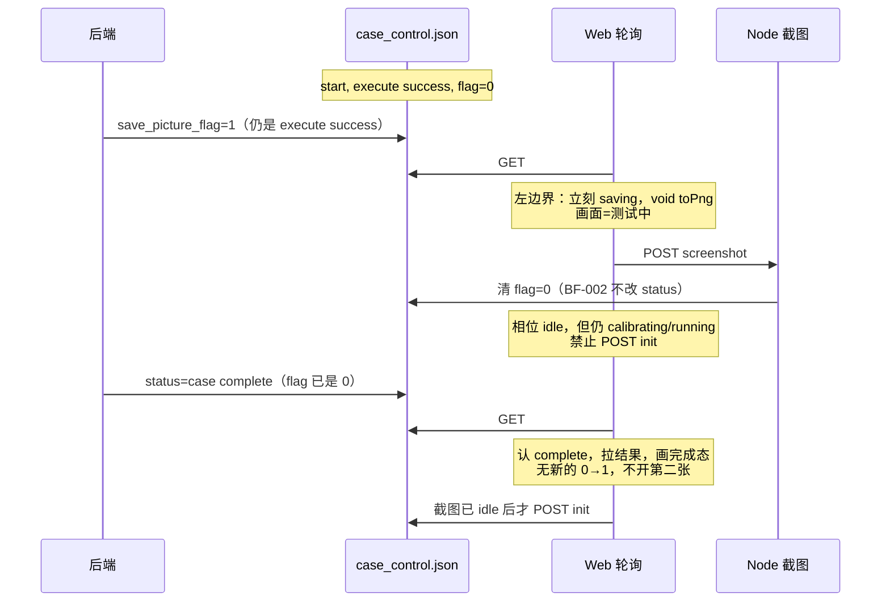
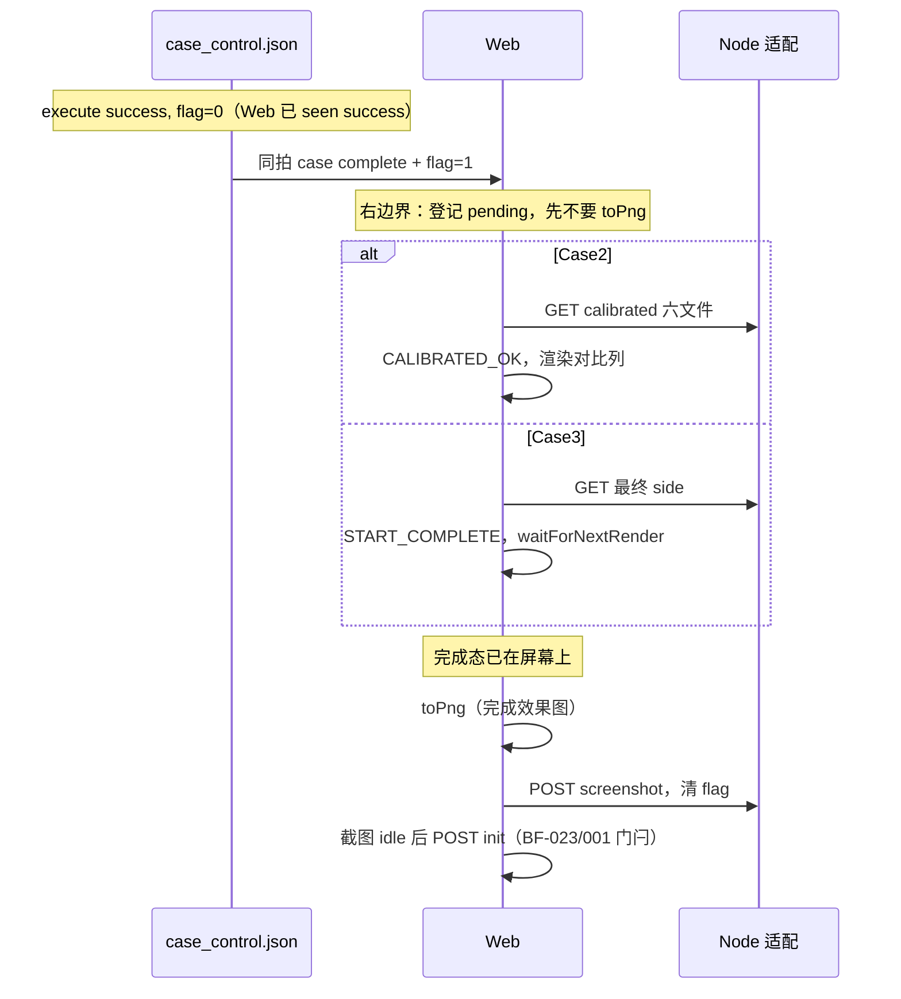
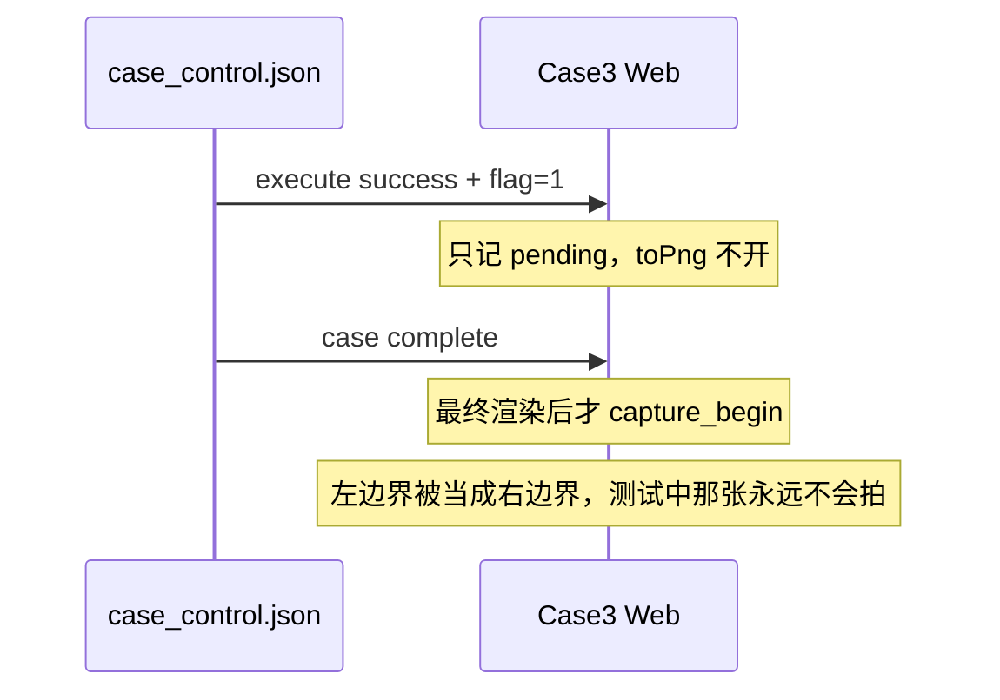

# BF-024 截图只跟 flag 0→1，窗口为 execute success～case complete（含两端）

- Status: done
- Severity: P0
- Area: `code/web` Case2 / Case3（Node 截图路由**不改门禁**）
- 一次只修这一条
- 来源：2026-08-12 客户口径，**不是**原代码检视列表
- 完成：2026-08-13，success 左边界立刻拍测试中；complete 右边界（含同拍）先渲染完成态再截。success 上传成功后立刻 lastFlag=0 且 idle。`code/web npm test` 102/102

## 客户口径（本单唯一目标）

在 `status: execute success` 到 `status: case complete` **闭区间**（含两个边界）内，只要 `save_picture_flag` 出现 **0→1** 就截图。何时置 flag 由真实后端决定。

**两个边界的画面不同，不是前端猜意图，而是本拍已经到达哪条边界：**

| 本拍落在哪条边界 | 前端应做什么 | PNG 必须是 |
| --- | --- | --- |
| **success 左边界**：`status=execute success` 时 0→1 | **立刻** `toPng`，**禁止**等待未来的 `case complete` | 当时的测试中画面 |
| **complete 右边界**：可认的 `case complete` 时 0→1（**含同拍**） | 先把完成态画上，再 `toPng` | **已渲染的完成效果图** |
| 区间外（未见 success、已失败、ReInit、进页诊断 GET） | 不截 | — |

complete 边界的落地顺序（用户 2026-08-12 修正）：

- **Case2**：先拉六文件 → 进入 `completed` 并渲染 Calibrated 对比 → 再截图
- **Case3**：先最终 side 过门槛 → `START_COMPLETE` → 等一次 completed 渲染 → 再 `toPng`

禁止把 **success 期间已经升起的 0→1** 憋到 complete 再拍（那才是替后端决定「要截完成态」）。complete 边界等渲染，是处理**已经到达的右边界**。

## 相关工单（本单不得回退）

| 工单 | 必须保住的行为 |
| --- | --- |
| **BF-023** | Case2 重置门闩：`screenshotPhase===idle` 且控制已是 `command=init,status=""`；完成瞬间不可抢发 reinit。若 Case2 为 complete 边界增加 `pending`，`pending` 必须视为未 idle（重置仍不可点） |
| **BF-001** | Case2 `completed + waitClear` 必须续轮询，直到看到 flag 0 才能 POST init。success 左边界上传成功（或 GET 确认 flag=0）后立刻 idle + lastFlag=0，不再进 waitClear 等下一轮 poll；success 期间不得因此 POST init |
| **BF-002** | 清 flag 写前再读、只改 flag、最多 3 次元组冲突重试；不得改 `status` |
| **BF-010** | 仍 open：结果不完整回退应 abort 截图。complete 边界若六文件不过关，**不得**把 pending 落成一张测试中画面充完成态 |
| P0-4 / 截图 3 次 | 同一 0→1 任务最多 3 次；第 3 次失败经 Node 清 flag、丢图、不改业务相 |

不改：BF-003 Calibrated 归属、BF-004 Case3 乐观清空。不要顺手改 stub 默认同拍策略。

## 当前问题

规格口头上是「Start 等待态观察 0→1，同拍 complete 不漏拍」。实现上两条边界缠在一起：

**Case3 把所有 0→1 都当成 complete 边界：** flag 上升只登记 `pending`，真正 `toPng` 一律等到最终 side 过门槛并 completed 渲染之后。

```656:663:code/web/src/cases/case3/hooks/useCase3Controller.ts
        screenshotPhaseRef.current = "pending";
        case3Log("screenshot.requested", {
          generation,
          side: action.side,
          status: control.status,
          savePictureFlag: flag,
        });
```

于是客户在 **success 左边界**把 flag 从 0 拉到 1 时看不到截图，要等到 `case complete` 才 `capture_begin`。
**Case3 在 complete 右边界（含同拍）的「先渲染再拍」是对的，要保留。** 错的是 success 也走同一条 pending。

**Case2 把所有 0→1 都当成 success 边界：** `shouldStartScreenshot` 只看 `calibrating + idle + lastFlag 0 + flag 1`，立刻 `void runScreenshotTask()`，再拉六文件。success 期间立刻拍是对的；**同拍 / complete 边界会先截测试中，Calibrated 列可能还没上屏。** 默认 stub 靠 `toPng`≈2s 和 GET 赛跑，演示常常碰巧是完成态，**不保证。**

Case2 另外过宽：`status` 仍是 `""` 时 flag=1 也会截。

Node 截图保存**已经**不锁 `status`。本单不要给 Node 加上「必须 complete 才能存 PNG」。

### 对照（含本次修正）

| | Case2 现状 | Case3 现状 | 目标 |
| --- | --- | --- | --- |
| success 期间 0→1 | 立刻 `toPng` | 只 `pending`，等 complete 渲染 | **立刻 `toPng`（测试中）** |
| complete 边界 0→1（含同拍） | 立刻开任务，再拉六文件（画面竞态） | 先完成态渲染，再 `toPng` | **Case2 先拉六文件再截；Case3 先完成态渲染再 `toPng`** |
| start 后、未见 success、flag=1 | **会截**（超出窗口） | 会登记 pending，仍等 complete | **不截**；等进入 success 且 flag 仍为 1 再当上升沿消费 |
| ReInit / 进页诊断 GET | 不截 | 不截 | 保持不截 |

默认本地 stub 同拍 `case complete + flag=1` 走的是 **complete 右边界**。修完后这条必须仍是完成效果图（Case2 不再靠赛跑碰运气）。

## 目标

1. **触发仍只认 0→1**，窗口仍是 `[execute success, case complete]`（complete 须本轮已见 success）。
2. **success 左边界**：命中后立即 `saving` + `toPng`。禁止再 pending 到 complete。
3. **complete 右边界（含同拍）**：先落地并渲染完成态，再 `toPng`。PNG 必须是完成效果图，不是测试中。
4. **必须**：success 期间截完、清 flag、相位回 idle，**不得** `POST init` 或当成轮次结束。
5. Node / stub 置位策略不改。

## 拟议修法（请审核）

只动 Web 截图调度。Node 保存/清 flag、BF-002、ownership 字面值不改。

### 1. 消费 0→1 的谓词（两边对齐）

登记一次「本轮截图请求」须同时满足：

- 本轮是 **Start 等待**（Case2 `calibrating`；Case3 `activeAction.kind==="start"`）；
- 当前没有进行中的截图任务（`idle`；同一高电平不重复开）；
- `lastFlag === 0` 且本拍 `save_picture_flag === 1`；
- 本拍 `status === "execute success"`，**或** `status === "case complete"` 且 `seenExecuteSuccess === true`。

然后按本拍 `status` 分流（下一节）。

窗口外规则不变：

- `status===""` / 未知字面值 / 未见 success 的 `case complete` / `execute fail` / ReInit：**不截、不登记。**
- **窗口外即使读到 flag=1，也不得把 `lastFlag` 写成 1。** 进入 success 后 flag 仍为 1，相对 `lastFlag=0` 视为左边界上升沿。

### 2. 按边界分流（本单核心）

```text
0→1 命中谓词
  ├─ status == execute success
  │     → 立刻 saving，void toPng（测试中画面）
  │     → 禁止 await 在 pollOnce 里（Case3 live 点位不能停）
  └─ status == case complete（已 seen success）
        → 只登记「complete 边界待拍」（pending）
        → 先拉完成结果并渲染
        → 渲染完成后再 saving / toPng（完成效果图）
```

同一高电平只一张：

- success 已在 `saving`/`waitClear`，随后 complete 且 flag 仍为 1：这是**同一张**测试中任务，complete **不再**开第二张。后端若还要完成态图，须先被清到 0 再 0→1。
- success 已拍完并清 flag 回 0，随后 complete 再 0→1：这是**新的**右边界上升沿，走完成效果图。
- 同拍 complete+flag=1（默认 stub）：从未经过 success 开拍，只走右边界：先渲染完成态再拍。

### 3. Case3

- **保留** complete 路径现有顺序：最终门槛 → `START_COMPLETE` → `waitForNextRender` → `runScreenshotTask`。这就是右边界「完成效果图」。
- **拆开** success：命中左边界时不要设 `pending` 干等，立刻 `void runScreenshotTask()`。
- `pending` 只表示「右边界已登记、完成态还没画完」。不要再用它表示 success 的 0→1。
- `maybeFinishAfterScreenshot` **继续**要求 `pendingCompleteSideRef` 有值。success 期间截完 idle **禁止** POST init。
- complete 时若已是 `saving`/`waitClear`（左边界任务还在飞）：不要开第二张，等其收尾再 `maybeFinish`。
- complete 时若已 `idle` 且本拍没有新的 0→1：不截，直接 `maybeFinish`。

### 4. Case2（右边界顺序要改）

- **左边界**：`shouldStartScreenshot` 加上 status 谓词后，success 仍立刻 `void runScreenshotTask()`。
- **右边界 / 同拍**：现状是先开截图再拉六文件，**改成**：
  1. 本拍可认 complete 且 0→1 → 登记 pending（Case2 今天没有该相位，需加，或用等价 latch，且 `canReset` / completion init / Tab busy 都不得把它当成 idle）；
  2. `GET data-files?phase=calibrated`，成功才 `CALIBRATED_OK`（UI 进入 completed，Calibrated 列上屏）；
  3. 等下一帧渲染（与 Case3 `waitForNextRender` 同级，至少 `requestAnimationFrame`）；
  4. 再 `runScreenshotTask()`。
- 实现陷阱：`shouldStartScreenshot` 今天要求 `case2UiState==="calibrating"`。若先 `CALIBRATED_OK` 再问「要不要截」，会变成 `completed` 而永远不开拍。右边界必须**在仍 calibrating 时登记**，渲染完成后再拍，**不要**依赖 completed 之后的下一次 0→1 观察。
- 六文件尚未就绪：保持 pending + calibrating，继续轮询；**不要**用测试中画面充右边界 PNG。耗尽走现有不完整回退（BF-010 范围，本单不把 pending 拍出去）。
- `CONTROL_POLL_OK` 仍不得在未开拍时把 `screenshotLastFlag` 置 1（只在真正 `SCREENSHOT_ENTER_SAVING` 或明确「已消费该边沿的 pending 登记」时消费边沿；窗口外仍禁止消费）。建议：右边界一登记就把 lastFlag 视为已消费该次 0→1，避免 complete 后下一拍再当新沿；但相位不是 idle，防止重复开任务。

### 5. Node / stub：不改

- 保存 PNG：继续只校验 `case + command=start + dt_type + flag=1`，不锁 status。
- 清 flag：继续 BF-002。
- 默认 stub 仍同拍 complete+flag=1（后端选在右边界置位，合法；修完后 PNG 应为完成效果图）。

## 必须保住的正常 / 异常保护（改坏即本单失败）

### 正常主线

- 默认 stub 同拍：右边界 0→1 截**完成效果图**，落盘、清 flag、POST init；重置可点且不 409。
- 启动 / 重置互斥；ReInit **永不**观察 flag。
- 同一高电平只一个 Web 任务；`0→1→0→1` 仍两张、序号递增（允许左边界一张测试中 + 右边界一张完成态，若后端清零后再置 1）。
- 进页诊断 GET 不截图。
- Case3 success 期间继续 GET live side；左边界截图必须 `void`，不得 `await` 堵住 poll。
- 未知控制字段透传；清 flag 不改 `status`/`command`/`case`/`dt_type`。

### 收尾门闩（BF-023 / BF-001 / Case3 roundClosing）

- Case2：`pending`/`saving`/`waitClear` 期间 `canReset===false`；控制还不是 `init+status=""` 也不可重置。
- 徽标可以「已完成」（结果已到），重置仍等截图收尾 + POST init。这是 BF-023 已接受的对外语义，右边界「先渲染再拍」会让「已完成但重置未亮」的窗口更明显，**不要**因此放松 `canReset`。
- `completed + waitClear` 必须续轮询（BF-001）。success 左边界 POST 成功或 GET 确认 flag=0 后立刻 idle + lastFlag=0，以便认随后 complete 的新 0→1；不要删掉 waitClear 分支（未确认清零时仍可能用到）。
- Case3 `POST init` 只发生在完成态提交之后且截图不是 pending/saving/waitClear。
- 不得为发 reinit 而 abort 在飞的完成态 init。

### 失败 / 异常

- `execute fail`：取消 pending、停截图、进失败相、不认之后的 complete。
- Case3 最终快照不过关耗尽：仍 abort 截图并 POST init 撤权。Case2 不完整回退见 BF-010；右边界 pending 在耗尽时必须丢掉，不得补拍一张测试中。
- 截图 3 次仍失败：POST `{save_picture_flag:0}`，丢图日志，**业务相不变**（完成态结果仍保留）。
- 上传响应不确定：GET 见 flag=0 当成功；仍为 1 才重试。
- `409 SCREENSHOT_NOT_REQUESTED` / `409 CONTROL_BUSY` 语义不变。
- 切 Tab / 卸载：停轮询、停截图、丢本地态。

### 明确不在本单做的

- 不把 Node 改成「status 必须是 complete 才收图」。
- 不把左边界改成等 complete（那是 Case3 现状缺陷）。
- 不改 `canReset` / waitClear 谓词本身来「让完成瞬间能点重置」。
- 不为消除左边界 PNG 是测试中而加等待。

## 设计时序

### 修后：success 左边界置 flag（立刻拍测试中）



### 修后：complete 右边界同拍（默认 stub，完成效果图）



### 禁止：左边界也 pending 到 complete（Case3 现状缺陷）



### 左边界已截完，再 complete

截图收尾与 `case complete` 解耦：先拍测试中并清 flag 合法；complete 只负责结果门闩和 init。不要因为「已经 idle」而漏认 complete，也不要因为「已经拍过测试中」而跳过 POST init。只有 complete 时 **又一次** 0→1 才再拍完成效果图。

## 验收

- [x] Case3：`execute success + 0→1` 在 complete 之前就有 `capture_begin` / 上传（测试中）；不得只打 `screenshot.requested` 后干等。
- [x] Case3：上述路径截完并清 flag 后，控制仍是 `start + execute success` 时 **不** `POST init`、不解 Start 忙、不进完成态。
- [x] Case3：随后仅 `case complete`（flag 已 0）仍走最终门槛 → 渲染 → 不截第二张 → POST init。
- [x] Case3：同拍 complete+flag=1：先 completed 渲染再 `toPng`；PNG 对应完成态，不是 running 半截图。
- [x] Case2：`execute success + 0→1` 仍立刻截测试中。
- [x] Case2：同拍 / complete+0→1：先六文件成功并渲染对比，再截图；不得在 Calibrated 未上屏时 `toPng`。
- [x] Case2：`status=""` 或未见 success 的 complete + flag=1 **不截**；进入 success 后 flag 仍为 1 则按左边界补截。
- [x] 右边界六文件/最终 side 未就绪：保持 pending，不把测试中画面当完成效果图。
- [x] ReInit、进页 GET、`execute fail` 不截；fail 后不认 complete。
- [x] BF-023：完成瞬间（含「结果已画上、截图 pending」）重置仍不可点，直到 init 空闲。
- [x] BF-001：`completed + waitClear` 仍续轮询。左边界上传成功（或 GET 确认 flag=0）后立刻 idle + lastFlag=0，success 期间不 POST init。
- [x] success 截完后立刻把 lastFlag 视为已见 0；随后 complete 0→1 能开第二张完成态；Case3 不得卡在 waitClear 不 init。
- [x] 同一 0→1 不重复开任务；清零后再 0→1 可第二张（允许左一张 + 右一张）。
- [x] 3 次失败清 flag、业务相不变；清 flag 不改 status（BF-002）。
- [x] Case3 success 期间 live 更新不被截图 `await` 卡住。

## 已实现

- Case2 增加 `pending`；`shouldStartScreenshot` 仅 success 左边界；`shouldLatchCompleteScreenshot` 登记右边界；六文件 `CALIBRATED_OK` 并 `rAF` 后再 `toPng`。
- Case3：success 的 0→1 `void runScreenshotTask()`；`pending` 只用于可认的 complete；窗口外不把 `lastFlag` 收成 1。
- 代码检视补丁：success 上传成功或 GET 确认 flag=0 后，Case2/Case3 立刻 `lastFlag=0` 且 idle（不再进 waitClear 等下一轮 poll），success 期间仍不 POST init，以便认随后 complete 的新 0→1。
- `maybeFinishAfterScreenshot` / `canReset` / waitClear 门闩未放松。Node 未改。
- `code/web npm test` 102/102。`WEB-SPEC` 待人工接受后再改。

## 测试入口

- `code/web`：`shouldStartScreenshot` / 右边界 latch；`useCase2Controller` 同拍须在 `CALIBRATED_OK` 之后才 `postScreenshot`；`useCase3Controller` 左边界 complete 前已 upload、右边界在 `round.completed_rendered` 之后才 `capture_begin`。
- mock 控制序列分别打：success 单独置 flag、同拍 complete+flag=1、success 置 flag 并清零后再 complete+flag=1。
- 人工默认 stub：验同拍完成效果图不回归（Case2 不应再出现「只有 Initial、没有 Calibrated 列」的 PNG）。

## 关键代码

- `code/web/src/cases/case2/state/case2Reducer.ts`：`shouldStartScreenshot`、`canReset`、`ScreenshotPhase`
- `code/web/src/cases/case2/hooks/useCase2Controller.ts`：`pollOnce` 顺序（右边界改为先六文件后截图）；completion init 门闩
- `code/web/src/cases/case3/hooks/useCase3Controller.ts`：pending 仅用于右边界；左边界立刻开拍；`maybeFinishAfterScreenshot`
- Node 对照（只读）：`assertScreenshotOwnership`、`clearPictureFlag`

## 文档

代码落地且用户接受后，再改 `doc/case2/WEB-SPEC.md` §10（同拍改为先六文件再截）和 `doc/case3/WEB-SPEC.md` §6.3 / §10（pending 仅右边界）。未批准前不改 `doc/`。
