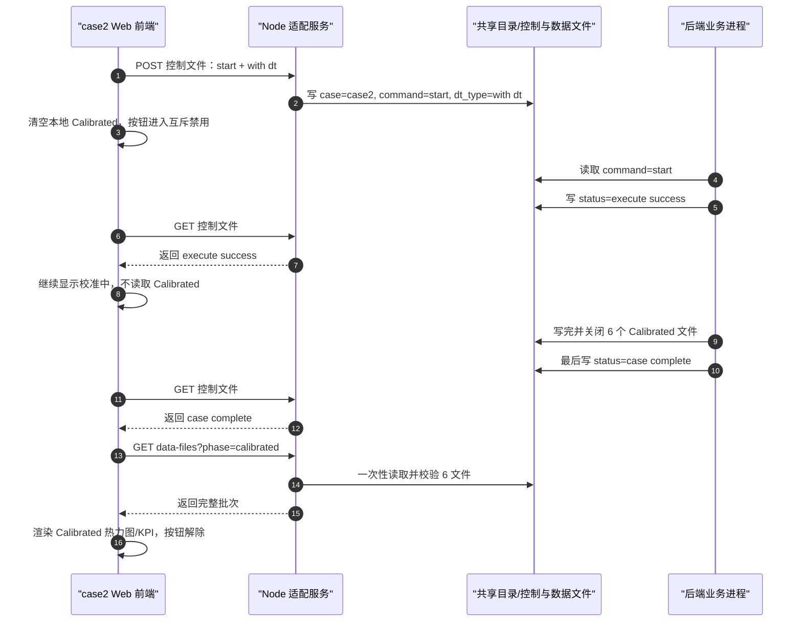
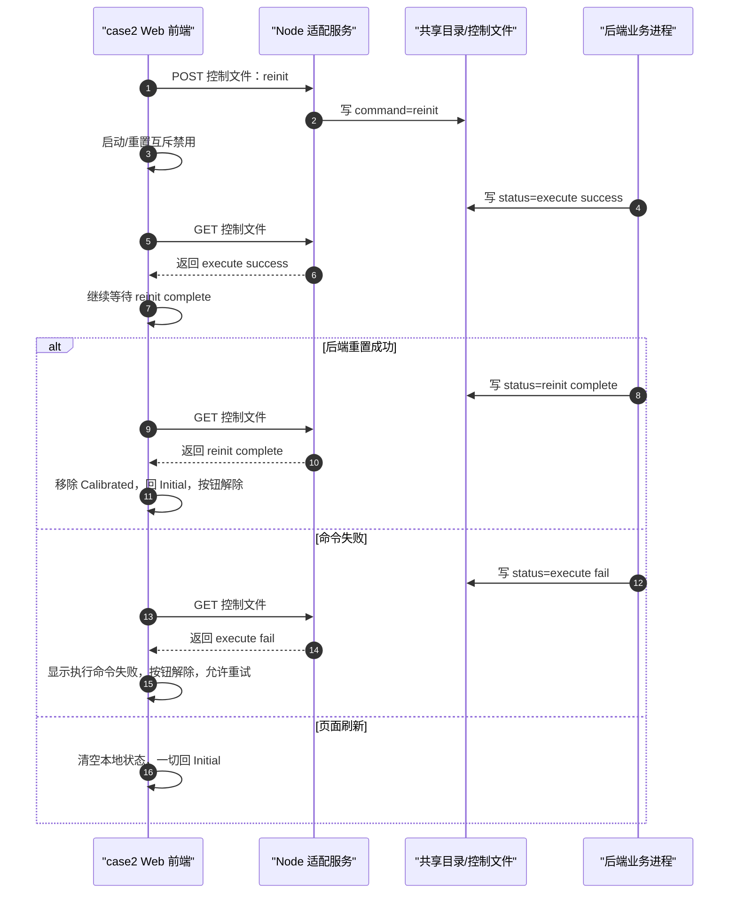
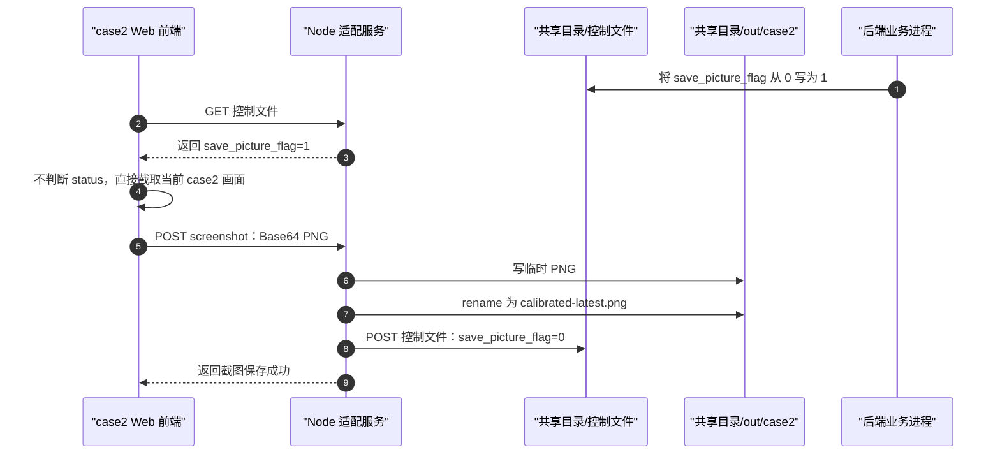

# case2 Gate 2 API 契约（草案 v0.4）

> 范围：只约束 `DT Calibration`（case2）的文件控制、结果发布、浏览器与前端 PC Node 适配服务之间的**语义**。本文是 Gate 2 的唯一接口真相源；端口、部署目录、挂载路径和具体文件锁算法留到 Gate 3。
>
> 状态：`DRAFT`。P0-1 至 P0-4 已按用户确认口径回填；在用户批准契约 v1 前，不得进入 Gate 3 或连接真实共享目录。

## 0. 契约边界与术语

### 0.1 固定术语

| 面向    | 固定名称                                                                            | 含义                                                                                          |
| ----- | ------------------------------------------------------------------------------- | ------------------------------------------------------------------------------------------- |
| UI 按钮 | **启动**                                                                          | 发起一次 `with dt` 校准请求。                                                                        |
| UI 按钮 | **重置**                                                                          | 提交协议命令 `reinit`；读到 `status="reinit complete"` 后移除 Calibrated 显示并回到登录时按钮状态。界面不再使用“清除”作为按钮文案。 |
| 协议命令  | `init` / `start` / `reinit`                                                     | 初始化/空闲、开始测试、重置。                                                                             |
| 后端状态  | `""` / `execute success` / `execute fail` / `case complete` / `reinit complete` | 初始化、命令执行成功、命令执行失败、后端系统测试完成、后端系统重置完成。                                                        |
| 结果批次  | Calibrated 六文件集合                                                                | 三张 Calibrated 热力图 + 三组 Calibrated KPI 样本；缺任一文件即不是完整批次。                                      |

“清除”仅可作为历史文档中的旧称；正式 Web、后端交接和后续 SPEC 一律使用“重置”。

### 0.2 层级与禁止事项

| 层                  | 负责                                                  | 明确不负责                    |
| ------------------ | --------------------------------------------------- | ------------------------ |
| Shell              | Tab、1920×1080 缩放、公共 token、建设中占位                     | case2 命令、结果、轮询、截图和业务 CSS |
| case2 Web          | 交互意图、case-local 可见状态、热力/CDF/均值派生展示、生成完成态截图          | 直接读取共享目录、持锁、写结果或输出 PNG   |
| Node 本地适配服务（前端 PC） | 唯一文件 I/O、控制读写、稳定批次读取、锁、截图落盘和 `save_picture_flag` 回写 | 后端校准算法、其他 case 的状态判断     |
| 后端业务进程（后端 PC）      | 读取控制、执行校准、发布结果、写 `status` 与截图请求标志                   | 浏览器展示、前端截图编码             |

Gate 2 冻结最小 REST 语义：不用 WebSocket，不做命令队列，不做取消命令。端口、共享目录挂载路径、锁实现与轮询频率由 Gate 3 SPEC 再定。

## 1. 逻辑接口总表

| 逻辑操作          | 最小 REST 语义                         | 方向                         | 触发                                  | 输入/输出语义                                           | 约束                                  |
| ------------- | ---------------------------------- | -------------------------- | ----------------------------------- | ------------------------------------------------- | ----------------------------------- |
| GET 控制文件      | `GET /api/case2/control-file`      | Web → 适配服务 → 控制文件          | 页面进入、运行期间、截图请求检测                    | 返回当前 `case_control` 字段及可用性                        | Web 不直接读文件。                         |
| POST 控制文件     | `POST /api/case2/control-file`     | Web → 适配服务 → 控制文件          | 用户点击“启动”或“重置”；适配服务截图成功后清零           | 启动写 `case=case2,command=start,dt_type=with dt`；重置写 `command=reinit`；截图成功写 `save_picture_flag=0` | 只改本操作负责字段，保留后端字段。                   |
| 读取数据文件        | `GET /api/case2/data-files`        | Web → 适配服务 → Initial/Calibrated 文件 | Initial 首屏；本轮启动观察到 `execute success -> case complete` | 返回三项热力矩阵与 KPI 样本；Calibrated 必须为完整六文件批次             | 文件存在、`execute success` 或旧缓存均不能替代完成门槛。 |
| 提交截图          | `POST /api/case2/screenshot`       | Web → 适配服务 → 输出目录          | Web 发现 `save_picture_flag` 从 `0` 变为 `1` | Web 传 Base64 PNG；适配服务落盘后通过 POST 控制文件清零              | 浏览器不得写共享目录；失败不得提前清零。                |

`data-files` 的 `phase` 参数只允许 `initial` / `calibrated`；端口和共享目录实际路径不得写死在 Web 代码中。

### 1.1 启动与完成时序

### 1.2 重置、失败与刷新时序

### 1.3 截图请求时序

## 2. 控制文件合同

参考文件：`01-参考资料/case_control.json`。部署时的实际共享目录路径尚未冻结；该参考路径不是运行时挂载路径。

| 字段                  | 类型/允许值                                                                          | 权威写方                            | case2 Web 语义                                 |
| ------------------- | ------------------------------------------------------------------------------- | ------------------------------- | -------------------------------------------- |
| `case`              | 字符串；当前为 `case2`                                                                 | 前端侧适配服务代表 Web 写入                | 每次启动请求必须写 `case2`。                           |
| `command`           | `init` / `start` / `reinit`                                                     | 前端侧适配服务代表 Web 写入                | `start` 对应启动；`reinit` 对应重置；`init` 表示初始/空闲。   |
| `dt_type`           | `""` / `with dt`                                                                | 前端侧适配服务代表 Web 写入                | 本 case 的启动必须为 `with dt`；不得自行加入 `without dt`。 |
| `status`            | `""` / `execute success` / `execute fail` / `case complete` / `reinit complete` | 后端                              | Web 只读解释，绝不以此字段向后端回写业务结论。                    |
| `save_picture_flag` | `0` / `1`                                                                       | 后端置 `1`；适配服务在截图成功后置 `0`；默认状态为 `0` | Web 只消费请求并回传截图数据，不能直接写标志或文件。                 |
| `debug_flag`        | 整数；当前参考值 `0`                                                                    | 未冻结                             | 当前 UI 不消费、不修改、不赋予业务语义。                       |
| `scene_type`        | 字符串；当前参考值 `U6G`                                                                 | 未冻结                             | 当前 UI 不消费、不修改、不赋予业务语义。                       |

### 2.1 写入保护

1. 适配服务只能代表 case2 写入 `case`、`command`、`dt_type` 和受控的 `save_picture_flag` 回写；不得因整文件写入丢失 `status`、`debug_flag`、`scene_type` 或未来未消费字段。
2. 后端拥有 `status`；Web 或适配服务不得用前端本地状态伪造 `execute success`、`execute fail`、`case complete` 或 `reinit complete`。
3. `GET /api/case2/control-file` 与 `POST /api/case2/control-file` 是控制文件唯一 REST 口径；启动、重置和截图清零都通过 POST 控制文件表达，不再拆成多个命令专用接口。
4. 具体原子写、互斥锁与字段保留算法是 Gate 3 实现事项，但其结果必须满足前三条。

## 3. 状态机与可见行为

### 3.1 映射优先级

适配服务可达时，case2 Web 按以下优先级解释快照。本地提交态只表达按钮和过渡 UI，不能伪造后端状态或结果批次。

| 优先级 | 条件                                                | case2 可见状态                                | Calibrated 区域                                          |
| --- | ------------------------------------------------- | ----------------------------------------- | ------------------------------------------------------ |
| 1   | 适配服务不可达或快照无效                                      | 连接/读取异常，不能冒充业务失败                          | 不展示旧结果；Initial 保留或显示其自身读取错误。                           |
| 2   | `status=execute fail`                             | `failed`                                  | 显示“执行命令失败”；本轮不再等待 `case complete` 或 `reinit complete`。 |
| 3   | 本地已提交 `reinit`，且尚未读到 `status="reinit complete"`   | `resetting`                               | 启动按钮禁用；`execute success` 只表示重置命令执行成功，不能当成重置完成。         |
| 4   | `status="reinit complete"`，且当前没有本地已接受的 `start` 请求 | `initial`                                 | 移除 Calibrated 热力图和 KPI 数据；控件回登录时状态。                    |
| 5   | 本轮本地启动已被适配服务接受，且已观察到 `execute success -> case complete`，且六文件批次通过全部校验 | `completed`                               | 显示新批次热力图、CDF、均值与降幅。                                    |
| 6   | 本轮本地启动已被适配服务接受，且已观察到 `case complete`，但批次缺失、解析失败或无法证明稳定          | 结果发布异常                                    | 不显示完成态，也不得回退为旧 Calibrated 结果；按钮解除，允许重置或重新启动。             |
| 7   | 本轮本地启动已被适配服务接受，且尚未命中上述条件                         | `calibrating` / `execute-success-waiting` | 不展示任何旧结果。`execute success` 仍属于等待结果。                    |
| 8   | `command=init` 且 `status=""`                      | `initial`                                 | Initial 可见；Calibrated 为空态。                             |
| 9   | 其他组合                                              | 未知控制状态                                    | 不得显示完成态；保留诊断信息给适配服务/QA。                                |

### 3.2 主线时序

| 阶段       | Web                        | 适配服务                    | 后端                                                                 | 结果展示                             |
| -------- | -------------------------- | ----------------------- | ------------------------------------------------------------------ | -------------------------------- |
| 进入 case2 | 请求控制快照与 Initial 输入         | 读取并返回可用快照/输入            | 无需新命令                                                              | 仅 Initial 基线。                    |
| 启动       | 先清空本地 Calibrated，再提交启动     | 写 `case2/start/with dt` | 读取并执行                                                              | 校准中。                             |
| 启动命令已执行  | 继续读取控制快照                   | 转发 `execute success`    | 启动命令执行成功后写 `execute success`                                       | 仍是等待，不读 Calibrated。              |
| 测试完成发布   | 仅在 `case complete` 后请求完成批次 | 校验并提供完整稳定批次             | 启动路径终态为 `case complete`                                            | 显示成对热力图、CDF、均值和运行时降幅。            |
| 重置命令已执行  | 继续读取控制快照                   | 转发 `execute success`    | 重置命令执行成功后写 `execute success`                                       | 继续等待 `reinit complete`，不按成功完成处理。 |
| 重置完成     | 等待 `reinit complete`       | 转发重置完成快照                | 重置路径终态为 `reinit complete`                                          | 前端收到后移除 Calibrated 数据并回 Initial。 |
| 命令失败     | 解释 `execute fail`          | 转发状态                    | 写 `status=execute fail`，且本轮不再写 `case complete` / `reinit complete` | 显示执行命令失败。                        |

`execute success` 是启动与重置两条路径共用的“命令执行成功”中间状态，不是业务终态。启动路径必须继续等 `case complete`；重置路径必须继续等 `reinit complete`。`execute fail` 是命令失败终态，出现后前端显示“执行命令失败”，后端本轮不再给 `case complete` 或 `reinit complete`。

`reinit` 后端不需要再把 `command` 改回 `init`、把 `status` 改回 `""` 才算完成；`status="reinit complete"` 就是本轮重置的完成确认。后续用户点击“启动”时，前端侧适配服务再次写入 `command=start` 与 `dt_type=with dt`，进入新一轮测试。

### 3.3 刷新、切 Tab 与重放

- 页面刷新后一切回 Initial：必须销毁 case2 的本地动作、Calibrated 数据、轮询和截图临时状态，不续接刷新前的启动或重置动作。
- 切离 case2 时也必须销毁 case2 的本地 Calibrated 数据、轮询和截图临时状态；回到 case2 后按新进入 Initial 处理。
- 刷新或切回后，不因当前控制文件已经是 `case complete` 自动读取 Calibrated；用户需要重新点击“启动”进入新一轮。
- `execute success`、文件已存在和静态样本均不是可重放完成态的依据。
- 如果刷新后读到 `command=reinit` 且 `status="reinit complete"`，Web 仍只进入 Initial 可见状态并保持 Calibrated 为空；不得要求后端额外回落到 `command=init,status=""`。
- Gate 2 不定义命令超时；若演示中长期无终态，人工刷新页面即可回 Initial，前端不得把等待过久自行解释为 `execute fail`。

### 3.4 互斥操作与按钮解除

1. 启动和重置互斥；任一命令提交后，本轮未终止前不允许重复点击启动或重置。
2. 启动路径的按钮解除点：`case complete` 且 Calibrated 批次校验通过、`case complete` 但批次校验失败，或 `execute fail`。
3. 重置路径的按钮解除点：`reinit complete`，或 `execute fail`。
4. `execute fail` 后允许用户重新点击启动或重置；前端不得自动重试。
5. 本契约不设计取消命令、命令队列、自动超时和自动恢复。

## 4. 结果批次与数据格式

### 4.1 当前 UI 唯一消费的六文件

| UI 指标   | Initial 热力图                           | Calibrated 热力图                        | Initial KPI 样本                            | Calibrated KPI 样本                         |
| ------- | ------------------------------------- | ------------------------------------- | ----------------------------------------- | ----------------------------------------- |
| RSS 误差  | `heatmap_init_rss.txt`                | `heatmap_cali_rss.txt`                | `heatmap_init_kpi_rss.txt`                | `heatmap_cali_kpi_rss.txt`                |
| 有效路径数误差 | `heatmap_init_effective_path_num.txt` | `heatmap_cali_effective_path_num.txt` | `heatmap_init_kpi_effective_path_num.txt` | `heatmap_cali_kpi_effective_path_num.txt` |
| 首径时延误差  | `heatmap_init_first_path_delay.txt`   | `heatmap_cali_first_path_delay.txt`   | `heatmap_init_kpi_first_path_delay.txt`   | `heatmap_cali_kpi_first_path_delay.txt`   |

AOA、ZOA 的参考文件不进入当前 case2 UI、结果批次、截图或“校准有效”结论。

### 4.2 解析与有效性

| 文件类别   | 正式语义             | 可接受格式                | 有效性条件                                                          |
| ------ | ---------------- | -------------------- | -------------------------------------------------------------- |
| 热力图矩阵  | `Nx × Ny` 误差空间分布 | 文本；CRLF 或 LF；逗号或空白分隔 | 非空矩形矩阵；每个非空行必须有相同数量的有限数值。列数为 `Nx`，行数为 `Ny`，二者均由文件解析得到且不固定为 20。 |
| KPI 样本 | `N` 个误差标量        | 文本；CRLF 或 LF；逗号或空白分隔 | 至少 1 个有限数值；`N` 由文件解析得到且不固定为 20。行列分组不表达业务语义。                    |

当前仓库参考样本经验证表现为热力图 20×20、KPI 20×1；这只是参考样本形状，不是正式接口限制。前端必须从文件内容推导 `Nx`、`Ny` 与 `N`，再计算热力图、CDF 与均值。

### 4.3 完整批次门槛

1. P0-1 已确认：真实后端采用最小发布规则，不新增 manifest、批次 ID 或原子目录切换作为正式后端约束。
2. 后端每轮启动后，必须先完整写完并关闭六个 Calibrated 文件，最后才把 `status` 写成 `case complete`。
3. 前端只有在本轮点击“启动”并观察到 `execute success -> case complete` 后，才通过适配服务读取六个 Calibrated 文件。
4. 适配服务读取后必须一次性校验六个文件，任一缺失、解析失败、非矩形热力图或 KPI 样本非法，则整批拒绝。
5. 被拒绝时，Web 保持 Initial 和“结果发布异常/等待处理”状态，绝不拼接旧文件、部分新文件或静态代表图。

Gate 3 后端打桩计划可以采用更强实现：先写入 run-local 临时目录，六个文件全部写完后做原子目录切换或原子指针切换，最后写 `status=case complete`。这是打桩端自测稳定性策略，不反向要求真实后端必须采用目录切换。

### 4.4 数据真实性标签

| 数据                                     | 当前标签            | 可否宣称为本次校准结果                   |
| -------------------------------------- | --------------- | ----------------------------- |
| `heatmap_init_*` 参考文件                  | 参考离线输入          | 否；只能作为基线样本。                   |
| 已存在的 `heatmap_cali_*` 参考文件             | 参考离线样本          | 否；仅可支持设计、静态验收和格式验证。           |
| 后端按已确认 P0-1 发布并在 `case complete` 后读取的完整批次 | 待 Gate 5 运行证据确认 | 可作为当前批次展示；真实采集来源仍需 Gate 5 证据。 |

## 5. 前端派生数据合同

| UI 输出                     | 输入                                                                    | 固定算法/规则                                                                                        |
| ------------------------- | --------------------------------------------------------------------- | ---------------------------------------------------------------------------------------------- |
| Initial / Calibrated 热力色场 | 对应 `Nx × Ny` 矩阵 + `04-runtime-assets/case2/maps/heatmap-map-base.png` | 运行时按已提供热力图说明进行插值、配色和马赛克叠加；静态代表图 `heatmap-calibrated-represent.png` 不得进入正式运行路径。                 |
| CDF                       | 每项对应的 `N` 个 KPI 样本                                                    | 升序经验 CDF；按 `t=0..1` 的 51 个等距位置取 `floor(t×(n-1))`，其中 `n` 为当前样本数。                                |
| 平均误差                      | 每项对应的 `N` 个 KPI 样本                                                    | 算术平均；显示精度由 Gate 3 WEB-SPEC 冻结。                                                                 |
| 降幅                        | Initial / Calibrated 平均误差                                             | `(meanInitial - meanCalibrated) / meanInitial × 100%`，仅当 `meanInitial > 0` 且两者均有效时显示。不得写死 50%。 |

“校准有效”只能基于当前已展示批次的三项误差 CDF 左移与平均误差下降来解释；UI 不得把参考样本、单一指标或固定数字包装成真实执行结论。

## 6. 截图请求合同

1. 触发：Web 通过 GET 控制文件发现 `save_picture_flag` 从 `0` 变为 `1`，即触发截图；Web 不再额外判断 `status`。
2. 后端责任：后端负责在它认为需要截图时把 `save_picture_flag` 置 `1`；不要依赖 Web 通过 `status` 二次判断截图时机。
3. 传输：Web 生成 PNG 截图后，通过 `POST /api/case2/screenshot` 以 Base64 传给适配服务。
4. 输出：适配服务写入 `{CASE2_SHARED_DIR}/out/case2/calibrated-latest.png`；先写临时文件，成功后 rename 覆盖 latest。
5. 所有权：Web 只生成 Base64 截图并交给适配服务；适配服务是截图文件、目录、写入结果与标志回写的唯一所有者。
6. 回写：仅在适配服务确认 PNG 已完整落盘后，才可通过 POST 控制文件把 `save_picture_flag` 写回 `0`。
7. 失败与去重：截图生成、Base64 传输或落盘失败时不得清零；适配服务进程重启后若仍读到 `save_picture_flag=1`，重新触发截图并覆盖同一个 `calibrated-latest.png`，不生成历史队列。

## 7. 异常合同

| 情况                             | Web 行为                                              | 禁止行为                         |
| ------------------------------ | --------------------------------------------------- | ---------------------------- |
| 适配服务不可达/读控制失败                  | 与业务失败区分，显示连接/读取异常；不展示旧 Calibrated                   | 把网络或本机服务错误标为 `execute fail`。 |
| `status` 未知                    | 进入未知控制状态，保留诊断并停止完成态展示                               | 猜测为完成。                       |
| `case complete` 但六文件不完整/格式错误   | 拒绝整批，显示结果发布异常                                       | 部分图表完成、复用旧数据或静态代表图。          |
| `execute fail`                 | 显示执行命令失败；本轮不再等待 `case complete` 或 `reinit complete` | 继续假装等待完成，或把失败解释为后端系统测试完成。    |
| `reinit` 提交后刷新                 | 一切回 Initial，Calibrated 为空，按钮恢复初始可点击状态                    | 由浏览器缓存恢复旧完成态。                |
| `save_picture_flag=1` 但截图失败      | 保留请求，不清零；下次继续尝试或进程重启后覆盖 latest                       | 未保存成功即清零。                     |

## 8. Gate 2 验收与待确认

### 已冻结的合同事实

- UI 文案“重置”严格映射 `command=reinit`；启动严格映射 `case=case2`、`command=start`、`dt_type=with dt`。
- `status="reinit complete"` 是重置完成信号；前端据此移除 Calibrated 数据并恢复登录时按钮状态，不再等待后端回到 `command=init,status=""`。
- `execute success` 不是完成；启动路径必须继续等 `case complete`，重置路径必须继续等 `reinit complete`。
- `execute fail` 是命令失败终态；出现后前端显示执行命令失败，后端本轮不再给 `case complete` 或 `reinit complete`。
- P0-1 已确认：真实后端先完整写完并关闭六个 Calibrated 文件，最后写 `status=case complete`；前端只在本轮启动后的 `execute success -> case complete` 链路上读取结果。
- P0-2 已确认：启动和重置互斥；不做取消、队列、自动超时或自动重试；刷新后一切回 Initial。
- P0-3 已确认：Node 适配服务采用最小 REST，控制文件读写归一为 `GET /api/case2/control-file` 与 `POST /api/case2/control-file`。
- P0-4 已确认：Web 发现 `save_picture_flag` 从 `0` 变为 `1` 即截图；截图以 Base64 传给适配服务；适配服务保存 latest PNG 后才清零。
- 当前 UI 只消费 RSS、有效路径数、首径时延三项；每项包括动态解析得到的热力矩阵与 KPI 样本集合，不能硬编码为 20×20 或 20 个样本。
- CDF、均值、降幅都是前端派生，降幅按当前样本计算；浏览器不能直接读写共享目录或截图文件。

### 剩余事项：用户批准后冻结 v1

| ID | 待确认事实 | 状态 |
| --- | --- | --- |
| P0-1 | 六文件完整发布与本轮读取门槛 | 已确认并回填。 |
| P0-2 | 命令互斥、失败解除、刷新回 Initial，不考虑自动超时 | 已确认并回填。 |
| P0-3 | Node 适配服务最小 REST 与 GET/POST 控制文件口径 | 已确认并回填。 |
| P0-4 | `save_picture_flag` 触发截图、Base64 传输、latest PNG 落盘后清零 | 已确认并回填。 |

**停止条件：** 用户批准本文为 API 契约 v1 后，才进入 Gate 3；此前不写 Node、React、共享目录连接或真实状态机。
