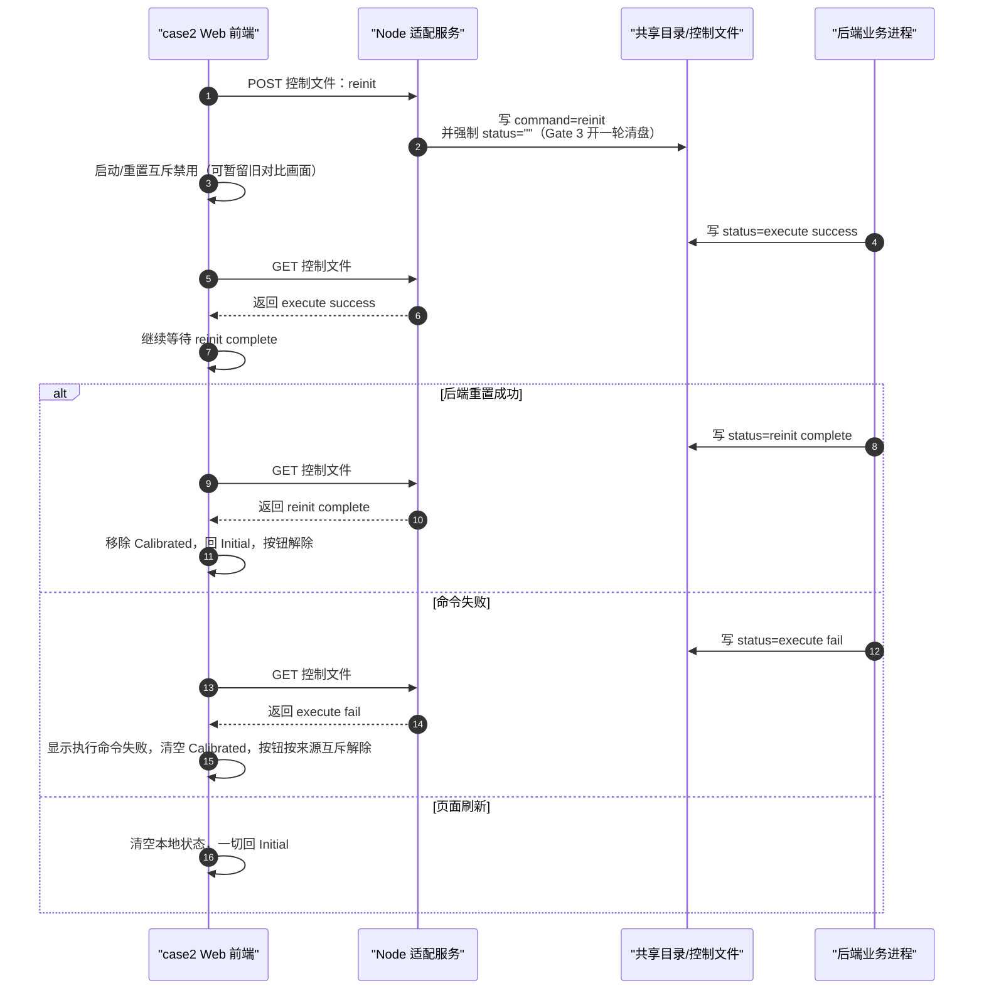
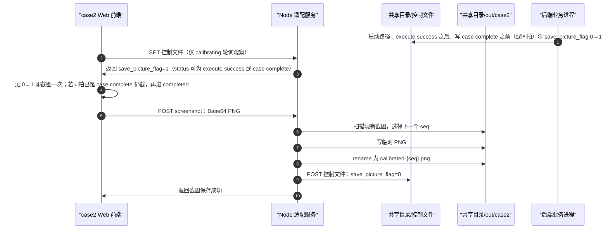

# case2 Gate 2 API 契约（v1）

> 范围：只约束 `DT Calibration`（case2）的文件控制、结果发布、浏览器与前端 PC Node 适配服务之间的**语义**。本文是 Gate 2 的唯一接口真相源；端口、部署目录、挂载路径和控制文件写入算法由 Gate 3 SPEC 具体化。
>
> 状态：`APPROVED`（Gate 2，2026-07-31）。P0-1 至 P0-4 已按用户确认口径回填。**2026-08-03 Gate 3 增量回填**：`start`/`reinit` 开一轮清 `status=""`；Web 可见态施工细节以 [WEB-SPEC.md](WEB-SPEC.md) 为准（无独立 result-error/unknown-control UI）；截图 flag 仅启动路径、`execute success` 之后至 `case complete`（含同拍 complete）窗口。**2026-08-10 跨 Case 安全增量**：Case2/Case3 共用 store 后，非法并发命令返回 `CONTROL_BUSY`，Case2 截图路由对称校验 ownership。**2026-09-24 增量**：entry `init` / `reinit` 写控制前从 `case2/backCali/` 逐个覆盖六个 Calibrated 文件；任一失败即从头重试整批，最多三次，不回滚部分覆盖，也不保证六文件整体原子切换；最终失败拦截控制写入。校准/重置轮结束的 `init` 使用 `restore_calibrated:false` 仅回写空闲控制状态、保留 Calibrated 文件。`start` 不再清空 Calibrated 磁盘文件。Node 与 Web 施工见 [SERVER-SPEC.md](SERVER-SPEC.md) / [WEB-SPEC.md](WEB-SPEC.md)。

## 0. 契约边界与术语

### 0.1 固定术语

| 面向    | 固定名称                                                                            | 含义                                                                                          |
| ----- | ------------------------------------------------------------------------------- | ------------------------------------------------------------------------------------------- |
| UI 按钮 | **启动**                                                                          | 发起一次 `with dt` 校准请求。                                                                        |
| UI 按钮 | **重置**                                                                          | 提交协议命令 `reinit`；读到 `status="reinit complete"` 后移除 Calibrated 显示并回到登录时按钮状态。界面不再使用“清除”作为按钮文案。 |
| 协议命令  | `init` / `start` / `reinit`                                                     | 初始化/空闲、开始测试、重置。                                                                             |
| 后端状态  | `""` / `execute success` / `execute fail` / `case complete` / `reinit complete` | 初始化、命令执行成功、命令执行失败、后端系统测试完成、后端系统重置完成。                                                        |
| 结果批次  | Calibrated 六文件集合                                                                | 三张 Calibrated 热力图 + 三组 Calibrated KPI 样本；缺任一文件即不是完整批次。                                      |

“清除”仅可作为历史文档中的旧称；正式 Web、后端交接和后续 SPEC 一律使用“重置”。

### 0.2 层级与禁止事项

| 层                  | 负责                                                  | 明确不负责                    |
| ------------------ | --------------------------------------------------- | ------------------------ |
| Shell              | Tab、1920×1080 缩放、公共 token、建设中占位                     | case2 命令、结果、轮询、截图和业务 CSS |
| case2 Web          | 交互意图、case-local 可见状态、热力/CDF/均值派生展示、生成完成态截图          | 直接读取共享目录、持锁、写结果或输出 PNG   |
| Node 本地适配服务（前端 PC） | 唯一文件 I/O、控制读写、稳定批次读取、锁、截图落盘和 `save_picture_flag` 回写 | 后端校准算法、其他 case 的状态判断     |
| 后端业务进程（后端 PC）      | 读取控制、执行校准、发布结果、写 `status` 与截图请求标志                   | 浏览器展示、前端截图编码             |

Gate 2 冻结最小 REST 语义：不用 WebSocket，不做命令队列，不做取消命令。默认端口、共享目录注入方式、控制文件写入算法与轮询频率由 Gate 3 SPEC 固定，不改变本文接口语义。

## 1. 逻辑接口总表

| 逻辑操作          | 最小 REST 语义                         | 方向                         | 触发                                  | 输入/输出语义                                           | 约束                                  |
| ------------- | ---------------------------------- | -------------------------- | ----------------------------------- | ------------------------------------------------- | ----------------------------------- |
| GET 控制文件      | `GET /api/case2/control-file`      | Web → 适配服务 → 控制文件          | 页面进入、运行期间、截图请求检测                    | 返回当前 `case_control` 字段及可用性                        | Web 不直接读文件。                         |
| POST 控制文件     | `POST /api/case2/control-file`     | Web → 适配服务 → 控制文件          | 进入/刷新/切回 case2 的 GET 诊断成功后；启动轮 Calibrated 与截图收尾完成后；重置完成并回 Initial 后；用户点击“启动”或“重置”；截图成功或累计 3 次失败后清零           | 进页/切回写 `command=init`（恢复基线）；启动/重置结束写 `command=init,restore_calibrated=false`（保留结果）；启动写 `case=case2,command=start,dt_type=with dt`；重置写 `command=reinit`；截图成功或放弃本张截图写 `save_picture_flag=0`；**Gate 3：`start`/`reinit` 额外强制 `status=""`** | `restore_calibrated` 是请求控制的传输字段，不写进共享控制快照；请求体不含 `status`；业务终态字面值仍只由后端写出；保留其他未知字段。 |
| 读取数据文件        | `GET /api/case2/data-files`        | Web → 适配服务 → Initial/Calibrated 文件 | Initial 首屏；本轮启动观察到 `execute success -> case complete` | 返回三项热力矩阵与 KPI 样本；Calibrated 必须为完整六文件批次             | 文件存在、`execute success` 或旧缓存均不能替代完成门槛。 |
| 提交截图          | `POST /api/case2/screenshot`       | Web → 适配服务 → 输出目录          | Web 发现 `save_picture_flag` 从 `0` 变为 `1` | Web 对同一任务最多尝试 3 次；Node 以临时文件 + 原子 rename 落盘，成功后清零 | 浏览器不得写共享目录；前两次失败不得清零；第三次仍失败允许清零并丢失本张截图；不得覆盖旧截图。                |

`data-files` 的 `phase` 参数只允许 `initial` / `calibrated`；端口和共享目录实际路径不得写死在 Web 代码中。

### 1.1 启动与完成时序

```mermaid
sequenceDiagram
  autonumber
  participant Web as "case2 Web 前端"
  participant Node as "Node 适配服务"
  participant Shared as "共享目录/控制与数据文件"
  participant Backend as "后端业务进程"

  Web->>Node: POST 控制文件：start + with dt
  Node->>Shared: 写 case=case2, command=start, dt_type=with dt<br/>并强制 status=""（Gate 3 开一轮清盘）
  Web->>Web: 清空本地 Calibrated，按钮进入互斥禁用
  Backend->>Shared: 读取 command=start（可先见空 status）
  Backend->>Shared: 写 status=execute success
  Web->>Node: GET 控制文件
  Node-->>Web: 返回 execute success
  Web->>Web: 继续显示校准中，不读取 Calibrated
  Backend->>Shared: 写完并关闭 6 个 Calibrated 文件
  Backend->>Shared: 最后写 status=case complete
  Web->>Node: GET 控制文件
  Node-->>Web: 返回 case complete
  Web->>Node: GET data-files?phase=calibrated
  Node->>Shared: 一次性读取并校验 6 文件
  Node-->>Web: 返回完整批次
  Web->>Web: 渲染 Calibrated 热力图/KPI，按钮解除
  opt 截图请求已保存或放弃，或本轮无截图
    Web->>Node: POST 控制文件：init
    Node->>Shared: 写 command=init, dt_type="", status="", save_picture_flag=0
  end
```

### 1.2 重置、失败与刷新时序

### 1.3 截图请求时序

## 2. 控制文件合同

参考文件：`01-参考资料/case_control.json`。部署时的实际共享目录路径尚未冻结；该参考路径不是运行时挂载路径。

| 字段                  | 类型/允许值                                                                          | 权威写方                            | case2 Web 语义                                 |
| ------------------- | ------------------------------------------------------------------------------- | ------------------------------- | -------------------------------------------- |
| `case`              | 字符串；当前为 `case2`                                                                 | 前端侧适配服务代表 Web 写入                | 每次启动请求必须写 `case2`。                           |
| `command`           | `init` / `start` / `reinit`                                                     | 前端侧适配服务代表 Web 写入                | `start` 对应启动；`reinit` 对应重置；`init` 表示初始/空闲。   |
| `dt_type`           | `""` / `with dt`                                                                | 前端侧适配服务代表 Web 写入                | 本 case 的启动必须为 `with dt`；不得自行加入 `without dt`。 |
| `status`            | `""` / `execute success` / `execute fail` / `case complete` / `reinit complete` | **业务终态字面值**仅后端写出；Gate 3：`start`/`reinit` 时适配服务可强制写 `status=""` 开一轮清盘 | Web 只读解释业务终态；请求体仍禁止带 `status`。不得伪造 `execute success` / `execute fail` / `case complete` / `reinit complete`。 |
| `save_picture_flag` | `0` / `1`                                                                       | 后端仅在启动路径、已写 `execute success` 之后至 `case complete`（允许与 complete **同拍**）置 `1`；适配服务在截图成功或 Web 累计 3 次失败后置 `0`；默认 `0`；**重置路径不得置 1** | Web 仅在 `calibrating` 轮询中消费 0→1；同拍 `case complete` 仍截一次；浏览器不能直接写文件，清零必须经适配服务。 |
| `debug_flag`        | 整数；当前参考值 `0`                                                                    | 未冻结                             | 当前 UI 不消费、不修改、不赋予业务语义。                       |
| `scene_type`        | 字符串；当前参考值 `U6G`                                                                 | 未冻结                             | 当前 UI 不消费、不修改、不赋予业务语义。                       |

控制快照以 `case`、`command`、`dt_type`、`status`、`save_picture_flag` 为五个必填字段；`debug_flag`、`scene_type` 为可选部署字段，存在时分别校验为整数、字符串。缺少可选字段不拒读，未来未知字段继续原样透传并在写入时保留。

### 2.1 写入保护

1. 适配服务只能代表 case2 写入 `case`、`command`、`dt_type`、进页空闲写回所需的 `status=""` 和受控的 `save_picture_flag` 回写；不得因整文件写入丢失 `debug_flag`、`scene_type` 或未来未消费字段。
2. **业务终态字面值**（`execute success` / `execute fail` / `case complete` / `reinit complete`）仅后端写出；Web 或适配服务不得伪造这些终态。
3. **Gate 3 演示向放宽（开一轮清盘）**：处理 `start` / `reinit` 时，适配服务在合并命令字段后**额外强制写入 `status=""`**（HTTP 请求体仍禁止带 `status`）。用于去掉上轮残留终态，供 Web 用「时刻 A 见 `execute success`、之后时刻 B 见完成终态」的简单规则。合法 `start|reinit` 命令元组与 `status=""` 的组合同时构成后端/打桩唯一的新轮命令门沿；不得仅凭 `command` 值变化、文件 mtime 或一次文件事件判断新命令。真实后端须接受开一轮时出现空 `status`。截图清零路径**不得**改写 `status`。细节见 [SERVER-SPEC.md](SERVER-SPEC.md) / [BACKEND-API-HANDOFF.md](BACKEND-API-HANDOFF.md)。
4. 进页空闲写回：Web 在进入/刷新/切回 case2 时先 `GET control-file`；GET 成功后再 `POST {command:"init"}`，由适配服务写回 `case=case2,command=init,dt_type="",status="",save_picture_flag=0`。该写回只表示页面进入后的空闲握手，不是一次业务 start/reinit 门沿。
5. 启动轮收尾写回：Web 已按 `execute success -> case complete` 读取 Calibrated 六文件并进入 `completed` 后，若本轮截图请求已保存并清零、已累计 3 次失败后放弃清零，或本轮无截图请求，再 `POST {command:"init",restore_calibrated:false}` 写回空闲态并保留本轮文件。不得在读取 Calibrated 或截图收尾前提前清 `status` / `save_picture_flag`。
6. 重置轮收尾写回：Web 已按 `execute success -> reinit complete` 清空 UI 内存中的 Calibrated 并回到 `initial` 后，再 `POST {command:"init",restore_calibrated:false}` 写回空闲态；重置基线已在 reinit POST 前恢复，收尾不得重复覆盖。不得在 UI 消费 `reinit complete` 前提前清 `status`。
7. `GET /api/case2/control-file` 与 `POST /api/case2/control-file` 是控制文件唯一 REST 口径；进页空闲写回、启动/重置轮收尾写回、启动、重置和截图清零都通过 POST 控制文件表达，不再拆成多个命令专用接口。
8. 具体原子写、串行化与字段保留算法见 [SERVER-SPEC.md](SERVER-SPEC.md)，其结果必须满足本节全部条款。
9. Case2/Case3 共用 Node 控制 store 后，Start/ReInit 使用同一 `CONTROL_BUSY` guard：空闲允许；同 Case 同动作 `execute fail` 允许手动重试；活动、未消费完成终态、其他 Case fail 或未知活动 status 拒绝覆盖。POST init 永远允许。Case2 合法主线和成功 shape 不变，非法直接请求收紧为 409。
10. `{save_picture_flag:0}` 在最新 flag=0 时幂等成功；flag=1 时 Case2 路由只允许清 `case=case2,command=start,dt_type=with dt` 的截图请求，不能清 Case3 高电平。

## 3. 状态机与可见行为

> Gate 3：**Web 内部相名、按钮互斥、进页策略、旁路失败处理**以 [WEB-SPEC.md](WEB-SPEC.md) 为施工权威。本节保留接口层语义；与 WEB-SPEC 冲突时，以实现施工规格为准（下表已按 2026-08-03 回填对齐）。

### 3.1 映射优先级

下列优先级仅在 **本挂载已进入等待态**（本轮已成功 POST `start`/`reinit`）后解释控制快照。**新进入 / 刷新 / 切回 case2：一律 `initial`**，不因控制文件残留的 `execute fail` / `case complete` / `reinit complete` 改相，也不自动读 Calibrated；但进页诊断 GET 成功后会再 POST 一次 `init` 空闲写回。

| 优先级 | 条件 | case2 可见状态 | Calibrated 区域 |
| --- | --- | --- | --- |
| 1 | 适配服务不可达或快照无效 | 连接异常（`adapterError` 叠加；不另切业务相） | 不展示旧结果；Initial 保留或显示其自身读取错误。 |
| 2 | 本轮启动等待态内见 `execute fail` | `failed-start` | 显示“执行命令失败”；仅可再启动；本轮不再等 `case complete`。 |
| 3 | 本轮重置等待态内见 `execute fail` | `failed-reinit` | 显示“执行命令失败”；仅可再重置；清空暂留对比；本轮不再等 `reinit complete`。 |
| 4 | 本轮已提交 `reinit`，尚未见 `reinit complete` | `resetting` | 双禁；**必须暂留**旧对比画面；`execute success` 只表示命令成功，不是重置完成。 |
| 5 | 本轮启动已见 `execute success` 后再见 `case complete`，且六文件批次校验通过 | `completed` | 显示新批次热力图、CDF、均值与降幅。 |
| 6 | 本轮启动已见 `execute success` 后再见 `case complete`，但六文件失败 | 保持 `calibrating` | 不显示完成态、不另开 UI 相；打诊断日志；双禁直至刷新/切 Tab（演示主路径假定可读）。 |
| 7 | 本轮启动已接受且尚未命中完成/失败 | `calibrating` | 空；`execute success` 仍属等待。 |
| 8 | 重置已见 `execute success` 后再见 `reinit complete`；或新进入/刷新/切回 | `initial` | 清空 Calibrated；控件回登录时状态。 |
| 9 | 等待态内未知 `status` 字面值 | 保持当前等待态 | 打诊断日志；不映射为完成/失败；无前端超时。 |

不设独立的 `result-error` / `unknown-control` UI 相。

### 3.2 主线时序

| 阶段       | Web                        | 适配服务                    | 后端                                                                 | 结果展示                             |
| -------- | -------------------------- | ----------------------- | ------------------------------------------------------------------ | -------------------------------- |
| 进入 case2 | 请求控制快照（诊断）与 Initial 输入；可见态固定 `initial` | 读取并返回可用快照/输入；`start`/`reinit` 写路径见下行 | 无需新命令 | 仅 Initial 基线；不解释历史 `status`。 |
| 启动       | 先清空本地 Calibrated，再提交启动 | 写 `case2/start/with dt`，并强制 `status=""` | 读取并执行（可先见空 status） | 校准中。 |
| 启动命令已执行  | 继续读取控制快照 | 转发 `execute success` | 启动命令执行成功后写 `execute success` | 仍是等待，不读 Calibrated。 |
| 测试完成发布   | 仅在已见 success 后的 `case complete` 后请求完成批次 | 校验并提供完整稳定批次 | 启动路径终态为 `case complete` | 六文件 OK → 显示对比；失败 → 保持校准中+日志（无独立异常相）。 |
| 重置       | 进入 `resetting`，暂留旧对比 | 写 `command=reinit`，并强制 `status=""` | 读取并执行 | 「重置中」。 |
| 重置命令已执行  | 继续读取控制快照 | 转发 `execute success` | 重置命令执行成功后写 `execute success` | 继续等待 `reinit complete`。 |
| 重置完成     | 已见 success 后的 `reinit complete` | 转发重置完成快照 | 重置路径终态为 `reinit complete` | 清空 Calibrated，回 Initial。 |
| 命令失败     | 本轮等待态内解释 `execute fail` | 转发状态 | 写 `status=execute fail`，且本轮不再写完成终态 | 显示执行命令失败（启动/重置分相互斥）。 |

`execute success` 是启动与重置两条路径共用的“命令执行成功”中间状态，不是业务终态。启动路径必须继续等 `case complete`；重置路径必须继续等 `reinit complete`。`status` 为单值：轮询时刻 A 见 success，**之后**时刻 B 见完成终态。`execute fail` 是命令失败终态，出现后前端显示“执行命令失败”，后端本轮不再给 `case complete` 或 `reinit complete`。

`reinit` 后端不需要再把 `command` 改回 `init`、把 `status` 改回 `""` 才算完成；`status="reinit complete"` 就是本轮重置的完成确认。后续用户点击“启动”时，前端侧适配服务再次写入 `command=start`、`dt_type=with dt` 并清 `status=""`，进入新一轮测试。

### 3.3 刷新、切 Tab 与重放

- 页面刷新后一切回 Initial：必须销毁 case2 的本地动作、Calibrated 数据、轮询和截图临时状态，不续接刷新前的启动或重置动作。
- 切离 case2 时也必须销毁 case2 的本地 Calibrated 数据、轮询和截图临时状态；回到 case2 后按新进入 Initial 处理。
- 刷新或切回后，不因当前控制文件已经是 `case complete` / `execute fail` / `reinit complete` 自动进入完成或失败相，也不自动读取 Calibrated；用户需要重新点击“启动”进入新一轮。
- `execute success`、文件已存在和静态样本均不是可重放完成态的依据。
- 如果刷新后读到 `command=reinit` 且 `status="reinit complete"`，Web 仍只进入 Initial 可见状态并保持 Calibrated 为空；不得要求后端额外回落到 `command=init,status=""`。
- Gate 2 不定义命令超时；若演示中长期无终态，人工刷新页面即可回 Initial，前端不得把等待过久自行解释为 `execute fail`。

### 3.4 互斥操作与按钮解除

1. 启动和重置互斥；任一命令提交后，本轮未终止前不允许重复点击启动或重置。
2. 启动路径的按钮解除点：`case complete` 且六文件 OK（进入 `completed`，仅重置可用），或 `execute fail`（`failed-start`，仅启动可用）。六文件失败**不**解除双禁（保持 `calibrating`）。
3. 重置路径的按钮解除点：`reinit complete`（回 `initial`），或 `execute fail`（`failed-reinit`，仅重置可用）。
4. `execute fail` 后允许用户按来源相手动重试；前端不得自动重试。
5. 本契约不设计取消命令、命令队列、自动超时和自动恢复。

## 4. 结果批次与数据格式

### 4.1 当前 UI 唯一消费的六文件

| UI 指标   | Initial 热力图                           | Calibrated 热力图                        | Initial KPI 样本                            | Calibrated KPI 样本                         |
| ------- | ------------------------------------- | ------------------------------------- | ----------------------------------------- | ----------------------------------------- |
| RSS 误差  | `heatmap_init_rss.txt`                | `heatmap_cali_rss.txt`                | `heatmap_init_kpi_rss.txt`                | `heatmap_cali_kpi_rss.txt`                |
| 有效路径数误差 | `heatmap_init_effective_path_num.txt` | `heatmap_cali_effective_path_num.txt` | `heatmap_init_kpi_effective_path_num.txt` | `heatmap_cali_kpi_effective_path_num.txt` |
| 首径时延误差  | `heatmap_init_first_path_delay.txt`   | `heatmap_cali_first_path_delay.txt`   | `heatmap_init_kpi_first_path_delay.txt`   | `heatmap_cali_kpi_first_path_delay.txt`   |

AOA、ZOA 的参考文件不进入当前 case2 UI、结果批次、截图或“校准有效”结论。

### 4.2 解析与有效性

| 文件类别   | 正式语义             | 可接受格式                | 有效性条件                                                          |
| ------ | ---------------- | -------------------- | -------------------------------------------------------------- |
| 热力图矩阵  | `Nx × Ny` 误差空间分布 | 文本；CRLF 或 LF；逗号或空白分隔 | 非空矩形矩阵；每个非空行必须有相同数量的有限数值。列数为 `Nx`，行数为 `Ny`，二者均由文件解析得到且不固定为 20；语义精度 **2** 位小数（文件侧宜 ≤2 位；超过时适配服务**四舍五入**到 2 位，不拒绝）。当前默认范围为 RSS `-1～500`、有效路径数 `-1～500`、首径时延 `-1～1000`；越界由适配**双边掐位**并记无效个数，不删格、不因此整批 422。 |
| KPI 样本 | `N` 个误差标量        | 文本；CRLF 或 LF；逗号或空白分隔 | 至少 1 个有限数值；`N` 由文件解析得到且不固定为 20。行列分组不表达业务语义；语义精度 **2** 位小数（同上，超过则适配**四舍五入**到 2 位）。当前默认范围为 RSS `-1～1000`、有效路径数 `-1～50000`、首径时延 `-1～10000`；低于下限的值由适配钳为 `min` 并保留，高于上限的值丢弃，均记录越界数。当前 `min=-1`，低侧钳位值由 Web 作为哨兵排除于统计。 |

当前仓库参考样本经验证表现为热力图 20×20、KPI 20×1；这只是参考样本形状，不是正式接口限制。前端必须从文件内容推导 `Nx`、`Ny` 与 `N`，再计算热力图、CDF 与均值。

### 4.3 完整批次门槛

1. P0-1 已确认：真实后端采用最小发布规则，不新增 manifest、批次 ID 或原子目录切换作为正式后端约束。
2. 后端每轮启动后，必须先完整写完并关闭六个 Calibrated 文件，最后才把 `status` 写成 `case complete`。
3. 前端只有在本轮点击“启动”并观察到 `execute success -> case complete` 后，才通过适配服务读取六个 Calibrated 文件。
4. 适配服务读取后必须一次性校验六个文件，任一缺失、解析失败、非矩形热力图或 KPI 样本非法，则整批拒绝。
5. 被拒绝时，Web **保持 `calibrating`**，只打诊断日志，不另开「结果发布异常」UI 相，绝不拼接旧文件、部分新文件或静态代表图；演示主路径假定六文件可读。

Gate 3 本地无真实后端时，模拟后端打桩按 [realback_no.md](realback_no.md) 与真实后端共用 flat 语义：向 `case2/` 写完并关闭六个 Calibrated 文件后，最后写 `status=case complete`；`execute success` 默认至少保持 `CASE2_STUB_STEP_MS=5000`。不引入 stub 专用指针目录或 `CASE2_DATA_MODE`。前端文件适配服务见 [SERVER-SPEC.md](SERVER-SPEC.md)，不含打桩状态机。

### 4.4 数据真实性标签

| 数据                                     | 当前标签            | 可否宣称为本次校准结果                   |
| -------------------------------------- | --------------- | ----------------------------- |
| `heatmap_init_*` 参考文件                  | 参考离线输入          | 否；只能作为基线样本。                   |
| 已存在的 `heatmap_cali_*` 参考文件             | 参考离线样本          | 否；仅可支持设计、静态验收和格式验证。           |
| 后端按已确认 P0-1 发布并在 `case complete` 后读取的完整批次 | 待 Gate 5 运行证据确认 | 可作为当前批次展示；真实采集来源仍需 Gate 5 证据。 |

## 5. 前端派生数据合同

| UI 输出                     | 输入                                                                    | 固定算法/规则                                                                                        |
| ------------------------- | --------------------------------------------------------------------- | ---------------------------------------------------------------------------------------------- |
| Initial / Calibrated 热力色场 | 对应 `Nx × Ny` 矩阵 + `04-runtime-assets/case2/maps/heatmap-map-base.png` | 运行时按已提供热力图说明进行插值、配色和马赛克叠加；静态代表图 `heatmap-calibrated-represent.png` 不得进入正式运行路径。                 |
| CDF                       | 每项对应的 `N` 个 KPI 样本                                                    | **经验 CDF**：排序后点 \((x_{(k)},\,k/N)\)（`k=1..N`），点数随 `N`；仅当 `N` 超过 Web 配置的显示上限（默认 256）时才下采样。不以固定 51 点为接口要求。画法见 [WEB-SPEC.md](WEB-SPEC.md) §9。 |
| 平均误差                      | 每项对应的 `N` 个 KPI 样本                                                    | 算术平均；显示精度按 [WEB-SPEC.md](WEB-SPEC.md) 执行。                                                                 |
| 降幅                        | Initial / Calibrated 平均误差                                             | `(meanCalibrated - meanInitial) / meanInitial × 100%`（Cali 相对 Init 增减）；仅当 `meanInitial > 0` 且两者均有效时显示。徽章显示幅度，箭头区分升高/降低。不得写死 50%。 |

“校准有效”只能基于当前已展示批次的三项误差 CDF 左移与平均误差下降来解释；UI 不得把参考样本、单一指标或固定数字包装成真实执行结论。

## 6. 截图请求合同

1. **后端置位窗口（客户对齐）**：仅在本轮 **启动**（`command=start`）路径中，于已写出 `execute success` 之后、写出 `case complete` 之时或之前，将 `save_picture_flag` 从 `0` 置为 `1`。允许与 `case complete` **同一次控制快照**中同时为 `1`；选择同拍时必须把 `status="case complete"` 与 `save_picture_flag=1` 合并为同一次完整控制文件写，不能先写 complete 再补 flag。选择不同拍时顺序必须为先 flag、后 complete。**重置（`reinit`）路径不得置 `1`**；`case complete` 之后的新一轮不得再依赖 Web 继续观察（Web 进 `completed` 后停控制轮询）。
2. **Web 观察窗口**：仅在可见态 `calibrating` 的控制轮询中检测 `save_picture_flag` 的 **0→1**；`initial` / `completed` / `failed-*` / 纯进页诊断 GET **不**观察。`resetting` 无截图诉求，不因 flag 截图。
3. **触发**：在观察窗口内发现 0→1 即截图一次；**不因**当前 `status` 仍是 `execute success` 还是已是 `case complete` 而拒绝。**同拍规则**：若本拍同时满足「可认 `case complete`」与「flag 0→1」，须**先开本次截图，再进入 `completed` 并停表**。
4. 传输：Web 生成 PNG 后经 `POST /api/case2/screenshot` 以 Base64 交给适配服务；保存前最新控制必须为 `case=case2,command=start,dt_type=with dt,save_picture_flag=1`，不能消费 Case3 截图 flag。
5. 输出：适配服务写入 `{DT_SHARED_DIR}/out/case2/calibrated-{seq}.png`；`seq` 从 `000` 递增，不覆盖旧文件。成功响应的 `path` 返回相对共享根的 `out/case2/calibrated-{seq}.png`，日志记录实际绝对路径。
6. 所有权：Web 只生成 Base64；适配服务是截图文件、目录、落盘与标志回写的唯一所有者。
7. 回写：正常成功路径仅在确认 PNG 完整落盘后，才经 POST 控制文件把 `save_picture_flag` 写回 `0`；清零必须在共享队列内重读并复验 Case2 ownership，不能用保存前旧快照清掉另一个 Case 或后续任务的新 flag；累计 3 次失败后的接受丢图清盘是第 11 条唯一例外。
8. 序号：保存前扫描已完成 `calibrated-*.png`，最大序号加一；无历史从 `000`；超过三位自然扩展。
9. **Web 有限重试**：同一 0→1 只创建一个截图任务，最多尝试 3 次（首次 + 2 次重试）。`toPng` 失败时下一次尝试可重新生成；Base64 已生成后的上传失败必须复用同一份 Base64。上传响应不确定时先补一次控制 GET：若 flag 已为 `0`，说明适配服务已完成清零，按成功收尾；仍为 `1` 才计失败并重试。该任务一旦启动，即使同拍进入 `completed` 也继续到成功或第 3 次失败，不随业务控制轮询停止而取消。
10. **Node 简化落盘**：Node 对截图请求进程内串行，写同目录临时文件并原子 rename 为最终 PNG；只有最终文件完整落盘后才清零。不创建持久事务、SHA-256 去重或进程重启恢复。极端崩溃/响应不确定窗口允许本张截图丢失或重复，但不得覆盖旧文件，也不得改变业务 `status`。
11. **接受丢图的清盘规则**：累计 3 次生成/上传仍失败时，Web 通过 `POST /api/case2/control-file` 请求适配服务写 `save_picture_flag=0`，记录“本张截图已放弃”诊断日志，不生成 PNG、不占用新序号。该清盘只结束截图请求，不改变业务 `status` 或 `case2UiState`。

## 7. 异常合同

| 情况                             | Web 行为                                              | 禁止行为                         |
| ------------------------------ | --------------------------------------------------- | ---------------------------- |
| 适配服务不可达/读控制失败                  | 与业务失败区分，显示连接异常（`adapterError`）；不展示旧 Calibrated                   | 把网络或本机服务错误标为 `execute fail`。 |
| 等待态内 `status` 未知                    | 打诊断日志，保持当前等待态继续轮询；不另开 UI 相                               | 猜测为完成或失败。                       |
| `case complete` 但六文件不完整/格式错误   | 拒绝整批，保持 `calibrating` + 诊断日志（无独立异常相）                                       | 部分图表完成、复用旧数据或静态代表图；解除双禁假装可操作。          |
| `execute fail`                 | 显示执行命令失败（`failed-start` / `failed-reinit`）；本轮不再等待完成终态 | 继续假装等待完成，或把失败解释为后端系统测试完成。    |
| `reinit` 提交后刷新                 | 一切回 Initial，Calibrated 为空，按钮恢复初始可点击状态                    | 由浏览器缓存恢复旧完成态。                |
| `save_picture_flag=1` 但截图失败      | 同一任务最多尝试 3 次；前两次失败不清零；第 3 次仍失败则经适配服务清零并记录本张截图丢失，不改变业务相                       | 单次失败即清零、覆盖旧截图，或把截图失败映射为业务 `execute fail`。 |

## 8. Gate 2 验收结论

### 已冻结的合同事实

- UI 文案“重置”严格映射 `command=reinit`；启动严格映射 `case=case2`、`command=start`、`dt_type=with dt`。
- `status="reinit complete"` 是重置完成信号；前端据此移除 Calibrated 数据并恢复登录时按钮状态，不再等待后端回到 `command=init,status=""`。
- `execute success` 不是完成；启动路径必须继续等 `case complete`，重置路径必须继续等 `reinit complete`。
- `execute fail` 是命令失败终态；出现后前端显示执行命令失败，后端本轮不再给 `case complete` 或 `reinit complete`。
- 合法 `start|reinit` 命令元组 + `status=""` 是唯一新轮命令门沿；相同 command 在失败后重试时仍可由再次清空 status 被识别，后端/打桩不得只监听 command 变化。
- P0-1 已确认：真实后端先完整写完并关闭六个 Calibrated 文件，最后写 `status=case complete`；前端只在本轮启动后的 `execute success -> case complete` 链路上读取结果。
- P0-2 已确认：启动和重置互斥；不做取消、队列、自动超时或业务命令自动重试；截图有限重试按 P0-4 执行；刷新后一切回 Initial。
- P0-3 已确认：Node 适配服务采用最小 REST，控制文件读写归一为 `GET /api/case2/control-file` 与 `POST /api/case2/control-file`。
- P0-4 已确认：启动路径中，后端在 `execute success` 之后至 `case complete`（允许同拍）将 `save_picture_flag` 0→1；重置路径不置 1。Web 仅在 `calibrating` 观察；同拍 `case complete` 仍截一次。同一截图任务最多尝试 3 次；Node 以临时文件 + 原子 rename 落盘并在成功后清零，不做持久事务、SHA-256 去重或进程重启恢复；3 次仍失败允许经适配服务清零并丢失本张截图。
- Gate 3 增量（2026-08-03）：`start`/`reinit` 时适配服务强制 `status=""`；业务终态字面值仍只由后端写出；Web 可见态施工见 [WEB-SPEC.md](WEB-SPEC.md)（无独立 result-error/unknown-control UI；进页不续接历史 status）；截图观察窗与后端置位窗见 §6。
- 2026-09-24 增量：进页 `POST {command:"init"}` / `POST {command:"reinit"}` 写控制前，适配服务将 `{DT_SHARED_DIR}/case2/backCali/` 六个同名文件逐个覆盖到 `{DT_SHARED_DIR}/case2/`；任一失败即从头重试整批，最多 3 次，不回滚部分覆盖，也不保证六文件整体原子切换；最终失败返回 `CALIBRATED_RESTORE_FAILED` 且不写命令。轮次结束的 `POST {command:"init",restore_calibrated:false}` 只回写空闲控制字段并保留磁盘结果；`POST start` 不清空或覆盖文件。磁盘恢复不导致 Web 展示 Calibrated；失败时 Web `console.error` + 进页 `adapterError`（方案甲）。细则见 [SERVER-SPEC.md](SERVER-SPEC.md) / [WEB-SPEC.md](WEB-SPEC.md)。
- 当前 UI 只消费 RSS、有效路径数、首径时延三项；每项包括动态解析得到的热力矩阵与 KPI 样本集合，不能硬编码为 20×20 或 20 个样本。
- CDF、均值、降幅都是前端派生，降幅按当前样本计算；浏览器不能直接读写共享目录或截图文件。

### P0 事项结论

| ID | 待确认事实 | 状态 |
| --- | --- | --- |
| P0-1 | 六文件完整发布与本轮读取门槛 | 已确认并回填。 |
| P0-2 | 命令互斥、失败解除、刷新回 Initial，不考虑自动超时 | 已确认并回填。 |
| P0-3 | Node 适配服务最小 REST 与 GET/POST 控制文件口径 | 已确认并回填。 |
| P0-4 | 启动路径 success→complete 窗口内 flag 0→1；Web calibrating 观察；同拍 complete 仍截；落盘后清零 | 已确认并回填（2026-08-03 收紧窗口）。 |

**Gate 2 结论：** 用户已于 2026-07-31 批准本文为 API 契约 v1，允许进入 Gate 3 编写施工规格；在两份 SPEC 获用户批准前，仍不创建 Node、React、共享目录连接或真实状态机。

**Gate 3 文档增量（2026-08-03）：** 开一轮清 `status=""` 与 Web 可见态对齐已回填本文；后端交接见 [BACKEND-API-HANDOFF.md](BACKEND-API-HANDOFF.md)。
