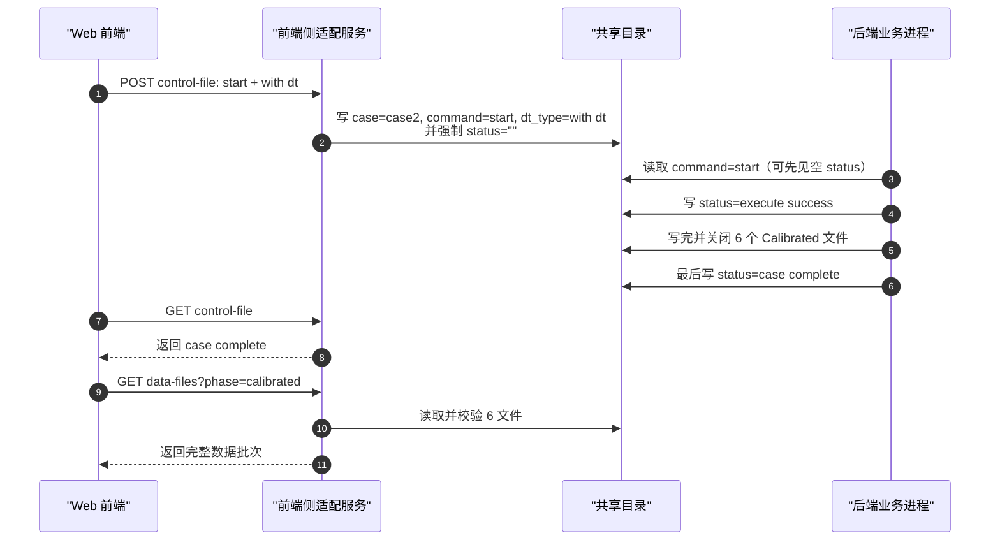
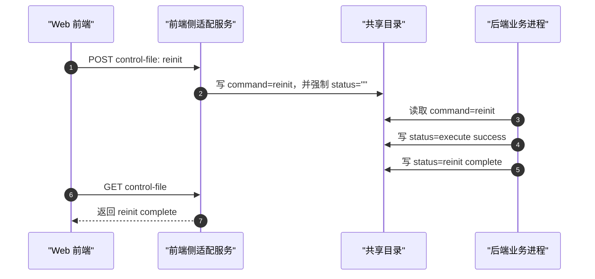
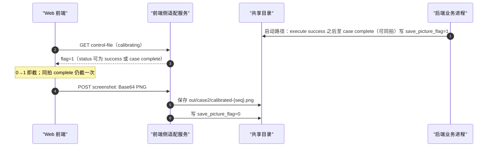

# case2 后端接口交接文档

本文面向后端团队，描述 `DT Calibration`（case2）需要遵守的共享文件、状态、数据文件、前端侧 REST 适配语义、WebSocket 边界、主线时序、错误格式和检查清单。

> **2026-08-03 接口增量：** 前端侧适配服务在 `start` / `reinit` 写入时会**强制把 `status` 清为 `""`**（开一轮清盘）。后端须接受新一轮开始后短暂出现空 `status`；`execute success` / `execute fail` / `case complete` / `reinit complete` 等业务终态字面值仍**只由后端写出**。本文后续章节已展开控制字段、时序和检查项。

## 1. 系统边界


| 组件            | 职责                                                                     | 不负责                                      |
| ------------- | ---------------------------------------------------------------------- | ---------------------------------------- |
| 后端业务进程        | 读取控制文件；执行启动/重置；写 `status`；发布 Calibrated 结果文件；按需置 `save_picture_flag=1` | 浏览器展示；截图编码；截图文件落盘；清零 `save_picture_flag` |
| 前端侧 Node 适配服务 | 代表 Web 读写控制文件；读取和校验数据文件；保存截图 PNG；保存成功或 Web 累计 3 次失败放弃本张截图后清零 `save_picture_flag`           | 后端算法；写后端状态；伪造完成结果                        |
| Web 前端        | 用户交互；展示状态；渲染热力图/KPI；生成 Base64 PNG 截图                                   | 直接读写共享目录；直接写控制文件；直接输出截图文件                |


共享目录实际挂载路径由部署双方约定。本文用 `{SHARED_DIR}` 表示该共享根目录。

## 2. 接口总表


| 接口/文件                            | 方向                    | 所有者     | 用途                           |
| -------------------------------- | --------------------- | ------- | ---------------------------- |
| `{SHARED_DIR}/case_control.json` | 前端侧适配服务 ↔ 后端业务进程      | 双方分字段写入 | 命令、状态和截图请求控制                 |
| Calibrated 六个结果文件                | 后端业务进程 → 前端侧适配服务      | 后端业务进程  | 发布本轮校准结果                     |
| Initial 六个输入文件                   | 后端业务进程/部署材料 → 前端侧适配服务 | 部署约定    | 提供 Initial 基线输入              |
| `GET /api/case2/control-file`    | Web → 前端侧适配服务         | 前端侧适配服务 | 读取控制文件快照                     |
| `POST /api/case2/control-file`   | Web → 前端侧适配服务         | 前端侧适配服务 | 写启动、重置和截图清零字段                |
| `GET /api/case2/data-files`      | Web → 前端侧适配服务         | 前端侧适配服务 | 读取 Initial 或 Calibrated 数据文件 |
| `POST /api/case2/screenshot`     | Web → 前端侧适配服务         | 前端侧适配服务 | 上传 Base64 PNG 截图，由适配服务保存     |
| WebSocket                        | 无                     | 无       | 本接口不使用 WebSocket             |


## 3. 控制文件格式

控制文件为 JSON 对象。字段之外的未知键必须保留，任何一方不得整文件覆盖导致对方字段丢失。

```json
{
  "case": "case2",
  "command": "init",
  "dt_type": "",
  "status": "",
  "save_picture_flag": 0,
  "debug_flag": 0,
  "scene_type": "U6G"
}
```


| 字段                  | 类型/允许值                                                                                  | 写方                          | 要求                         |
| ------------------- | --------------------------------------------------------------------------------------- | --------------------------- | -------------------------- |
| `case`              | 字符串；case2 固定写 `"case2"`                                                                 | 前端侧适配服务                     | 启动请求必须写为 `case2`           |
| `command`           | `"init"` / `"start"` / `"reinit"`                                                       | 前端侧适配服务                     | `start` 表示启动；`reinit` 表示重置 |
| `dt_type`           | `""` / `"with dt"`                                                                      | 前端侧适配服务                     | case2 启动必须写 `"with dt"`    |
| `status`            | `""` / `"execute success"` / `"execute fail"` / `"case complete"` / `"reinit complete"` | **业务终态字面值**仅后端业务进程；`start`/`reinit` 时前端侧适配服务可强制写 `""` 开一轮清盘 | 后端须接受开一轮时空 status；不得由前端伪造业务终态字面值 |
| `save_picture_flag` | `0` / `1`                                                                               | 后端仅在启动路径、`execute success` 之后至 `case complete`（允许同拍）置 `1`；适配服务落盘成功后置 `0`，或 Web 累计 3 次失败后执行接受丢图清盘；**重置路径不得置 1** | Web 不直接写文件；仅 calibrating 观察；flag 回到 0 不保证一定有 PNG |
| `debug_flag`        | 整数                                                                                      | 部署约定                        | 当前 Web 不消费、不修改             |
| `scene_type`        | 字符串                                                                                     | 部署约定                        | 当前 Web 不消费、不修改             |

前端侧适配服务要求 `case`、`command`、`dt_type`、`status`、`save_picture_flag` 五个核心字段存在；`debug_flag`、`scene_type` 为可选部署字段，存在时分别必须为整数、字符串。缺少可选字段不会导致控制快照拒读。


## 4. 状态语义


| `status`            | 含义          | 前端行为                                                                |
| ------------------- | ----------- | ------------------------------------------------------------------- |
| `""`                | 初始化/空闲；或新一轮 `start`/`reinit` 后由适配服务清盘 | 进页不因历史 status 改相；等待态内空 status 继续等中间态/终态                                            |
| `"execute success"` | 命令执行成功的中间状态 | 启动路径继续等待 `case complete`； 重置路径继续等待 `reinit complete`                |
| `"execute fail"`    | 命令执行失败终态    | 显示执行命令失败； 本轮不再等待完成状态                                                |
| `"case complete"`   | 后端系统测试完成    | 前端只在本轮启动且已观察到 `execute success -> case complete` 后读取 Calibrated 六文件 |
| `"reinit complete"` | 后端系统重置完成    | 前端移除 Calibrated 显示，恢复 Initial                                       |


## 5. 命令写入要求

**新轮命令识别（真实后端也必须遵守）：**

- 文件监视、轮询、mtime 变化只用于唤醒读取；每次都必须重新读取完整控制快照。
- 启动的新轮门沿为 `case="case2",command="start",dt_type="with dt",status=""`。
- 重置的新轮门沿为 `command="reinit",status=""`。
- 不得只看 `command` 是否变化：失败后再次启动/重置时 command 可能与上一轮相同，适配服务通过再次清空 `status` 标识新轮。
- 后端写出 `execute success` 或 `execute fail` 后，自己引发的文件变化不得被当成新命令。


### 5.1 启动

前端侧适配服务代表 Web 写入：

```json
{
  "case": "case2",
  "command": "start",
  "dt_type": "with dt"
}
```

适配服务合并上述字段后**额外强制写入 `status=""`**（请求 JSON 本身仍不含 `status`）。后端读取到该命令后，控制文件上可能先看到空 `status`，这是正常开一轮清盘，不是前端伪造完成态。

后端读取到该命令后：

1. 执行启动。
2. 命令执行成功后写 `status="execute success"`。
3. 完整写完并关闭六个 Calibrated 文件。
4. 最后写 `status="case complete"`。

`case complete` 必须是结果发布之后的最后状态信号。后端应保证 `execute success` 对前端 1000ms 级轮询可观察（勿在极短时间内跳过该中间态直接写 `case complete`，否则前端可能因未见 success 而忽略 complete）。

### 5.2 重置

前端侧适配服务代表 Web 写入：

```json
{
  "command": "reinit"
}
```

适配服务同样强制 `status=""`。后端读取到该命令后：

1. 执行重置。
2. 命令执行成功后写 `status="execute success"`。
3. 重置完成后写 `status="reinit complete"`。

后端不需要再把 `command` 改回 `init`，也不需要再把 `status` 改回 `""`。
### 5.3 命令失败

如果启动或重置命令执行失败，后端写：

```json
{
  "status": "execute fail"
}
```

写入 `execute fail` 后，本轮不得继续写 `case complete` 或 `reinit complete`。

## 6. 数据文件要求


### 6.1 文件清单


| UI 指标   | Initial 热力图                           | Calibrated 热力图                        | Initial KPI 样本                            | Calibrated KPI 样本                         |
| ------- | ------------------------------------- | ------------------------------------- | ----------------------------------------- | ----------------------------------------- |
| RSS 误差  | `heatmap_init_rss.txt`                | `heatmap_cali_rss.txt`                | `heatmap_init_kpi_rss.txt`                | `heatmap_cali_kpi_rss.txt`                |
| 有效路径数误差 | `heatmap_init_effective_path_num.txt` | `heatmap_cali_effective_path_num.txt` | `heatmap_init_kpi_effective_path_num.txt` | `heatmap_cali_kpi_effective_path_num.txt` |
| 首径时延误差  | `heatmap_init_first_path_delay.txt`   | `heatmap_cali_first_path_delay.txt`   | `heatmap_init_kpi_first_path_delay.txt`   | `heatmap_cali_kpi_first_path_delay.txt`   |


当前 case 2 UI 只消费以上三项。

### 6.2 热力图文件内容

热力图文件表示 `Nx × Ny` 误差矩阵：

- `Nx` 和 `Ny` 不固定为 20。
- 文件必须是非空矩形矩阵。
- 每个非空行必须有相同数量的数值。
- 数值必须是有限数值。
- 分隔符允许逗号或空白字符。
- 换行允许 LF 或 CRLF。
- 数值宜最多保留 **2** 位小数；超过 2 位时前端适配服务会**四舍五入**到 2 位后使用（不因此拒读）。
- 取值范围按指标（归一后；越界时适配对热力**掐位**、对 KPI **丢弃该样本**，不因此整文件 422，除非 KPI 滤完为空）：
  - RSS 热力 **\-500～500**
  - 有效路径数热力 **0～500**
  - 首径时延热力 **0～1000**
- 行内逗号或空白均为分隔符，空格不是无效数据。格子对应地图位置，后端不要省略越界格。

示例：

```text
0.12 0.18 0.20
0.10 0.14 0.19
```

示例：

```text
0.12,0.18,0.20
0.10,0.14,0.19
```

### 6.3 KPI 文件内容

KPI 文件表示 `N` 个误差样本：

- `N` 不固定为 20。
- 至少包含 1 个有限数值。
- 行列排布不表达业务语义，前端侧按数值样本集合处理。
- 分隔符允许逗号或空白字符。
- 换行允许 LF 或 CRLF。
- 数值宜最多保留 **2** 位小数；超过 2 位时前端适配服务会**四舍五入**到 2 位后使用（不因此拒读）。
- 取值范围按指标（归一后；越界样本由适配丢弃）：
  - RSS KPI **\-1000～1000**（允许负号）
  - 有效路径数 KPI **0～50000**
  - 首径时延 KPI **0～10000**
- 滤完后仍须至少 1 个样本，否则前端侧整批失败。

示例：

```text
0.12
0.18
0.20
```

示例：

```text
1.1,0.1,6
```

### 6.4 Calibrated 发布要求

启动后，后端必须先完整写完并关闭以下六个文件：

- `heatmap_cali_rss.txt`
- `heatmap_cali_effective_path_num.txt`
- `heatmap_cali_first_path_delay.txt`
- `heatmap_cali_kpi_rss.txt`
- `heatmap_cali_kpi_effective_path_num.txt`
- `heatmap_cali_kpi_first_path_delay.txt`

六个文件全部完成后，最后写：

```json
{
  "status": "case complete"
}
```

前端侧只在本轮启动后观察到 `execute success -> case complete` 时读取这六个文件。文件缺失、格式错误、非矩形热力图或非法 KPI 样本会导致整批拒绝。

## 7. 截图请求

**置位窗口（须遵守）**：仅在本轮启动路径中，于已写 `execute success` 之后、写 `case complete` 之时或之前，将 `save_picture_flag` 从 `0` 写为 `1`。允许与 `case complete` 同拍；若选择同拍，必须把 `status="case complete"` 与 `save_picture_flag=1` 合并为同一次完整控制文件写。若选择不同拍，必须先写 flag、再写 complete。`reinit` / 重置路径**不得**置 `1`。禁止先写 `case complete`、再补写 flag，因为前端可能已经停轮询。

前端侧行为：

1. Web 仅在 `calibrating` 控制轮询中检测 0→1；发现上升沿即截图一次。
2. 若本拍 `status` 已是 `case complete` 且同时出现 flag 0→1，仍截图一次，再进入完成展示。
3. Web 通过 `POST /api/case2/screenshot` 上传 Base64 PNG。
4. 前端侧适配服务保存为 `{SHARED_DIR}/out/case2/calibrated-{seq}.png`。
5. `seq` 从 `000` 开始递增，例如 `calibrated-000.png`、`calibrated-001.png`。
6. 正常路径由前端侧适配服务确认 PNG 完整落盘后，将 `save_picture_flag` 写回 `0`；累计 3 次失败时允许执行接受丢图清盘。

同一 0→1 截图任务最多尝试 3 次（首次 + 2 次重试）：前两次生成/传输失败不清零；Node 以临时文件 + 原子 rename 保存 PNG，完整落盘后清零，不覆盖旧文件。内部演示不实现截图持久事务、SHA-256 去重或进程重启恢复，极端崩溃窗口允许丢失或重复截图。累计第 3 次仍失败时，Web 经 Node 自动清零并记录本张截图丢失；此时可能没有对应 PNG，后端不得仅凭 flag 回到 `0` 推断截图一定存在。该取舍已由用户接受，业务状态不受影响。

## 8. REST 输入输出

REST 接口由前端侧 Node 适配服务承载，后端业务进程不需要实现这些接口。这里列出 REST 语义，是为了后端团队理解 Web 与共享文件之间的中间层。

### 8.1 `GET /api/case2/control-file`

返回控制文件快照。

成功响应：

```json
{
  "ok": true,
  "control": {
    "case": "case2",
    "command": "start",
    "dt_type": "with dt",
    "status": "execute success",
    "save_picture_flag": 0,
    "debug_flag": 0,
    "scene_type": "U6G"
  }
}
```


### 8.2 `POST /api/case2/control-file`

用于写启动、重置或截图清零字段。

启动请求：

```json
{
  "case": "case2",
  "command": "start",
  "dt_type": "with dt"
}
```

重置请求：

```json
{
  "command": "reinit"
}
```

截图清零请求：

```json
{
  "save_picture_flag": 0
}
```

成功响应：

```json
{
  "ok": true,
  "control": {}
}
```

响应中的 `control` 为写入后的控制文件快照。

### 8.3 `GET /api/case2/data-files`

查询参数：


| 参数      | 允许值                      | 含义                           |
| ------- | ------------------------ | ---------------------------- |
| `phase` | `initial` / `calibrated` | 读取 Initial 输入或 Calibrated 结果 |


成功响应：

```json
{
  "ok": true,
  "phase": "calibrated",
  "metrics": {
    "rss": {
      "heatmap": [[0.12, 0.18], [0.10, 0.14]],
      "kpi": [0.12, 0.18, 0.20]
    },
    "effective_path_num": {
      "heatmap": [[1.0, 2.0], [1.5, 2.5]],
      "kpi": [1.0, 1.5, 2.0]
    },
    "first_path_delay": {
      "heatmap": [[0.03, 0.04], [0.02, 0.05]],
      "kpi": [0.03, 0.04, 0.05]
    }
  }
}
```


### 8.4 `POST /api/case2/screenshot`

请求：

```json
{
  "image_base64": "iVBORw0KGgo..."
}
```

成功响应：

```json
{
  "ok": true,
  "path": "out/case2/calibrated-000.png",
  "seq": 0
}
```

`path` 是相对 `{SHARED_DIR}` 的稳定路径；适配服务仅在本机日志中记录实际绝对路径。


## 9. WebSocket 事件

本接口不使用 WebSocket。


| 事件  | 说明                           |
| --- | ---------------------------- |
| 无   | 状态和数据均通过共享文件与前端侧 REST 适配语义表达 |


## 10. 错误 shape

前端侧 REST 适配服务失败时，统一返回：

```json
{
  "ok": false,
  "error": {
    "code": "CONTROL_READ_FAILED",
    "message": "failed to read case_control.json"
  }
}
```

建议错误码：


| code                      | 含义                  |
| ------------------------- | ------------------- |
| `CONTROL_READ_FAILED`     | 控制文件读取失败            |
| `CONTROL_WRITE_FAILED`    | 控制文件写入失败            |
| `DATA_FILE_MISSING`       | 数据文件缺失              |
| `DATA_FILE_INVALID`       | 数据文件格式非法            |
| `RESULT_BATCH_INCOMPLETE` | Calibrated 六文件批次不完整 |
| `SCREENSHOT_SAVE_FAILED`  | 截图保存失败              |


后端业务失败不得使用 REST 错误表达；后端业务失败只写 `status="execute fail"`。

## 11. 主线时序


### 11.1 启动到结果完成




### 11.2 重置完成




### 11.3 截图保存




## 12. 后端检查清单

- [ ] 启动命令只认 `case="case2"`、`command="start"`、`dt_type="with dt"`。
- [ ] 重置命令只认 `command="reinit"`。
- [ ] 接受新一轮 `start`/`reinit` 后控制文件出现 `status=""`（前端侧适配服务开一轮清盘）；不把它当成异常。
- [ ] 以合法命令元组 + `status=""` 识别新轮；文件事件只唤醒读取，不以 command 值变化或 mtime 作为命令身份。
- [ ] 业务终态字面值（`execute success` / `execute fail` / `case complete` / `reinit complete`）只由后端写出。
- [ ] `execute success` 只作为中间状态写入，不作为完成状态；对前端轮询保持可观察窗口。
- [ ] 启动成功链路为 `execute success -> case complete`。
- [ ] 重置成功链路为 `execute success -> reinit complete`。
- [ ] 失败链路只写 `execute fail`，本轮不再写完成状态。
- [ ] 写 `case complete` 前，六个 Calibrated 文件已经完整写完并关闭。
- [ ] 接受前端侧适配服务在新一轮 `start`/`reinit` 时先清空六个 Calibrated 文件（可为空）；后端须在本轮重新完整发布，不得依赖磁盘上旧内容。
- [ ] 热力图文件为动态 `Nx × Ny` 非空矩形矩阵，不固定 20×20。
- [ ] KPI 文件为动态 `N` 个有限样本，不固定 20 条。
- [ ] 热力图数值宜最多 2 位小数；范围按指标（RSS \-500～500、有效路径数 0～500、首径时延 0～1000）；超过 2 位由适配四舍五入，越界由适配掐位。
- [ ] KPI 数值宜最多 2 位小数；范围按指标（RSS \-1000～1000、有效路径数 0～50000、首径时延 0～10000）；超过 2 位由适配四舍五入，越界样本由适配丢弃。
- [ ] 需要截图时：仅在启动路径、`execute success` 之后至 `case complete`（允许同拍）将 `save_picture_flag` 从 `0` 写为 `1`；重置路径不置 1；勿在前端已进 completed 停轮询后再置 1。
- [ ] flag 与 complete 同拍时合并为一次完整控制写；不同拍时严格先 flag 后 complete；禁止 complete 后补 flag。
- [ ] 不清零 `save_picture_flag`；清零由前端侧适配服务在截图保存成功后完成，或由 Web 累计 3 次失败后经适配服务执行放弃清零。flag 回到 `0` 不再等价于一定存在截图文件。
- [ ] 不要求重置完成后再回写 `command=init,status=""`。
- [ ] 不依赖 WebSocket。
