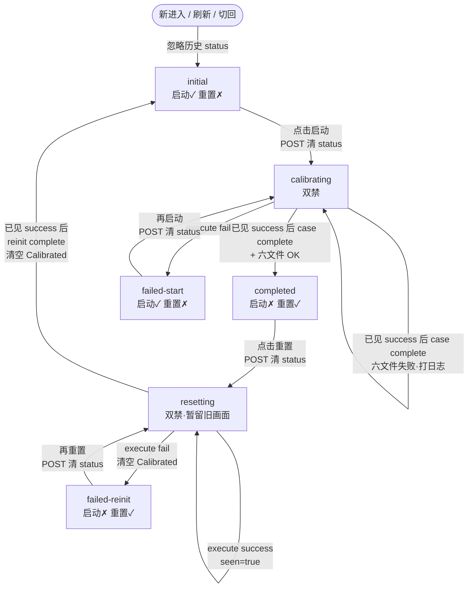
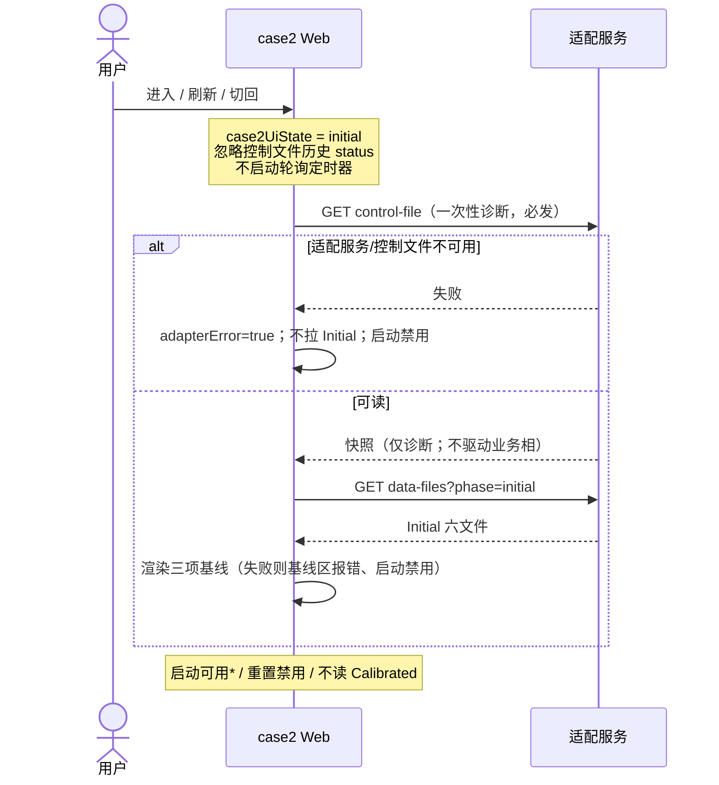
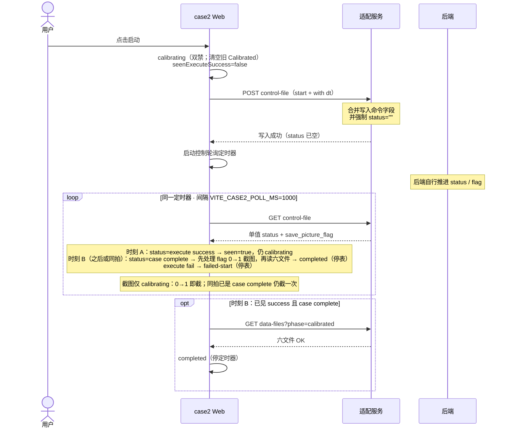
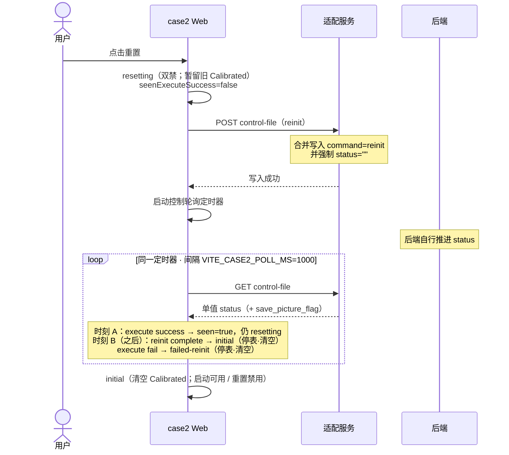
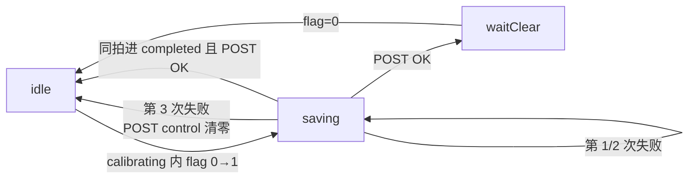
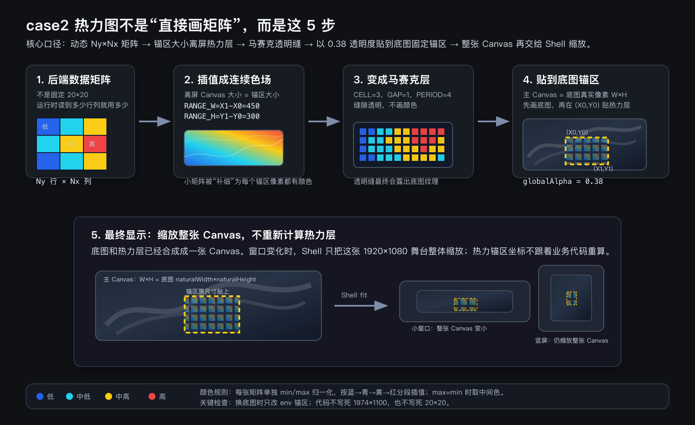
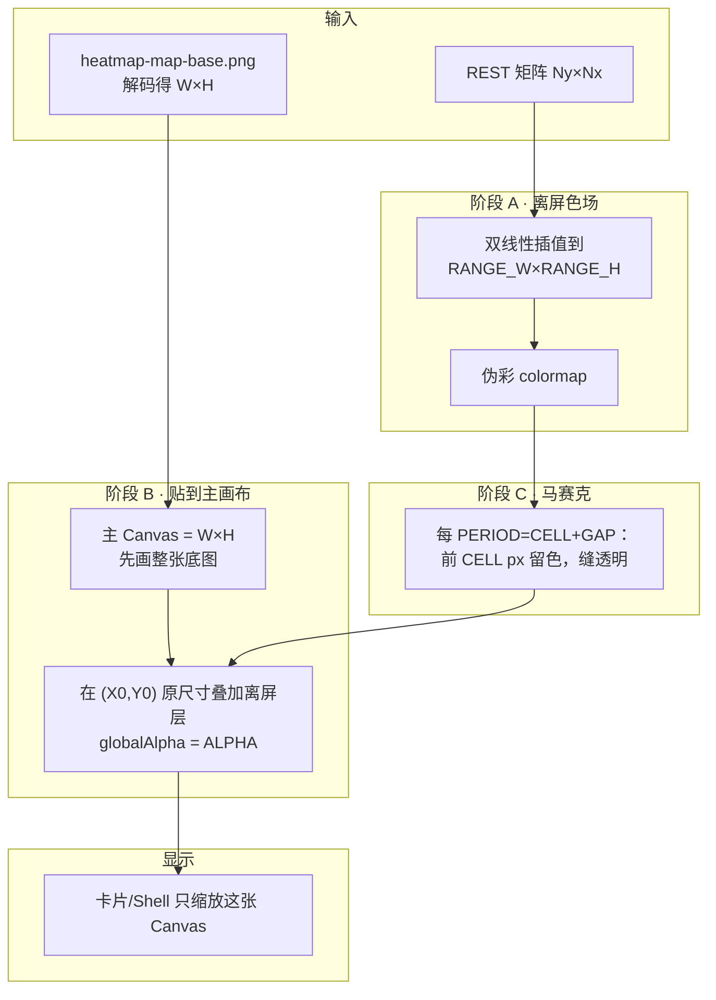

# case2 Web 施工规格

> 使用者：正式 React Web 实现 agent。本文把 [API-CONTRACT.md](API-CONTRACT.md) v1、冻结设计和运行时资源转换为施工约束；`web-static/case2/` 只作为 Gate 1.5 视觉参照，不是代码模板或运行依赖。状态语义以契约为准；本文补充 Web 施工增量。Gate 3 演示向放宽：启动/重置 POST 由适配服务清 `status=""`（见 §6），以便去掉残留终态而不引入 `baselineStatus`。

## 0. 出口条件

- [ ] Shell 独立拥有四 Tab、1920×1080 等比缩放、公共 token 和“建设中”占位。
- [ ] case2 离开 Tab 即卸载，停止轮询并清空业务态、Calibrated 和截图状态。
- [ ] Initial、calibrating、completed、failed-start/failed-reinit、resetting 与适配错误行为符合**本文施工写死点**（相对契约的 Gate 3 放宽以本文为准；无 result-error/unknown-control UI）。
- [ ] 新进入 / 刷新 / 切回 case2 一律 `initial`（可启动、不读 Calibrated），不续接控制文件历史 `status`；无自动业务超时、业务命令自动重试、取消或队列；截图有限重试按 P0-4 单独执行。
- [ ] 启动和重置互斥；`failed-start` / `failed-reinit` 仅本挂载内本轮命令失败后出现。
- [ ] 启动/重置 POST 由适配服务清 `status=""`；仅在 `calibrating` 内本轮已见 `execute success` 后再见 `case complete`，才读取 Calibrated 六文件。
- [ ] 动态 `Nx × Ny` 热力图、动态 `N` CDF/均值/降幅均由当前响应计算，无固定 20 或固定百分比。
- [ ] `save_picture_flag`：仅 `calibrating` 观察 0→1；同拍 `case complete` 仍截一次；同一任务最多尝试 3 次，3 次仍失败则经 Node 自动清零并接受丢失本张截图；重置路径无截图。
- [ ] 正式 Web 的全部静态资源位于 `web/` 内（如 `web/assets/`）；构建与运行不引用仓库其他目录；`web/` 可单独迁走或独立建库。
- [ ] 单元测试、类型检查、构建和 Chrome 1920×1080 主线 E2E 通过。

## 0.1 验收速览（目标核对）

> 先看图是否符合预期，再下钻后文。字段与后端时序语义以 [API-CONTRACT.md](API-CONTRACT.md) §1.1–1.3 为准；**Web 可见态、按钮互斥、旁路失败处理以本文为准**（含相对契约的 Gate 3 施工写死点）。下列为相对契约的写死点（其余不重复罗列「符合」项）：

1. **新进入 / 刷新 / 切回 case2：一律** `initial`（可启动、不读 Calibrated），**不续接**控制文件里任何历史 `status`。`failed-start` / `failed-reinit` 只在**本挂载内**本轮命令失败后出现。进页**不**重写控制文件（可选运维卫生除外）。
2. **本轮开盘（Gate 3 演示向，相对契约放宽）**：启动/重置的 `POST control-file` 由适配服务在写命令字段时**同时清** `status=""`，去掉上轮残留。等待态内：**先见** `execute success`**，再认** `case complete` / `reinit complete`；`execute fail` 可直接认（清盘后即为本轮失败）。不设 `baselineStatus` / `pendingAction`。
3. 连接异常用 `adapterError` 叠加，不另切 phase。
4. `completed`：启动禁、只可重置。`failed-start`：只可再启动；`failed-reinit`：只可再重置。不设 `result-error` / `unknown-control` UI：六文件失败或未知 status 只打诊断日志并保持等待态（演示主路径假定可读）。
5. 不设 Initial 独立 error phase；不单独设计命令 POST 写失败 UI 机。业务命令不自动重试；截图生成/上传按同一任务最多 3 次处理，3 次仍失败则经 Node 清零并记丢图日志。命令 POST 主路径假定成功；若失败：回退点击前相 + `adapterError` + 打日志（不启轮询、不留双禁死锁）。
6. `status` 为单值字段：轮询时刻 A 见 `execute success` 置 `seenExecuteSuccess`；**之后**的轮询时刻 B 见 `case complete` / `reinit complete` 才认终态（不得假设同一次响应里同时存在两种 status）。
7. `resetting`：**必须**暂留旧对比画面；仅文案「重置中」+ 双禁；`reinit complete` 或 `failed-reinit` 再清空 Calibrated。

### Web 内部状态清单

`case2UiState` 是唯一业务相（驱动文案、按钮、Calibrated 是否展示）。


| `case2UiState`  | 何时出现                                          | 用户看到什么                         | 启动  | 重置  | Calibrated |
| --------------- | --------------------------------------------- | ------------------------------ | --- | --- | ---------- |
| `initial`       | 新进入 / 刷新 / 切回；或重置成功                           | 仅 Initial 基线；「等待启动测试」          | 可用* | 禁用  | 空          |
| `calibrating`   | 本挂载内点击启动之后                                    | 「测试运行中」（含等待 `execute success`） | 禁用  | 禁用  | 空          |
| `completed`     | 本挂载启动轮：已见 success 后的 `case complete` + 六文件 OK | 「已完成」+ 对比结果                    | 禁用  | 可用  | 显示         |
| `failed-start`  | 本挂载启动轮：清盘后的 `execute fail`                    | 「执行命令失败」                       | 可用  | 禁用  | 空          |
| `failed-reinit` | 本挂载重置轮：清盘后的 `execute fail`                    | 「执行命令失败」                       | 禁用  | 可用  | 空          |
| `resetting`     | 本挂载内点击重置之后                                    | 「重置中」+ **必须**暂留旧对比画面           | 禁用  | 禁用  | 暂留至终态再清  |


 Initial 数据未就绪时启动也禁用。`adapterError=true` 时相不变，两按钮均禁用。

不设 `result-error` / `unknown-control`。六文件失败或未知 `status`：演示主路径假定不发生；若发生只打诊断日志，不另开 UI 态，**保持当前等待态**（`calibrating` / `resetting`），无自动超时；脱身只能刷新或切 Tab。


| 其他层    | 状态                                       | 含义                                  |
| ------ | ---------------------------------------- | ----------------------------------- |
| 连接叠加   | `adapterError` boolean                   | 适配不可达；不替换 `case2UiState`            |
| 数据     | `initialData` / `calibratedData`         | Calibrated 由 `completed` 写入；`resetting` 暂留至终态清空 |
| 本轮门闩   | `seenExecuteSuccess`                     | 等待态内是否已见本轮 `execute success`；完成终态前置 |
| 截图（启动等待态） | `idle` → `saving` → `waitClear`/`idle` | 仅 `calibrating` 看 flag；同拍 complete 仍截；同一任务最多 3 次，最终失败经 Node 清零并接受丢图 |


#### `case2UiState` 切换示意

代码里的枚举名带连字符（`failed-start` / `failed-reinit`）；下图节点用下划线仅为 mermaid 语法。




读图约定：


| 箭头                               | 含义                                         |
| -------------------------------- | ------------------------------------------ |
| 进页 → `initial`                   | 唯一入口；不读 Calibrated；不因历史 fail/complete 改相   |
| 指向自身的环                           | 相不变（仍在等）                                   |
| 「本轮」                             | POST 清盘后的等待态；完成终态须本轮已 `seenExecuteSuccess` |
| `failed-start` / `failed-reinit` | 只能回到各自等待态重试，不能交叉点另一按钮                      |
| success → complete 时序            | 时刻 A 见 `execute success`；**之后**时刻 B 见 complete（`status` 单值，非同拍并存） |
| POST 写失败（旁路）                     | 回退点击前相 + `adapterError` + 日志；不启轮询           |


硬规则：

1. 控制轮询定时器仅在 `calibrating` / `resetting` 运行；非等待态不轮询，也就不会因历史 `status` 改相。**截图 flag 仅在 `calibrating` 观察**（`resetting` 不截图）。
2. `adapterError` 叠加当前态（双禁），不单独占相。
3. 命令 POST 主路径假定成功；失败时必须回退点击前相，禁止停在「已切等待态但未启表」的双禁死锁。
4. **同拍截图**：本拍同时见 flag 0→1 与可认的 `case complete` 时，须先开本次截图，再进 `completed` 停表。

### 可见态切换（主路径时序）

上图看「态怎么跳」；下面三张时序图分场景。

**控制轮询定时器生命周期**（细节 §5.2）：


| 项   | 约定                                                                                                     |
| --- | ------------------------------------------------------------------------------------------------------ |
| 启   | 进入 `calibrating`（点启动）或 `resetting`（点重置）时启动；已在跑则不重复开                                                    |
| 停   | 离开等待态到终态时停：`completed` / `failed-start` / `failed-reinit` / 重置回到 `initial`；切离 case2、卸载、刷新也立即停并 `abort` |
| 不启  | 纯 `initial`（含新进入 / 刷新 / 切回）**不**启定时器；进页对 control **必发**一次性 GET（诊断），不作定时轮询 |
| 请求  | 同一路 `GET /api/case2/control-file`（一次响应读 `status` + `save_picture_flag`）                                |
| 周期  | `VITE_CASE2_POLL_MS`，默认 **1000ms**；上一次 GET **结束后**再等；禁止 `setInterval` 叠请求                              |


#### ① 进入 case2

无定时器。进页采用**串行门闩**（非并行）：

1. **必发**一次性 `GET control-file`：只诊断 **Node 适配服务 + 控制文件是否可读**；**不是**探真实后端/打桩是否在线。失败 → 置 `adapterError`，**不**改相，**不**继续拉 Initial。
2. 仅当 control 诊断成功后，再 `GET data-files?phase=initial` 拉基线。
3. control 成功时的历史 `status` / `command` **不**改相；开发态 StrictMode 重挂载须丢弃陈旧进页结果，避免 Initial 双发。



- 启动可用条件：Initial 就绪且无 `adapterError`。
- control 诊断成功 **不**表示打桩/真实后端已在线；后端是否推进 status 只在用户 start/reinit 后的等待态轮询验证。

#### ② 点击启动

POST 时适配服务写命令字段并**清** `status=""`；成功后启动定时器。本轮须在轮询时刻 A 见 `execute success`，再在**之后**的时刻 B 见 `case complete` 并读 Calibrated（`status` 单值，两拍推进）。`completed` / `failed-start` 后停表。主路径假定 POST 成功；若 POST 失败见 §6.1。




#### ③ 点击重置

POST 时同样**清** `status=""` 后启表；须在时刻 A 见 `execute success`，再在**之后**的时刻 B 见 `reinit complete`。`resetting` **必须**暂留旧对比画面（仅文案改「重置中」+ 双禁）；`reinit complete` 或 `failed-reinit` 再清空。主路径假定 POST 成功；若 POST 失败见 §6.2。




旁路按钮/文案见 §6；截图状态机细节见下节。

### 截图机（仅启动等待态）

观察窗口与业务相相关：**只在 `calibrating`** 看 `save_picture_flag`。在窗口内对 0→1 上升沿截图；**不因**本拍 `status` 已是 `case complete` 而跳过（须截一次）。




| 状态          | 前端 Web 要做什么                                                                                                                                                                    |
| ----------- | ------------------------------------------------------------------------------------------------------------------------------------------------------------------------------ |
| `idle`      | 仅在 **`calibrating`** 轮询中记下 `save_picture_flag`。相对上次出现 **0→1** → `saving`。`resetting` / 非等待态 / 进页诊断 GET：不观察、不截。                                                                 |
| `saving`    | 对同一 0→1 任务累计尝试次数。`toPng` 失败时下一次重新生成；已有 Base64 的上传失败复用同一份 Base64。上传响应不确定时补一次 control GET：flag=`0` 按成功收尾，flag=`1` 才计失败。成功 → 若仍在 `calibrating` 则 `waitClear`；若本拍已切 `completed` 则直接 `idle`。第 1/2 次失败继续本任务；第 3 次仍失败则 POST control `{save_picture_flag:0}`，记录丢图日志后回 `idle`。 |
| `waitClear` | 仅当仍在 `calibrating`：继续同一定时器轮询，**什么都不 POST**，直到 `flag=0` 回 `idle`。若已因 complete 停表，POST 成功后应已直回 `idle`，不依赖 `waitClear`。 |


补充：

- 进入 `calibrating` 启表时 `lastFlag` 初值当作 `0`，故等待态内首包已是 `1` 也会截一次；进页一次性 GET **不**触发截图。
- 同一段 `flag=1` 只创建一个 Web 截图任务；该任务内部允许最多 3 次尝试。正常路径只生成一个序号；仅在 Node 已落盘但未清零/响应不确定的极端窗口允许重试产生额外序号。
- **同拍顺序**：处理控制快照时，先判 flag 0→1（开截图），再判 `case complete`（读六文件 / 切 `completed` / 停表）。
- 已启动的截图任务独立于业务相收尾：同拍进入 `completed` 后仍继续到成功或第 3 次失败。
- Web **绝不直接写控制文件**；成功清零和第 3 次失败后的放弃清零都通过 Node 的 `POST control-file` 完成。
- 细节（`onclone`、字体/图片等待）见 §10。

## 1. 技术选择与目录

### 1.1 技术选择

- React + TypeScript + Vite。
- case2 状态使用 `useReducer` 和 case-local hooks；不引入 Redux、MobX 或全局业务 store。
- REST 使用原生 `fetch`，不用 WebSocket。
- 热力图使用 Canvas；CDF 使用 SVG；均值柱和降幅使用 React + CSS。
- 截图使用 `html-to-image` 的 `toPng`，截取固定 1920×1080 Stage，`pixelRatio=2`（落盘 3840×2160 PNG）。
- 测试使用 Vitest + React Testing Library；浏览器主线使用 Playwright。

### 1.2 目标目录

仓库实现根对齐已建目录 `code/`（可单独迁走其中的 `web/`）。与 [SERVER-SPEC.md](SERVER-SPEC.md) 共用同一树；**Web / Server 均按 case 命名空间隔离**，本阶段只实现 case2：

```text
code/
├── web/                 # 本 SPEC：React Web（可单独建库）
│   ├── package.json / vite.config.ts / tsconfig.json / index.html
│   ├── assets/          # shell/ + case2/（未来 case3/4 各自分目录）
│   ├── src/
│   │   ├── app/ + shell/
│   │   └── cases/
│   │       └── case2/   # 本阶段唯一业务（含 metrics 纯算法）
│   └── test/
├── back/                # 后端业务进程（空，待实现）
├── server/              # 多 case 适配进程（见 SERVER-SPEC）
│   └── src/shared/ + src/cases/case2|3|4/
└── comdatafiles/        # 共享根：case_control + caseN/ + out/caseN/
```

本地联调：`CASE2_SHARED_DIR` 指向仓库内 `code/comdatafiles`（绝对路径）。Web 与 Node 适配服务同机在前端 PC；正式部署时该变量改为前端 PC 上已挂载共享根，目录**结构**不变。

case2 指标模块固定职责（路径可微调，合同不变）：

- `cases/case2/metrics/heatmapConfig.ts`：唯一读取 `import.meta.env.VITE_*`、默认值与强校验。
- `cases/case2/metrics/heatmap.ts` / `statistics.ts`：纯算法；不得直接读 env。

硬约束：

- Chrome **不**直接读 `comdatafiles/`；只访问适配服务 `127.0.0.1:3102`。
- **UI 静态资源**只来自 `code/web/assets/`（或迁走后的 `web/assets/`）。禁止 import 指向 `01-参考资料/`、`04-runtime-assets/`、`comdatafiles/` 等。
- `01-参考资料/` 仅格式/拷贝源；当前 `comdatafiles` 已从参考样本放入十二文件与干净控制 JSON。
- Shell 与 case2 隔离；业务 CSS 用 CSS Modules 或 `.case2-page`。
- `04-runtime-assets/` → 实现前复制进 `web/assets/`。

## 2. 运行配置与命令

配置写入 Web 根目录 Vite env（如 `.env` / `.env.development` / `.env.production`），与 `VITE_CASE2_API_BASE`、`VITE_CASE2_POLL_MS` **同一套文件**；代码只允许由 `metrics/heatmapConfig.ts` 读取 `import.meta.env.VITE_*`，缺省用下表默认值。`heatmap.ts` 与 React 组件只接收已校验的 `HeatmapConfig`，不得再次读取 env、复制默认值或自行容错。

Vite env 是**构建时配置**：修改 `.env.production`、底图资产或以下 `VITE_*` 后必须重新构建 Web；它们不是打包后由 REST 动态下发的运行时参数。

### 2.1 已有与热力相关的 env


| 配置                         | 默认值    | 规则                                                          |
| -------------------------- | ------ | ----------------------------------------------------------- |
| `VITE_CASE2_API_BASE`      | 空字符串   | 默认同源 `/api/case2`；开发服务器代理 `/api` 到 `http://127.0.0.1:3102`。 |
| `VITE_CASE2_POLL_MS`       | `1000` | 只用于控制快照串行轮询；不得被解释为业务超时。                                     |
| `VITE_CASE2_HEATMAP_X0`    | `750`  | 锚定区左（底图像素）。                                                 |
| `VITE_CASE2_HEATMAP_Y0`    | `400`  | 锚定区上。                                                       |
| `VITE_CASE2_HEATMAP_X1`    | `1200` | 锚定区右（须 `> X0`）。                                             |
| `VITE_CASE2_HEATMAP_Y1`    | `700`  | 锚定区下（须 `> Y0`）。                                             |
| `VITE_CASE2_HEATMAP_CELL`  | `3`    | 马赛克色块边长（px）。                                                |
| `VITE_CASE2_HEATMAP_GAP`   | `1`    | 马赛克透明缝（px）。                                                 |
| `VITE_CASE2_HEATMAP_ALPHA` | `0.38` | 热力层叠加透明度。                                                   |
| `VITE_CASE2_CDF_POINT_CAP` | `256`  | CDF 显示点上限：`N≤CAP` 画完整经验台阶；`N>CAP` 才下采样到 CAP 个端点；若配置则必须为 `>=2` 的十进制安全整数。 |


换底图或微调叠加时改 env 即可，无需改算法代码，但必须重新构建。env 缺失时才使用默认值；env 已提供但为空、非数值、非有限数或不满足约束时，配置初始化必须失败并报告具体字段，禁止静默钳制或回退默认值。

### 2.2 参数归属与生命周期


| 参数 | 生命周期 / 唯一来源 | 说明 |
|---|---|---|
| `API_BASE` / `POLL_MS` | **构建时 Vite env** | 部署与联调；修改后重新构建。 |
| 锚定 `X0,Y0,X1,Y1` | **构建时 Vite env** | 与具体底图构图绑定；由 `heatmapConfig.ts` 解析。 |
| `CELL` / `GAP` / `ALPHA` | **构建时 Vite env** | 视觉调参；`PERIOD = CELL + GAP` 在 `heatmapConfig.ts` 派生，不单独配置。 |
| 底图 URL | **代码 import 的构建时资产** | `assets/case2/maps/heatmap-map-base.png`；不进 env，替换后重新构建。 |
| 色标、断点、双线性公式、矩阵方向、`max===min` 策略 | **代码冻结常量/规则** | 以 §8.2 为唯一算法口径；不进 env。 |
| REST `Ny×Nx` 矩阵 | **运行时输入** | 每次 Initial / Calibrated 数据响应提供；禁止写死 20。 |
| 画布 / 底图宽高 | **运行时识别** | `Image.naturalWidth/Height`；不写死 1974×1100，但必须做锚区边界校验。 |
| 离屏 `RANGE_W×RANGE_H` | **运行时派生** | `(X1-X0)×(Y1-Y0)`；禁止再定义第二套 450×300 常量。 |
| `Nx,Ny`、矩阵 `min/max`、插值结果 | **运行时派生** | 从当前矩阵计算；Initial 与 Calibrated 各自独立。 |
| CDF 点集规则、降幅公式 | **代码规则 + 可选 env** | 完整经验台阶，点数随 `N`；`VITE_CASE2_CDF_POINT_CAP` 仅封顶且由 `heatmapConfig.ts` 严格解析。见 §9。 |

优先级只有一条：**env 缺失 → 使用 `heatmapConfig.ts` 默认值；env 存在 → 严格解析并覆盖默认值；图片解码后 → 用实际宽高做第二阶段锚区校验。** 文档表格只描述施工口径，代码默认值只能在 `heatmapConfig.ts` 出现一次。


### 2.3 命令


| 命令                  | 用途                            |
| ------------------- | ----------------------------- |
| `npm run dev`       | Vite 开发服务器，代理到 Node 适配服务。     |
| `npm run build`     | 类型检查后生成正式静态包。                 |
| `npm run typecheck` | TypeScript 严格检查。              |
| `npm test`          | Vitest 单元/组件测试。               |
| `npm run test:e2e`  | Playwright 主线测试；无真实后端时可配合 [realback_no.md](realback_no.md) 打桩。 |


生产部署优先由 Node 适配服务或同机静态服务器托管 `web/dist`，保持 Web 与 `/api` 同源；不依赖 CORS、CDN 或 Google Fonts。

## 3. Shell 与 case2 所有权

### 3.1 组件树

```text
App
└── Shell
    └── ScaledStage (1920×1080)
        ├── Header + CaseTabs
        └── ActiveCase
            ├── Case2Page
            │   ├── StatusFeedback
            │   ├── CalibrationPanel
            │   │   ├── CalibrationControls
            │   │   └── HeatmapPair × 3
            │   └── KpiPanel
            │       └── KpiComparisonRow × 3
            └── ComingSoon
```

case-local 弹层、业务反馈不得渲染在 Stage 外。Header 可内嵌于 `Shell`，不必单独文件。

### 3.2 Shell 规则

- `ScaledStage` 固定 `1920×1080`。
- `scale = min(viewportWidth / 1920, viewportHeight / 1080)`，舞台水平、垂直居中。
- Shell 是唯一缩放所有者；case2 内部保持固定布局，不增加第二套响应式重排或缩放。
- 切到 case1/3/4 时只渲染“建设中”，必须卸载 `Case2Page`。
- Shell 只导入 `web/assets/shell/` 下的 tokens、品牌 Logo 与导航底图。

### 3.3 case2 规则

- case2 只导入 `web/assets/case2/` 下的 tokens 与业务资源。
- case2 可以消费 Shell 已注入的 `--shell-*`，不能重定义或复制。
- 指标标签使用 `--case2-color-metric-tag-rss/path/delay` 与 HTML 文案，不复制 PNG 底板。
- 三项指标通过配置映射复用同一套组件，不复制三套状态逻辑。
- 正式按钮与互斥以本文和 Gate 2 为准；Gate 1.5 静态原型里 calibrating 曾允许点重置，不得照抄。
- 「现场环境 >」按 §6.4：文案与静态一致；点击打开 Shell 级现场环境弹窗（图片占位，可关闭/拖拽）。

## 4. 类型与状态归属

### 4.1 REST 类型

成功/失败 JSON shape 以 [SERVER-SPEC.md](SERVER-SPEC.md) 为准。Web 侧至少区分：

```ts
type ControlStatus =
  | ""
  | "execute success"
  | "execute fail"
  | "case complete"
  | "reinit complete";

type MetricKey = "rss" | "effective_path_num" | "first_path_delay";
type DataPhase = "initial" | "calibrated";

type MetricData = {
  heatmap: number[][];
  kpi: number[];
};

type DataFilesResponse = {
  ok: true;
  phase: DataPhase;
  metrics: Record<MetricKey, MetricData>;
};

// 控制快照：包含 status、save_picture_flag 等契约字段；完整字段表见契约/SERVER-SPEC
type ControlFileResponse = {
  ok: true;
  control: {
    case: string;
    command: string;
    dt_type: string;
    status: ControlStatus;
    save_picture_flag: 0 | 1;
    // debug_flag / scene_type / 未知字段：原样保留，UI 不消费
    [key: string]: unknown;
  };
};

type ApiErrorResponse = {
  ok: false;
  error: { code: string; message: string };
};
```

API client 必须运行时检查 `ok`、枚举、三项指标和数组 shape，不能只依赖 TypeScript 编译期类型。

### 4.2 case2 reducer

```ts
type Case2UiState =
  | "initial"
  | "calibrating" // 本轮启动未完成：互斥等待；唯一允许发起 GET calibrated 的相（显示上 resetting 可暂留已持有的数据）
  | "resetting"   // 本轮重置未完成；暂留旧 Calibrated 画面，不新读六文件
  | "completed"
  | "failed-start"  // 启动路径 execute fail：只可再启动
  | "failed-reinit"; // 重置路径 execute fail：只可再重置
```

不设 `pendingAction`、`connection-error`、`initial-data-error`、`result-error`、`unknown-control`：本轮动作就是 `calibrating`/`resetting`；连接问题用 `adapterError` 叠加；Initial/Calibrated 异常与未知 status 以日志 + 保守可见态处理（未知 status：保持等待态，见 §5.2）。

case-local state 至少包含：


| 状态                   | 来源              | 说明                                             |
| -------------------- | --------------- | ---------------------------------------------- |
| `case2UiState`       | reducer         | 唯一业务相；进页固定 `initial`。                          |
| `adapterError`       | REST            | 叠加标志；为 true 时双禁并显示连接异常，**不**改写 `case2UiState`。 |
| `seenExecuteSuccess` | 等待态轮询           | 本轮是否已见 `execute success`；认完成终态的前置。             |
| `initialData`        | Initial REST    | 进入 case2 时读取；仅本次挂载有效。                          |
| `calibratedData`     | Calibrated REST | 每次启动前清空；`completed` 写入；`resetting` **暂留**；`reinit complete` / `failed-reinit` / 刷新 / 切 Tab 时清空。 |
| `lastControl`        | 控制 REST         | 诊断与截图 flag；非等待态时 `status` 不驱动 UI 相变。           |
| `screenshotState`    | 独立小状态机          | 不参与 `case2UiState` 完成判断。                       |


不得把定时器句柄、Canvas 上下文、图片对象或截图 Base64 放入 reducer。

## 5. 生命周期与轮询

### 5.1 进入 case2

1. reducer 初始化为 `initial`、`adapterError=false`、`seenExecuteSuccess=false`、无 Calibrated。
2. **串行门闩（必按此顺序）**：
   1. **必发**一次性 `GET control-file`（诊断 **适配服务 + 控制文件可读性**，不是探真实后端/打桩）。
   2. 仅当 control 诊断成功后，再 `GET data-files?phase=initial`。
   3. control 失败：置 `adapterError=true`，**停止进页数据加载**（不得再发 Initial），可见态仍为 `initial`。
3. Initial 六文件整体成功后渲染三项基线；失败则 Initial 区报错且启动禁用，不进入独立 error phase。Initial 失败与 control 失败语义分离：前者 `initialError`（基线不可用），后者 `adapterError`（适配连接异常）。
4. **可见态固定** `initial`，与首包 `status`/`command` 无关：启动可用（Initial 就绪且无 adapterError 时）、重置禁用、不读 Calibrated、不进入 `failed-`*/`completed`。控制快照仅诊断；其 `status` 不改相。
5. 进页**不**启动控制轮询定时器；在进入 `calibrating`/`resetting` 之前不因 `status` 改相。
6. 截图：仅 `calibrating` 轮询看 `save_picture_flag`；启表后 `lastFlag` 初值当作 `0`；进页一次性 GET **不**触发。同拍 `case complete` + 0→1 须先截再停表。
7. 开发态 React StrictMode 可能 setup→cleanup→setup：进页请求须带 abort / generation 去重，**同一有效挂载周期不得成功提交两次 Initial**。
8. 成功路径须有可对表的结构化诊断日志（至少：进页 control/initial 结果、start/reinit POST 结果、status 边沿、截图 0→1 与成败、calibrated 成败）。

### 5.2 控制轮询

- **启**：POST `start`/`reinit` 成功并进入 `calibrating`/`resetting` 后启动；已在跑则不重复开。
- **停**：进入 `completed` / `failed-start` / `failed-reinit` / 重置后的 `initial` 时清理 timer；切离 case2、卸载、刷新立即 `abort` 并清理。
- **不启**：纯 `initial`（新进入/刷新/切回）只做一次性 `GET control-file` 诊断（必发），不作定时业务轮询。例外：`adapterError=true` 且仍为 `initial` 时，每 **5s** 探活一次 `GET control-file`（不封顶），成功后清 `adapterError`；若尚无 Initial 再拉 `data-files?phase=initial`；不因历史 `status` 改相。切离 case2 / 进入等待态 / 卸载时停探。
- 使用递归 `setTimeout`：上一次 GET 完成后再等待 `VITE_CASE2_POLL_MS`（默认 1000），禁止 `setInterval` 造成请求重叠。
- 每个挂载实例持有 `AbortController`；停表/卸载时 abort 当前请求并清理 timer。
- 网络/控制读失败：置 `adapterError=true` 并继续轮询；成功后清 `adapterError`。不改 `case2UiState`。
- 仅 `calibrating` / `resetting` 解释 `status`：见 `execute success` 置 `seenExecuteSuccess=true`；**仅当** `seenExecuteSuccess` 为真才认 `case complete` / `reinit complete`；`execute fail` 直接认失败相。`status` 为单值：时刻 A 见 success、**之后**时刻 B 见 complete，不得假设同拍并存两种 status。**仅 `calibrating`** 同一次响应顺带驱动截图机（读 `save_picture_flag`）；处理顺序：先 flag 0→1，再认 complete。
- 等待态内出现**未知** `status` 字面值：打诊断日志，相不变，继续轮询；不映射为 fail/complete；无前端超时。脱身：刷新或切 Tab。
- 不累计失败次数，不生成前端业务超时，不把连接失败映射为 `execute fail`，不自动重发命令。

### 5.3 刷新与切 Tab

遵循契约 [API-CONTRACT.md](API-CONTRACT.md) §3.3 的「回 Initial、不重放完成」；演示施工进一步写死：

- 刷新依赖内存销毁；不得写入 `localStorage` / `sessionStorage` / URL / IndexedDB。
- 切离必须卸载、停轮询、停截图、丢弃 Calibrated 与 `seenExecuteSuccess`。
- 切回或刷新 = 新挂载：一律 `initial`，不续接历史 fail/complete，不自动读 Calibrated。

## 6. 状态转换与按钮

可见态由本挂载交互 +（仅等待态内的）控制快照驱动。下表是施工用按钮结果。


| 当前条件                                               | 可见态              | 启动  | 重置  | Calibrated    |
| -------------------------------------------------- | ---------------- | --- | --- | ------------- |
| 新进入 / 刷新 / 切回；或非等待态且未完成本轮                          | `initial`        | 可用* | 禁用  | 空             |
| Initial 尚未成功                                       | `initial`        | 禁用  | 禁用  | 空             |
| 本挂载已点启动，等待本轮终态                                     | `calibrating`    | 禁用  | 禁用  | 空             |
| `calibrating` 且已见 success 后的 `case complete`，六文件有效 | `completed`      | 禁用  | 可用  | 当前新批次         |
| `calibrating` 且已见 success 后的 `case complete`，六文件失败 | 保持 `calibrating` | 禁用  | 禁用  | 空；打日志（主路径假定不发生） |
| 本挂载已点重置，等待本轮终态                                     | `resetting`      | 禁用  | 禁用  | **必须**暂留旧对比 +「重置中」 |
| `resetting` 且已见 success 后的 `reinit complete`       | `initial`        | 可用  | 禁用  | 清空            |
| `calibrating` 且本轮 `execute fail`                   | `failed-start`   | 可用  | 禁用  | 空             |
| `resetting` 且本轮 `execute fail`                     | `failed-reinit`  | 禁用  | 可用  | 清空            |
| 任一相上 `adapterError=true`                           | （相不变）            | 禁用  | 禁用  | 不变            |


 与控制文件是否仍残留 `execute fail` / `case complete` 无关。

本轮终态识别（开盘 + 链路）：

1. 启动/重置 POST **成功**时，适配服务已把 `status` 清为 `""`（见 SERVER-SPEC）；Web 置 `seenExecuteSuccess=false` 并启表。若 POST **失败**：回退点击前相 + `adapterError=true` + 打日志；不启轮询（§6.1 / §6.2）。
2. 轮询时刻 A 见 `execute success` → `seenExecuteSuccess=true`，相不变。
3. **之后**的轮询时刻 B，且 `seenExecuteSuccess===true`：启动路径认 `case complete`（再读六文件）；重置路径认 `reinit complete`。`status` 单值，两拍推进，非同拍并存。
4. 未见 success 就出现的 complete：忽略并打日志，不停表、不读 Calibrated。
5. `execute fail`：清盘后即可认 → `failed-start` / `failed-reinit`（不要求先见 success）。
6. 进页不启表、不解释历史 `status`，故残留终态不会在未点按钮时改相。

> Gate 3 演示向放宽：适配服务在 start/reinit 时写入 `status=""`。相对 Gate 2「`status` 仅后端写」；真实联调须与后端确认接受「开一轮时空 status」。业务终态字面值仍只由后端写出。

### 6.1 启动

1. 防重复：仅启动按钮可用（含从 `failed-start` 重试）、非 `calibrating`/`resetting`、`adapterError=false`；从 `initial` 进入时还需 Initial 已就绪。
2. 记录点击前相；清空旧 Calibrated，进入 `calibrating`，`seenExecuteSuccess=false`。
3. POST `{case:"case2",command:"start",dt_type:"with dt"}`（请求体仍不含 `status`；适配服务合并时强制 `status=""`）。
4. **主路径假定 POST 成功**（演示/联调环境适配可达）。不单独设计 POST 写失败 UI 机。**若 POST 确实失败**：回退到点击前相，置 `adapterError=true`，打诊断日志，**不**启轮询、不自动重发；不得停在「已是 `calibrating` 但未启表」的双禁死锁。
5. POST 成功后启表。轮询：时刻 A 见 `execute success` → `seenExecuteSuccess=true`，仍 `calibrating`；**之后**时刻 B 见 `case complete`（且已 seen）→ 请求一次 Calibrated；`execute fail` → `failed-start`。
6. 六文件成功 → `completed`。六文件失败：演示主路径假定不发生；若发生 → 保持 `calibrating`，打诊断日志，不另开 UI 态。

### 6.2 重置

1. 仅重置按钮可用时进入（含从 `failed-reinit` / `completed`）；记录点击前相；进入 `resetting`，`seenExecuteSuccess=false`，两按钮禁用。
2. **必须暂留**旧对比画面（热力 + KPI）；仅 StatusFeedback 文案改为「重置中」。
3. POST `{command:"reinit"}`（适配服务强制 `status=""`）。
4. **主路径假定 POST 成功**。若 POST 失败：回退点击前相 + `adapterError=true` + 打日志，不启轮询（与 §6.1 同口径）。
5. POST 成功后启表。时刻 A 见 `execute success` → `seenExecuteSuccess=true`；**之后**时刻 B 见 `reinit complete`（且已 seen）→ **清空** Calibrated，回 `initial`。
6. `execute fail` → `failed-reinit`，并**清空** Calibrated。
7. 不等待后端再把 `command` 改回 `init`。

### 6.3 文案


| 场景                                | 文案                                |
| --------------------------------- | --------------------------------- |
| initial                           | 等待启动测试                            |
| calibrating（含 execute success 等待） | 测试运行中                             |
| completed                         | 已完成                               |
| resetting                         | 重置中                               |
| `failed-start` / `failed-reinit`  | 执行命令失败（文案相同；按钮按来源互斥）              |
| `adapterError`                    | 适配服务连接异常：**替换** StatusFeedback 主文案（不另起第二行相文案）；按钮双禁；底层 `case2UiState` 不变 |
| Initial 文件读取失败                    | Initial 区不可用 + 诊断日志（不另设 UI phase） |


业务失败（`execute fail`）与连接异常（`adapterError`）文案必须可区分，不得共用“测试失败”。Calibrated 批次失败不设用户可见专用态，只打日志（主路径假定不发生）。

### 6.4 杂项 UI

- 「现场环境 >」：文案与 Gate 1.5 静态 HTML 一致（`现场环境 >`）。点击打开 **Shell 级**现场环境弹窗（蒙版 + 可拖拽窗口 + 双路画面）；画面当前为静态图占位，**不接入真实视频流**。弹窗挂在 1920×1080 stage 内（兼容 Shell scale）；切离当前 Tab 时关闭。不得跳转外链或误接导航。实现对照 `web-static/shared/site-env-window` 与 Pencil `oTc2N`/`jbeAj`，正式代码在 `code/web/src/shell/`，资源在 `assets/shell/site-env/`。
- 非 `completed` 且非 `resetting` 时，Calibrated 列保留空槽骨架（对照 Gate 1.5），不整列拆掉布局。

## 7. API 接入


| 接口                                | 调用点                                                     | 成功更新                                   |
| --------------------------------- | ------------------------------------------------------- | -------------------------------------- |
| `GET control-file`                | 进页一次性（诊断，**必发**）；`calibrating`/`resetting` 内 1000ms 串行轮询 | 等待态推进终态；**仅 calibrating** 消费截图 flag；非等待态不启定时器。 |
| `POST control-file` start         | 启动按钮                                                    | 进入 `calibrating`；适配服务强制写后 `status=""`。 |
| `POST control-file` reinit        | 重置按钮                                                    | 进入 `resetting`；适配服务强制写后 `status=""`。   |
| `GET data-files?phase=initial`    | 进页串行门闩第 2 步：仅 control 诊断成功后，每次 case2 挂载一次 | Initial 三项。                            |
| `GET data-files?phase=calibrated` | `calibrating` 且 `seenExecuteSuccess` 后见 `case complete` | Calibrated 三项。                         |
| `POST screenshot`                 | 截图机生成 Base64 后（含同拍 complete 触发）                         | 保存回执；仍 calibrating → `waitClear`；已 completed → `idle`。 |


- 所有请求 `cache:"no-store"`。
- 页面卸载后的响应必须丢弃，不能回写新挂载实例。
- 不对命令 POST 自动 retry；不把 POST 失败建模成业务 `execute fail`；POST 失败按 §6.1 / §6.2 回退点击前相 + `adapterError`。
- GET 轮询只重试读取本身，不重放用户动作。
- HTTP/`ok:false` 错误码解释见 SERVER-SPEC；控制/连接类映射 `adapterError`；Calibrated 批次失败只打日志。
- 每次控制快照只含**一个** `status` 字面值；按该值更新 `seenExecuteSuccess` 或认终态。`calibrating` 内顺带看 `save_picture_flag`：**先**处理 0→1 开截图，**再**认 `case complete`（同拍 complete 也截一次）。

## 8. 热力图实现

本节是热力图施工的唯一规范性口径；参数生命周期以 §2.2 为准。[case2--热力图叠加 1.md](../../01-参考资料/case2/Ui关键实现/case2--热力图叠加%201.md) 仅是非规范性背景材料，其中固定 20×20、1974×1100、五指标及旧插值伪代码不得复制到正式实现。正式输入为动态 `Ny` 行 × `Nx` 列，当前 UI 只消费 RSS、有效路径数、首径时延三项。

### 8.0 Vite env（热力相关）

与 `VITE_CASE2_API_BASE`、`VITE_CASE2_POLL_MS` 写入**同一套** Web 根目录 `.env` / `.env.development` / `.env.production`。下列均可省略；省略时由 `metrics/heatmapConfig.ts` 使用默认值。Vite 在构建时注入这些字符串，修改后必须重新构建，不允许把它们误当成 REST 运行时参数。

```env
# —— case2 热力图 ——
# 底图资产（代码 import，不进 env）：web/assets/case2/maps/heatmap-map-base.png
# 下列坐标相对该底图左上角（当前交付图为 1974×1100，Canvas 以解码尺寸为准）
# 锚定区：热力色场贴在地图上的矩形 [X0,X1) × [Y0,Y1)
VITE_CASE2_HEATMAP_X0=750
VITE_CASE2_HEATMAP_Y0=400
VITE_CASE2_HEATMAP_X1=1200
VITE_CASE2_HEATMAP_Y1=700

# 马赛克：色块边长（px）+ 透明缝（px）；周期 PERIOD = CELL + GAP，代码内派生，不必单独配置
VITE_CASE2_HEATMAP_CELL=3
VITE_CASE2_HEATMAP_GAP=1

# 热力层相对底图的叠加透明度 (0,1]
VITE_CASE2_HEATMAP_ALPHA=0.38

# CDF SVG 显示点上限；仅 N > CAP 时用于展示下采样
VITE_CASE2_CDF_POINT_CAP=256
```

`heatmapConfig.ts` 必须执行两阶段强校验：

1. **解析 env 时**：`X0/Y0/X1/Y1/CELL/GAP/CDF_POINT_CAP` 的原始字符串必须匹配 `^\d+$`，转为 `Number` 后还须为安全整数；`X0/Y0/GAP≥0`、`CELL≥1`、`CDF_POINT_CAP≥2`、`X1-X0≥2`、`Y1-Y0≥2`。`ALPHA` 先 `trim`，空字符串非法，再用 `Number(raw)` 完整解析，结果必须有限且 `0<ALPHA≤1`。禁止用 `parseInt` 部分接受、钳制或回退默认值。
2. **底图 decode 后**：必须满足 `0≤X0<X1≤naturalWidth`、`0≤Y0<Y1≤naturalHeight`。越界时停止绘制，禁止 Canvas 自动裁切后继续伪装成功。

env 非法、底图加载/解码失败或锚区越界都属于**部署配置错误**，不是 `case2UiState` 业务相：由 case2 页面边界捕获，case2 内容区只显示 `case2 热力图配置错误：{field-or-asset}`，启动/重置均禁用并记录原始错误；不继续渲染任何热力 Canvas。Gate 4 必须保证默认配置与正式底图不会进入此分支。

**不进 env**：底图路径与宽高（资产 import + 解码识别）、离屏尺寸（由锚区派生）、色标、矩阵 `Nx×Ny`。完整归属见 §2.2。

配置模块合同固定为：

```ts
type HeatmapConfig = {
  x0: number;
  y0: number;
  x1: number;
  y1: number;
  rangeWidth: number;  // x1 - x0
  rangeHeight: number; // y1 - y0
  cell: number;
  gap: number;
  period: number;      // cell + gap
  alpha: number;
  cdfPointCap: number; // VITE_CASE2_CDF_POINT_CAP
};

loadHeatmapConfig(env): HeatmapConfig
assertHeatmapAnchor(config, naturalWidth, naturalHeight): void
```

`loadHeatmapConfig` 是 env、默认值和派生值的唯一入口；`assertHeatmapAnchor` 只在图片 decode 后做实际尺寸边界校验。`heatmap.ts` 的纯函数接收 `HeatmapConfig` 与矩阵，`statistics.ts` 的 CDF 点集函数接收 `config.cdfPointCap`，React 组件不得重算或覆盖配置字段。

### 8.1 默认绘制参数与坐标系

Canvas **内部分辨率 = 底图 `naturalWidth×naturalHeight`**（自动识别）；锚定区与离屏色场按锚区像素 **1:1** 贴上，不做跨分辨率归一化映射。当前交付底图与算法源同为 1974×1100，仅作事实说明；代码**不得断言图片必须等于 1974×1100**，但必须执行 §8.0 的锚区边界校验。


| 参数     | 值                                            | 说明                                     |
| ------ | -------------------------------------------- | -------------------------------------- |
| 运行底图   | `web/assets/case2/maps/heatmap-map-base.png` | 实现前自 `04-runtime-assets` 拷入；代码 import  |
| 画布内部尺寸 | 底图解码的 `naturalWidth × naturalHeight`         | 自动识别；不写死 1974×1100                     |
| 锚定区    | `(750,400)-(1200,700)`                       | 默认与 §8.0 env 一致；宽高 = `(X1-X0)×(Y1-Y0)` |
| 热力离屏层  | 与锚定区等大                                       | **派生**：`(X1-X0)×(Y1-Y0)`，1:1 贴上        |
| 马赛克    | `CELL=3`、`GAP=1`（周期 `PERIOD=CELL+GAP=4`）     | 默认与 §8.0 env 一致；相对离屏像素；缝为透明            |
| Alpha  | `0.38`                                       | 默认与 §8.0 env 一致                        |


口径：**只按图片真实像素建 Canvas**；换图时同步改锚区 env，保证矩形仍在图内。

### 8.1.1 绘制在干什么（对照算法说明）

一句话（与参考文档同构，仅把「20×20」换成动态 `Ny×Nx`）：

**矩阵 → 插值成锚区大小的连续色场 → 3px 色块 + 1px 透明缝 → 半透明贴到地图锚区。**



参考文档阶段对应：


| 参考 `case2--热力图叠加 1.md`              | 本 SPEC（Canvas 实现）               | 是否一致                                       |
| ----------------------------------- | ------------------------------- | ------------------------------------------ |
| 阶段 A：矩阵 → `RANGE_W×RANGE_H` 色场 + 伪彩 | 离屏 Canvas 上插值 + 色标              | **一致**（尺寸 = `(X1-X0)×(Y1-Y0)`，默认仍 450×300） |
| 阶段 B：色场与锚区 **1:1** 对应               | `drawImage(离屏, X0, Y0)`，不缩放     | **一致**                                     |
| 阶段 C：锚区内马赛克 + α 与底图 blend           | 离屏先打马赛克缝（透明），再以 `ALPHA` 叠到底图    | **等价**（缝不画 = 露底图；色块按 α 混合）                 |
| 视口 fit 缩放（文档 §5.1）                  | Shell/DOM 缩放整张 Canvas，**不**重算矩阵 | **一致**                                     |
| 写死 20×20、`MAP_W/H=1974×1100`        | 动态矩阵；底图宽高 decode                | **施工放宽**（原理不变）                             |





主画布与锚区（默认参数，与参考图同）：

```text
主 Canvas（= 底图像素，当前交付约 1974×1100）
(0,0) ─────────────────────────────────── (W,0)
  │                                         │
  │         (X0,Y0) ┌── RANGE_W ──┐         │
  │                 │  离屏热力层  │         │  ← 与色场 1:1
  │                 │  RANGE_H    │         │
  │                 └────────────(X1,Y1)    │
(0,H) ─────────────────────────────────── (W,H)
```

马赛克（离屏局部坐标，贴上后即地图锚区局部坐标）：

```text
连续色场                         马赛克后
┌────────────────┐              ┌──┐ ┌──┐ ┌──┐
│ 每个像素都有色  │   CELL=3    │色│ │色│ │色│   ← 与底图 α 混合
│                │  GAP=1  →   └──┘ └──┘ └──┘
└────────────────┘               ↑缝透明，露出底图
```

### 8.1.2 实现步骤（对应上图）

1. **加载底图**：`decode` 完成后，主 Canvas 宽高 = `naturalWidth × naturalHeight`，先 `drawImage` 整张底图。
2. **做离屏热力层**（阶段 A+C）：宽高 = `(X1-X0)×(Y1-Y0)`；对矩阵插值 → 伪彩；色块像素 RGBA alpha 写 `255`，缝像素 alpha 写 `0`。禁止依赖未初始化像素或上一帧内容表达透明缝。
3. **贴回地图**（阶段 B）：主 Canvas 先画底图；随后 `ctx.save()`，设置 `globalAlpha = ALPHA`，把离屏层画到 `(X0, Y0)` 且宽高不变，最后 `ctx.restore()`。禁止缩放离屏层或让 `globalAlpha` 泄漏到下一次绘制。
4. **上屏**：把主 Canvas 放进热力卡；窗口变化只靠 Shell/DOM 缩放，**不要**因此重算插值或改锚区。

实现时注意：马赛克判定用离屏局部坐标 `(x,y)`，与参考文档的 `x_local = xm - X0` 相同；缝隙不绘制即保留已画好的底图。

### 8.2 插值与动态矩阵边界

**插值算法：双线性（Bilinear）**。参考说明提供原理，本节修正旧伪代码的末端像素映射，并把写死的 20×20 / 450×300 换成运行时 `R=Ny`、`C=Nx`、`RANGE_W/H`。

进入插值前仍做 Web 侧防御校验：矩阵必须非空、矩形、每行至少一个值且所有值为有限数。失败时终止该批绘制并走既有 Initial/Calibrated 数据错误处理，禁止跳过坏值、补零或绘制部分矩阵。小数归一与取值范围由适配服务完成（超过 2 位小数已**四舍五入**到 2 位；热力矩阵 **\-200～200**）；Web 收到的已是归一后数字，不重复做词法/范围拒绝，也不对越界值做静默钳制。

矩阵方向固定如下，不允许实现自行猜测：

- `E[row][column] = E[y][x]`；第一维是行 `Ny`，第二维是列 `Nx`。
- 文件第一行对应锚区顶部，最后一行对应底部；每行第一个值对应左侧，最后一个值对应右侧。
- 不转置、不上下翻转、不左右翻转；若未来业务坐标系需要变换，必须先修改契约与本 SPEC。

对离屏像素 `(x, y)`（`x∈[0,RANGE_W)`，`y∈[0,RANGE_H)`）：

```text
gx = (C == 1) ? 0 : x * (C - 1) / (RANGE_W - 1)
gy = (R == 1) ? 0 : y * (R - 1) / (RANGE_H - 1)
x0 = floor(gx);  y0 = floor(gy)
x1 = min(x0+1, C-1);  y1 = min(y0+1, R-1)
fx = gx - x0;  fy = gy - y0
ê = E[y0][x0]*(1-fx)*(1-fy) + E[y0][x1]*fx*(1-fy)
  + E[y1][x0]*(1-fx)*fy     + E[y1][x1]*fx*fy
```

由于配置已强制 `RANGE_W/H≥2`，上述分母不会为零。端点必须精确对应：`(0,0) ↔ E[0][0]`，`(RANGE_W-1,RANGE_H-1) ↔ E[R-1][C-1]`。不得再使用 `RANGE_W/(C-1)` 或 `RANGE_H/(R-1)`，否则最后一个输出像素无法精确到达矩阵末行/末列。

矩阵退化分支：

| 矩阵形状 | 做法 |
|---|---|
| `Nx>1` 且 `Ny>1` | 上式双线性 |
| `Nx=1` | `gx=x0=x1=fx=0`，只沿 y 线性插值 |
| `Ny=1` | `gy=y0=y1=fy=0`，只沿 x 线性插值 |
| `1×1` | 整个锚区同一值 `E[0][0]` |

### 8.2.1 值 → 颜色（伪彩）

插值得到的是标量场 `ê`，**不是**颜色。颜色由「本张矩阵内相对高低 → 归一化 `t` → 冻结色标」三步得到。

**步骤 A — 本张矩阵的两端**

对当前这张 `Ny×Nx` 矩阵（Initial 或 Calibrated 的某一指标，彼此独立）扫描全部元素：

```text
eMin = min(E[*][*])
eMax = max(E[*][*])
```

- 契约合法区间 `\-200～200` 只约束文件/适配能否通过校验，**不得**拿来当色标的固定两端。
- 不得用全局常量、不得用三项指标共用的 min/max、不得用 Initial 与 Calibrated 的联合 min/max。

**步骤 B — 像素标量 → `t∈[0,1]`**

对每个离屏像素上的 `ê`：

```text
若 eMax === eMin:
  t = 0.5
否则:
  t = clamp((ê - eMin) / (eMax - eMin), 0, 1)
```

含义：本张图里最小值为蓝端（`t=0`），最大值为红端（`t=1`），中间按比例；整张常数矩阵则一律中位色 `t=0.5`。

**步骤 C — `t` → RGB（冻结色标，分段线性）**

色标是代码常量，不得改用 HSL/HSV、浏览器渐变或第三方默认色图：

| `t` | Hex | RGB | 语义（本张图内） |
|---:|---|---|---|
| `0` | `#2563EB` | `(37,99,235)` | 相对最低 |
| `0.33` | `#22D3EE` | `(34,211,238)` | 偏低 |
| `0.66` | `#FACC15` | `(250,204,21)` | 偏高 |
| `1` | `#EF4444` | `(239,68,68)` | 相对最高 |

查找：

1. `t=1` → 直接返回最后一个断点色。
2. 否则找到相邻断点 `[ta,tb]` 使 `ta ≤ t < tb`（或末段含右端）。
3. `u = (t - ta) / (tb - ta)`。
4. R/G/B 各自：`round(a + (b - a) × u)`（在 sRGB 数值上线性插值，不是感知均匀空间）。

示例：若本张 `eMin=10`、`eMax=90`，某像素 `ê=50`，则 `t=(50-10)/(90-10)=0.5`，落在 `0.33～0.66` 之间，`u=(0.5-0.33)/(0.66-0.33)≈0.515`，RGB 在青与黄之间插值。

**读色禁区**

- 颜色只表达**该张矩阵内部**的相对高低；两张图出现同一蓝色，**不能**推断绝对误差相等。
- Initial 不因 Calibrated 到达而重算颜色；Calibrated 也不复用 Initial 的 `eMin/eMax`。
- 跨阶段「校准是否有效」只看 KPI 的 CDF 左移、均值与降幅，不从热力颜色下结论。

得到 RGB 后写入离屏色场像素（马赛克缝的 alpha=0，色块 alpha=255），再按 §8.1 以 `ALPHA` 叠到底图。

更新矩阵时只重绘对应卡片。Initial 与 Calibrated 不共享可变 Canvas 状态。

## 9. CDF、均值与降幅

三项 KPI（RSS / 有效路径数 / 首径时延）各自独立派生：**CDF 曲线**、**均值柱**、**降幅**。算法背景见 [case2-CDF曲线 1.md](../../01-参考资料/case2/Ui关键实现/case2-CDF曲线%201.md)；**以本节为准**。

### 9.0 输入与前提

| 项 | 约定 |
|---|---|
| 数据从哪来 | 仅 REST `data-files` 里每项的 **`kpi: number[]`**（适配服务已把 `heatmap_*_kpi_*.txt` 按文件顺序展平）。**禁止**用热力空间矩阵（`heatmap`）算 CDF/均值。 |
| 长度 | `N = kpi.length`，**运行时解析，不固定**。仓库参考样本常为 20，只是样例。Initial 与 Calibrated 的 `N` **允许不同**。 |
| 下限 | 适配服务保证每条 KPI ≥1 个有限数；空/非法整批失败，Web 假定到达绘制时 `N≥1`。 |
| 文件数值（适配已归一） | 全部 txt：语义精度 **2** 位小数（超过则适配**四舍五入**到 2 位后下发）。六 KPI：取值 **0～500**（含端点，非负）。六热力矩阵：取值 **\-200～200**（含端点，可正可负）；热力矩阵**不**进入本节 CDF/均值。 |
| 指标范围 | 演示只做上述三项；参考文档中的 AOA/ZOA 不接。 |
| 语义 | 指标是**误差**：数值越小越好；Calibrated CDF **左移**、平均误差下降 → 校准有效。 |
| 何时有 Calibrated 显示 | `completed`：本轮新批次；`resetting`：**暂留**上一批对比（热力+KPI，含双 CDF/双柱/降幅）；其余相：Calibrated 区为空槽，KPI 仅 Initial |
| 何时发起 GET calibrated | 仅 `calibrating` 且已见 success 后的时刻 B `case complete` |

```text
heatmap_*_kpi_*.txt  ──适配服务展平──►  kpi[N]  ──Web──►  CDF(随 N，≤CAP) / mean / 降幅%
heatmap_*.txt        ──仅热力图──►  不进本节
```

### 9.1 CDF 计算（动态点数）

**经验 CDF（Empirical CDF），不用 Sigmoid。显示点数随 `N` 变化，不写死 51。**

#### 为何不用固定 51

固定 51 只是旧参考实现的显示习惯，与统计和 `N` 无关：`N` 很小时会重复点，很大时又抽稀真实台阶。实事求是应以**完整经验台阶**为准。

#### 默认：完整经验台阶（点数 = `N`）

对一组样本 `samples`（长度 `N≥1`）：

1. `sorted = copy(samples)` 后**升序**排序（不改原数组）。
2. 生成 `N` 个点（`k = 1 .. N`，0-based 下标 `k-1`）：

```text
x_k = sorted[k - 1]
y_k = k / N
```

即 \(F(x_{(k)}) = k/N\)。重复的 `x` 会形成竖直台阶（同一 x 上 y 升高），**必须保留概率跃迁，禁止按 x 去重丢掉中间 y**。实现可选：将连续相同 `x` 合并为「该段最大 y」的单段竖直边（路径更短，语义等价）；不合并也正确。测试不得要求某一种合并策略。

3. `N=1`：单点 `(sorted[0], 1)`。

Initial / Calibrated **分别**用各自的 `kpi` / `N` 算点集。

#### `CAP` 配置与仅当 `N` 过大时封顶下采样

演示 SVG 在数百点内无压力；为防极端大文件，设上限 **`CAP = config.cdfPointCap`**。默认 `256`，来自 `VITE_CASE2_CDF_POINT_CAP`，但只允许 `heatmapConfig.ts` 读取 env：

| 项 | 规则 |
|---|---|
| 缺省 | `256` |
| 合法词法 | 原始字符串 `trim` 后必须匹配 `^\d+$` |
| 合法范围 | 转为 `Number` 后必须是安全整数且 `>=2` |
| 非法处理 | 配置初始化失败，报告 `VITE_CASE2_CDF_POINT_CAP`；禁止钳制、禁止回退默认值 |
| 生命周期 | 构建时 Vite env；修改后重新构建，不由 REST 下发 |

| 条件 | 点集 |
|---|---|
| `N ≤ CAP` | 上节完整 `N` 点 |
| `N > CAP` | 将下标从 0‥`N-1` 均匀取 **CAP** 个端点（显示近似，非改定义） |

```text
# 仅 N > CAP 时
for i = 0 .. CAP - 1:
  t   = i / (CAP - 1)             # 0 .. 1
  idx = floor(t * (N - 1))
  x   = sorted[idx]
  y   = (idx + 1) / N
```

**为何默认 CAP=256：** 内部演示 KPI 常见为几十～一两百量级，256 下几乎总是「完整台阶」；又足以限制偶然超大 `N` 的 SVG 路径长度。可按环境改 env，不必改算法代码。

### 9.2 CDF 绘制

| 项 | 规则 |
|---|---|
| 几何 | SVG **阶梯线**（先水平再垂直）；禁止光滑曲线 / Sigmoid |
| 颜色 | Initial → 灰 token；Calibrated → 青 `--case2-color-calibrated` |
| 条数 | `initial` / `calibrating` / `failed-*`：仅 Initial；`completed` 与 `resetting`（暂留）：两条 |
| y-domain | 固定 `[0, 1]` |
| x-domain | 仅 Initial：用 Initial 样本 min/max；双曲线：用两组 **联合** min/max（必须共用 x 轴才能看左移） |
| min=max | x-domain 两侧扩 `max(1, abs(value)*0.05)` |
| 外框尺寸 | 以 `web/assets/case2/tokens.css` 的 `--case2-cdf-width` / `--case2-cdf-height` 等为准；`plotLeft/Top/Width/Height` 从该框内布局派生，不必在本文重抄 SVG viewBox 数字 |

SVG path 生成必须按下列规则实现，不得交给图表库自由平滑：

```text
points = CDF 点集，按 x 非降序、y 递增
xMinRaw = 仅 Initial 时 initial 样本最小值；completed 时 initial/cali 两组样本联合最小值
xMaxRaw = 仅 Initial 时 initial 样本最大值；completed 时 initial/cali 两组样本联合最大值

若 xMinRaw == xMaxRaw:
  pad = max(1, abs(xMinRaw) * 0.05)
  xMin = xMinRaw - pad
  xMax = xMaxRaw + pad
否则:
  xMin = xMinRaw
  xMax = xMaxRaw

sx(x) = plotLeft + (x - xMin) / (xMax - xMin) * plotWidth
sy(y) = plotTop + (1 - y) * plotHeight

path:
  d = "M " + sx(xMin) + " " + sy(0)
  currentY = 0
  对 points 中每个点 p:
    d += " L " + sx(p.x) + " " + sy(currentY)
    d += " L " + sx(p.x) + " " + sy(p.y)
    currentY = p.y
  d += " L " + sx(xMax) + " " + sy(1)
```

含义：曲线从左边界的 `F=0` 起步，水平走到第一个样本值，再垂直跳到 `1/N`；后续每个样本都先水平、再垂直。重复 `x` 会在同一屏幕 x 坐标上连续垂直上跳，必须保留；`N=1` 时得到从 `y=0` 到 `y=1` 的单次跳变，并在顶部延伸到右边界。

### 9.3 均值与柱图

对每组样本：

```text
mean = sum(samples) / N
```

| 项 | 规则 |
|---|---|
| Initial / Calibrated | 各用各的 `N` 与 `mean` |
| 柱高 | 由运行时 `mean` 按下列坐标公式计算；**禁止**设计稿/静态原型写死柱高 |
| Initial 柱外观 | 可复用 `bar-initial-fill.png` 纹理 |
| Calibrated 柱 | CSS/`--case2-color-calibrated`，不复用静态代表柱 |
| 外框尺寸 | 以 `web/assets/case2/tokens.css` 的 `--case2-bar-width` 等为准；`plotTop/Height` 从柱区布局派生 |
| y-domain（completed 双柱） | 两组均值与 **0** 一起定域；契约下 KPI∈\[0,500\]，均值 ≥0，正常路径柱在 0 上方 |
| 0 基线 | 必须绘制或保留可感知的零基线；柱子从 `mean=0` 起画 |
| 方向 | `mean>0` 从 0 基线向上；`mean=0` 为零高度柱或最小视觉线；负均值仅防御分支（见坐标公式），正常路径不出现 |
| 禁止钳制 | 不得把均值钳到假值或按与样本无关的比例画柱 |
| 显示文案 | 最多一位小数（`5`、`3.1`）；按当前样本算，不写死；与适配归一后的 2 位语义精度独立，显示再四舍五入 |

柱图坐标计算固定为：

```text
yMin = min(0, 所有参与显示的有限 mean)
yMax = max(0, 所有参与显示的有限 mean)
若 yMin == yMax == 0:
  yMin = -1
  yMax = 1

sy(v) = plotTop + (yMax - v) / (yMax - yMin) * plotHeight
zeroY = sy(0)

若 mean >= 0:
  barTop = sy(mean)
  barHeight = zeroY - barTop
否则:
  barTop = zeroY
  barHeight = sy(mean) - zeroY
```

Initial-only 状态（无暂留 Calibrated）只用 Initial 均值与 0 定域；`completed` 与 `resetting`（暂留双柱）用 Initial / Calibrated 两个均值与 0 联合定域。契约下 KPI 非负，正常路径柱均在 0 上方。

### 9.4 降幅

仅 `completed` 且该项 Initial / Calibrated 均值均有效时尝试计算：

```text
若 meanInitial > 0 且两均值有限:
  reductionPct = (meanInitial - meanCalibrated) / meanInitial * 100
否则:
  显示「不可计算」（不写假百分比）
```

| 项 | 规则 |
|---|---|
| 禁止 | 写死 `50%` / `40%` 或任何与当前样本无关的降幅 |
| 显示 | 最多一位小数；整数不显示 `.0`（`40%`、`44.4%`） |
| 符号 | 负降幅保留负号（Calibrated 均值更大 = 误差变差） |
| `meanInitial<=0` | KPI 契约为非负；仅当 Initial 均值恰为 0（全零样本）时分母无效，显示「不可计算」 |

### 9.5 与参考 / 契约的关系

| 项 | 旧参考 / 契约 v1 表述 | 本节（Gate 3 施工） | 结论 |
|---|---|---|---|
| 经验 CDF 定义 \(k/N\) | 有 | 有 | **一致** |
| 固定 51 点重采样 | 参考 §3.3；契约曾写 51 | **改为**随 `N` 的完整台阶 + `CAP` 封顶 | **有意偏离**（显示应贴合真实台阶） |
| 非 Sigmoid | 有 | 有 | **一致** |
| KPI 动态 `N` | 契约已要求 | 强化 init/cali 可不等长 | **一致并写清** |
| SVG 阶梯 / domain / 降幅格式 | 多未写 | §9.2–9.4 | **Web 施工增量** |

### 9.6 实现禁区（摘要）

- 不把热力 `Nx×Ny` 矩阵当 CDF/均值输入。
- 不写死 `N=20`，不要求 init/cali 等长，**不写死 51 点**。
- 不用 Sigmoid；双曲线不拆两套 x 轴。
- `N≤CAP` 不得无故下采样；仅 `N>CAP` 才用封顶公式。
- `CAP` 非法不得钳制；SVG 阶梯 path 不得平滑、不得从第一个点直接起笔。
- 均值柱不得把合法非负均值钳到假值或按与样本无关的比例画柱；负均值防御分支不得按绝对值向上画。
- 降幅/柱高/均值文案全部由当前批次样本计算。

## 10. 截图状态机

截图机**观察窗口**仅 `calibrating`（与契约 §6 / 后端置位窗口对齐）。窗口内只认 `save_picture_flag` 的 **0→1**；**不因**本拍已是 `case complete` 而跳过。`resetting` 不观察 flag。


| 状态          | 含义                                   |
| ----------- | ------------------------------------ |
| `idle`      | 待命：记住上一观测值，等待下一次 0→1。                |
| `saving`    | 正在截 Stage 并 `POST /screenshot`。      |
| `waitClear` | 仍在 `calibrating` 且上传已成功：等轮询见 flag=`0`。 |


```text
idle
  -- calibrating 内 flag 0→1 --> saving
saving
  -- POST 成功且仍 calibrating --> waitClear
saving
  -- POST 成功且已进 completed --> idle
waitClear
  -- poll 见 flag=0 --> idle
saving
  -- 第 1/2 次失败 --> saving（同一任务）
saving
  -- 第 3 次失败 --> POST control 清 flag=0 --> idle（记录丢图）
```

规则：

1. 进入 `calibrating` 启表时上一观测初值为 `0`，故首包为 `1` 也会触发一次；进页一次性 GET 不触发截图。
2. 优先等 Stage 与 runtime 图就绪后再进入 `saving`；同一高电平只创建一个任务，最多 3 次尝试（首次 + 2 次重试）。
3. **同拍**：本拍可认 `case complete` 且 flag 0→1 → 先开截图，再切 `completed` 停表；POST 成功后直接 `idle`（不必再 `waitClear`）。
4. 仍在 `calibrating` 时：只有 `waitClear` 见到 `flag=0` 后回到 `idle`，之后的下一次 0→1 才能再截。
5. `toPng` 失败时下一次尝试重新生成；Base64 已生成后的 POST 失败复用同一份 Base64。上传响应不确定时先 GET control：flag 已为 `0` 视为 Node 已完成，不再重传；仍为 `1` 才进入下一次尝试。已进入 `completed` 不取消已启动的截图任务。
6. 第 3 次仍失败：Web 经 Node `POST /api/case2/control-file` 提交 `{save_picture_flag:0}`，记录 `SCREENSHOT_DROPPED_AFTER_RETRIES`；接受丢失本张截图，不生成新序号，不改变业务相。
7. Node 对截图请求进程内串行，以临时文件 + 原子 rename 落盘，完整成功后清零；不做持久事务、SHA-256 去重或进程重启恢复。极端崩溃/响应不确定窗口允许截图丢失或重复，但不得覆盖旧文件，且不影响业务相。

截取对象为 1920×1080 `ScaledStage` 内层，含 Shell 与当前 case2，不含开发工具或静态 `review-dock`。`toPng` 时强制：

- `width=1920`、`height=1080`、`pixelRatio=2`（输出画布 3840×2160；不跟 `devicePixelRatio` 浮动）；
- 去掉视口缩放 transform；
- 等待 runtime 图片和字体；
- 在 `onclone`（或等价钩子）中把各业务 Canvas 像素画进克隆节点，确保 PNG 含热力层；失败计入本任务 3 次尝试。

`toPng` 返回值去掉 `data:image/png;base64,` 前缀后作为 `image_base64` 发送。

## 11. 视觉与资源复用边界

### 11.0 视觉绑定（施工口径）

分层，避免两套数字权威源：

1. **框尺寸 / 色 / 字号 / 间距**：唯一绑定 `web/assets/case2/tokens.css`（自 `04-runtime-assets/case2/tokens.css` 拷入）与 Shell 的 `web/assets/shell/tokens.css`。组件消费 CSS 变量，本文不逐条重抄 px。
2. **动态内容填框**：热力 §8、CDF/柱/降幅 §9；曲线 path 与柱高比例由算法填入既有框。
3. **`web-static/case2/`**：Gate 1.5 已接受的人工对照（DOM 分区、空槽、按钮互斥外观）；**不是**代码模板，也不是第二套尺寸源；禁止 import。
4. **验收**：Chrome 1920×1080 下分区与 Gate 1.5 一致；不要求与代表态写死数字/柱高/CDF path 逐像素对齐。

### 11.1 正式可用（必须已落入 `web/assets/`）

实现前从设计导出目录拷贝到 `web/assets/`，之后**只**从该路径引用：


| 目标路径                                         | 内容                                        |
| -------------------------------------------- | ----------------------------------------- |
| `web/assets/shell/tokens.css`                | Shell 公共 token                            |
| `web/assets/shell/brand-logo.png`            | 品牌 Logo                                   |
| `web/assets/shell/shell-nav-background.png`  | 导航底图                                      |
| `web/assets/case2/tokens.css`                | case2 token（图表外框与 chrome 的施工绑定）           |
| `web/assets/case2/` 业务图                      | 面板底图、列头图标、指标图标、按钮 SVG、Initial 柱纹理、降幅徽章/箭头 |
| `web/assets/case2/maps/heatmap-map-base.png` | 热力运行底图（Canvas 按解码尺寸；当前交付 1974×1100）       |


上游来源可以是仓库根 `04-runtime-assets/`，但那是一次性拷贝源，不是运行时依赖。`web/` 迁走或单独建库后，不得再要求仓库外路径存在。

### 11.2 只可参照，不可运行依赖

- `03-design/case2/case2-dt-calibration.pen`：冻结视觉证据。
- `web-static/case2/index.html` 与 `case2.css`：对照 DOM 分区与空槽结构；尺寸以已拷入的 `tokens.css` 为准。
- `web-static/case2/case2.js`：禁止复用。
- `heatmap-calibrated-represent.png`、静态 CDF path、写死均值/柱高/40%：禁止进入正式运行。
- `02-ux/`、`01-参考资料/`、`04-runtime-assets/`：不得被正式 Web bundle 直接读取或 alias。

## 12. 测试计划

### 12.1 纯逻辑

- reducer：新进入/刷新/切回一律 `initial`；控制文件即使为 `execute fail` 或 `case complete` 也不进 `failed-*`/`completed`。
- reducer：仅 `calibrating`/`resetting` 内解释 status；完成终态须 `seenExecuteSuccess`；`initial` 不启表。
- reducer：initial → calibrating → completed；completed → resetting → initial；calibrating → failed-start → calibrating；resetting → failed-reinit → resetting。
- reducer：`execute success` 不完成但置门闩；未见 success 的 `case complete` 不读数据；非等待态不启表。
- reducer：success 与 complete 跨两次（或更多）轮询推进；`status` 单值，不存在同拍两种 status。
- reducer：未知 `status` → 日志 + 保持等待态，继续轮询。
- reducer：命令 POST 失败 → 回退点击前相 + `adapterError`，不启轮询。
- reducer：`resetting` 暂留旧 `calibratedData`（含 KPI 双曲线/双柱）；`reinit complete` 与 `failed-reinit` 均清空。
- reducer：切 Tab 卸载后旧响应不能回写。
- CDF 配置：`VITE_CASE2_CDF_POINT_CAP` 缺失使用默认 `256`；存在但为空、非 `^\d+$`、非安全整数或 `<2` 时明确失败；禁止 `parseInt` 部分接受、钳制或回退默认值。
- CDF 点集：覆盖 `N=1`、重复 x（允许合并或不合并连续同 x）、无序输入排序、Initial / Calibrated 不等长；`N≤CAP` 不下采样，`N>CAP` 按端点公式取 `CAP` 点。
- CDF SVG：断言 path 从 `(xMin,0)` 起笔，逐点先水平后垂直，最后延伸到 `(xMax,1)`；双曲线共用联合 x-domain；`min=max` 使用指定 padding；禁止平滑曲线。
- 均值/柱图/降幅：覆盖正均值、零均值、0 基线、正/负降幅、`meanInitial=0` 不可计算；负均值分支仅作防御（契约 KPI∈\[0,500\] 正常不出现）。
- 热力配置：env 缺失使用唯一默认值；存在但为空/非法词法/非安全整数/越界时明确失败；底图加载失败或 decode 后锚区越界时显示固定配置错误、双禁且不创建 Canvas。
- 热力插值：用 `2×2` 已知矩阵断言离屏四角精确等于矩阵四角；覆盖动态 `Ny×Nx`、`1×N`、`N×1`、`1×1` 和常量矩阵。
- 热力方向：非对称矩阵断言第一行在上、第一列在左，且无转置、上下翻转或左右翻转。
- 热力颜色：断点颜色精确一致；分段中点按 sRGB 通道线性插值并 `round`；`max===min` 固定 `t=0.5`。
- 热力马赛克/合成：`CELL=3/GAP=1` 时色块 alpha=255、缝 alpha=0；主 Canvas 叠加后恢复 `globalAlpha`。
- 热力隔离：Initial 与 Calibrated 各自按自身 `min/max` 归一化并使用独立 Canvas 状态，任一重绘不改变另一张图。
- 截图：仅 calibrating 观察；同拍 `case complete`+0→1 仍截一次；同一 flag=1 只建一个 Web 任务；生成失败重新生成、上传失败复用 Base64；响应不确定时 flag=0 视为成功、flag=1 才重试；最多 3 次；第 3 次失败经 Node 清零并记录丢图；Node 进程内串行、临时文件原子落盘且不覆盖，极端崩溃窗口允许丢失或重复；resetting 不截。

### 12.2 组件与视觉

- 四设计态 + failed-start/failed-reinit 的文案、按钮互斥和 Calibrated 可见性；`resetting` 暂留旧对比 +「重置中」。
- `adapterError` 替换 StatusFeedback 主文案（非双行并存）；与 `execute fail` 文案分离。
- 「现场环境 >」文案与静态一致；点击打开 Shell 级现场环境弹窗（图片占位；可关闭/拖拽；无真实视频）。
- Calibrated 读失败仅日志、无专用 UI 态；未知 status 保持等待态。
- 图表外框消费 `tokens.css` 变量；动态 path/柱高由 §9 填入。
- 1920×1080 1:1；其他窗口只整体缩放居中；分区对照 Gate 1.5，不要求代表态数字逐像素对齐。
- case1/3/4 只显示建设中，无 case2 API。
- 业务选择器被 CSS Modules 或 `.case2-page` 隔离。
- 静态资源引用扫描：无指向 `04-runtime-assets/`、`02-ux/`、`03-design/`、`web-static/`、`01-参考资料/` 的 import/alias。

### 12.3 Playwright 主线

1. 进入 case2：即使控制文件为 `execute fail` 或 `case complete`，仍为 `initial`，启动可用，不读 Calibrated。
2. 点击启动：POST shape 正确；写后快照 `status=""`；两按钮禁用，无旧 Calibrated；`seenExecuteSuccess=false`。
3. `execute success`：仍校准中，且 `seenExecuteSuccess=true`。
4. 未见 success 的 `case complete`：不读 Calibrated、不进 `completed`。
5. 时刻 A 见 `execute success` 后，时刻 B 见 `case complete` + 六文件有效：显示对比结果与运行时降幅。
6. 重置：两按钮禁用；写后 `status=""`；等待期间旧对比仍可见、文案「重置中」；时刻 A success 后时刻 B `reinit complete` 清空并回 Initial。
7. 启动路径 `execute fail`：显示“执行命令失败”，仅启动可用；重置路径 `execute fail`：同文案，仅重置可用，且 Calibrated 已清空。
8. 缺一个 Calibrated 文件：整批不显示、不进 `completed`，保持 `calibrating`，有诊断日志（演示主线不依赖）。
9. 命令 POST 失败：回退点击前相 +「适配服务连接异常」，不启轮询（旁路；演示主线不依赖）。
10. 刷新 completed 页：回 Initial，启动可用；历史 fail/complete 均不续接。
11. 切 Tab：轮询停止；切回仍从 Initial 开始（忽略控制文件历史 status）。
12. 启动路径内连续两次 `save_picture_flag: 0 -> 1 -> 0 -> 1`：两次上传、序号递增；同拍 `case complete`+flag=1 仍截一次；`completed` 后停表不再观察；resetting 不截。

## 13. 明确不做

- 不将业务状态放进 Shell 或跨 case 全局 store。
- 不实现 WebSocket、SSE、业务超时、业务命令自动重试、取消、队列；截图任务最多 3 次尝试不属于业务命令重试。
- 不单独设计命令 POST 写失败 UI 机，也不把适配错误映射为 `execute fail`；POST 失败仅回退点击前相 + `adapterError` + 日志。
- 不对未知 `status` 另开 UI 相；保持等待态直至刷新/切 Tab。
- 不设 `pendingAction`、`baselineStatus`、`connection-error`、`initial-data-error`、`result-error`、`unknown-control` 独立字段/phase。
- 「现场环境 >」打开 Shell 级现场环境弹窗（图片占位）；不得做成外链导航；不接入真实视频流。
- 进页不重写共享目录 `case_control.json`；不因历史 `status` 展示 fail/完成态。开一轮清盘只发生在 start/reinit POST（适配服务侧）。
- 截图不做无限重试或跨挂载恢复；同一挂载内同一任务最多 3 次，最终失败自动清零并接受丢图。
- 不读取 AOA、ZOA、`without dt` 或其他 case 数据。
- 不缓存或恢复旧 Calibrated，不把参考文件包装成本轮结果；`resetting` 暂留的是本挂载刚完成的批次，不是跨刷新恢复。
- 不用热力颜色单独下“校准有效”结论。
- 不把 `web-static/` 改成正式实现，不以静态 review 按钮态覆盖契约互斥；不以 `web-static` 为第二套尺寸权威源。
- 不在运行时依赖仓库根 `04-runtime-assets/` 或其他 `web/` 外路径；`web/` 必须自包含静态资源。
- 不在 SPEC/代码中重抄一套与 `tokens.css` 冲突的 CDF/柱外框硬编码 px（算法只填框）。
