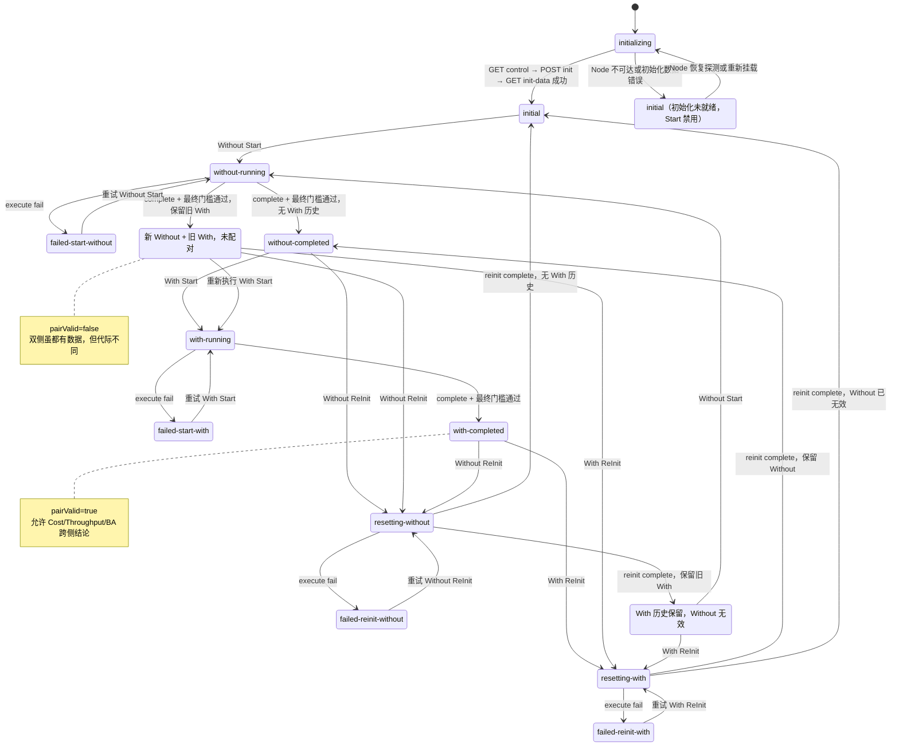
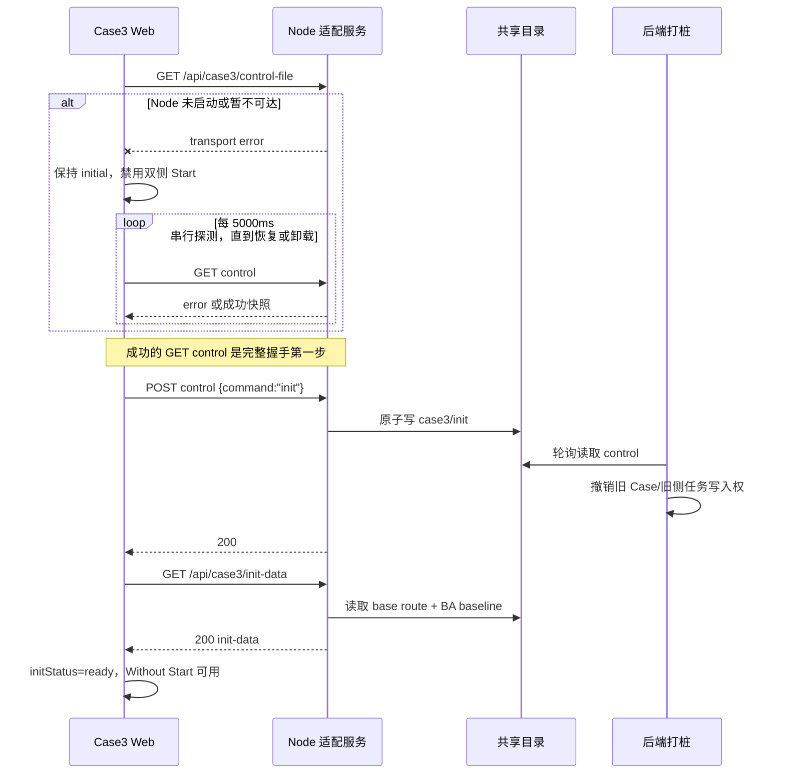
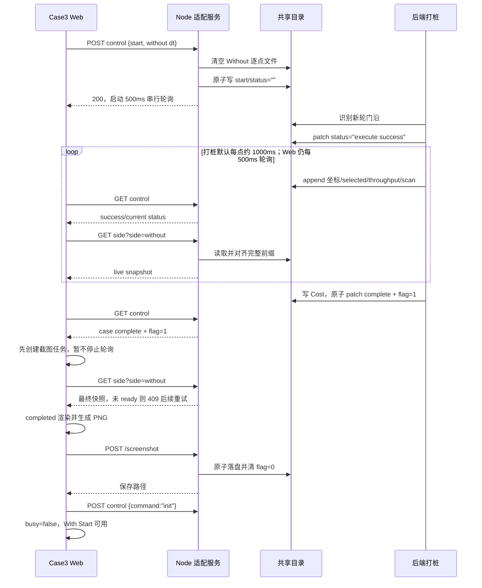
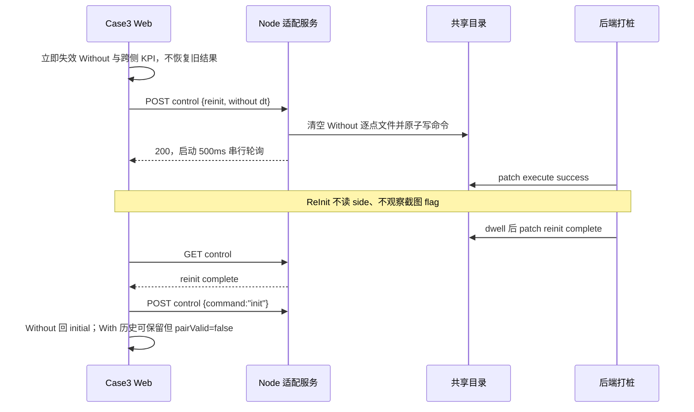
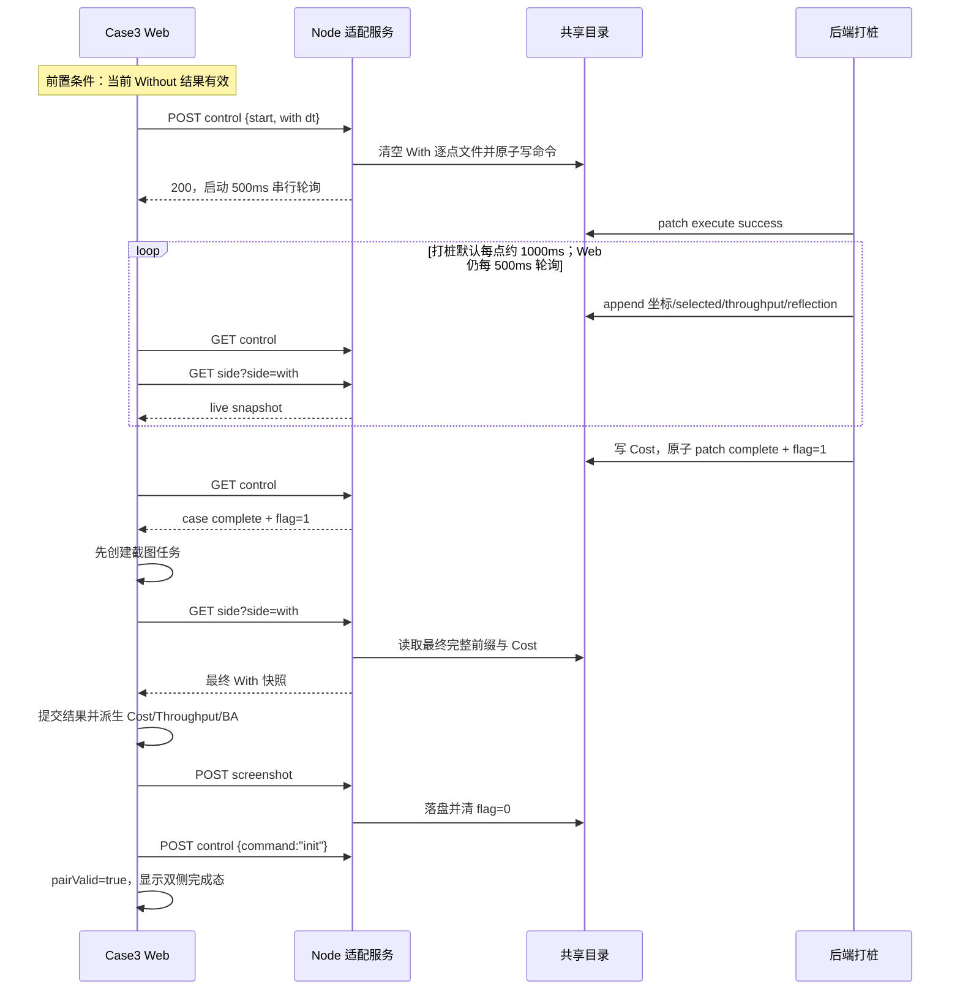
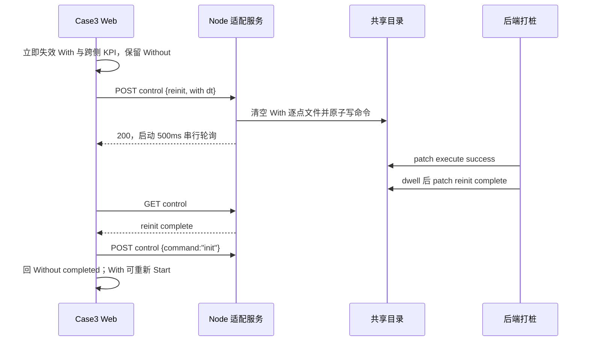

# case3 Web 施工规格

> status: `IMPLEMENTED_LOCAL`
>
> 使用者：正式 React Web 实现 agent。
>
> 唯一业务契约：[API-CONTRACT.md](API-CONTRACT.md)。视觉契约：`03-design/case3/case3-dt-com.pen` 与 `03-design/case3/Frontend_Spec.md`。本文只把已冻结语义落成施工图，不重新定义后端字段。

## 0. 出口条件

- [x] Case3 在现有 `code/web/` 应用内实现，不创建第二套 Shell、Vite 应用或独立端口。
- [x] 进入/刷新/切回固定执行 `GET control → POST init → GET init-data`；不恢复历史结果。
- [x] Without → With 顺序、双侧 Start/ReInit 互斥、失败后的同动作重试与契约一致。
- [x] 500ms 串行业务轮询不会重叠；初始化阶段 Node 不可达时按独立的 5000ms 探测节奏持续恢复。
- [x] `case complete` 后最终快照满足完整门槛才进入 completed；截图保存/放弃收尾后才 POST init。
- [x] Case3 截图与 Case2 同构：Start 等待态观察 0→1，同拍 complete 不漏拍，最多 3 次，ReInit 不截图。
- [x] Shell 在 Case2 或 Case3 任一 Start/ReInit 等待期间锁定其他 Tab。
- [x] 地图、波束、点位窗口、Cost、Throughput、Beam Accuracy 使用运行时数据；不写死静态代表值。
- [x] Reflection 是 With 响应必需 shape，v1 不渲染 Reflection/LOS。
- [x] `npm test`、`npm run typecheck`、`npm run build`、Case2 回归和 Case3 Playwright 主线通过。Playwright 须以 `--workers=1` 串行运行；Case3 现有 Playwright 为前端隔离主线，三进程 E2E 另行补证据。


## 1. 施工方案与边界

采用现有单应用、case-local 扩展：

```text
code/web/
├── assets/
│   ├── shell/
│   ├── case2/
│   └── case3/                  # 正式 bundle 唯一 Case3 资源入口
├── src/
│   ├── app/App.tsx             # 挂载 Case3；汇总当前 Case busy
│   ├── shell/Shell.tsx         # 只新增跨 Case 导航锁
│   └── cases/
│       ├── case2/              # 保持现有行为；只补 busy 回调
│       └── case3/
│           ├── Case3Page.tsx
│           ├── case3.css
│           ├── types.ts
│           ├── config/case3RuntimeConfig.ts
│           ├── api/case3Api.ts
│           ├── hooks/useCase3Controller.ts
│           ├── state/case3Reducer.ts
│           ├── metrics/case3Metrics.ts
│           ├── metrics/mapProjection.ts
│           └── components/
│               ├── PanelHeader.tsx          # 测试对比标题 + 现场环境入口
│               ├── SidePanel.tsx            # 含 SideHeader / StatusBadge / Start/ReInit
│               ├── MapStage.tsx
│               ├── map/MapRenderer2D.tsx
│               ├── BeamScanCard.tsx
│               ├── PointProgressWindow.tsx
│               ├── CostCard.tsx
│               ├── ThroughputChart.tsx
│               └── BeamAccuracyCard.tsx
├── test/case3/
└── e2e/case3-mainline.spec.ts
```

组件可内联拆分，但页面结构须对齐 `Frontend_Spec`：`Case3Page → PanelHeader + SidePair(SidePanel×2) + KpiComparePanel`。

明确不采用：

- 不新建 Case3 专用 Web 应用或第二个 Shell。
- 不先做“大一统 Case 框架”；只抽取 Case2/Case3 确实共用的 busy 上报与截图原语。API 前缀各自写死，不抽共享 API URL 配置。
- 不把 Case3 reducer、数据、轮询或图表状态放进 Shell/global context。


## 2. 配置、资源和命令


### 2.1 Web 配置

`code/web/.env` 是 Case2/Case3 共用的 Vite 配置文件，必须按 Case 分块；Case3 不复用或改写 `VITE_CASE2_*`。Vite 在启动/构建时读取这些值，修改后必须重启 dev server 或重新 build。

Case3 单独配置：

| `.env` 配置 | 默认值 | 规则 |
| --- | --- | --- |
| `VITE_CASE3_POLL_MS` | `500` | Start/ReInit 期间的串行业务轮询间隔，十进制正安全整数；非法配置启动失败。 |
| `VITE_CASE3_MAP_ORIGIN_X` | `905` | `ue_comm_map.png` 标定原点 X，必须是有限数。 |
| `VITE_CASE3_MAP_ORIGIN_Y` | `445` | `ue_comm_map.png` 标定原点 Y，必须是有限数。 |
| `VITE_CASE3_MAP_UNITS_PER_PX` | `0.11` | 1 px 对应的业务坐标单位，必须是有限正数；文件 x/y 到图片 XY 时交换轴。 |

现有 Case2 专属项继续只服务 Case2，不得因 Case3 施工改名或共用：

- `VITE_CASE2_POLL_MS`
- `VITE_CASE2_HEATMAP_X0` / `VITE_CASE2_HEATMAP_Y0`
- `VITE_CASE2_HEATMAP_X1` / `VITE_CASE2_HEATMAP_Y1`
- `VITE_CASE2_HEATMAP_CELL` / `VITE_CASE2_HEATMAP_GAP` / `VITE_CASE2_HEATMAP_ALPHA`
- `VITE_CASE2_CDF_POINT_CAP`

以下内容故意不进入 `.env`：

- Case2 / Case3 API 前缀分别写死为同源 `/api/case2`、`/api/case3`（各自 `*Api.ts` 常量）；不引入 `VITE_CASE2_API_BASE` / `VITE_CASE3_API_BASE`。同机适配 + Vite `/api` 代理已覆盖开发与部署，不得在组件散落 `3102`。
- 初始化 Node 不可达时的恢复探测固定为 `5000ms`，与 Case2 的 `ADAPTER_RECOVERY_PROBE_MS` 同机制；它不是业务轮询，也不跟随 `VITE_CASE3_POLL_MS`。
- 截图 `pixelRatio=2`、点位窗口 `20`、地图视图缩放/旋转边界属于冻结 UI 行为，保留为有名称的代码常量。
- 当前只有 2D 地图，不预埋 `VITE_CASE3_MAP_MODE`、3D 模型 URL、相机或灯光参数；待真实模型与坐标系冻结后再增加。

所有 Case3 Vite 值由 `config/case3RuntimeConfig.ts` 一次解析并导出；组件不得直接读 `import.meta.env`。配置项一旦显式提供但非法，启动时给出键名和值并失败，不静默 fallback 或 clamp。

开发期继续由 Vite `/api` 代理到同一个 Node 适配服务。`DT_ADAPTER_HOST` / `DT_ADAPTER_PORT` 是 Vite/Node 进程环境变量，不写成 `VITE_*`、不暴露给浏览器；它们作为项目级主变量，旧 `CASE2_ADAPTER_HOST` / `CASE2_ADAPTER_PORT` 仅作 fallback。

### 2.2 三轨资源

1. 设计证据：`03-design/case3/`，只用于评审。
2. Gate 1.5：`web-static/case3/`，只用于人工视觉对照。
3. 正式资源：先落入 `04-runtime-assets/case3/` 并登记清单，再复制到 `code/web/assets/case3/`；正式 bundle 只 import `code/web/assets/case3/`。

Gate 4 至少准备：

- `ue_comm_map.png`
- 页面/上下区/侧面板背景
- BS、UE、Without/With、Cost/Throughput、正确/错误图标
- 波束卡和 Beam Accuracy 装饰资源

禁止正式代码 import/alias 到 `02-ux/`、`03-design/`、`04-runtime-assets/` 或 `web-static/`。

### 2.3 命令


| 命令                  | 预期                                |
| ------------------- | --------------------------------- |
| `npm run dev`       | 现有四 Tab Web，Case2/Case3 均由同一应用提供。 |
| `npm test`          | Case2 + Case3 Vitest。             |
| `npm run typecheck` | 无 TypeScript 错误。                  |
| `npm run build`     | 正式 bundle 成功，资源自包含。               |
| `npm run test:e2e`  | Case2 和 Case3 Playwright。         |


## 3. 类型、状态权属与可见态


### 3.1 REST 类型

直接按契约定义：

```ts
type Case3Side = "without" | "with";

type BaseRoutePoint = {
  no: number;
  x: number;
  y: number;
  z: number;
};

type Case3Point = {
  no: number;
  ue: { x: number; y: number; z: number };
  selectedBeamId: number; // -1 为本点波束异常；正常值 0-255
  scanBeamIds?: number[]; // Without；任一元素为 -1 时整点波束异常
  reflection?: { x: number; y: number; z: number; los: boolean };
};

type SideSnapshot = {
  side: Case3Side;
  points: Case3Point[];
  completeCount: number;
  pendingTail: boolean;
  costPct: number | null;
};
```

Without 的 `scanBeamIds` 必需、With 的 `reflection` 必需属于响应 shape；Web 检查存在性和 JSON 类型，但不重复 Node 的范围、精度、行号、列数、互异或包含关系校验。

### 3.2 reducer 状态

```ts
type ActionKind = "start" | "reinit";

type ActiveAction = {
  kind: ActionKind;
  side: Case3Side;
  seenExecuteSuccess: boolean;
  generation: number;
};

type Failure = {
  kind: ActionKind;
  side: Case3Side;
} | null;

type Case3State = {
  initStatus: "loading" | "ready" | "error";
  baseRoute: BaseRoutePoint[];
  baseline: { success: number; total: number } | null;
  results: { without: SideSnapshot | null; with: SideSnapshot | null };
  live: { without: SideSnapshot | null; with: SideSnapshot | null };
  pairValid: boolean;
  activeAction: ActiveAction | null;
  failure: Failure;
  adapterError: boolean;
  generation: number;
};
```

`generation` 只用于本挂载内丢弃旧响应，不写入共享文件，也不是 backend command id。

### 3.3 派生可见态


| 条件                              | 可见态                                            |
| ------------------------------- | ---------------------------------------------- |
| 无 action/failure；双侧无结果          | `initial`                                      |
| Start + without                 | `without-running`                              |
| Start + with                    | `with-running`                                 |
| ReInit + without                | `resetting-without`                            |
| ReInit + with                   | `resetting-with`                               |
| failure start/reinit            | `failed-start-{side}` / `failed-reinit-{side}` |
| 无 action；仅 Without 有效           | `without-completed`                            |
| 无 action；Without + 当前配对 With 有效 | `with-completed`                               |
| 无 action；新 Without 有效、仅保留旧 With | `without-completed` + With 历史面板；`pairValid=false`，不显示跨侧结论 |
| 无 action；Without 无效、仅保留 With 历史 | initial 控制骨架 + With completed 历史面板；标记未配对，不显示跨侧结论 |


结果不写 localStorage/sessionStorage。刷新、重新挂载或切回一律丢弃。

### 3.4 状态切换图



`initializing` 与 `InitialBlocked` 都复用 initial 视觉骨架，后者只增加 Start 禁用和结构化错误日志，不新增一套 Gate 1 页面。图只表示 Web 可见业务态；5000ms adapter 恢复探测、500ms 业务轮询、截图 `saving/waitClear` 是正交子状态，分别由 controller/截图机管理，不再塞进同一个大枚举。

### 3.5 `pairValid` 决策

含义：`pairValid` 表示“当前 With 结果是在**当前仍有效的 Without 结果之后**完成的，因此两侧允许形成一组对比”，不是后端结果是否完整、接口是否成功，也不是 backend batch id。

必要性：在当前“另一侧历史结果可以保留”的规则下，**配对有效性这个概念必须存在**。例如：

1. Without-A 完成；
2. With-A 完成，此时两侧同代，`pairValid=true`；
3. ReInit Without-A，旧 With-A 仍可保留；
4. Without-B 完成，此时 `results.without` 和 `results.with` 都非空，但它们分别是 B/A，不能计算开销变化、双侧吞吐对比或当前轮 Beam Accuracy，必须保持 `pairValid=false`；
5. With-B 完成后才重新置 `pairValid=true`。

因此不能用 `Boolean(results.without && results.with)` 替代。只有删除“保留另一侧历史结果”规则、在 Without 失效时同时清掉 With，才可以移除该字段并由双侧结果是否存在直接派生；这会改变当前已冻结展示行为，本版不采用。

v1 保留 `pairValid:boolean`，因为当前单挂载、单活动动作、无缓存恢复，布尔 latch 是最小实现。更新规则必须只在 reducer 内发生：

- 初始、刷新或重新挂载为 false；
- 任一 Start/ReInit 在 POST 前立即置 false，POST/execute 失败也不恢复；
- Without 完成永远不能单独置 true；
- 只有当前 generation 的 With 最终快照提交成功，且当前 Without 仍有效时置 true；
- `pairValid=false` 时，所有跨侧派生输出必须失效：Cost 变化为 `--`、Throughput 不绘制双侧对比结论、Beam Accuracy 回文件基线；单侧历史面板可以保留并标记未配对。例外仅是当前 With Start 的实时单侧吞吐：吞吐快照一到即可显示，不等待独立的 With `/side` 快照；这不恢复旧 With 吞吐，也不构成跨侧配对结论。非运行态 With 吞吐仍服从现有配对/历史 lineage 可见规则。

若未来增加页面恢复、后台常驻或多轮缓存，布尔值证据不足，应升级为 Web 本地 lineage（如 `withoutGeneration` + `withBasedOnWithoutGeneration`）后再派生 `pairValid`；不得把当前布尔值误扩展为后端轮次标识。

## 4. Shell 与跨 Case 导航锁

`App` 持有的只能是 Shell 级信号：

```ts
type CaseBusy = { caseId: CaseTabId; busy: boolean };
```

- `Case3Page` 在 Start/ReInit POST 发起前置 busy，动作完成、失败或 POST 回退后解除。
- `Case2Page` 对现有 `calibrating/resetting` 同样上报 busy；不得把 Case2 reducer 移入 Shell。
- `Shell` 接收 `navigationLocked`。锁定时所有非当前 Tab 按钮 `disabled`，`onTabChange` 还要二次 guard。
- completed、failed 或 idle 不锁 Tab；截图收尾仍属于当前 Start 动作收尾，未清 flag 前保持锁定。
- Shell 继续拥有现场环境弹窗组件与开闭状态；切 Tab 时关闭。
- Case3 `PanelHeader` 的「现场环境」按钮只向 Shell 发打开请求（例如 `onOpenSiteEnv`），不在 Case3 内复制弹层 DOM/状态。

Node 仍会返回 `CONTROL_BUSY`，Shell 锁不是唯一安全边界。

## 5. 进入、刷新与卸载


### 5.1 串行门闩

每次 Case3 挂载先执行一次完整握手：

```text
GET /api/case3/control-file
  -> 成功后 POST /api/case3/control-file {"command":"init"}
  -> 成功后 GET /api/case3/init-data
  -> baseRoute 非空且 baseline shape 有效
  -> initStatus=ready
```

- React StrictMode 必须有 mount generation/一次性门闩，不能双 POST init。
- Node 未启动、连接拒绝、超时或控制 GET/POST 暂时不可达时：保持 initial，双侧 Start 禁用，`adapterError=true`，输出 endpoint/code/reason；首次等待 5000ms，随后每 5000ms 串行探测，直到连接恢复或组件卸载，不设总次数上限。
- 恢复探测只以 `GET control` 唤醒；一旦成功，必须重新执行完整的 `GET control → POST init → GET init-data`，不能从上次失败步骤中段续跑。若完整握手中仍是 transport 错误，继续下一轮 5000ms 探测。
- 探测使用一个 `setTimeout` 串行调度，不用 `setInterval`，不得与上次请求重叠；卸载时 abort 当前请求并清 timer。
- 控制链路恢复后若 `GET init-data` 返回 `INIT_DATA_MISSING`、`INIT_DATA_INVALID` 或非法成功 shape，这是初始化数据错误而非“Node 未启动”：`initStatus=error`，记录 `console.error`，停止 5000ms adapter 探测。刷新或重新进入 Case3 才重跑完整初始化。
- init-data 失败输出 `console.error("[case3] entry.init_data_fail", {...})`，
  字段至少包含 `generation/source/endpoint/code/reason`。
- 不从历史 `case complete`、`execute fail` 或现有文件恢复结果。

5000ms 恢复探测和 500ms Start/ReInit 业务轮询是两个独立 timer：前者只存在于 initial adapter error，后者只存在于 active action，二者不能同时运行。

### 5.1.1 浏览器结构化诊断日志

Case3 成功路径和异常路径都必须能在浏览器控制台对表。统一事件前缀为
`[case3]`，正常生命周期用 `console.info`，可恢复异常/重试用
`console.warn`，业务失败或动作失败用 `console.error`。

每轮动作日志统一带 `generation`、`kind`、`side`；控制快照只记录
`case/command/dtType/status/savePictureFlag` 摘要，不输出未知字段。禁止记录完整
points、route、scanBeamIds、坐标数组或截图 Base64。

最低事件集：

| 环节 | 必须记录的事件 |
|---|---|
| 进页 | `entry.begin`、`entry.control_ok`、`entry.init_reset_ok`、`entry.init_data_ok`、`entry.cleanup` |
| 适配恢复 | `adapter_probe.start`、`adapter_probe.recovered`；探测失败不得每 5000ms 重复刷屏 |
| 命令 | `command.start_click/ok/fail`、`command.reinit_click/ok/fail`、`command.control_busy` |
| 轮询 | `poll.start`、`poll.status_edge`、`poll.stop`；相同 status 的 500ms 快照不得重复打印边沿 |
| 实时结果 | `side.live_progress`、`side.final_fetch_begin`、`side.final_ready/not_ready/fail`、`round.completed_rendered` |
| 截图 | `screenshot.requested`、`capture_begin/ok`、`upload_ok/confirmed`、`retry`、`flag_cleared`、`dropped` |
| 收尾 | `completion.init_begin/ok/fail`、`reinit.ui_applied` |

`side.live_progress` 只在 `completeCount` 变化时判断，并默认采样第
1、2、每 5 个点以及 base route 最终点。字段至少包括
`points/completeCount/lastPointNo/pendingTail/costPct`。最终读取持续
`RESULT_NOT_READY` 时，也只在完整性摘要变化时重复输出。

`screenshot.upload_ok` 必须记录 `attempt/path/seq/toPngMs/uploadMs/totalMs`，
用于区分 Without/With、轮次和实际落盘文件。ReInit 完成后的
`reinit.ui_applied` 记录目标侧、保留侧及保留点数，支持检查独立重置没有误清另一侧。


### 5.2 卸载

- abort 所有 fetch、清轮询 timer、增加 generation。
- `pagehide` 可用 `keepalive` 尽力 POST init；正确性不依赖它成功。
- 等待态被 Shell 锁定，正常 Tab 点击不会中途卸载；浏览器刷新/关闭仍由下次 mount init 撤销旧写入权。


## 6. 动作、轮询与完成门槛


### 6.1 Start

Without Start 条件：

- 初始化 ready；
- 无活动动作；
- Without 当前结果无效；
- 若来自失败态，只能是 `failed-start-without`。

With Start 额外要求当前 Without 结果有效。步骤：

1. busy=true，增加 generation，目标侧旧 result/live 立即失效，清全部跨侧派生 KPI。
2. 另一侧历史结果可以保留，但在重新配对前不用于对比结论。
3. POST 精确 payload：

```json
{
  "case": "case3",
  "command": "start",
  "dt_type": "without dt"
}
```

4. POST 成功才启动轮询；失败时 `adapterError=true`、busy=false、不自动重发。步骤 1 已失效的目标侧旧结果不得恢复。收到 `CONTROL_BUSY` 时保持当前态，不发第二命令。
5. 轮询启动时 `seenExecuteSuccess=false`，截图上一 flag 视为 `0`。


### 6.2 串行轮询

只在 active action 存在时运行；每轮完成后用 `setTimeout` 排下一轮，不用可能重叠的 `setInterval`。

轮询间隔默认 500ms；契约要求后端让 `execute success` 保持至少 3000ms。Web 仍以 seen latch 判定时序，不能因 dwell 约束而省略 success 观察。

Start 轮：

1. GET control。
2. 先把 `save_picture_flag` 交给截图机。
3. `execute success`：置 seen latch。
4. 已 seen success 后，GET 当前 `/side` 全量快照；成功则替换 `live[side]`。
5. `case complete` 且 seen：执行最终 GET side；只有契约完整门槛全部通过才提交 result。
6. `execute fail`：丢目标侧半轮 live/result，进入 failed-start-side，busy=false；本轮不得再认 complete。

ReInit 轮只 GET control，不 GET side。

未知 status：结构化日志，保持动作和轮询；不新建 unknown phase。

### 6.3 最终快照

进入 completed 前必须同时满足：

- 当前 action 是目标侧 Start；
- 已见 success，随后见 complete；
- `ok=true`、side 匹配；
- `pendingTail=false`；
- `points.length>0`；
- `completeCount===points.length`；
- `costPct!==null`。

不满足时保持 running，继续轮询，不 POST init。若 Node 返回 HTTP `RESULT_NOT_READY`，或 Web 本地门槛未过，均记结构化诊断日志（Web 侧日志码可用 `CASE3_RESULT_NOT_READY`，与 HTTP `error.code` 区分，勿混用）。

**失败出口**：`case complete` 后最终快照连续不过关达到 `CASE3_FINAL_NOT_READY_MAX_ATTEMPTS`（默认 10，含 local-gate / `RESULT_NOT_READY` / 其它最终 GET 失败）时，进入该侧 `failed-start`，徽标「结果不完整已自动回退」，丢弃本侧半轮 live、busy=false，并 best-effort POST `init` 撤权（避免控制停在 `case complete` 导致下一轮 `CONTROL_BUSY`）。不提交残缺 completed 结果。

满足时：

1. 原子提交目标侧 result，清 live，计算可用派生 KPI。
2. React 至少完成一次对应 completed 渲染。
3. 若截图任务已启动，等待保存成功或三次失败后的放弃清零；若没有截图请求，不等待虚构事件。
4. POST init；失败只记录 adapter error，不撤销已完成结果。
5. busy=false，停止业务轮询。

同拍 `case complete + flag=1` 时，步骤顺序必须是“先创建截图任务，再提交完成结果”。

### 6.4 ReInit

1. 仅目标侧有结果，或处于同侧 `failed-reinit` 时可点。
2. 点击立即使目标侧 result/live 和全部跨侧派生 KPI 失效；不恢复旧结果。
3. busy=true，POST `{case:"case3",command:"reinit",dt_type:"<side> dt"}`。
4. POST 成功后轮询；success 只置 latch。POST 失败也不恢复步骤 2 已失效的旧结果；保留同侧 ReInit 重试入口并记录 adapter error。
5. seen success 后见 `reinit complete`：只清本地目标侧 result/live（及已失效的跨侧派生），不额外 GET `/side` 去“确认文件为空”；然后 POST init，busy=false。
6. `execute fail`：进入 `failed-reinit-{side}`，只开放同侧 ReInit 重试；另一侧历史结果保留。
7. ReInit 不观察截图 flag、不截图。


## 7. 典型时序

图中“后端打桩”代表 `realback_no.md` 的本地模拟后端；接真实后端时，Web/Node 调用和文件协议不变，只替换该参与者。

### 7.1 Case3 界面初始化与 Node 晚启动恢复



若最后一步返回初始化文件缺失/非法，Web 进入初始化错误并停止 adapter 恢复探测；这不是 Node 连接故障。

### 7.2 Without DT 执行



### 7.3 Without DT 重置



### 7.4 With DT 执行



### 7.5 With DT 重置




## 8. API 客户端与信任边界

`case3Api.ts` 提供：

- API 前缀常量写死为 `/api/case3`（不读 env）
- `getControl(signal)`
- `postControl(payload, signal, { keepalive? })`
- `getInitData(signal)`
- `getSide(side, signal)`
- `postScreenshot(imageBase64, signal)`

所有 GET `cache:"no-store"`，所有响应先检查：

- HTTP、JSON 对象、`ok`；
- 必填对象/数组/字段是否存在；
- JSON 类型是否正确；
- side 与请求一致；
- Without/With 的条件必填字段。

非法响应统一抛 `Case3ApiError("CASE3_INVALID_RESPONSE", ...)`，整包丢弃。Web 不做：

- 小数四舍五入；
- `0～100`、`0～255` 或 scan 包含 selected 的业务复验；
- 多文件行数对齐；
- 文件路径推断。


## 9. 可视化施工

### 9.0 冻结文案与页面结构

视觉与交互以 Pencil + `Frontend_Spec` + 已接受 `web-static/case3/` 为准。正式 Web 禁止把代表态数字/折线当运行数据，但下列文案必须冻结：

| 位置 | 冻结文案 |
| --- | --- |
| 上区标题 | `测试对比` |
| 上区入口 | `现场环境`（只打开 Shell 弹窗） |
| 侧栏 | Without / With 侧标签按设计；StatusBadge 跟随可见态 |
| 波束卡标题 | `BS波束`；点位行 `点位{no}` |
| 点位进度标题 | `点位进度`（不把 N 或“20”写进标题） |
| Cost 标题 | `开销(%)`；中间 `开销变化`；左右图例 `无 DT` / `有 DT` |
| Throughput 图例 | `无 DT` / `有 DT` |
| BA 标题 | `波束预测准确率`；状态徽章 `正常`；次数标签 `正确次数` / `错误次数` |

`Case3Page` 布局骨架：

```text
Case3Page (.case3-page)
├── PanelHeader（测试对比 / 现场环境 → Shell）
├── SidePair
│   ├── SidePanel without（SideHeader + MapStage + BeamScanCard + PointProgressWindow）
│   └── SidePanel with（同上）
└── KpiComparePanel（CostCard + ThroughputChart + BeamAccuracyCard）
```

CSS 必须以 `.case3-page` 根作用域或 CSS Modules 隔离；禁止裸 `.metric-card`、`.panel-title` 等跨 case 类名。

### 9.1 MapStage

- 每侧 `MapStage` 固定为 Pencil 的约 891×452 视觉区，`overflow:hidden`；Case3 不提供全屏入口或 lightbox。
- 内部必须拆成同一变换层与固定浮层：

```text
MapStage（接收鼠标事件、裁切）
├── MapTransformLayer（唯一 transform）
│   ├── MapImage
│   └── RouteSvg（baseRoute、live 轨迹、UE/当前点）
├── BeamScanCard（固定浮层，不随地图变换）
├── PointProgressWindow（固定浮层，不随地图变换）
└── ResetViewButton（变换非 identity 时可见）
```

- 地图图片与轨迹/点/标记必须放在**同一个** `MapTransformLayer`，一次性应用 `translate → rotate → scale`。禁止分别计算两个 transform，否则旋转/缩放/移动后会错位。
- 推荐 MapImage + RouteSvg 共用原图坐标系；RouteSvg `viewBox` 与解码后的 `ue_comm_map.png` 尺寸一致。图片在同一层中铺满，所有业务坐标先转为地图原图像素。
- 解码后校验地图尺寸与标定匹配；不匹配时明确配置错误，不静默拉伸错位。
- 文件坐标映射到地图原图像素（必须读 `case3RuntimeConfig`，禁止把默认标定写死进公式）：

```text
mapPixelX = MAP_ORIGIN_X + y / MAP_UNITS_PER_PX
mapPixelY = MAP_ORIGIN_Y + x / MAP_UNITS_PER_PX
```

  默认标定仅为 `905 / 445 / 0.11`；改 `.env` 后须重启/重建，并以配置值参与断言与运行映射。

- 再按图片在 MapStage 内的等比缩放和居中偏移转换到 overlay。
- base route 为虚线；历史 live 点与当前点样式按冻结设计；z 不参与 2D 映射。
- Without/With 各自维护独立的本地视图状态：

```ts
type MapView = {
  scale: number;       // 0.5～5
  rotation: number;    // -90～90 度
  offsetX: number;     // Stage 逻辑 px
  offsetY: number;
};
```

- 鼠标滚轮：`passive:false` 并 `preventDefault()`；每档倍率与 Case2 相同为 1.1/1.1⁻¹，限制 0.5×～5×，以鼠标指针为缩放中心修正 offset。
- 左键拖动：水平拖过当前 MapStage 宽度对应约 90°，限制 ±90°；使用 pointer capture。
- 右键拖动：平移；阻止 `contextmenu`；使用 pointer capture。
- 1920×1080 Stage 被 Shell 缩放后，pointer delta 必须除以 `stage.getBoundingClientRect().width / 1920`，保证不同窗口下手感一致。
- `ResetViewButton` 使用现有 rotate-ccw 图标，将四个值恢复 identity；不新增全屏按钮。变换在同一次 Case3 挂载内跨数据更新、Start/ReInit 保留，刷新/卸载后重置。
- MapStage 使用 `touch-action:none`、`user-select:none`；只支持上述桌面鼠标主路径，不追加触摸手势。
- 截图必须保留用户当前地图变换；SVG/DOM 无需 Canvas clone。若实现 agent改用 Canvas，才进入截图 clone hook。

### 9.2 为后续 Three.js 3D 模型保留的边界

当前 Gate 4 仍只实现 2D 图片，不能因为未来规划提前引入 `three` 依赖或放一个未验收的空 3D 开关。但以下边界现在必须做好，避免未来替换时改 reducer、业务状态机和整个截图链路：

```text
MapStage（业务容器、固定浮层、renderer 生命周期）
├── MapRenderer2D（当前：图片 + SVG 轨迹，同层变换）
│   └── 未来可替换为 MapRenderer3D（Three.js scene）
├── BeamScanCard
├── PointProgressWindow
└── ResetViewButton
```

- `MapStage` 只把 `baseRoute`、当前侧 points、active point 和 side 传给 renderer；业务 reducer 始终保存后端原始 `(x,y,z)`，不得保存图片像素、Three.js `Vector3`、camera 或 scene 对象。
- 当前 2D 映射集中在 `mapProjection.ts`，导出纯函数 `projectPointToMap2D`；未来真实模型坐标冻结后新增独立的 `modelProjection.ts`，不得悄悄复用 `x/y` 交换和 `0.11` 比例。
- `MapView` 只属于 `MapRenderer2D` 本地状态，不进入 Case3 reducer。未来 3D renderer 自己拥有 camera/controls 状态，避免为了兼容 2D 的 `rotation`/`offset` 结构限制 3D 轨道相机。
- renderer 对外只预留最小句柄：

```ts
type MapRendererHandle = {
  resetView(): void;
  prepareCapture(): Promise<void>;
};
```

  当前 2D 的 `prepareCapture()` 在图片/SVG ready 后立即完成；未来 3D 必须在当前 camera 下完成一帧 WebGL render 后再完成。RAF、controls、geometry、material、texture 和 WebGL context 的释放属于 renderer 自身卸载职责，不泄漏到 controller。
- 鼠标语义保持“滚轮缩放、左键旋转、右键移动、复位”，但 3D 的 up 轴、旋转中心、相机初始位、缩放范围和移动平面必须等真实模型后单独冻结；当前 2D 的 ±90° 和 0.5～5×不能直接宣称为 3D 参数。
- `BeamScanCard`、`PointProgressWindow` 等 DOM 浮层继续由 `MapStage` 管理，永远不放进 Three.js scene，因此未来替换 renderer 不改变浮层位置或业务组件。
- 截图调度器统一先 await `prepareCapture()`。未来 WebGL canvas 还必须在 `html-to-image` clone hook 中复制源 canvas 像素，或采用经实测等价的捕获方案；不得仅依赖默认 DOM clone。验收必须包含“当前交互视角、轨迹和模型均非空”的 PNG。
- 未来模型建议使用运行时本地 `GLB/GLTF`，按三轨资源规则进入 `code/web/assets/case3/models/`；不允许运行时请求设计目录或外部 CDN。

进入 3D 施工前必须做一个小冻结：模型文件与压缩方式、坐标单位/原点/轴向、路线贴地或高度规则、相机与灯光、加载失败降级、模型体积和首屏加载预算、WebGL 截图证据。没有这些事实前，不往 `.env` 填模型路径或相机“猜测值”。


### 9.3 BeamScanCard

- 单 Canvas/SVG 程序化画 16×16 网格；beam id 0～255 按行优先定位。
- Without：正常点 `scanBeamIds` 白色，`selectedBeamId` 蓝色最优；selected 为 -1 或扫描行含 -1 时 BeamID 显示 NA 且整张矩阵不绘制色块。
- With：正常点 `selectedBeamId` 绿色；按相同 `no` 与 Without result 比较显示预测成功/失败图例。With selected 为 -1 时显示 NA、不画预测波；点位坐标和轨迹保留。
- 任一侧波束异常时，该点对比状态显示 NA，不显示预测成功/失败；另一侧正常波束仍按本侧数据展示。
- 视觉尺寸、颜色、图例和浮层位置以 Pencil 双侧 238×331 卡片及 `web-static/case3/` 为准。
- 禁止创建 256 个 Pencil ellipse 对应的 React 叶子节点。


### 9.4 PointProgressWindow

- 标题固定 `点位进度`。
- 唯一窗口算法：`visiblePoints = points.slice(-20)`；20 是可视槽数，不是 N 上限。
- `N<=20` 时按 `no` 升序从左到右显示已有点，其余为空槽。
- `N>20` 时每个新点到达后整体滑动，例如 `1..20 → 2..21 → 3..22`，默认始终展示最新 20 个真实点。
- 超过 20 点后，鼠标在槽条上左右拖动可把窗口移回更早点号（右拖看 P1）；拖到最新窗口则恢复自动跟随。可视槽数仍是 20，不改成整条滚动条。
- 已填槽标签显示真实业务编号 `P${point.no}`；Pencil/静态页的 P1～P20 是首窗代表态，不得在第 21 点后继续假装为全局 P1～P20。
- Without 显示该点 `selectedBeamId`；无数据或波束异常时显示 `NA`（不依赖有 DT 是否已有同 `no`）。
- With 在有 Without 同 `no` 且两侧波束均有效时显示预测正确/错误图标；缺对照或任一侧异常时显示 `NA`，且不计入 Beam Accuracy。
- 无路线号的垫槽保持空圆，补足到 20 个，但不伪造业务 no 或数值。
- 组件 key 使用 `point.no`，不能用窗口数组 index；窗口更新只移动视觉项，不改变 result 数据。


### 9.5 KPI

统一技术决策：Cost、Throughput、Beam Accuracy 均使用 React + 原生 SVG/DOM，不引入 ECharts。

理由：

- 当前只有一个双折线图和两个固定仪表，ECharts 会增加无必要依赖、初始化和 resize 生命周期。
- Pencil 与已接受静态页已有可直接复用的 SVG geometry、层次、颜色和尺寸。
- 原生 SVG 会被 `html-to-image` 直接捕获，不需要额外 Canvas 像素复制，截图风险更低。

#### 9.5.1 CostCard

- 卡片保持 600×303，结构对齐 Pencil `开销卡片/d4cqo` 与静态 `.case3-cost-*`；标题文案仅 `开销(%)`。
- 左右各用原生 SVG 半环：`viewBox="0 0 132 132"`、半径 58、圆头；左侧镜像白色渐变，右侧紫色渐变。
- 可用 `pathLength="100"`：`strokeDasharray=100`，`strokeDashoffset=100-costPct`。`costPct=null` 时只显示底轨，值为 `--`。
- 数值统一一位小数并带 `%`；Node 已保证 0～100，Web 不再钳制或四舍五入业务值。
- 中间「开销变化」按契约在 `metrics/case3Metrics.ts` 计算并显示一位小数（仅 `pairValid=true` 且双侧 Cost 有效），公式为 `(withCostPct - withoutCostPct) / withoutCostPct * 100`：
  - 正数：红色向上箭头 + `X%`，表示有 DT 相对无 DT 开销增加；
  - 负数：绿色向下箭头 + `-X%`，表示开销减少；
  - 0：中性颜色，无方向箭头；
  - 任一 Cost 缺失或 Without=0：`--`，隐藏箭头。
- 环进度只做约 250ms CSS transition，不用 JS 逐帧动画。

#### 9.5.2 ThroughputChart

- 使用一个原生 `<svg>`，外框 596×242；绘图区对齐 Pencil 的约 540×202，保留弱网格、坐标刻度和顶部图例。
- 两系列按独立吞吐快照的样点序号 `no` 升序折线；吞吐曲线不从结构点读取：
  - 无 DT：`#6B7280`，线宽 2.5，点直径 6；
  - 有 DT：`#22D3EE`，线宽 2.5，点直径 6。
- 当前 With Start 期间，独立 With 吞吐快照一到就可显示实时曲线，不要求 With `/side` 结构/KPI 快照先到。完成态及历史态仍按 With side KPI 的配对/历史 lineage 资格决定是否展示，防止旧 With 吞吐跟随新 Without 结果误显。
- 使用折线/polyline，不做 spline 平滑，避免产生不存在的吞吐峰值；缺点断开，不补 0。
- X 域覆盖完整 `baseRoute` 与双侧当前可见吞吐样点号的并集；若吞吐样点超出结构路线则扩展横轴，绘制全部 N 个吞吐数据点。刻度最多 20 个，N>20 时只抽稀刻度/竖网格，不丢曲线数据。
- Y 域从 0 开始，`yMax = max(10, niceCeil(maxThroughput × 1.1))`；超过 10 自动扩展，禁止裁剪。无数据时保留 0～10 空坐标。
- 绘图函数保持纯函数：输入两侧 points 与固定 viewport，输出 grid/ticks/polyline/circles；组件用 `React.memo`，只在快照变化时重算。
- 不增加缩放、tooltip 或动画交互；本卡只服务现场对比可读性。

#### 9.5.3 BeamAccuracyCard

- 使用原生 SVG 开口环 + DOM 次数卡，结构对齐 Pencil `波束准确率卡片/i1nWz` 和静态 `.case3-ba-*`；标题 `波束预测准确率`。
- 中央环复用已接受静态页的开口 path；设置 `pathLength="100"`，值环 `strokeDashoffset=100-displayPct`，底环 `#3A4048`，值环 `#22C55E`，12px 圆头并保留轻微绿光。
- BA 增量公式集中在 `metrics/case3Metrics.ts`，只按相同 `no` 比较有效 `selectedBeamId`，不以坐标匹配；缺一侧或任一侧波束异常的 `no` 不计入 `roundTotal`。
- 左侧显示 `displaySuccess`，右侧显示 `displayError=displayTotal-displaySuccess`，均带 `(次)` 与正确/错误图标及「正确次数」/「错误次数」。
- 中央 `displayPct` 按契约保留一位小数，使用 tabular numbers；`100.0` 等长值允许降低字号但不得溢出。
- baseline ready 时初始即显示文件基线；With 完成且 `pairValid=true` 后叠加当前轮匹配；任一侧新 Start/ReInit/失效立即回 baseline。
- 状态徽章保持冻结文案 `正常`；初始化数据非法时整卡显示 `--` 且 Start 已禁用，不创造“异常率”业务状态。
- 环、次数和百分比必须来自同一派生对象一次提交，避免某一帧数字与环不一致。

禁止复制 Pencil 的代表态数字、折线路径或固定 20 点作为运行数据。


## 10. 截图状态机

截图机独立于业务 reducer：

```text
idle
  -- Start 等待态内 flag 0→1 --> saving
saving
  -- 保存成功且业务仍 running --> waitClear
saving
  -- 保存成功且业务已 completed --> idle
waitClear
  -- control flag=0 --> idle
saving
  -- 第 1/2 次失败 --> saving
saving
  -- 第 3 次失败 --> POST control {save_picture_flag:0} --> idle
```

规则：

- 只在 Start 等待态观察；首个轮询快照 flag=1 也视为相对初值 0 的上升沿。
- 同一高电平只创建一个任务。
- `html-to-image` 截取 Shell 内层 1920×1080 Stage，不含开发工具。
- 强制 `width=1920,height=1080,pixelRatio=2`，去掉外层 scale transform，等待字体、图片，并 await 双侧 renderer 的 `prepareCapture()`。
- SVG/DOM KPI 可被 `html-to-image` 直接捕获；只有 Beam 等实际采用 Canvas 的图层才在 clone hook 中复制像素，Throughput 原生 SVG 不走 Canvas clone。
- 生成失败时重生成；Base64 已生成后的上传失败复用同一份。
- 上传响应不确定时补 GET control：flag 已为 0 按成功，仍为 1 才重试。
- 第 3 次失败清 flag 并记 `SCREENSHOT_DROPPED_AFTER_RETRIES`；截图失败不改变 completed/failed 业务态。


## 11. 测试计划


### 11.1 纯逻辑

- mount 门闩在 StrictMode 下只做一组 GET→POST→GET。
- Node 不可达时首次 5000ms 后探测、持续无上限、请求不重叠；恢复后只做一次完整 GET→POST→GET，卸载即停止。
- init-data 语义错误进入 `initStatus=error`，不被误当成 Node 不可达而无限探测。
- 500ms 业务轮询使用串行 `setTimeout`，慢响应期间不产生第二个 GET；与 5000ms adapter 恢复 timer 互斥。
- `case3RuntimeConfig` 覆盖四个 `VITE_CASE3_*` 的默认值、合法值和非法值；Case2 配置键和值不受影响。
- 初始化缺路线/非法 baseline 禁用 Start并输出结构化 error。
- Without Start→success→live snapshots→complete→final gate→completed。
- Without 未完成时 With Start 禁用。
- With completed 后 Cost、Throughput、BA 公式正确；BA 只按 no。
- 新 Start/任意 ReInit 立即使目标结果和跨侧 KPI 失效。
- `pairValid` 初始为 false；任一 Start/ReInit 立即 false，POST/execute 失败不恢复。
- 新 Without 完成但保留旧 With 时仍为 false；只有当前 Without 有效且当前 generation 的 With 最终提交成功才为 true。
- `pairValid=false` 即使双侧 snapshot 都非空，也不显示 Cost 变化/吞吐双侧结论，BA 回文件基线。
- ReInit fail 不恢复旧结果；只允许同侧 ReInit。
- 未见 success 的 complete 被忽略。
- final pending/空点/null cost 不完成、不 init。
- generation/AbortController 丢弃卸载和旧动作响应。
- 20 点窗口覆盖 N<20、N=20、N>20。
- 地图 x/y 交换公式有已知点断言。
- 地图 transform：滚轮以指针为中心且 clamp 0.5～5；左键旋转 clamp ±90°；右键平移；Shell 非 1:1 缩放时 pointer delta 正确。
- 地图图片与 route/UE 点共享同一 transform；BeamScanCard/PointProgressWindow 不随地图变换。
- `MapStage` 只接收原始业务坐标；2D renderer 本地持有 MapView，reducer 不出现像素、camera 或 Three.js 类型。
- `resetView()` 与 `prepareCapture()` renderer 句柄可调用；当前 2D capture 在资源 ready 后完成。
- PointProgressWindow 在 21、22 点时分别显示 2..21、3..22，标签使用真实 `point.no`。
- Cost 半环、正/负/零 delta 与缺值展示。
- Throughput 全 N 绘制、N>20 只抽稀刻度、动态 Y 域、不平滑、不补 0。
- Beam Accuracy baseline/增量/失效回退，环、百分比与次数同拍一致。
- beam 0、255 和 selected/scan 渲染索引正确。


### 11.2 API 与组件

- 五个 REST 操作的成功/错误/非法响应 shape。
- `CONTROL_BUSY` 不发第二命令。
- Case3 CSS 无裸业务选择器泄漏；Case2 视觉/测试不变。
- Shell busy 时非当前 Tab disabled；解除后恢复。
- Reflection 在 With shape 中必需但没有可见图层。
- 资源 import 不指向四类非运行目录。
- 依赖扫描确认没有新增 `echarts` 或 `three`；三个 KPI 均为原生 SVG/DOM，地图仍由 `MapRenderer2D` 提供。


### 11.3 截图

- Without/With Start 的 0→1 各触发一次；持续 1 不重复。
- 同拍 complete+1 先截图后停止轮询。
- ReInit、initial、failed 不截图。
- 生成失败重生成；上传失败复用 Base64；最多 3 次。
- 第三次失败清 flag、不改变结果、不占截图序号。
- 截图先 await renderer `prepareCapture()`；实际 Canvas 图层完成 clone 后 PNG 含动态图层；原生 SVG/DOM KPI 直接可见；尺寸为 3840×2160。
- 截图成功日志包含 `side/generation/path/seq` 与生成、上传、总耗时，不记录 Base64。


### 11.3.1 可观测性回归

- 初始化成功日志按 `control → init reset → init-data` 顺序出现，包含路线点数和 BA baseline 摘要。
- Start/ReInit POST 成功后出现 `poll.start`；重复相同控制快照只产生一次 `poll.status_edge`。
- complete 前第 1、2 点产生 `side.live_progress`，With Start 使用同一事件并以 `side=with` 区分。
- 最终快照、completed 渲染、截图、POST init 和 `poll.stop` 可按同一 generation 串起。
- 截图上传成功日志包含 Node 返回的 `path/seq`；失败重试区分 generate/upload 阶段。
- ReInit 完成日志明确目标侧和保留侧，Without/With 独立重置可对表。


### 11.4 Playwright

1. Node 已启动时进入 Case3 初始化成功，Without 可用、With 禁用。
2. 先打开 Case3、后启动 Node：Web 保持 initial 并在探测恢复后自动完成初始化，不需刷新页面。
3. Without Start 主线逐点更新并完成，截图落盘/清 flag，With 可用。
4. With Start 主线完成，显示 `-40.0%` 示例开销变化（有 DT 相对无 DT 减少）、双曲线与 BA 增量，截图递增。
5. 双侧任意 ReInit：等待态锁 Tab，完成后目标侧清空、BA 回 baseline。
6. Start/ReInit `execute fail` 的同动作重试。
7. complete 后文件仍 pending：保持 running，修复后才完成。
8. 刷新 completed：重新 initial，不恢复结果，旧任务被 init 撤销。
9. Case2 运行时 Case3 Tab 锁；Case3 运行时 Case2 Tab 锁。


## 12. 明确不做

- 不渲染 Reflection/LOS。
- 不做 WebSocket、SSE、cursor、缓存恢复、命令取消/队列/自动业务超时。
- 不让 Web 直读写共享目录。
- 不引入 ECharts 或其他图表库；三个 KPI 使用原生 SVG/DOM。
- 当前版本不引入 Three.js、不加载 3D 模型、不增加 2D/3D 切换开关；只冻结 renderer/坐标/截图边界。
- Case3 地图不实现全屏模式。
- 不复用 case2 热力图、CDF、误差或校准业务组件。
- 不把静态原型 review dock、URL 假状态或假数据带入正式 Web。


## 13. Gate 3 决策状态

已批准（无需再当开放项讨论）：

- [x] 用户确认 Case3 Start/ReInit 默认 500ms 业务轮询。
- [x] 用户确认初始化 Node 不可达时与 Case2 同机制持续探测至恢复；恢复探测固定 5000ms，和业务轮询分离。
- [x] 用户确认当前仍实现 2D 地图，只为未来 Three.js 替换保留 renderer/原始坐标/截图接口，不提前引入依赖和猜测参数。
- [x] 用户批准 Case2 只增加 busy 上报，不改变其业务状态机（跨 Case busy / Tab 锁已在 Gate 2 与安全增量批准；合法 Case2 主线不变）。
- [x] 用户批准 Case3 截图文件名 `out/case3/case3-{seq}.png`（见 `SERVER-SPEC` Gate 3 已批准项）。
- [x] 用户批准地图复用 Case2 0.5～5×/±90°/右键平移/复位交互，但不提供全屏（见 Gate 1.5 静态验收与本文 §9.1）。
- [x] 用户批准 Cost、Throughput、Beam Accuracy 均使用原生 SVG/DOM，不引入 ECharts。
- [x] 用户批准 Case2/Case3 API 前缀分别写死同源 `/api/case2`、`/api/case3`，不引入 `VITE_CASE*_API_BASE`。

仍待用户确认：

- [ ] 用户批准本文（含上述已对齐修订）交给 Web 实现 agent。
