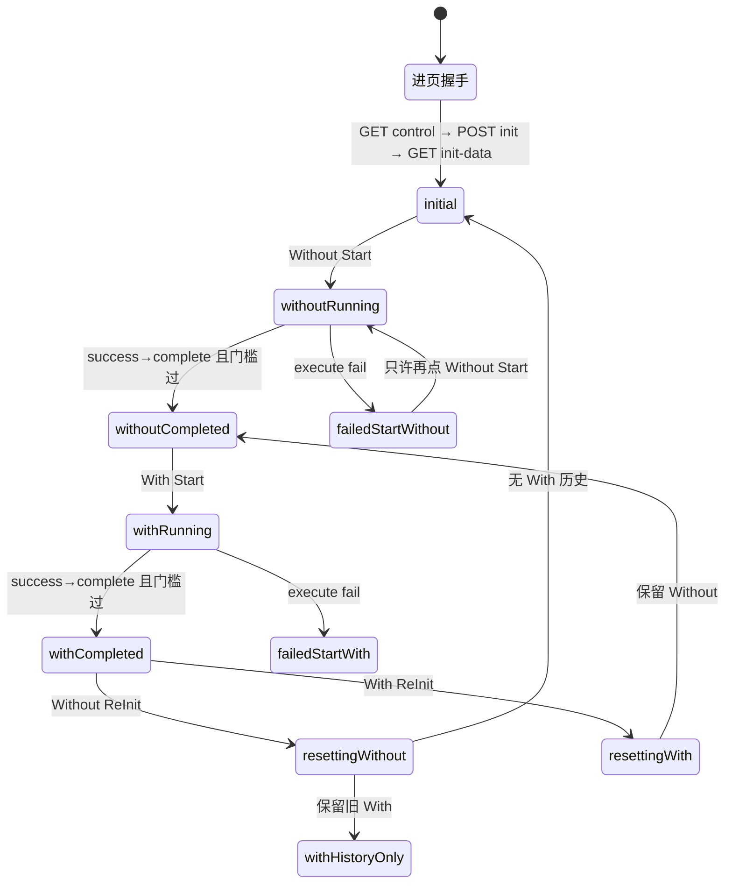

# case3 现状：业务逻辑、状态机、后端接口

- 日期：2026-08-18
- 范围：当前已上线的 case3 正式 Web（`code/web/src/cases/case3`）+ 已冻结契约
- 权威源：`API-CONTRACT.md`、`WEB-SPEC.md`、`MAINLINE.md`、`case3Reducer.ts`
- 用途：改造前业务脑基线。下文是 **当前正式 case3**，不是新 UX。路线见 [00-决策与行动路线.md](00-决策与行动路线.md)。

## 1. 一句话

case3 演示：同一条 UE 轨迹先跑 Without DT，再跑 With DT；最后对比开销 Cost、吞吐 Throughput、波束预测准确率 Beam Accuracy。  
浏览器不碰共享文件；只打本机 Node 的 `/api/case3/*`。业务终态字面值只由后端写。

## 2. 分层与数据关系

```text
用户
  │  Start / ReInit / 现场环境
  ▼
Case3Page（视觉皮）
  │  只渲染 props
  ▼
useCase3Controller + case3Reducer（业务脑）
  │  REST
  ▼
case3Api.ts  ──►  Node /api/case3/*
                    │ 文件 I/O + 数值校验
                    ▼
              DT_SHARED_DIR
              ├── case_control.json
              ├── case3/*.txt（多 txt append）
              └── out/case3/（截图、调试 jsonl）
                    ▲
              真实后端 / 打桩只写文件
```

UI 区块 ← 数据权威：

```text
init-data.baseRoute          → 双侧预置路线
init-data.beamAccuracyBaseline → BA 进页/重置后的环
GET side.points[].ue         → 地图实时轨迹
GET side.points[].scanBeamIds + selectedBeamId → Without 扫描波束
GET side.points[].selectedBeamId → With 预测波束；BA 对比键
GET throughput.samples[] → 吞吐曲线（独立于 `/side` 结构点）
GET side.costPct             → 开销表盘（不进 Case3Point）
points[].reflection          → With 完整点必需；v1 不画 LOS
save_picture_flag 0→1        → Stage 截图（非页面区块）
```

前端派生（后端不给现成结论）：

| 派生 | 规则 | 失效时 |
|---|---|---|
| 相对开销变化 | `(with - without) / without * 100` | 缺一侧、without=0、或 `pairValid=false` → `--` |
| BA 增量 | 同 `no` 比 `selectedBeamId` | 任意重置、无有效 Without、点不对齐 → 只显示文件基线 |
| 点位窗口 | `points.slice(-20)` | 20 是窗口长度，不是 N 上限 |
| `pairValid` | 当前 With 是在**当前仍有效 Without 之后**完成的 | 不能用「两侧都有数据」代替 |

## 3. 后端接口（Web 只看见这 5 个）

| 接口 | 何时 | 作用 |
|---|---|---|
| `GET /api/case3/control-file` | 进页；动作中每 500ms | 读控制快照 |
| `POST /api/case3/control-file` | 只四种 body | `init` / `start` / `reinit` / 截图放弃清零 |
| `GET /api/case3/init-data` | init 写回成功后 | `baseRoute` + BA 基线；不返回地图 URL |
| `GET /api/case3/side?side=without\|with` | 已见 `execute success` 后每 500ms；complete 后再读一次最终快照 | 全量 `points` + `costPct` |
| `POST /api/case3/screenshot` | Start 等待态 flag 0→1 | Base64 → `out/case3/`，Node 清 flag |

控制文件五个核心字段：`case`、`command`、`dt_type`、`status`、`save_picture_flag`。

`status` 字面值只由后端写：

| status | 含义 | Web 怎么用 |
|---|---|---|
| `""` | 空闲，或开一轮清盘 | 等待态内继续等，不当完成 |
| `execute success` | 命令已接住，还没完 | 必须能看见且保持 ≥3000ms；此后才开始拉 `/side` |
| `execute fail` | 本轮失败 | 进 failed；本轮不再等 complete |
| `case complete` | 该侧文件和 Cost 已写完并停止写入 | 最终 `/side` 过门槛才渲染完成 |
| `reinit complete` | 该侧重置完成 | 清该侧 UI，保留另一侧历史 |

POST 只允许：

```json
{ "command": "init" }
{ "case":"case3","command":"start","dt_type":"without dt" }
{ "case":"case3","command":"start","dt_type":"with dt" }
{ "case":"case3","command":"reinit","dt_type":"without dt"|"with dt" }
```

禁止 Web 提交 `status` 或把 `save_picture_flag` 置 1。

## 4. 主路径时序

```text
进页/刷新/切回
  GET control → POST init → GET init-data
  → initial（不恢复历史结果）

Without Start
  Node 清 without 实时文件
  写 start + without dt + status=""
  后端 execute success(≥3s) → 逐点 append
  Web 500ms 拉 /side?side=without
  后端 case complete（可与 save_picture_flag=1 同拍）
  Web 最终快照门槛通过并渲染
  截图保存或 3 次后放弃
  POST init

With Start（必须已有当前有效 Without）
  同上，dt_type=with dt，拉 /side?side=with
  完成后才算跨侧 KPI / BA 增量

ReInit 某一侧
  立刻让该侧结果和全部跨侧结论失效
  另一侧历史可留在画面上，但不参与对比
  等 reinit complete 后清该侧 UI
  POST init
  不截图
```

最终快照门槛（缺一不可）：`ok=true`、`pendingTail=false`、`points>0`、`costPct!=null`。不过门槛就保持 running，不写 init。

## 5. 可见态

由 reducer 派生，不存文件、不进 localStorage。

| 可见态 | 条件 |
|---|---|
| `initial` | 无动作、无失败、双侧无结果 |
| `without-running` / `with-running` | Start 进行中 |
| `resetting-without` / `resetting-with` | ReInit 进行中 |
| `failed-start-*` / `failed-reinit-*` | 本轮 `execute fail` 或结果不完整回退 |
| `without-completed` | 仅 Without 有效 |
| `with-completed` | 双侧有效且 `pairValid=true` |
| `unpaired-both` | 两侧都有数但代际不同，禁止跨侧结论 |
| `with-history-only` | Without 已清、With 历史还在 |



正交、不进上图大枚举的子状态：5000ms 适配探活、500ms 业务轮询、截图 `pending/saving/waitClear`、`roundClosing`（完成已渲染、截图/init 未收尾）。

## 6. 按钮互斥（现状必须守住，除非新 UX 明确改交互）

| 条件 | Without Start | With Start | Without ReInit | With ReInit | 其他 Tab |
|---|---|---|---|---|---|
| 双侧都空 | 允许 | 禁止 | 禁止 | 禁止 | 允许 |
| Without 有效，With 无/未配对 | 禁止 | 允许 | 允许 | 有 With 历史则允许 | 允许 |
| 双侧有效且已配对 | 禁止 | 禁止 | 允许 | 允许 | 允许 |
| Without 空，仅 With 历史 | 允许 | 禁止 | 禁止 | 允许 | 允许 |
| 任一 Start/ReInit 等待中 | 禁止 | 禁止 | 禁止 | 禁止 | **禁止** |
| `failed-start-{side}` | 仅同侧 Start | 按失败侧 | 禁止 | 禁止 | 允许 |
| `failed-reinit-{side}` | 禁止 | 禁止 | 仅失败侧 ReInit | 仅失败侧 ReInit | 允许 |

其它硬规则：

- 必须先 Without，再 With。
- 不做取消、命令队列、业务命令自动重试。
- 刷新/切离一律回 initial，停轮询。
- Start 失败只许同侧再 Start；ReInit 失败不恢复旧结果，只许同侧重置。
- 初始化失败（baseRoute 空或 BA 基线非法）：两侧 Start 禁用。
- 任一 Case 忙：Shell 锁其他 Tab。开发期 case5 与 case3 共用这把锁（见 00 的 D5/D6）。

侧栏徽标文案现状：`等待启动测试` / `等待无DT测试完成` / `测试中` / `已完成` / `重置中` / `执行失败` / `重置失败` / `未配对历史` / `历史结果`，以及连接/初始化异常文案。

## 7. 现状 UI 区块（v1 视觉，换皮对象）

大布局：1920×1080；上「测试对比」左右两列；下「KPI对比」三列。

```text
Case3Page
├── PanelHeader（测试对比 + 现场环境）
├── SidePanel ×2
│   ├── 标签 / 徽标 / 启动 / 重置
│   ├── MapStage（2D 底图 + 路线 + 轨迹；滚轮缩放、左键旋转、右键平移、复位；无全屏）
│   ├── BeamScanCard（Without 扫描集合+选中；With 预测点）
│   └── PointProgressWindow（最近 20 条）
└── KPI
    ├── CostCard 文案「开销(%)」，单位 %，不是切图里的 dB
    ├── ThroughputChart 原生 SVG，不用 ECharts
    └── BeamAccuracyCard 基线环 + 正确/错误次数
```

Gate 1.5 v1 静态页覆盖：初始、无 DT 运行/完成、有 DT 运行/完成、现场环境弹窗。  
reset / failed 当时没进静态验收，正式 Web 已实现。

## 8. 这份基线怎么用

P2/P3 的帧和静态页必须能表达本节状态，不要发明新命令。P4 的 case5 新皮继续接本节的 api / reducer / controller。细节按 00 的阶段表执行。
