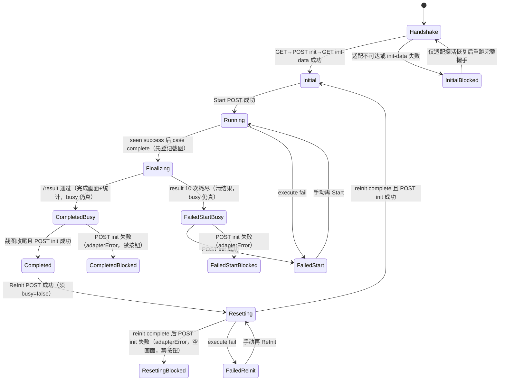
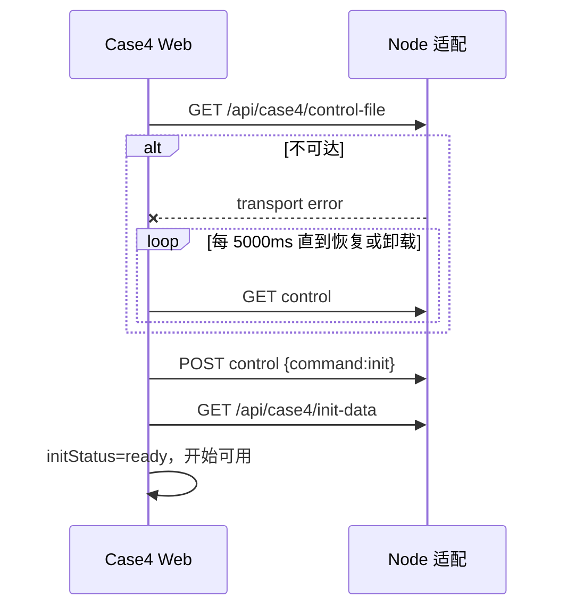
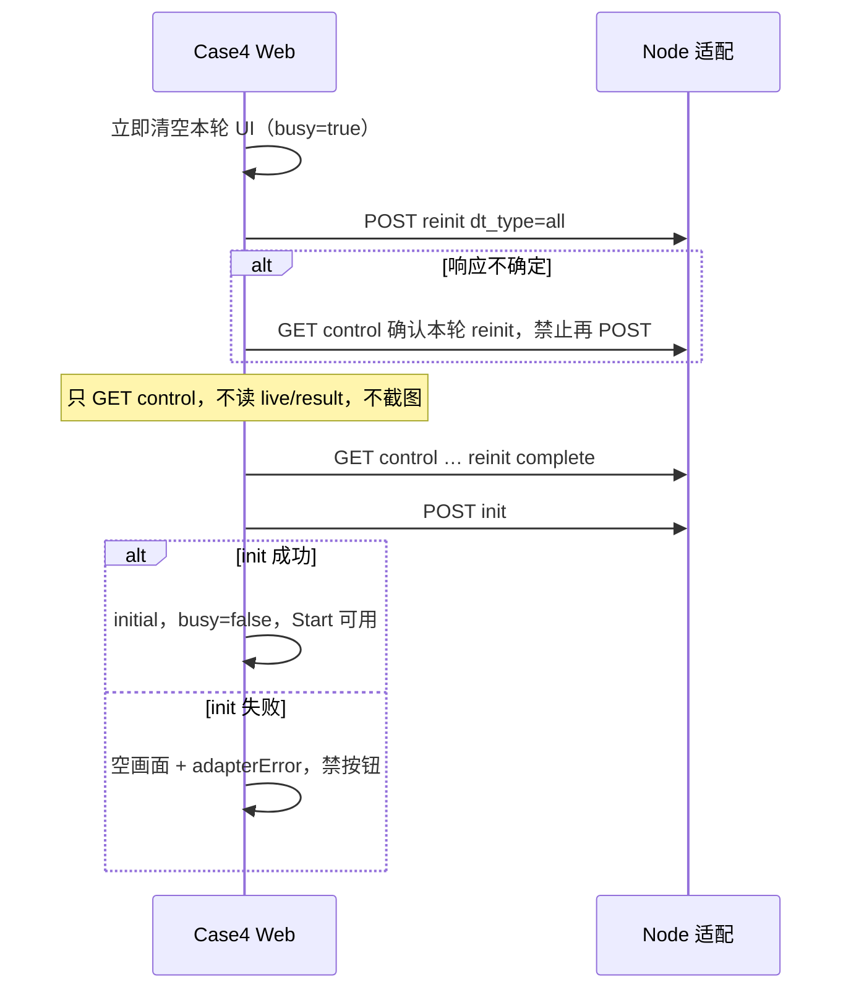

# case4 正式 Web 施工规格

> status: `已实现 — 2026-09-18 用户确认除 3D 外功能全部完成本地开发`
>
> 使用者：正式 React Web 实现 agent。
>
> 唯一业务契约：[API-CONTRACT.md](API-CONTRACT.md)。视觉契约：`03-design/case4/case4.pen`、`03-design/case4/Frontend_Spec.md`、已接受 `web-static/case4/`。本文只把已冻结语义落成施工图，不重新定义后端字段。

开工前必读：`state.md`、契约 §0 / §3 / §4 / §7 / §8 / §9 / §11、本文、`doc/case4/STATIC-HTML-ACCEPTANCE.md`（已接受效果、可复用成果、留给 React 的地图/图表问题），以及 `code/web/src/app/App.tsx`、`shell/Shell.tsx`、`cases/case3/hooks/useCase3Controller.ts`、`cases/case3-v2/mapProjectionV2.ts`、`cases/case3-v2/Case3V2Page.tsx`。

正式代码已实现；CEP 增减百分比已实现并由用户接受（c4382a3）；2D Reflection 见 [REFLECTION-SPEC.md](REFLECTION-SPEC.md)；误差/吞吐/CDF 悬停已落地。**仅 3D 未实现**（按钮可见禁用）。阶段证据见 [QA-EVIDENCE.md](QA-EVIDENCE.md)。

---

实现及验收证据见 [QA-EVIDENCE.md](QA-EVIDENCE.md)。下列清单保留为施工核对项，本次文档收尾不将其批量勾选为独立复测通过。

## 0. 出口条件

- [ ] Case4 在现有 `code/web/` 单应用内实现，不新建 Vite 应用、端口或第二套 Shell。
- [ ] 导航仍是四可见 Tab：`case1` / `case2` / `case3`（文案 `DT辅助通信` = Case3 V2）/ `case4`（`DT辅助定位`）。临时 `case5` Tab 已合回；旧 case3 皮已删除。
- [ ] `case4` 取代自身「建设中」；`App.test.tsx` 中「case1 与 case4 仍为建设中」改为只断言 case1。
- [ ] 进入 / 刷新 / 切回固定 `GET control → POST init → GET init-data`；完成握手前不读 `/trajectory`、`/throughput`、`/result`。
- [ ] 一次 Start 覆盖三方案；POST body 精确为 `{case:"case4",command:"start",dt_type:"all"}`。
- [ ] 本轮见 `execute success` 后才启动 **轨迹 + 两路吞吐** 各自独立的 500ms 串行轮询（吞吐 **两个定时器、两次 GET**，禁止合并）；complete 后停这三条 live，**继续** control 与 `/result`。
- [ ] `case complete` 且同拍 `flag=1`：先登记截图任务，再读 `/result`。`/result` 通过后**立即**切完成画面（含统计）；PNG 必须在该完成画面提交并 `prepareCapture()` 之后生成，不得截 running 空统计。截图与 POST init 期间 **busy 保持**，开始/重置/其他 Tab 仍锁。
- [ ] `/result` 完整门槛通过才展示完成统计；连续 10 次失败回退，**busy 保持到 POST init 返回**后再决定能否再开始。
- [ ] Start/ReInit 等待（含截图与 init 收尾）上报 busy，锁定其他 Tab。
- [ ] 地图用现行 case3-v2 **运行标定**驱动真实坐标，不复制 Pencil 组偏移或静态 `left:-447px`。
- [ ] CDF/CEP/NLOS/吞吐/误差窗由正式数据驱动；禁止 `pencilCep` 固定柱高、CDF 0–4.5 压边、写死 20 点轨迹。
- [ ] SVG 截图关键 `fill/stroke/dash` 写在元素属性上；有 `SvgCaptureCompatibility` 同类测试。
- [ ] 1920×1080 对照 initial / running / completed / 现场环境，留下正式 React 截图与差异结论；自动测试通过不能代替视觉验收。
- [ ] `npm run typecheck`、`npm test`、`npm run build`、受影响的 case2/case3/case3-v2 回归通过。Case4 三进程主线有独立 stack 脚本，前端 mock 不能替代。

---

## 1. 施工方案与边界

采用现有单应用、case-local 扩展。目录与现网 case3 **同构**（Page / controller / reducer / presentation / api / config / components），只把 case3 已证明会胖的两块切开：controller 副作用、地图手势。

**禁止**再套 `polling/`、`screenshot/`、`error-replay/`、`stats/` 以及 `components/index.ts` 桶文件。**禁止**把 fetch、timer、reducer 分支、超长绘图堆进 `Case4Page` 或用 IIFE/超长内联 JSX 代替下表文件。

```text
code/web/
├── assets/
│   ├── shell/                       # 不动
│   ├── case3-v2/site-2d.jpg         # 同场地底图；case4 import，不复制第二份
│   └── case4/                       # 从 04-runtime-assets/case4 拷入（不含底图）
├── src/
│   ├── app/App.tsx                  # 挂载 Case4Page；汇总 case4Busy
│   ├── shell/Shell.tsx              # 不改 Tab 文案映射
│   └── cases/case4/
│       ├── Case4Page.tsx            # 只组装 DOM、接线；目标 <150 行
│       ├── case4.css                # 根作用域 .case4-page
│       ├── types.ts
│       ├── config/case4RuntimeConfig.ts
│       ├── api/case4Api.ts          # 只 REST + 错误类型
│       ├── log/case4Log.ts          # [case4] 结构化事件
│       ├── state/case4Reducer.ts    # 纯转换，无 IO
│       ├── presentation/selectCase4Presentation.ts
│       ├── hooks/
│       │   ├── useCase4Controller.ts    # 编排握手/Start/ReInit/busy；目标 <400 行
│       │   ├── case4Handshake.ts        # GET control → POST init → GET init-data / 探活
│       │   ├── case4Polling.ts          # 串行原语 + 运行中 4 链 + result；export 只要启停
│       │   └── case4Screenshot.ts       # 截图状态机 + toPng + 放弃清 flag
│       ├── metrics/case4Metrics.ts  # XYZ、20 窗、CDF/CEP 几何、吞吐窗口；分区注释，先不拆 5 文件
│       └── components/
│           ├── MapStage.tsx         # 视口、挂鼠标；复位钮小则放这里，不进 transform
│           ├── map/MapRenderer2D.tsx    # 变换层 + 底图/路线/点/UE
│           ├── map/mapGestures.ts       # 缩放/旋转/平移纯逻辑，不写 JSX
│           ├── MapHud.tsx
│           ├── ViewModeToggle.tsx
│           ├── TrackLegend.tsx
│           ├── Banner.tsx
│           ├── BottomDock.tsx       # 只排 ErrorReplay + KPI 行
│           ├── ErrorReplay.tsx      # 开始/重置/状态 + 点列；点列单独 >300 行再拆 ErrorPointChart
│           ├── PositionStatistics.tsx   # 一张卡组装 CdfChart + CepBars
│           ├── CdfChart.tsx
│           ├── CepBars.tsx
│           ├── NlosGauge.tsx
│           └── ThroughputChart.tsx
├── test/case4/                      # 与源文件同名，如 case4Polling.test.ts
└── e2e/case4-mainline.spec.ts
```

文件头（每个 export 模块）写 5～8 行 JSDoc：**做什么、不做什么、关键时序**（例如 busy 在 init 返回前保持）。关键 export 函数同样写注释。不要逐行注释。

篇幅：页面组装少于 150 行；controller 编排少于 400 行；单组件 150～350 行正常。超过约 400 行且混了两件无关的事再拆；不要为拆而拆。

页面 DOM 必须对齐静态 `data-region`（视觉契约，与文件怎么切无关）：

```text
Case4Page (.case4-page)
├── MapStage（鼠标缩放/旋转/平移）
│   ├── MapTransformLayer（底图+路线+点+UE）
│   └── ResetViewButton（偏离 config 时显示，不进 transform；可内联在 MapStage）
├── MapHud（测试对比 / 现场环境 / ViewModeToggle / TrackLegend）
├── Banner          # 相对 page，dock 外
└── BottomDock
    ├── ErrorReplay
    └── KpiRow（PositionStatistics + NLOS + Throughput）
```

### 1.1 允许复用

| 复用 | 方式 |
|---|---|
| Shell 缩放、Tab、现场环境弹窗 | 现有 `Shell` + `useSiteEnvWindow` |
| 跨 Case busy | `onBusyChange?: (busy: boolean) => void`，与 case2/case3-v2 同形 |
| 物理投影公式 | **只 import** `projectBusinessToImage`、`mapImageLayerToCssTransform`、`isImagePointInNaturalBounds`、`pinBoxFromImagePoint`（`cases/case3-v2/mapProjectionV2.ts`） |
| 地图指针数学 | `zoomMapViewAtPointer` / `rotateMapViewByDrag` / `panMapView` / `clientDeltaToStageLogical`（`cases/case3/metrics/mapProjection.ts`）；事件接线对照 `case3-v2/components/map/MapRenderer2D.tsx`（滚轮/左旋/右移/复位），**不要**抄其 drawMode/debug |
| 复位图标 | `code/web/assets/case3-v2/icon-rotate-ccw.svg`（可直接 import，不必复制） |
| 截图原语 | `html-to-image` `toPng`，`width=1920,height=1080,pixelRatio=2`，去掉外层 scale |
| 底图文件 | `code/web/assets/case3-v2/site-2d.jpg` |
| 生命周期套路 | 对照 `useCase3Controller`：**抄流程，不抄双侧 state** |

### 1.2 明确不采用

- 不 import `useCase3Controller`、`case3Reducer`、`selectCase3Presentation`、`pairValid`。
- 不 import `ThroughputCompareCard`（X 轴绑通信点号）、`PointBeamReplay`、`BeamMatrixCard`、`Case3V2Page`。
- 不调用 `ueBoxFromImagePoint`（case3-v2 UE 高 38；case4 Pencil 为 **36×48**）。
- 不读 `VITE_CASE3_*` / `VITE_CASE3_V2_*`。
- 不复制 `web-static/case4/js/pencil-map-art.js`、`.c4-map-image { left:-447px; top:-874px; width:3466px }`、走廊组偏移 `(17,-6)` / 点位 `(18,-7)` / 轨迹 `(12,-36)`。
- 不把 case3-v2 `MapRenderer2D` 的调参面板、画点器、`VITE_CASE3_V2_DEBUG_SHOW` 带进 case4。缩放/旋转/平移/复位**必须**做，且与 V2 同一套数学；只去掉 debug。
- 不新建 `/api/case5`，不把 case4 控制写成 `case:"case5"`。
- 不引入 ECharts / Three.js / Socket。
- 不新建 `polling/`、`screenshot/`、`error-replay/`、`stats/` 子树，不写 `components/index.ts`，不抽 `shared/charts`。
- 不把 4 条轮询拆成 4 个小文件；吞吐两路必须两个定时器，但都写在 `case4Polling.ts` 内。

---

## 2. 配置、资源和命令

### 2.1 Web 配置

`code/web/.env` 按 Case 分块追加；Case4 不改写已有 `VITE_CASE2_*` / `VITE_CASE3_*`。修改后必须重启 dev / 重新 build。

| `.env` 配置 | 默认值（代码与 `.env` 一致） | 规则 |
|---|---|---|
| `VITE_CASE4_POLL_MS` | `500` | 业务串行轮询间隔；十进制正安全整数 |
| `VITE_CASE4_MAP_ORIGIN_X` | `916` | 相对 `site-2d.jpg` 原图像素；有限数 |
| `VITE_CASE4_MAP_ORIGIN_Y` | `608` | 同上 |
| `VITE_CASE4_MAP_UNITS_PER_PX` | `0.11` | 有限正数；`imageX = originX + y / units`，`imageY = originY + x / units` |
| `VITE_CASE4_MAP_IMAGE_SCALE` | `1.6` | 显示层缩放，有限正数；不改变 origin 语义 |
| `VITE_CASE4_MAP_IMAGE_ROTATION_DEG` | `0` | 显示层旋转，有限数 |
| `VITE_CASE4_MAP_IMAGE_OFFSET_X` | `205` | 显示层平移 CSS px |
| `VITE_CASE4_MAP_IMAGE_OFFSET_Y` | `-400` | 同上 |
| `CASE4_REFLECTION_ENABLE` | 未设置=`false` | `true/false/1/0`。Vite 白名单注入，不是 `VITE_` 前缀。开启时请求 `reflection=true` |
| `CASE4_BS_XYZ` | 开启时必填 | 如 `(1.0,5.0,7.0)`，三个有限非哨兵数。示例不是真实标定 |

上述默认值拷贝 **2026-09-15 现行 case3-v2 运行 `.env`**（不是代码里的 905/445 缺省，也不是静态 `map-projection.js` 的 905/445/-447/-874）。同场地；case4 用自己的键，避免以后改通信标定误伤定位页。视觉 QA 若取景不够，只调 case4 的 display scale/offset，不动 origin。

故意不进 env：

- API 前缀写死 `/api/case4`。
- 探活固定 `5000ms`。
- 截图 `pixelRatio=2`、误差/吞吐窗口 `20`、地图 0.5～5× / ±90°。
- 不预埋 3D 模型 URL。

全部由 `config/case4RuntimeConfig.ts` 一次解析；组件不得直接读 `import.meta.env`。键已提供但非法 → 启动失败并报键名，禁止静默 fallback / clamp。

配置错误时：case4 内容区显示 `case4 配置错误：{field}`，开始/重置禁用；不渲染地图。

### 2.2 三轨资源

1. 设计：`03-design/case4/`，只评审。
2. Gate 1.5：`web-static/case4/`，只对照；禁止 import CSS/JS。
3. 正式：`04-runtime-assets/case4/` → 拷入 `code/web/assets/case4/`。底图不拷，引用已有 `assets/case3-v2/site-2d.jpg`。

Gate 4 至少准备：`tokens.css`、`point-done.png`、`c4-label-plan.png`、`btn-*.png`、`progress-overlay.png`、`cursor-car.png`、`ue-pin-*.png`、`ue-2d.png`、`compare-icon.png`、`top-mask.png`。Shell 品牌/导航/现场环境仍走 `assets/shell/`。

`case4.css` 从静态迁移时：

- 根作用域 `.case4-page`；把 `--c4-asset` / `--c4-map` 改成正式 import 或 `assets/case4`。
- 删除评审条、`[hidden]` 假状态依赖、Pencil 组 left/top、底图 cover 3466×1783。
- 底栏视觉以验收记录为准：`#ffffff66`、gap 12、pad `[14,16]`、r14；**不要**把验收已否定的自加 blur 当契约。
- 横幅必须留在 `.c4-dock` **之外**（`STATIC-HTML-ACCEPTANCE` / ISS-12）。

禁止正式代码 import/alias 到 `02-ux/`、`03-design/`、`04-runtime-assets/`、`web-static/`。

静态成果用法（细节与已知缺口见 `STATIC-HTML-ACCEPTANCE.md`）：

| 静态成果 | 正式 React |
|---|---|
| 页面结构、`data-region`、叠层 | 组件拆分与 DOM 分区依据 |
| `case4.css`、视觉 token | 迁入正式目录，改作用域和资源路径 |
| 图片、按钮、图标 | 经 `code/web/assets/case4/` 进入 |
| NLOS 等展示几何 | 可复用 path；动态值由正式数据驱动 |
| 假状态、评审控件、固定 20 点地图、示意数据 | **不进**正式运行逻辑 |
| 静态导航和环境弹窗 | 只参考外观；正式端复用现有 Shell |

### 2.3 命令

| 命令 | 预期 |
|---|---|
| `npm run dev` | 现有四可见 Tab；case4 为正式页 |
| `npm test` | 含 `test/case4/**`；Vitest `include` 已覆盖 |
| `npm run typecheck` / `npm run build` | 通过 |
| `npm run test:e2e -- --workers=1` | 现有 case2 全栈 + case3 隔离 + **case4 独立 project** 不抢 case2 端口 |

实现须新增 `code/scripts/e2e-case4-stack.sh`（对照 `e2e-case2-stack.sh`：临时共享根 + Node + case4 stub + Vite）。Playwright 为 case4 单独 project 与端口（建议 Web `55174`、适配 `33104`），不要挂到现有 case2 `webServer` 上假装覆盖。

---

## 3. 类型、状态权属与可见态

### 3.1 REST 类型

按契约定义，Web 再加防御。核心：

```ts
type Scheme = "traditional" | "commercial" | "dt";
type ThroughputSide = "without" | "with";
type ControlStatus =
  | ""
  | "execute success"
  | "execute fail"
  | "case complete"
  | "reinit complete";

type XYZ = { x: number; y: number; z: number };
type BasePoint = XYZ & { no: number };
type TrajectoryPoint = {
  no: number;
  traditional: XYZ;
  commercial: XYZ;
  dt: XYZ;
};
type TrajectorySnapshot = {
  points: TrajectoryPoint[];
  completeCount: number;
  pendingTail: boolean;
};
type ThroughputSample = { no: number; gbps: number };
type ThroughputSnapshot = {
  samples: ThroughputSample[];
  pendingTail: boolean;
};
type CdfPoint = { errorM: number; probability: number };
type CepPoint = { p50M: number; p90M: number };
type Statistics = {
  cdf: Record<Scheme, CdfPoint[]>;
  cep: Record<Scheme, CepPoint>;
  nlosRatio: number;
};
```

`/result` 成功 shape 见契约 §7。Web 检查 `ok`、对象/数组存在、有限 number、`side` 与请求一致、`completeCount === points.length`（对 trajectory）。不重复 65535、不解析文件、不量化 CDF/CEP。

### 3.2 reducer 状态

```ts
type ActionKind = "start" | "reinit";

type ActiveAction = {
  kind: ActionKind;
  seenExecuteSuccess: boolean;
  generation: number;
};

type Case4UiState =
  | "initial"
  | "running"
  | "finalizing"
  | "completed"
  | "resetting"
  | "failed-start"
  | "failed-reinit";

type Case4State = {
  initStatus: "loading" | "ready" | "error";
  ui: Case4UiState;
  adapterError: boolean;
  liveReadHint: string | null;       // 运行中某路暂时失败；不改 ui
  baseRoute: BasePoint[];
  liveTrajectory: TrajectorySnapshot | null;
  liveThrp: {
    without: ThroughputSnapshot | null;
    with: ThroughputSnapshot | null;
  };
  result: {
    trajectory: TrajectorySnapshot;
    throughput: { without: ThroughputSnapshot; with: ThroughputSnapshot };
    statistics: Statistics;
  } | null;
  activeAction: ActiveAction | null;
  generation: number;
  finalSubmitted: boolean;           // 本轮 /result 已成功提交一次
  resultFailCount: number;
};
```

`generation` 只用于丢弃旧响应，不进共享文件。定时器、AbortController、Base64、Canvas 不进 reducer。

不设 `pairValid`、`pendingAction`、`baselineStatus`、独立 `unknown-control` / `result-error` phase。

### 3.3 派生可见态与按钮

| 条件 | `ui` | `data-state`（CSS） | 开始 | 重置 | 其他 Tab | 轨迹/误差/吞吐 | CDF/CEP | NLOS |
|---|---|---|---|---|---|---|---|---|
| 握手中 / 就绪无动作 | `initial` | `initial` | 可用* | 禁用 | 可用 | 仅 base | 空轴 | `--` |
| `initStatus=error` | `initial` | `initial` | 禁用 | 禁用 | 可用 | 无 | 空轴 | `--` |
| Start 等待且未见 complete | `running` | `running` | 禁用 | 禁用 | 锁 | live | 空轴 | `--` |
| 已见 complete，等 `/result` | `finalizing` | `running` | 禁用 | 禁用 | 锁 | 停 live，保留最后一帧 | 空轴 | `--` |
| `/result` 已提交，截图或 POST init 未结束 | `completed` | `completed` | 禁用 | 禁用 | **锁（busy）** | result 替换 | **展示** | **展示** |
| `/result` 已提交且截图+init 收尾成功 | `completed` | `completed` | 禁用 | 可用 | 可用 | result | 展示 | 展示 |
| ReInit 等待（含等 POST init） | `resetting` | `resetting` | 禁用 | 禁用 | 锁 | 已清空 | 空轴 | `--` |
| Start `execute fail` | `failed-start` | `failed-start` | 仅手动再开始 | 禁用 | 可用 | 已丢半轮 | 空轴 | `--` |
| result 耗尽、POST init 尚未返回 | `failed-start` | `failed-start` | 禁用 | 禁用 | **锁（busy）** | 已丢半轮 | 空轴 | `--` |
| result 耗尽且 init 成功 | `failed-start` | `failed-start` | 仅手动再开始 | 禁用 | 可用 | 空 | 空轴 | `--` |
| result 耗尽且 init 失败 | `failed-start` | `failed-start` | 禁用 | 禁用 | 非忙可切 | 空 | 空轴 | `--` |
| ReInit `execute fail` | `failed-reinit` | `failed-reinit` | 禁用 | 仅手动再重置 | 可用 | 空 | 空轴 | `--` |
| 任一相 `adapterError` | 相不变 | 不变 | 禁用 | 禁用 | 非忙可切 | 不变 | 不变 | 不变 |

\*开始可用还要求 `initStatus=ready` 且 `baseRoute.length>=1`。`finalizing` 不新开 CSS 态，避免补设计。

**画面态与锁分离：** `ui=completed` / `data-state=completed` 只表示「本轮结果已一次提交、完成画面已展示」。能否点重置、能否切 Tab 看 `busy` 与 `adapterError`，不看 `ui` 字面值。实现可用 `selectCase4Presentation` 派生 `startEnabled/resetEnabled/navigationLocked`。

`completed` 后 POST init 失败：保留 `result` 与完成画面，`adapterError=true`，`busy=false`，禁用业务按钮；恢复路径是刷新 / 切回，不自动再 Start。

ReInit 路径 POST init 失败：保留空画面（不要宣称已回到可点 Start 的 `initial`），`adapterError=true`，`busy=false`，禁用业务按钮。

### 3.4 状态图



截图 `idle/pending/saving/waitClear` 与探活 timer 正交，不进 `ui` 枚举。

### 3.5 冻结文案

| 场景 | 控制列 `c4-ctrl-status` | 横幅 |
|---|---|---|
| initial 就绪 | `未开始` | 无 |
| running | `测试中...` | 无（除非 live 读失败短提示） |
| finalizing（等 `/result`） | `测试中...` | 无 |
| completed（含 busy 收尾中） | `已完成` | 无 |
| resetting | `重置中` | 无 |
| `failed-start` / `failed-reinit` | `执行命令失败` | 可选同文案 |
| result 耗尽 | `结果不完整已自动回退` | 标题同左 |
| `adapterError` | `适配异常` | 标题 `适配服务异常`（可替换控制列主文案） |
| `initStatus=error` | `未开始` | `case4初始化数据异常` |
| 运行中某路暂时失败 | 保持 `测试中...` | 短句如 `轨迹暂时不可读，保留上次结果` |

业务失败与连接异常文案必须可区分。`现场环境 >` 只调用 Shell `open()`。标题「测试对比」不可点成导航。3D 文案可见但 `aria-disabled`，不接业务。

---

## 4. Shell、App 与跨 Case 锁

`App` 只多持有：

```ts
const [case4Busy, setCase4Busy] = useState(false);
// navigationLocked 增加：tab === "case4" && case4Busy
```

- `tab === "case4"` 渲染 `Case4Page`（配置失败则配置错误页），`onBusyChange={setCase4Busy}`。
- `tab === "case3"` 挂 `Case3V2Page`（旧皮已删除；无 `case5`）。
- `tab === "case1"` 挂正式 Case1 离线页。
- busy=true：Start/ReInit 点击当拍，直到：普通命令失败回退、`CONTROL_BUSY` 回退、**或** 本轮截图 idle 且 POST init **已经返回**（成功或失败都算返回）。`ui=completed` 本身不解 busy、不开放重置。
- `CONTROL_BUSY` 不保持 busy。
- 切 Tab 关闭现场环境（Shell 已有）。
- 更新 `test/app/App.test.tsx`：case4 不再期望「建设中」；补 case4 busy 锁 Tab，对标现有 case3 用例。

Node `CONTROL_BUSY` 仍是第二安全边界。

---

## 5. 进入、刷新、卸载与日志

### 5.1 串行门闩

每次挂载：

```text
GET /api/case4/control-file
  → 成功后 POST {command:"init"}
  → 成功后 GET /api/case4/init-data
  → baseRoute 非空、点号从 1 连续
  → initStatus=ready
```

- StrictMode：`entryLoadGeneration` / Abort，同一有效挂载不得双 POST init。
- 控制 GET/POST transport 失败：`adapterError=true`，保持 initial，Start 禁用；5000ms 串行探活，不封顶。恢复后必须重跑**完整**三步，不能从中段续。
- `init-data` 语义错误（缺失/非法 shape）：`initStatus=error`，`console.error`，**停止探活**。刷新或再进才重跑。
- 历史 `case complete` / `execute fail` / 磁盘旧实时文件一律不恢复。
- 探活与业务轮询不能同时跑。

### 5.2 结构化日志

前缀 `[case4]`。正常 `console.info`，可恢复 `warn`，失败 `error`。`generation` 在 entry/probe 事件里键名 `entryGeneration`，动作事件里 `roundGeneration`（与 case3 现网一致）。控制快照只摘要 `case/command/dtType/status/savePictureFlag`。禁止 points 全量、Base64、未知字段。

| 环节 | 必须事件 |
|---|---|
| 进页 | `entry.begin`、`entry.control_ok`、`entry.init_reset_ok`、`entry.init_data_ok`、`entry.cleanup` |
| 探活 | `adapter_probe.start`、`adapter_probe.recovered`；失败不每 5s 刷屏 |
| 命令 | `command.start_click/ok/fail`、`command.reinit_click/ok/fail`、`command.control_busy` |
| 轮询 | `poll.start`、`poll.status_edge`、`poll.stop`；相同 status 不重复边沿 |
| live | `trajectory.live_progress`、`thrp.live_progress`（`side`）；仅 count 变化，采样第 1、2、每 5 个及末点 |
| 最终 | `result.fetch_begin`、`result.ready` / `not_ready` / `fail`、`round.completed_rendered` |
| 截图 | `screenshot.requested`、`capture_begin/ok`、`upload_ok`、`retry`、`dropped` |
| 收尾 | `completion.init_begin/ok/fail`、`reinit.ui_applied` |

`screenshot.upload_ok` 必须含 `attempt/path/seq/toPngMs/uploadMs/totalMs`。`result.not_ready` 仅在摘要变化时重复。

Web 本地门槛失败日志码可用 `CASE4_RESULT_NOT_READY`，与 HTTP `error.code` 区分。shape 非法：`CASE4_INVALID_RESPONSE`。

### 5.3 卸载

- abort 所有 fetch、清四类 timer、`generation++`。
- `onBusyChange(false)`；禁止旧回调清掉另一 case 的 busy。
- `pagehide` 可用 `keepalive` POST init；正确性不依赖它。可靠恢复是下次 mount 握手。
- 已启动的截图若页面已卸：abort，不再 POST；极端窗口允许丢图。

---

## 6. 动作、四路轮询与完成门槛

### 6.1 Start

条件：`initStatus=ready`、无 activeAction、无 adapterError、`busy=false`、当前不是 `running/finalizing/resetting/completed`；从失败进入时只能是 `failed-start`。

1. `busy=true`，`generation++`，清 `result` / live / `finalSubmitted` / `resultFailCount`，`ui=running`，`seenExecuteSuccess=false`。
2. POST 精确 payload：

```json
{ "case": "case4", "command": "start", "dt_type": "all" }
```

3. POST 成功才启动 **control** 轮询（此时还不见 success，**不要**开轨迹/吞吐）。截图 `lastFlag` 初值 0。
4. POST 普通失败：回退点击前相，`adapterError=true`，busy=false，不启轮询，不自动重发。步骤 1 已清的结果不恢复。
5. `409 CONTROL_BUSY`：`CLEAR_ACTIVE` 回到可点 Start 的相（通常 `initial` 或 `failed-start`），**不**置 `adapterError`，打 `command.control_busy`，busy=false。
6. POST 响应不确定：先 GET control。若已是 `case4/start/all` 且 `status=""` 或本轮合法推进，视为成功并启表；若仍是 init 空闲，视为失败并按 4 处理。**禁止**再 POST 一条 start。

### 6.2 运行中四条独立串行链（+ finalizing 的 result）

全部用递归 `setTimeout`，禁止 `setInterval`。每条链独立 AbortController。默认间隔 `VITE_CASE4_POLL_MS=500`（**上一拍 HTTP 结束后再等**，真实周期 = 耗时 + 500ms）。

这不是「三套定位方案各轮询一次」。三方案在**同一个** `GET /trajectory` 里。也不是一个定时器打三次 GET。

`execute success` 之后运行中共 **4 个定时器**：

| 链 | 何时启 | 何时停 | 请求 |
|---|---|---|---|
| control | Start/ReInit POST 成功 | 离开等待（POST init **已返回** / execute fail / 回 initial / 卸载） | `GET /control-file` |
| trajectory | **本轮已** `seenExecuteSuccess` 且 `ui=running` | 进入 finalizing / 失败 / 卸载 | `GET /trajectory` |
| thrp without | 同上 | 同上 | `GET /throughput?side=without` |
| thrp with | 同上 | 同上 | `GET /throughput?side=with` |
| result（第 5 条，仅收尾） | `ui=finalizing` 且尚未 `finalSubmitted` | 提交成功或 10 次耗尽或卸载 | `GET /result` |

吞吐稳定性要求（已确认）：

- **两个定时器、两次 GET**，各管各的，失败只留该路旧折线。
- **禁止**合成 `GET /throughput` 一次返回两路（不改 Gate 2 契约）。
- **禁止**一个定时器里串行 `without` 再 `with`（慢的一路会拖死另一路）。
- **禁止**一个定时器 `Promise.allSettled` 两路（一路 hang 会推迟另一路的下一拍）。
- 两路刷新可以差几十毫秒、窗口按 `max(最后 no)` 切，这是独立更新的正常观感，不是错位。

实现：四条链都写在 `hooks/case4Polling.ts`，对外只 `startControlPoll` / `startLivePolls` / `stopLivePolls` / `startResultPoll` / `stopAllPolls`。不要拆成 `runThrpWithout.ts`。

规则：

1. **先做归属校验，再碰 flag 与 status。** 当前 `activeAction` 存在时，控制快照必须属于本轮 case4 动作：`control.case==="case4"`，且 `command`/`dt_type` 与本动作一致（Start：`start` + `"all"`；ReInit：`reinit` + `"all"`）。归属不匹配：打 `poll.control_context_mismatch`，**不得**登记截图、不得认 `execute fail` / `case complete` / `reinit complete`、不得改 busy。其他 case 的 `flag=1` 或 `execute fail` 不影响 case4。继续轮询，等待本轮快照回来。
2. 归属已匹配后：控制 tick **先**把 `save_picture_flag` 交给截图机（仅 Start 的 running 窗口认 0→1），**再**解释 status。同拍 `complete+flag=1` 仍是「先登记截图、再转入 finalizing / 读 result」，但这一顺序排在归属校验之后。
3. `execute success` 且归属已匹配 → `seenExecuteSuccess=true`，再启动三条 live（轨迹 + 两路吞吐，已在跑不重复开）。
4. 未见 success 的 `case complete`（即使归属匹配）：忽略并打日志，不停表、不读 result。
5. 归属匹配的 `execute fail`：丢 live/result，对应 `failed-start` / `failed-reinit`，busy=false，停所有业务轮询。
6. 未知 status：日志，保持动作，继续轮询。
7. live 成功：全量替换对应快照。`pendingTail` 不阻塞显示已有前缀。
8. live HTTP/shape 失败：**保留**该路上次合法快照，设 `liveReadHint`，不计入 result 的 10 次，不造点。
9. 晚到响应：`generation` / `ui` / `activeAction` 不符则丢弃。
10. 控制/连接连续失败达到 `CASE4_POLL_FAIL_RETRY_THRESHOLD`（默认 3，对齐 case3）才置 `adapterError`；成功清 streak。不把连接失败映射为 `execute fail`。
11. ReInit 轮只跑 control，不跑 live/result。

### 6.3 complete → finalizing → completed

当归属已匹配、control 为本轮 Start、已 seen success，且 `status="case complete"`：

1. 若本拍 `flag=1`（或相对 lastFlag 的 0→1）：**先**登记唯一截图任务 `pending`，不立刻 `toPng`。
2. 停三条 live（轨迹 + 两路吞吐），丢在途 live 响应；`ui=finalizing`（`data-state` 仍 `running`，统计仍空）；control 不停。
3. 启动 result 串行链。每次完整 HTTP（含 409/404/422/网络/本地门槛失败）`resultFailCount++`。
4. 本地门槛（与 Node 成功叠加）：`ok`、`pendingTail===false`、`completeCount===points.length>0`、三方案点都在、两路 `throughput.*.pendingTail===false`（**允许 `samples=[]`**）、`statistics.cdf/cep` 三方案与有限 `nlosRatio`。
5. 不满足：打 `result.not_ready`，继续等。满 10 次走 **§6.3.1 耗尽**，不要先解 busy。
6. 满足且尚未 `finalSubmitted`：一次提交 `result`（轨迹/误差/吞吐/CDF/CEP/NLOS 同拍进 store），清 live（展示改吃 result），`finalSubmitted=true`，**立刻** `ui=completed` / `data-state=completed`（控制列 `已完成`）。**busy 保持 true**：开始/重置禁用，其他 Tab 仍锁。停 result 链。`finalSubmitted` 之后忽略后续 control 的 complete/fail，避免半轮重入。
7. 调用可注入的 `waitForPaint()`（见下），再 `await mapRef.prepareCapture()`。打 `round.completed_rendered`。
8. 若有截图任务：进入 §10 `saving` 再 `toPng`。无截图任务：直接 POST init。
9. 截图收尾（成功或按 §10 放弃）之后 POST init。**init 返回前 busy 仍为 true**。
10. init 成功：保持 `ui=completed`，`busy=false`，停 control，重置可用。init 失败：保留 `result` 与完成画面，`adapterError=true`，`busy=false`，禁按钮。

`waitForPaint()`（测试必须可注入同一签名）：

- 默认：连续 **两次** `requestAnimationFrame`（环境无 rAF 时两次 `setTimeout(0)`）。一次 rAF 只保证调度到下一帧回调，不保证 React 已 commit 且浏览器已绘制。
- **禁止**只 `queueMicrotask`、只 `Promise.resolve()`、只单次 rAF 就调用 `toPng`。
- 测试：`result` 提交后，在 `waitForPaint` resolve 之前不得出现 `toPng` / `POST /screenshot`。

同拍顺序硬规则：**登记截图 → 停 live → 读 result → 提交完成画面（`ui=completed`）→ waitForPaint + prepareCapture → toPng → POST init → 解 busy**。不得在 `data-state=running` 的空统计画面上截图。不得等 init 成功才切完成画面（会死锁，也会让「先渲染再截图」与「init 成功才 completed」互相卡住）。

#### 6.3.1 `/result` 耗尽

连续 10 次仍不满足门槛：

1. 停 result 链；`abort` 待处理截图（`pending`/`saving` 都取消）。截图 generation / AbortController 失效后，**禁止**旧 `toPng`、旧 `POST /screenshot`、旧「截图后再 POST init」回调继续收尾。
2. 丢 live 与 `result`，`ui=failed-start`，文案「结果不完整已自动回退」。
3. **busy 保持 true**，开始/重置/其他 Tab 仍锁。
4. `await POST init`（带本轮 generation）。晚到的旧 init 响应若 generation 已变则丢弃，不得清掉新挂载或新动作。
5. init 成功：`busy=false`，允许手动再 Start。init 失败：`adapterError=true`，`busy=false`，禁用业务按钮。

禁止：耗尽后先 `busy=false` 再 best-effort POST init（用户可能立刻 Start 或切 Tab，晚到的 init 会清掉新动作）。

### 6.4 ReInit

1. 仅 `ui=completed` **且** `busy=false` **且** 无 `adapterError`，或 `failed-reinit`，可点。`completed` 但 busy（截图/init 收尾中）不可点。
2. 点击立即清空 `result` / live / 派生误差，`ui=resetting`，`busy=true`，`generation++`，`seenExecuteSuccess=false`。骨架不拆（空轴保留）。顺带 abort 任何残留截图任务。
3. POST `{case:"case4",command:"reinit",dt_type:"all"}`。
4. POST 失败不恢复步骤 2 已清结果；普通失败 `adapterError`，busy=false；`CONTROL_BUSY` 进入 `failed-reinit` 以便只重试 ReInit，不置连接异常，busy=false。
5. POST 响应不确定：与 Start 相同，先 GET control。若已是 `case4/reinit/all` 且 `status=""` 或本轮合法推进（success / `reinit complete`），视为成功并只启 control；若仍是 init 空闲，视为失败并按 4 处理。**禁止**再 POST 一条 reinit。
6. 只轮询 control。success 只置 latch。seen 后 `reinit complete`：停 control，**busy 保持**，`await POST init`。
   - init 成功：回可操作 `initial`（Start 可用），`busy=false`。
   - init 失败：保留空画面（`ui` 可停在 `resetting` 或空 `initial` 骨架，但 **Start/ReInit 都禁用**），`adapterError=true`，`busy=false`。不得宣称已恢复可点 Start 的 initial。
   - 不 GET trajectory 去“确认文件为空”。
7. `execute fail` → `failed-reinit`，只开放 ReInit，busy=false。
8. ReInit 不观察截图 flag。

---

## 7. 典型时序

打桩参与者见 `realback_no.md`；接真实后端时 Web/Node 调用不变。

### 7.1 初始化与 Node 晚启动



### 7.2 Start → 实时 → complete + 截图

```mermaid
sequenceDiagram
    participant W as Case4 Web
    participant N as Node 适配
    participant B as 后端打桩
    W->>N: POST start dt_type=all
    N-->>W: 200 status=""
    W->>W: 只启 control 500ms
    B->>N: execute success
    W->>N: GET control
    W->>W: seen=true；启 trajectory + thrp without + thrp with（三个独立定时器）
    par 三条 live 各串行 500ms
        W->>N: GET /trajectory
        W->>N: GET /throughput?side=without
        W->>N: GET /throughput?side=with
    end
    B->>N: case complete + flag=1 同拍
    W->>N: GET control
    W->>W: 先登记截图 pending；停三条 live；ui=finalizing
    loop result 重试
        W->>N: GET /result
        N-->>W: 未就绪则 409，计数+1
    end
    W->>W: 提交 result；ui=completed（统计全亮）；busy 仍真
    W->>W: waitForPaint（双 rAF）+ prepareCapture
    W->>N: POST /screenshot
    N-->>W: path/seq
    W->>N: POST init
    W->>W: init 返回后 busy=false（重置可用）
```



### 7.3 ReInit



---

## 8. API 客户端

`case4Api.ts`：

- `CASE4_API_PREFIX = "/api/case4"`
- `getControl` / `postControl(payload, signal, { keepalive? })`
- `getInitData` / `getTrajectory` / `getThroughput(side)` / `getResult`
- `postScreenshot(imageBase64, signal)`
- GET `cache:"no-store"`；吞吐 query **恰好** `side=without|with`

非法响应抛 `Case4ApiError("CASE4_INVALID_RESPONSE", ...)`，整包丢弃。Web 不做：小数四舍五入、65535、文件对齐、路径推断。

错误映射：控制/连接 → `adapterError`（`CONTROL_BUSY` 除外）；live 失败 → hint + 保留旧快照；result 失败 → 计入 10 次。

---

## 9. 可视化施工

### 9.0 布局叠层（禁止文档流四行）

对齐 `Frontend_Spec`：

```text
.case4-page  (absolute 1920×1080)
├── MapStage          top:60 height:766 overflow:hidden
│   └── MapTransformLayer  1920×782；唯一 transform
│       ├── img site-2d.jpg（自然像素，不要 3466 cover）
│       ├── 预期走廊（全量 base）
│       ├── 已走（base 前 K 点）
│       ├── 预置点（全量 N，不是 20）
│       ├── 三方案轨迹（前 K 点）
│       ├── UE（36×48，锚在 base[K-1] 底边中心）
│       └── 侧标「预期路径」
├── MapHud            不进 transform（含 2D/3D、图例、现场环境）
├── ResetViewButton   钉在 MapStage 视口，不进 transform；仅变换≠config 基准时显示
├── Banner            top:640 + translateY(-100% - 8px)；z 高于 dock
└── BottomDock        top:640 height≈439
```

层序：底图 < 预期走廊 < 已走 < 预置点 < 三轨迹 < UE。颜色：`--c4-plan` 预期、`--c4-bs` 传统、`--c4-gaode` 商用、`--c4-dt` DT。

### 9.1 地图投影（分轨）

**物理（与 case3-v2 运行中相同）：**

```text
imageX = MAP_ORIGIN_X + y / MAP_UNITS_PER_PX
imageY = MAP_ORIGIN_Y + x / MAP_UNITS_PER_PX
```

读 `case4RuntimeConfig`，禁止把 916/608/0.11 写进公式字面量（默认只存在 config 一处）。

**同一变换层（与 case3-v2 同构）：**

```text
MapStage（裁切 1920×766；接收鼠标；touch-action:none）
├── MapTransformLayer / image-layer
│     width/height = 底图 naturalWidth × naturalHeight
│     style.transform = mapImageLayerToCssTransform(view)
│     内含：底图 img + 走廊/已走/点/三轨迹/UE/「预期路径」侧标
└── ResetViewButton（浮层，不进 transform）
```

- `img` 铺满该层（`object-fit:fill`），`draggable={false}`，`pointer-events:none`。
- Route SVG `viewBox` 与解码后的 `site-2d.jpg` 尺寸一致；业务点先 `projectBusinessToImage` 再画在同一层。
- **只允许一份** `translate → rotate → scale`。禁止底图一套、轨迹/UE 再算一套，否则旋转缩放后钉线错位。
- HUD / 底栏 / 横幅 / 2D·3D / 图例 **不**进该层。
- 变换状态是 MapRenderer **本地** state，不进 case4 reducer。

禁止：

- Pencil 代表 `d`、组偏移、静态钉的 left/top 数组。
- 静态 `.c4-map-image { left:-447px; width:3466px }` 那套 cover 定位。
- 把 38 点走廊在只有 30 个完整点时用 `pathLength` 画满。

`MapRendererHandle`：`resetView()`、`prepareCapture(): Promise<void>`（图/SVG ready；超时 10s 打日志仍继续截，避免死锁）。

38 预期 / 30 完成：预置点仍画 38 个 base；三轨迹与已走、UE、误差窗只到 P30。

### 9.1.1 地图操作：缩放 / 旋转 / 平移 / 复位

**首版必须实现**，与现行 `DT for Comm`（case3-v2 `MapRenderer2D`）同一套手感；只去掉 V2 的画点/调参 debug。对照源码：`code/web/src/cases/case3-v2/components/map/MapRenderer2D.tsx` 的 `onWheel` / `onPointerDown` / `onPointerMove` / `showReset`。数学函数 import case3 `mapProjection.ts`，不要重写一套 clamp。

本地视图（字段名可与 V2 的 `rotationDeg` 对齐，或内部转成 `MapView.rotation`）：

```ts
type Case4MapView = {
  scale: number;        // 运行时 0.5～5；初值来自 config（默认 1.6）
  rotationDeg: number;  // -90～90；初值来自 config（默认 0）
  offsetX: number;      // Stage 逻辑 px；初值来自 config（默认 205）
  offsetY: number;      // 初值来自 config（默认 -400）
};
```

`baseView` = 四个 config 显示字段。挂载时 `view = baseView`。用户操作改同一份 `view`。

| 操作 | 行为（必须与 case3-v2 一致） |
|---|---|
| 滚轮缩放 | `addEventListener("wheel", { passive: false })` 并 `preventDefault()`。每档 `1.1` / `1.1⁻¹`，`scale` clamp **0.5～5**。以指针为缩放中心，调用 `zoomMapViewAtPointer`。本地坐标算法抄 V2：`(client - rect) / (rect.width / el.clientWidth) - el.clientWidth/2`（及 height），原点在 MapStage 中心。 |
| 左键拖动旋转 | `button!==2` 进入 `rotate`；`setPointerCapture`。水平拖过 **当前 MapStage 宽度** 约 90°，`rotateMapViewByDrag`，旋转 clamp **±90°**。 |
| 右键拖动平移 | `button===2` 进入 `pan`；`setPointerCapture`；`onContextMenu` **preventDefault**。`panMapView(dx, dy)`。 |
| 指针增量 | 拖动 delta 必须经 `clientDeltaToStageLogical`，分母用 **Shell 舞台** `stage.getBoundingClientRect().width / 1920`，保证窗口缩小后手感仍按 1920 逻辑像素。 |
| 复位 | 变换与 `baseView` 不完全相等时，显示右上复位钮（约 32×32，样式可对齐 `.case3v2-map-reset`）。图标用 `icon-rotate-ccw.svg`。`onPointerDown` 要 `stopPropagation`，避免按按钮被当成旋转。点击把 `view` 设回 `baseView`。无全屏按钮。 |
| 生命周期 | 同一次 case4 挂载内，Start / ReInit / 数据更新 **保留**当前变换。刷新、切 Tab、卸载后回到 `baseView`。 |
| CSS | MapStage：`touch-action:none`、`user-select:none`。只做桌面鼠标主路径，不追加触摸手势、不实现双指。 |
| 截图 | PNG 必须带用户当前缩放/旋转/平移；轨迹与底图仍共层，无需为 2D 做 Canvas clone。 |

接线注意（实现时按 V2 抄，不要“简化”成只绑 CSS）：

1. 滚轮监听挂在 MapStage 根，卸载时 remove；React 合成 `onWheel` 默认 passive，**不能**只靠 JSX `onWheel`。
2. `pointerup` / `pointercancel` 清 drag。
3. 底栏 ErrorReplay 的开始/重置是业务按钮，与地图复位无关。
4. 不要把 HUD 热区（现场环境、2D/3D）做成拖地图的目标；拖动手势只在 MapStage 空白/地图层上。

不实现：V2 debug 画点、采样文本框、全屏、3D 轨道相机。3D 开关保持可见禁用。

### 9.2 ErrorReplay

- `errors[scheme][i] = hypot(p[scheme].x - base[i].x, p[scheme].y - base[i].y, p[scheme].z - base[i].z)`，base 用本页 `init-data`，计入 Z。
- `visible = points.slice(-20)`；标签 `P${no}`；N≤20 左起填、右侧空槽；N>20 滑到最新。
- 空槽不画 0。当前点光标/进度叠层对齐静态（absolute，不是第三 flex 列）。
- Y 轴与点共用线性 mapping：`yMax = max(窗口内有限误差, ε)`；无点时只保留轴 chrome（可用占位 0～1），不画点。
- 连线用 SVG path，禁止照抄示意小矩形。
- 2026-09-16 增量：有数据的误差槽可悬停显示点号、三方案误差（XYZ 派生值、三位小数、米单位）；空槽不显示，移出或进入拖动时收起，不新增接口。当前实现未限定 completed；运行中已有数据槽也可显示。

### CEP 改善百分比增量（2026-09-17，已实现：c4382a3）

- 分别使用最终统计中传统基站与 DT 的 CEP50、CEP90，计算 `(traditional - dt) / traditional * 100`；不新增后端数据、不从逐点误差重算、不使用已舍入标签参与计算。
- 仅在传统值非零且两者原值不相等时显示；传统值为零或两者相等时隐藏整个百分比标记，不显示 `—` 或 `0%`。初始/运行中无最终统计时不显示旧轮标记。
- 百分比保留 1 位小数，例如 `80.0%`。可见性按原值判断，不因显示舍入为 0.0 而改写条件。
- 位置：CEP50 和 CEP90 各自 DT 柱及数值上方，水平对齐 DT 列；参考用户本次红圈标注的灰色气泡与下降箭头，红圈/红箭头是标注，不是页面元素；商用列不增加百分比。示意图数字不能硬编码。
- 当前交付：DT 更优用绿色下降箭头，DT 更差用红色上升箭头；百分比取变化绝对值，不重复加正负号。用户已确认效果和意图满意；该项不再列为开发遗留。
- 布局：保留传统柱顶虚线；气泡底边取传统基准位置与DT数值避让位置两者较高值，包含三角高度与2px间距，避免接近传统值或DT更差时覆盖数字。
- 最小验收：传统10、DT2得到80.0%；传统0时隐藏；两者相等时隐藏；CEP50/90独立；复位后清除；气泡不遮挡数值、图例，截图保留。覆盖DT更差时的上升箭头。

### 9.3 CDF

输入：`statistics.cdf[scheme]`，**不要**用逐点误差重算。

- 三方案共用横轴：`xMin/xMax = 全部 errorM 的 min/max`；相等则两侧 pad `max(1e-6, abs(x)*0.05)`。
- Y 固定 `[0,1]`。
- 每个方案独立阶梯：从**第一个真实点**下笔，先水平再垂直到下一点。禁止从 `(xMin,0)` 虚构起点；禁止把末点拉到 `(xMax,1)`；末 `probability<1` 保持原值。
- 空态：只轴，隐藏 `--` 覆盖层（对齐已接受静态 / Pencil 空闲）。
- 禁止固定 0–4.5 再把越界 X clamp 到右缘。
- 轴标签按范围选可读格式（小值科学计数或 3 位，大值 1～2 位），与点位置同一 scale。
- 2026-09-18 增量：悬停画水平概率虚线，浮层显示该 P 对应误差（1 位小数、米）；空图不响应。不引入 ECharts。

### 9.4 CEP

- 50 一组、90 一组，组内三方案共用 `yMax = max(三值, ε)`。
- `height = plotMax * (value / yMax)`。数字 `toFixed(3)`，**柱高用原值**，不用标签。
- 禁止 `pencilCep` 命中 3.3/8.1 就写死 109px。
- `0` 柱高为 0（槽位仍在）。空态只轴，不画柱。

### 9.5 NLOS

- 展示 `nlosRatio * 100`，一位小数 + `%` 或纯数字（对静态中心样式）。
- 量程 0～100。几何复用静态 path（底部开口约 270°），`pathLength="100"`。
- `nlosRatio===0`：有效，弧 dash=0，中心 `0.0`，**不是** `--`。
- `null` / 无最终统计：`--`，弧 `is-off`。
- **截图：** 元素上写 `fill="none"`、`stroke="#3B82F6"`（底环 `#FFFFFF33`）、`strokeWidth="11"`、`strokeLinecap="round"`、`strokeDasharray` / `strokeDashoffset`。CSS **不得**再写会盖掉属性的 `stroke-dashoffset`。动态 dash 同时用 presentation attribute + 内联 style（对齐 case3 CostCard：克隆要属性，运行要 style 压过 CSS）。

脚注保持「平均NLOS径占比」；不把高占比画成更好。

### 9.6 吞吐

- 两路全量数组保留；绘图窗口：`maxNo = max(两路最后 no)`，`windowStart = max(1, maxNo-19)`，只画该闭区间内的点。
- 不等长不补 0；空路无折线；单点画圆点仍可见。
- 共用 X=样点序号，标签 `1,2,3…`，不换算秒、不绑 Pi。
- Y 从 0；空图默认 `yMax=10`；有数据 `niceCeil(max*1.1)`（可复用 case3 `niceCeilThroughput` 思路，默认上限按 case4 空轴 10 档，不要 import case3 图表组件）。
- 折线不平滑。颜色：without=`--c4-bs`，with=`--c4-dt`（静态图例：传统基站 / 数字孪生辅助）。
- 运行中即可画 live；completed 改吃 result.throughput。
- 2026-09-18 增量：悬停显示该样点两路 Gbps（2 位）；缺测 `--`。标题为 `吞吐率(Gbps)`，无「对比」。

### 9.7 数值格式

| 量 | 显示 |
|---|---|
| 坐标 / 吞吐 | 2 位 |
| 逐点误差 / CEP | 3 位 |
| NLOS 百分数 | 1 位 |
| CDF 概率轴 | 0～1，刻度 1 位或 2 位 |

格式化与几何计算分开。

---

## 10. 截图状态机

独立于 `ui`：

```text
idle
  -- running 内 flag 0→1 --> pending   （只登记，不 toPng）
pending
  -- result 已提交且完成画面 waitForPaint + prepareCapture 完成 --> saving
pending / saving
  -- result 耗尽 / 卸载 / ReInit / generation 失效 --> idle（abort，旧回调作废）
saving
  -- POST 成功 --> idle          （已不在 running，不必 waitClear）
saving
  -- 第 1/2 次失败 --> saving
saving
  -- 第 3 次 --> POST flag=0 --> idle（SCREENSHOT_DROPPED_AFTER_RETRIES）
```

- 只在 Start 的 `running` 控制轮询里认 0→1；进页 GET、initial、failed、resetting **不新开**任务。`ui` 切到 `completed` 后也不新开，但 **必须继续执行已在 running 登记的 pending**（这正是完成画面截图）。
- 进入 running 时 lastFlag=0，首包已是 1 也登记一次。
- 一轮最多一个任务。`finalizing` / `completed+busy` 里持续 `flag=1` 不重复登记。
- result 耗尽、卸载、ReInit、generation 失效：abort 当前任务，旧回调作废（§6.3.1）。
- `toPng(stage, {width:1920,height:1080,pixelRatio:2, style:{transform:"none"}})`，filter 掉 `review-dock`。
- 生成失败重生成；已有 Base64 的上传失败复用。响应不确定则 GET control：归属仍是本轮且 flag=0 当成功；flag=1 才重试；归属已不是本轮按 §10.1 无权再写处理。
- 第 3 次仍失败：POST `{save_picture_flag:0}` 放弃，记 `SCREENSHOT_DROPPED_AFTER_RETRIES`。丢图**不**改 `result` / `ui=completed`。清零成功后才走 POST init。
- 验收看 PNG 内容：完成文案、三轨迹、误差点、CDF/CEP/NLOS/吞吐，以及用户当时的地图缩放/旋转/平移，而不是文件存在。

#### 10.1 放弃清零失败（必须有终态，禁止永久 busy）

POST `{save_picture_flag:0}` transport / 5xx / 补读后仍是本轮 `flag=1`，或清零不确定且控制 GET 也失败：

| 项 | 终态 |
|---|---|
| 画面 / 数据 | 保留 `ui=completed` 与已提交 `result` |
| 截图任务 | `idle`，abort，**停止重试**，旧回调作废 |
| 轮询 | **停止** control 与一切业务轮询 |
| POST init | **禁止**再发（避免把未收尾控制写成成功 idle，也避免抢其他 case） |
| `adapterError` | `true`，业务按钮禁用 |
| `busy` | `false`（解开其他 Tab，避免永久锁页） |
| 文案 | 适配异常；不得声称截图或控制已收尾成功 |
| 恢复 | 刷新或切回，走完整握手（握手里的 POST init 才是撤权） |

清零接口返回 `SCREENSHOT_NOT_REQUESTED` 或补读发现归属已不是本轮 case4 动作：同样 **不 POST init**、停轮询、截图 idle、`adapterError=true`、`busy=false`、保留完成结果。不要去抢别人的 control。

对照：清零**成功**（含补读确认本轮 `flag` 已是 0）只表示放弃这张 PNG，**继续** POST init；init 失败走已有「完成画面 + adapterError」分支，与本小节「清零失败不发 init」不同。

NLOS/CDF/误差/吞吐/地图反射层的 stroke、fill、dash 必须经得起「整棵 SVG `cloneNode(true)` 后子节点仍带这些属性」测试（对照 `test/case4/SvgCaptureCompatibility.test.tsx`）。反射波纹/Ri/BS/标签不得只靠外部 CSS，否则 html-to-image 深克隆会变成默认黑填或看不见描边。

---

## 11. 测试计划

### 11.1 纯函数 `metrics/case4Metrics.ts`

- XYZ 误差：计入 Z；已知点断言 `hypot`。
- 20 窗：N=0/20/21/30；标签为真实 no。
- 投影：用 config 符号断言 `x/y` 交换；不出现 905 硬编码。
- 地图交互：滚轮以指针为中心且 scale clamp 0.5～5；左键旋转 clamp ±90°；右键平移；`clientDeltaToStageLogical` 在非 1:1 Shell 缩放下正确；复位回到 config `baseView` 而不是 `{scale:1,offset:0}`；底图与轨迹共用同一 transform。
- CDF：三线共用数据域；不补 0/1；单点；末概率 0.9 不拉到 1。
- CEP：组内比例柱高；改 p90 时 90 组柱变、50 组按自己的 yMax；禁止固定像素特例。
- NLOS：0 / 0.897 / null。
- 吞吐窗口：不等长、空路、单点、>20 只切显示。

### 11.2 controller / polling / screenshot

测试文件与源码同名：`case4Handshake` / `case4Polling` / `case4Screenshot` / `useCase4Controller`。

- StrictMode 只一组握手。
- success 前零次 trajectory/thrp 请求。
- 两路 thrp **各有定时器**；一路失败不影响另一路与轨迹，也不推迟另一路的下一拍。
- 未见 success 的 complete 不读 result。
- 归属不匹配的 control（其他 case 的 `flag=1` / `execute fail`）不登记截图、不失败本轮。
- 同拍 complete+flag：归属匹配后先 `screenshot.requested` 再 `result.fetch_begin`。
- result 通过后：立即 `ui/data-state=completed` 且统计全亮，同时 `busy=true`、重置仍禁用、其他 Tab 仍锁；`toPng` 发生在该完成画面之后、POST init 之前。
- `waitForPaint` 可注入；resolve 之前不得 `toPng` / `POST /screenshot`。
- result 10 次 → 清结果、abort 截图、`failed-start`，**busy 保持到 POST init 返回**；期间不可 Start / 不可切 Tab。init 成功才开放再开始；init 失败 `adapterError` 禁按钮。
- 耗尽后晚到的截图回调不得 POST screenshot、不得再 POST init、不得把 busy 清掉新动作。
- 刷新后晚到 live 不写新实例。
- Start fail 只重试 Start；ReInit fail 只重试 ReInit 且不恢复旧 result。
- Start / ReInit POST 响应不确定：GET control 确认，**不二次 POST**。
- `CONTROL_BUSY` 不置 adapterError。
- completed 后 init 失败保留 result 与完成画面，禁按钮。
- ReInit 见 `reinit complete` 后 init 失败：保留空画面，`adapterError`，Start/ReInit 都禁用；不得回到可点 Start 的 initial。
- 卸载后截图回调不 `onBusyChange(false)` 误伤其他 case（用 generation/归属）。
- 放弃清零失败：不 POST init、停轮询、`adapterError`、`busy=false`、保留 completed 结果；不得保持永久 busy。
- 放弃清零成功：丢图，仍 POST init。

### 11.3 组件 / 视觉

自动测试只证明结构、按钮和隔离，**不能**代替视觉验收。

- 三设计态 + failed/resetting/adapter 文案与按钮。
- 现场环境打开 Shell 弹窗。
- 3D 禁用；图例不可点。
- 地图：滚轮/左旋/右移可用；复位钮仅在变换偏离 config 时出现；截图含当前视角。
- CSS 无裸 `.metric-card`；选择器在 `.case4-page` 下。
- 资源扫描：无 `web-static` / `04-runtime-assets` / `02-ux` import。
- 无 `echarts` / `three` 新依赖。
- SVG clone 兼容测试覆盖 NLOS 弧、CDF path、误差折线、吞吐折线、地图反射层波纹/点/标签/亮段。

### 11.3.1 视觉对照证据（人工，1920×1080）

对照物：已接受静态页（`STATIC-HTML-ACCEPTANCE.md`）+ Pencil 三帧。正式页按 **接口数据** 画轨迹/CDF/CEP/NLOS/吞吐，禁止为了贴近设计示意数字而改数据、写死柱高或固定 20 点地图。

在 Chrome 逻辑舞台 1920×1080 留下正式 React 截图（建议 `doc/case4/QA-EVIDENCE.md` 登记路径与时间，运行图默认不入库）：

| 画面 | 至少对照 |
|---|---|
| initial | 预期走廊+预置点；实测/误差空；CDF/CEP 空轴、NLOS `--`；开始可用、重置禁用 |
| running | 共同前缀轨迹与误差窗；吞吐可有线；CDF/CEP 仍空、NLOS `--`；双禁 |
| completed | 完成文案；三轨迹/误差/吞吐保留；CDF/CEP/NLOS 为 `/result` 真值 |
| 现场环境 | 现有 Shell 弹窗，外观可对静态，实现不复制静态导航 |

对照项：布局、字体、间距、颜色、层级、空态。不要求逐像素。未消除差异必须写进 QA 证据，不得用 `npm test` 通过代替。地图标定与 CDF/CEP 动态映射是静态阶段明确留给 React 的缺口，正式验收要看真数据，不看 `pencilCep`。

### 11.4 Playwright（三进程，独立 stack）

1. 进入 case4：Start 可用，不读旧轨迹。
2. Start 主线：success 后轨迹/双吞吐更新；38/30 完成不补点；截图落盘 `out/case4/case4-000.png` 且画面为完成态。
3. 重置回 initial，再 Start 第二轮（random）；序号递增。
4. 空吞吐文件仍可完成，该路无折线。
5. execute fail 仅能再 Start。
6. 刷新 completed：回 initial。
7. case2/case3-v2 运行时 case4 Tab 锁，反之亦然。
8. 缩小窗口舞台居中（可与人工对照）。

`replay` 至少一轮、`random` 连续两轮（完成→重置→再开始）必须在 QA 证据里留下命令与 PNG 路径。现有 `npm run test:e2e` 默认 case2 stack **不能**算 case4 主线已过。

---

## 12. 明确不做

- 3D、单方案图例显隐、暂停/取消/队列/业务超时/自动重发命令。2D Reflection 按 REFLECTION-SPEC 实施，不在此列。
- 地图不实现触摸手势、双指、全屏；缩放/旋转/平移仅桌面鼠标，与 case3-v2 主路径一致。
- WebSocket、直读写共享目录、localStorage 恢复。
- 把静态 `dataset=pencilCep` / `visual20` 当运行数据。
- 复用 case2 热力/CDF 组件或 case3 Cost/BA/波束。
- 修改 Pencil；把 `web-static` 当运行依赖。
- 在日志或 UI 把 stub 随机统计宣称为本轮轨迹的真实统计（来源说明留给打桩日志 / QA，首版不做「模拟数据」徽标）。

---

## 13. Gate 3 决策状态

本轮用户 YES（2026-09-15）已冻结进本文：

- [x] 地图：复用 `mapProjectionV2.ts` 纯函数 + `site-2d.jpg`；case4 自有 `VITE_CASE4_*`；默认拷贝现行 V2 运行标定 916/608/0.11 与显示 1.6/(205,-400)；UE 36×48；禁止 Pencil 组偏移与静态底图 left/top。
- [x] 地图操作与 case3-v2 同构：滚轮缩放、左键旋转、右键平移、偏离基准时复位；不带 V2 画点/调参。
- [x] 新写 `useCase4Controller`，生命周期学 case3，不抄双侧/`pairValid`；握手/轮询/截图分文件，目录与 case3 同构、扁放。
- [x] 运行中 4 个独立定时器（control + trajectory + 两路吞吐），吞吐禁止合并请求或合并定时器；`/result` 通过后先完成画面再截图；busy 保持到 init 返回。
- [x] Codex 核查三处已收口：完成态渲染与截图解耦（画面 completed ≠ 解锁）；result 耗尽保持锁定到 init 返回并 abort 截图；ReInit 不确定 POST 补读 control，init 失败保留空画面 + adapterError。
- [x] Codex 续查已收口：控制快照归属校验先于 flag/status；放弃清零失败保留完成结果、禁按钮、停截图与轮询、不 POST init、busy=false；视觉对照证据不能用组件测试代替。
- [x] 组件树对齐静态 `data-region`；CSS 迁正式 assets；`STATIC-HTML-ACCEPTANCE.md` 为开工必读。
- [x] App 只加 case4 挂载与 busy；case3-v2 正式挂在 `case3`（临时 `case5` 已合回，旧皮已删）。
- [x] CEP 百分比已实现并由用户接受（见 §9 增量）；2D Reflection 按 REFLECTION-SPEC 实施；误差/吞吐/CDF 悬停已实现；**3D 保留未做**。
- [x] Case2/Case3/Case4 API 前缀各自写死同源路径。

2026-09-16 阶段收口：实现已完成，用户确认本地自测完成，下一步为真实后端联调。
2026-09-18 功能收口：用户确认除 3D 外全部功能已完成本地开发。
